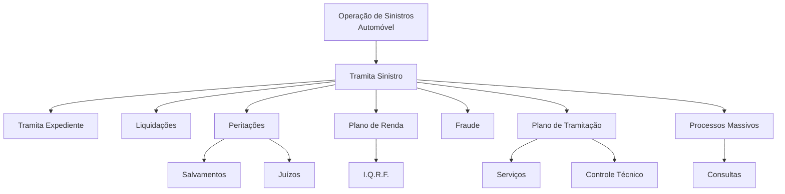

# Documentação de Operação de Sinistros — Automóvel (Reef)

## 1. Metadados do Documento
- **Arquivo de Origem:** Não identificado no conteúdo fornecido
- **Tipo de Documento:** Manual Operacional / Material de Formação
- **Domínio / Sistema:** Operação de Sinistros de Automóvel; Reef; Mapfre
- **Público-Alvo:** Operação, analistas funcionais e equipes envolvidas na tramitação de sinistros
- **Data/Versão Identificada:** Não identificada

---

## 2. Resumo Executivo & Contexto de Negócio

O conteúdo apresenta uma documentação de operação de sinistros para o negócio de **Automóvel**, com caráter de formação orientada à operação e aos tipos de negócio. O material organiza as áreas funcionais envolvidas no tratamento de sinistros, sem detalhar procedimentos, contratos técnicos, regras de cálculo ou responsabilidades por etapa.

A estrutura funcional identificada inclui tramitação de sinistro, tramitação de expediente, liquidações, peritações, salvamentos, juízos, plano de renda, I.Q.R.F., fraude, plano de tramitação, serviços, controle técnico, processos massivos e consultas. Esses itens são apresentados como módulos ou categorias de operação.

O documento está associado ao contexto de documentação **Reef**, com referências a **Mapfredocument** e à plataforma de navegação documental que contém categorias como Soluções, Arquiteturas, APIs, Componentes, Cloud, Documentação, Zeus e Reef.

Não há descrição adicional sobre integrações entre módulos, fluxos de aprovação, sistemas externos, ambientes, URLs, métodos de acesso ou regras específicas de negócio. Portanto, a interpretação deve se limitar aos nomes e à hierarquia funcional efetivamente apresentados.

---

## 3. Arquitetura, Componentes & Tecnologias Envolvidas

O documento não descreve uma arquitetura de software, infraestrutura, interfaces de integração, tecnologias de implementação ou ambientes técnicos. O conteúdo permite apenas reconstruir uma visão funcional dos módulos de operação de sinistros de Automóvel.



### Componentes e referências identificadas

| Componente / Termo | Classificação | Descrição sustentada pelo documento |
| :--- | :--- | :--- |
| Operação de Sinistros | Domínio operacional | Contexto principal do material de formação. |
| Automóvel | Tipo de negócio | Segmento de negócio explicitamente mencionado para a operação de sinistros. |
| Tramita Sinistro | Módulo operacional | Categoria apresentada sob “Tipos de Operação por Módulo”. |
| Tramita Expediente | Módulo operacional | Item associado à tramitação de sinistro. |
| Liquidações | Módulo operacional | Categoria operacional listada no documento. |
| Peritações | Módulo operacional | Categoria operacional listada no documento. |
| Salvamentos | Submódulo ou tema operacional | Item apresentado sob peritações. |
| Juízos | Submódulo ou tema operacional | Item apresentado sob peritações. |
| Plano de Renda | Módulo operacional | Categoria operacional listada no documento. |
| I.Q.R.F. | Submódulo ou sigla | Item apresentado sob plano de renda; significado não detalhado. |
| Fraude | Módulo operacional | Categoria operacional listada no documento. |
| Plano de Tramitação | Módulo operacional | Categoria operacional listada no documento. |
| Serviços | Submódulo ou tema operacional | Item apresentado sob plano de tramitação. |
| Controle Técnico | Submódulo ou tema operacional | Item apresentado sob plano de tramitação. |
| Processos Massivos | Módulo operacional | Categoria operacional listada no documento. |
| Consultas | Submódulo ou tema operacional | Item apresentado sob processos massivos. |
| Reef | Repositório ou domínio documental | Referência repetida na documentação e na navegação. |
| Mapfredocument | Plataforma ou referência documental | Nome identificado no conteúdo, sem descrição funcional adicional. |
| Zeus | Categoria de navegação documental | Referência disponível no menu de navegação. |

> **Nota de Análise:** O documento apresenta uma hierarquia visual de módulos, porém não descreve integrações, protocolos, APIs, tecnologias, bancos de dados, serviços ou responsabilidades técnicas entre os componentes.

---

## 4. Regras de Negócio, Especificações Funcionais & Processos

O conteúdo não define regras de negócio explícitas, fórmulas, critérios de elegibilidade, condições de validação, estados processuais, regras de cálculo ou procedimentos operacionais detalhados.

A estrutura funcional apresentada pode ser organizada da seguinte forma:

1. A formação é orientada à **operação de sinistros** e ao **tipo de negócio Automóvel**.
2. O módulo ou processo principal listado é **Tramita Sinistro**.
3. Sob **Tramita Sinistro**, o documento relaciona:
   - Tramita Expediente;
   - Liquidações;
   - Peritações;
   - Plano de Renda;
   - Fraude;
   - Plano de Tramitação;
   - Processos Massivos.
4. Sob **Peritações**, o conteúdo relaciona:
   - Salvamentos;
   - Juízos.
5. Sob **Plano de Renda**, o conteúdo relaciona:
   - I.Q.R.F.
6. Sob **Plano de Tramitação**, o conteúdo relaciona:
   - Serviços;
   - Controle Técnico.
7. Sob **Processos Massivos**, o conteúdo relaciona:
   - Consultas.

> **Nota de Análise:** Não é possível afirmar, com base no material fornecido, se os itens subordinados representam etapas sequenciais, funcionalidades independentes, equipes responsáveis, telas de sistema ou classificações operacionais.

---

## 5. Tabelas de Parâmetros, Ambientes e Estruturas de Dados

| Item / Parâmetro | Descrição / Função | Tipo / Valores / Formato | Ambiente / Observações |
| :--- | :--- | :--- | :--- |
| Tipo de negócio | Segmento abordado pela documentação de operação de sinistros. | Automóvel | Não há ambiente técnico identificado. |
| Formação | Orientação declarada do material. | Formação orientada à operação e tipo de negócio | Não há cronograma, público detalhado ou carga horária. |
| Módulo principal | Categoria principal de operação listada. | Tramita Sinistro | Sem detalhamento de funções, telas ou regras. |
| Tramita Expediente | Item vinculado à tramitação de sinistro. | Nome de módulo ou processo | Sem detalhamento adicional. |
| Liquidações | Item vinculado à tramitação de sinistro. | Nome de módulo ou processo | Sem parâmetros ou regras de liquidação. |
| Peritações | Item vinculado à tramitação de sinistro. | Nome de módulo ou processo | Relaciona Salvamentos e Juízos. |
| Salvamentos | Item listado sob Peritações. | Nome de submódulo ou tema | Sem detalhamento adicional. |
| Juízos | Item listado sob Peritações. | Nome de submódulo ou tema | Sem detalhamento adicional. |
| Plano de Renda | Item vinculado à tramitação de sinistro. | Nome de módulo ou processo | Relaciona I.Q.R.F. |
| I.Q.R.F. | Sigla ou item listado sob Plano de Renda. | Sigla não expandida | Significado não identificado. |
| Fraude | Item vinculado à tramitação de sinistro. | Nome de módulo ou processo | Sem regras de detecção, análise ou tratamento. |
| Plano de Tramitação | Item vinculado à tramitação de sinistro. | Nome de módulo ou processo | Relaciona Serviços e Controle Técnico. |
| Serviços | Item listado sob Plano de Tramitação. | Nome de submódulo ou tema | Sem detalhamento adicional. |
| Controle Técnico | Item listado sob Plano de Tramitação. | Nome de submódulo ou tema | Sem detalhamento adicional. |
| Processos Massivos | Item vinculado à tramitação de sinistro. | Nome de módulo ou processo | Relaciona Consultas. |
| Consultas | Item listado sob Processos Massivos. | Nome de submódulo ou tema | Sem detalhamento adicional. |
| Owner | Proprietário registrado no conteúdo. | `user:agonzalez_mapfre.com` | O formato é apresentado literalmente. |
| Lifecycle | Estado de ciclo de vida do conteúdo. | Approved Source | Não há definição do processo de aprovação. |
| Idioma de navegação | Idioma exibido na interface. | ES | O material contém termos em espanhol. |

---

## 6. Bateria de Perguntas & Respostas para RAG (FAQ Sintético)

### P1: Qual é o domínio de negócio tratado pela documentação?
**R:** A documentação trata da operação de sinistros para o tipo de negócio **Automóvel**. O conteúdo informa que a formação é orientada à operação e ao tipo de negócio, mas não apresenta regras específicas do segmento Automóvel.

### P2: Qual é o módulo principal listado para a operação de sinistros?
**R:** O módulo principal explicitamente listado é **Tramita Sinistro**. O documento o associa aos itens Tramita Expediente, Liquidações, Peritações, Plano de Renda, Fraude, Plano de Tramitação e Processos Massivos.

### P3: Quais itens estão relacionados ao módulo Peritações?
**R:** O conteúdo lista **Salvamentos** e **Juízos** sob o item **Peritações**. O documento não detalha procedimentos, regras de encaminhamento ou responsabilidades para Salvamentos e Juízos.

### P4: O que é I.Q.R.F. no contexto apresentado?
**R:** **I.Q.R.F.** é uma sigla ou item apresentado sob **Plano de Renda**. O documento não expande a sigla nem descreve sua finalidade operacional, regras ou parâmetros.

### P5: Quais componentes fazem parte do Plano de Tramitação?
**R:** O **Plano de Tramitação** possui os itens **Serviços** e **Controle Técnico** associados em sua estrutura. Não há detalhamento adicional sobre as atividades executadas por esses itens.

### P6: O documento descreve processos massivos?
**R:** O documento apenas lista **Processos Massivos** como parte dos tipos de operação por módulo e relaciona **Consultas** sob esse item. Não são descritos tipos de processamento, agendamentos, volumes, entradas ou saídas.

### P7: Existem regras de negócio para liquidações de sinistros?
**R:** Não. **Liquidações** é listado como um item de operação, mas o conteúdo não informa critérios, cálculos, validações, alçadas, prazos ou condições para liquidação de sinistros.

### P8: Existem integrações técnicas, APIs ou contratos de dados descritos?
**R:** Não. O conteúdo não identifica APIs, métodos HTTP, contratos JSON, filas, bancos de dados, protocolos, endpoints, URLs de ambiente ou tecnologias de implementação.

### P9: Qual plataforma ou contexto documental é mencionado no material?
**R:** O material menciona **Documentation / DOCUMENTACIÓN Reef**, **DOCUMENTACIÓN Reef** e **Mapfredocument**. Também apresenta uma navegação com categorias como Soluções, Arquiteturas, APIs, Componentes, Cloud, Documentação, Zeus, Reef e Ajuda.

### P10: Quem é identificado como proprietário do conteúdo?
**R:** O campo **Owner** apresenta literalmente `user:agonzalez_mapfre.com`. O material não informa o nome completo, papel organizacional ou responsabilidades desse proprietário.

---

## 7. Glossário de Termos, Siglas & Conceitos-Chave

- **Automóvel:** Tipo de negócio explicitamente associado à operação de sinistros no documento.
- **Consultas:** Item relacionado a Processos Massivos; não há detalhamento funcional.
- **Controle Técnico:** Item relacionado ao Plano de Tramitação; não há detalhamento funcional.
- **Fraude:** Módulo ou tema operacional listado na estrutura de Tramita Sinistro.
- **I.Q.R.F.:** Sigla apresentada sob Plano de Renda. O significado não é informado.
- **Juízos:** Item apresentado sob Peritações; o conteúdo não define o termo.
- **Liquidações:** Módulo ou tema operacional associado a Tramita Sinistro.
- **Mapfredocument:** Nome de plataforma ou referência documental identificado no conteúdo, sem descrição adicional.
- **Peritações:** Módulo ou tema operacional associado a Tramita Sinistro.
- **Plano de Renda:** Módulo ou tema operacional associado a Tramita Sinistro.
- **Plano de Tramitação:** Módulo ou tema operacional associado a Tramita Sinistro.
- **Processos Massivos:** Módulo ou tema operacional associado a Tramita Sinistro.
- **Reef:** Contexto ou repositório documental mencionado no material.
- **Salvamentos:** Item apresentado sob Peritações; não há definição adicional.
- **Serviços:** Item apresentado sob Plano de Tramitação; não há definição adicional.
- **Tramita Expediente:** Item associado a Tramita Sinistro; não há descrição adicional.
- **Tramita Sinistro:** Módulo principal listado para a operação de sinistros.
- **Zeus:** Categoria de navegação documental identificada no menu.

---

## 8. Notas Críticas, Riscos & Limitações

- O material fornecido contém somente uma página de conteúdo e apresenta uma taxonomia de módulos, não um procedimento operacional detalhado.
- Não foram identificadas regras de negócio, fluxos sequenciais, critérios de validação, contratos de integração ou requisitos não funcionais.
- Não há informações sobre versões, datas, ambientes, URLs, servidores, credenciais, permissões, logs ou responsáveis por módulo.
- A relação hierárquica entre os itens foi inferida exclusivamente da indentação visual do conteúdo original; ela não comprova dependência técnica, ordem de execução ou responsabilidade organizacional.
- O significado de **I.Q.R.F.** não é fornecido.
- O documento lista **Peritações**, **Salvamentos**, **Juízos**, **Fraude**, **Liquidações** e **Controle Técnico**, mas não detalha os respectivos processos operacionais.
- O campo `Lifecycle` indica **Approved Source**, porém o documento não explica os critérios, a autoridade ou o processo associado a essa aprovação.

---

## 9. Conteúdo Bruto Estruturado (Referência Fiel)

```text
--- [PÁGINA 1 DE 1] ---

DOCUMENTACIÓN de OPERACIÓN de SINIESTROS (Automóvil)
 Formación orientada a la operación y tipo de negocio
TIPOS DE OPERACIÓN por MÓDULO
 TRAMITA SINIESTRO
  TRAMITA EXPEDIENTE
  LIQUIDACIONES
 PERITACIONES
  SALVAMENTOS
  JUICIOS
 PLAN DE RENTA
  I.Q.R.F.
  FRAUDE
 PLAN DE TRAMITACIÓN
  SERVICIOS
  CONTROL TÉCNICO
 PROCESOS MASIVOS
  CONSULTAS
Documentation / DOCUMENTACIÓN Reef
DOCUMENTACIÓN Reef
Mapfredocument
DOCUMENTACIÓN Reef
Owner
user:agonzalez_mapfre.com
Lifecycle
Approved Source
 / 
 VL
Buscar Inicio Soluciones Arquitecturas APIs Componentes Cloud Documentación Zeus Reef Ayuda
ES
```
