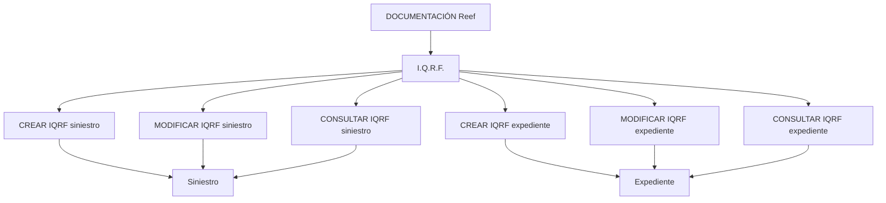

# Documentación de Operaciones de Siniestros (Automóvil) — I.Q.R.F. en Reef

## 1. Metadados do Documento
- **Arquivo de Origem:** Não identificado no conteúdo extraído
- **Tipo de Documento:** Manual Operacional
- **Domínio / Sistema:** Operaciones de Siniestros (Automóvil), I.Q.R.F., Reef
- **Público-Alvo:** Não identificado explicitamente; o conteúdo descreve operações documentadas para siniestros e expedientes
- **Data/Versão Identificada:** Não identificada
- **Owner Identificado:** `user:agonzalez_mapfre.com`
- **Lifecycle Identificado:** `Approved Source / VL`

---

## 2. Resumo Executivo & Contexto de Negócio

O documento apresenta a documentação de operações de **I.Q.R.F.** para o domínio de **siniestros de Automóvil**. O conteúdo relaciona seis operações disponíveis para registrar, modificar e consultar informações de I.Q.R.F. associadas a um siniestro ou a um expediente.

As operações de criação permitem registrar uma **Incidencia, Queja, Reclamación o Felicitación**. O registro pode ser vinculado diretamente a um siniestro ou a um expediente. O documento não detalha os dados obrigatórios, regras de validação, usuários autorizados, métodos de integração ou persistência dessas informações.

As operações de modificação permitem alterar uma Incidencia, Queja, Reclamación o Felicitación já associada a um siniestro ou expediente. As operações de consulta exibem toda a informação de I.Q.R.F. vinculada ao respectivo siniestro ou expediente.

O conteúdo está hospedado ou catalogado sob **DOCUMENTACIÓN Reef**, com referências de navegação para áreas como Soluciones, Arquitecturas, APIs, Componentes, Cloud, Documentación, Zeus, Reef e Ayuda. Não há detalhamento adicional sobre a arquitetura técnica ou sobre a relação funcional entre essas áreas.

---

## 3. Arquitetura, Componentes & Tecnologias Envolvidas

Os elementos explicitamente citados são:

| Componente / Termo | Papel identificado no conteúdo |
| :--- | :--- |
| DOCUMENTACIÓN Reef | Área ou repositório de documentação referenciado no conteúdo |
| I.Q.R.F. | Conjunto de operações para criar, modificar e consultar registros vinculados a siniestros ou expedientes |
| Siniestro | Entidade para a qual podem ser criados, modificados e consultados registros I.Q.R.F. |
| Expediente | Entidade para a qual podem ser criados, modificados e consultados registros I.Q.R.F. |
| Operaciones de Siniestros (Automóvil) | Domínio funcional indicado no título extraído |
| Mapfredocument | Termo exibido no conteúdo, sem descrição adicional |
| Zeus | Item de navegação exibido no conteúdo, sem descrição adicional |



**Nota de Análise:** O documento não descreve tecnologias, endpoints, métodos HTTP, contratos JSON, bases de dados, microsserviços, autenticação, URLs de ambiente ou fluxos de integração.

---

## 4. Regras de Negócio, Especificações Funcionais & Processos

### Operações disponíveis para I.Q.R.F.

1. **CREAR IQRF siniestro**
   - Permite registrar uma Incidencia, Queja, Reclamación ou Felicitación para um siniestro.

2. **MODIFICAR IQRF siniestro**
   - Permite alterar uma Incidencia, Queja, Reclamación ou Felicitación para um siniestro.

3. **CREAR IQRF expediente**
   - Permite registrar uma Incidencia, Queja, Reclamación ou Felicitación para um expediente.

4. **MODIFICAR IQRF expediente**
   - Permite alterar uma Incidencia, Queja, Reclamación ou Felicitación para um expediente.

5. **CONSULTAR IQRF siniestro**
   - Mostra toda a informação de I.Q.R.F. de um siniestro.

6. **CONSULTAR IQRF expediente**
   - Mostra toda a informação de I.Q.R.F. de um expediente.

**Nota de Análise:** O texto não especifica critérios para criação, condições para modificação, regras de exclusão, estados possíveis de I.Q.R.F., campos editáveis, histórico de alterações ou limites de consulta.

---

## 5. Tabelas de Parâmetros, Ambientes e Estruturas de Dados

| Item / Parâmetro | Descrição / Função | Tipo / Valores / Formato | Ambiente / Observações |
| :--- | :--- | :--- | :--- |
| I.Q.R.F. | Conjunto de operações documentadas para siniestros e expedientes | Não detalhado | Não detalhado |
| CREAR IQRF siniestro | Registra uma Incidencia, Queja, Reclamación ou Felicitación em um siniestro | Operação | Não detalhado |
| MODIFICAR IQRF siniestro | Altera uma Incidencia, Queja, Reclamación ou Felicitación em um siniestro | Operação | Não detalhado |
| CONSULTAR IQRF siniestro | Mostra toda a informação de I.Q.R.F. de um siniestro | Operação | Não detalhado |
| CREAR IQRF expediente | Registra uma Incidencia, Queja, Reclamación ou Felicitación em um expediente | Operação | Não detalhado |
| MODIFICAR IQRF expediente | Altera uma Incidencia, Queja, Reclamación ou Felicitación em um expediente | Operação | Não detalhado |
| CONSULTAR IQRF expediente | Mostra toda a informação de I.Q.R.F. de um expediente | Operação | Não detalhado |
| Owner | Responsável identificado na documentação | `user:agonzalez_mapfre.com` | DOCUMENTACIÓN Reef |
| Lifecycle | Estado identificado no conteúdo | `Approved Source / VL` | Significado de `VL` não detalhado |
| Idioma de navegação | Idioma exibido no menu | `ES` | Interface ou página documentada |

---

## 6. Bateria de Perguntas & Respostas para RAG (FAQ Sintético)

### P1: Quais operações de I.Q.R.F. estão disponíveis para um siniestro?
**R:** Para um siniestro, o documento lista três operações: **CREAR IQRF siniestro**, para registrar uma Incidencia, Queja, Reclamación ou Felicitación; **MODIFICAR IQRF siniestro**, para alterar esse registro; e **CONSULTAR IQRF siniestro**, para mostrar toda a informação de I.Q.R.F. do siniestro.

### P2: O que a operação CREAR IQRF siniestro permite registrar?
**R:** A operação **CREAR IQRF siniestro** permite registrar uma **Incidencia, Queja, Reclamación ou Felicitación** associada a um siniestro.

### P3: Qual operação deve ser usada para alterar uma I.Q.R.F. de um expediente?
**R:** A operação indicada é **MODIFICAR IQRF expediente**. O texto informa que essa operação permite mudar uma Incidencia, Queja, Reclamación ou Felicitación associada a um expediente.

### P4: Como consultar todas as informações de I.Q.R.F. de um siniestro?
**R:** Deve-se utilizar a operação **CONSULTAR IQRF siniestro**, descrita como a operação que mostra toda a informação de I.Q.R.F. de um siniestro.

### P5: Como consultar todas as informações de I.Q.R.F. de um expediente?
**R:** Deve-se utilizar a operação **CONSULTAR IQRF expediente**, descrita como a operação que mostra toda a informação de I.Q.R.F. de um expediente.

### P6: Quais tipos de registro podem ser associados a um siniestro ou expediente?
**R:** O documento menciona quatro tipos de registro: **Incidencia**, **Queja**, **Reclamación** e **Felicitación**. Esses tipos podem ser registrados ou modificados para um siniestro ou para um expediente.

### P7: O documento informa APIs, endpoints ou métodos HTTP para as operações de I.Q.R.F.?
**R:** Não. O conteúdo apenas lista as operações funcionais de criação, modificação e consulta. Não há métodos HTTP, endpoints, contratos JSON, URLs, tecnologias ou detalhes de integração.

### P8: Qual é o domínio funcional indicado pela documentação?
**R:** O domínio indicado é **Operaciones de Siniestros (Automóvil)**, relacionado às operações de I.Q.R.F. aplicáveis a siniestros e expedientes.

### P9: Quem é o owner identificado na documentação de Reef?
**R:** O owner exibido no conteúdo é `user:agonzalez_mapfre.com`.

### P10: Qual lifecycle está associado ao documento?
**R:** O conteúdo apresenta o lifecycle como `Approved Source / VL`. O documento não esclarece o significado de `VL`.

---

## 7. Glossário de Termos, Siglas & Conceitos-Chave

- **I.Q.R.F.:** Sigla exibida no documento para o conjunto de operações de criação, modificação e consulta de Incidencia, Queja, Reclamación ou Felicitación. A expansão formal da sigla não é explicitada.
- **Siniestro:** Entidade tratada pelas operações de I.Q.R.F.; o documento a associa ao domínio de Automóvil.
- **Expediente:** Entidade tratada pelas operações de I.Q.R.F.; não há definição adicional no conteúdo.
- **Incidencia:** Tipo de registro que pode ser criado ou modificado para um siniestro ou expediente.
- **Queja:** Tipo de registro que pode ser criado ou modificado para um siniestro ou expediente.
- **Reclamación:** Tipo de registro que pode ser criado ou modificado para um siniestro ou expediente.
- **Felicitación:** Tipo de registro que pode ser criado ou modificado para um siniestro ou expediente.
- **Reef:** Nome presente em `DOCUMENTACIÓN Reef`; o documento não define a plataforma ou sistema.
- **VL:** Valor apresentado no lifecycle `Approved Source / VL`; significado não detalhado.

---

## 8. Notas Críticas, Riscos & Limitações

- O conteúdo não identifica o nome do arquivo de origem, data, versão, autor formal ou público-alvo.
- A expansão da sigla **I.Q.R.F.** não está presente no texto; apenas os tipos Incidencia, Queja, Reclamación e Felicitación são descritos.
- Não há requisitos de autenticação, autorização, perfis de acesso ou matriz de permissões.
- Não há definição de campos, parâmetros, códigos de erro, regras de validação, transições de estado ou tratamento de exceções.
- Não há especificação técnica de APIs, contratos, integrações, tecnologias, infraestrutura ou ambientes.
- O termo `expedienteo` aparece no conteúdo bruto da descrição de modificação de expediente; foi preservado na referência fiel por ser parte do texto original.
- **Nota de Análise:** O documento lista operações de I.Q.R.F., mas não detalha procedimentos de execução, interfaces, contratos técnicos ou critérios de negócio adicionais.

---

## 9. Conteúdo Bruto Estruturado (Referência Fiel)

```text
--- [PÁGINA 1 DE 1] ---

DOCUMENTACIÓN OPERACIONES de SINIESTROS (Automóvil) -
I.Q.R.F.
I.Q.R.F.
Todas las Operaciones que se pueden realizar I.Q.R.F.
CREAR IQRF siniestro
Permite registrar una Incidencia, Queja,
Reclamación o Felicitación a un siniestro
MODIFICAR IQRF siniestro
Permite cambiar una Incidencia, Queja,
Reclamación o Felicitación a un siniestros
CREAR IQRF expediente
Permite registrar una Incidencia, Queja,
Reclamación o Felicitación a un
expediente
MODIFICAR IQRF expediente
Permite cambiar una Incidencia, Queja,
Reclamación o Felicitación a un
expedienteo
CONSULTAR IQRF siniestro
Muestra toda la información de IQRF de
un siniestro
CONSULTAR IQRF expediente
Muestra toda la información de IQRF de
un expediente
Documentation / DOCUMENTACIÓN Reef
DOCUMENTACIÓN Reef
Mapfredocument
DOCUMENTACIÓN Reef
Owner
user:agonzalez_mapfre.com
Lifecycle
Approved Source
 /
VL
Buscar Inicio Soluciones Arquitecturas APIs Componentes Cloud Documentación Zeus Reef Ayuda
ES
```
