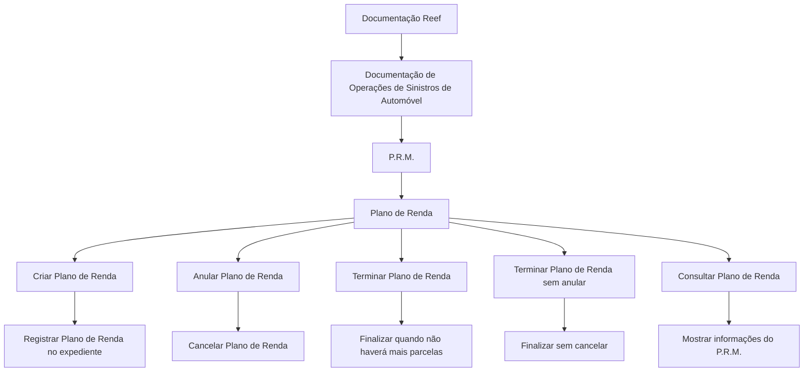

# Documentação de Operações de Sinistros de Automóvel — P.R.M. Plano de Renda

## 1. Metadados do Documento
- **Arquivo de Origem:** Não identificado no conteúdo fornecido
- **Tipo de Documento:** Manual Operacional
- **Domínio / Sistema:** Operações de Sinistros de Automóvel — P.R.M. / Plano de Renda; documentação Reef
- **Público-Alvo:** Operação, analistas funcionais e usuários responsáveis por operar planos de renda
- **Data/Versão Identificada:** Não identificada

---

## 2. Resumo Executivo & Contexto de Negócio

O documento descreve operações disponíveis para um **Plano de Renda** no contexto de **Sinistros de Automóvel**. O artefato referencia o domínio **P.R.M.** e apresenta ações operacionais que podem ser executadas sobre um plano de renda vinculado a um expediente.

As operações explicitamente apresentadas são: criar, anular, terminar, terminar sem anular e consultar um Plano de Renda. A criação permite registrar o Plano de Renda no expediente; a anulação permite cancelá-lo; e a consulta exibe as informações do P.R.M.

O término de um Plano de Renda é aplicável quando o plano não terá mais parcelas. O documento também diferencia a ação de terminar sem anular, que finaliza o Plano de Renda sem efetuar seu cancelamento.

A documentação está associada ao repositório ou ambiente documental **Reef**, também mencionado como “Documentation / DOCUMENTACIÓN Reef” e “Mapfredocument”. O conteúdo fornecido não detalha fluxos de tela, permissões, contratos de integração, campos, regras de cálculo ou critérios de elegibilidade para cada operação.

---

## 3. Arquitetura, Componentes & Tecnologias Envolvidas

Os elementos identificados no conteúdo são:

| Componente / Elemento | Papel identificado no documento | Detalhamento disponível |
| :--- | :--- | :--- |
| Sinistros de Automóvel | Domínio operacional da documentação | O documento relaciona as operações ao contexto de sinistros de automóvel. |
| P.R.M. | Entidade ou contexto funcional associado ao Plano de Renda | O significado expandido da sigla não é informado. |
| Plano de Renda | Objeto funcional sobre o qual são realizadas operações | Pode ser criado, anulado, terminado, terminado sem anulação e consultado. |
| Expediente | Registro no qual um Plano de Renda pode ser registrado | Mencionado somente na operação de criação. |
| Reef | Ambiente, solução ou área de documentação | Referenciado como “DOCUMENTACIÓN Reef”. |
| Mapfredocument | Elemento documental citado | O papel técnico ou funcional não é detalhado. |
| Zeus | Item disponível na navegação da documentação | Não há explicação adicional. |
| Soluciones | Item disponível na navegação da documentação | Não há explicação adicional. |
| Arquitecturas | Item disponível na navegação da documentação | Não há explicação adicional. |
| APIs | Item disponível na navegação da documentação | Não há APIs, endpoints ou contratos especificados. |
| Componentes | Item disponível na navegação da documentação | Não há componentes técnicos descritos. |
| Cloud | Item disponível na navegação da documentação | Não há provedor, arquitetura ou serviço cloud especificado. |



> **Nota de Análise:** O documento não apresenta arquitetura de software, microsserviços, tecnologias de implementação, bancos de dados, APIs, URLs, ambientes, autenticação ou fluxos de integração. O diagrama representa exclusivamente as relações funcionais explícitas no conteúdo fornecido.

---

## 4. Regras de Negócio, Especificações Funcionais & Processos

### 4.1 Operação: Criar Plano de Renda

A operação **CRIAR Plan Renta** permite registrar um Plano de Renda no expediente.

**Regra funcional identificada:**
1. O Plano de Renda é registrado em um expediente.
2. O documento não informa quais dados são obrigatórios para o registro.
3. O documento não informa validações, estados anteriores necessários, perfis autorizados ou efeitos posteriores à criação.

### 4.2 Operação: Anular Plano de Renda

A operação **ANULAR Plan Renta** permite cancelar um Plano de Renda.

**Regra funcional identificada:**
1. A anulação corresponde ao cancelamento de um Plano de Renda.
2. O documento não define se o cancelamento é reversível.
3. O documento não apresenta regras para parcelas existentes, pagamentos já efetuados, motivos de cancelamento ou aprovações necessárias.

### 4.3 Operação: Terminar Plano de Renda

A operação **TERMINAR Plan Renta** permite finalizar o Plano de Renda quando o plano não terá mais parcelas.

**Regra funcional identificada:**
1. O término é aplicável quando o Plano de Renda não terá mais parcelas.
2. O documento não define como verificar a inexistência de parcelas futuras.
3. O documento não especifica se o término altera o status do expediente ou se gera eventos para sistemas externos.

### 4.4 Operação: Terminar Plano de Renda sem Anular

A operação **TERMINAR Plan Renta sin anular** permite finalizar um Plano de Renda sem cancelá-lo.

**Regra funcional identificada:**
1. O término sem anulação finaliza o Plano de Renda.
2. O término sem anulação é explicitamente distinto do cancelamento.
3. O documento não detalha a diferença de estados, efeitos financeiros, auditoria ou comportamento de consulta entre um plano anulado e um plano terminado sem anulação.

### 4.5 Operação: Consultar Plano de Renda

A operação **CONSULTAR Plan Renta** mostra todas as informações do P.R.M.

**Regra funcional identificada:**
1. A consulta deve exibir as informações do P.R.M.
2. O documento não lista os atributos, campos, histórico, parcelas, status ou filtros disponíveis na consulta.
3. O documento não informa canais de acesso, telas, serviços ou permissões para consulta.

---

## 5. Tabelas de Parâmetros, Ambientes e Estruturas de Dados

| Item / Parâmetro | Descrição / Função | Tipo / Valores / Formato | Ambiente / Observações |
| :--- | :--- | :--- | :--- |
| Plano de Renda | Entidade funcional operada no documento | Objeto funcional; estrutura de dados não informada | Associado ao domínio de Sinistros de Automóvel e ao P.R.M. |
| Criar Plano de Renda | Registra o Plano de Renda no expediente | Operação funcional | Não há detalhes sobre formulário, API, campos ou validações. |
| Anular Plano de Renda | Cancela o Plano de Renda | Operação funcional | Não há motivo de anulação, regra de reversão ou impacto informado. |
| Terminar Plano de Renda | Finaliza o Plano de Renda quando não haverá mais parcelas | Operação funcional | A condição explícita é a ausência de futuras parcelas. |
| Terminar Plano de Renda sem anular | Finaliza o Plano de Renda sem cancelá-lo | Operação funcional | Difere da anulação; consequências não detalhadas. |
| Consultar Plano de Renda | Mostra todas as informações do P.R.M. | Operação funcional | Os campos exibidos não são detalhados. |
| Expediente | Registro que recebe o Plano de Renda no processo de criação | Entidade funcional; formato não informado | Citado exclusivamente na descrição de criação. |
| P.R.M. | Contexto ou entidade cujas informações são apresentadas na consulta | Sigla não expandida | Não há definição do significado da sigla no conteúdo. |
| Reef | Área, solução ou repositório de documentação | Ambiente documental | Citado como “DOCUMENTACIÓN Reef”. |
| Mapfredocument | Referência documental | Não informado | O papel no processo não é detalhado. |
| Owner | Proprietário informado na página documental | `user:agonzalez_mapfre.com` | Presente no conteúdo bruto. |
| Lifecycle | Ciclo de vida do documento | `Approved Source` | Presente no conteúdo bruto. |
| Idioma | Idioma indicado na navegação | `ES` | O conteúdo operacional está em espanhol. |

> **Nota de Análise:** Não foram identificados parâmetros técnicos, variáveis de configuração, rotas de logs, URLs, nomes de servidores, credenciais, portas, ambientes de desenvolvimento, homologação ou produção.

---

## 6. Bateria de Perguntas & Respostas para RAG (FAQ Sintético)

### P1: Quais operações podem ser realizadas com um Plano de Renda no contexto de Sinistros de Automóvel?
**R:** O documento lista cinco operações para um Plano de Renda: criar, anular, terminar, terminar sem anular e consultar. Essas operações estão apresentadas no contexto de “DOCUMENTACIÓN OPERACIONES de SINIESTROS (Automóvil) - P.R.M.”.

### P2: O que faz a operação de criar um Plano de Renda?
**R:** A operação **CRIAR Plan Renta** permite registrar o Plano de Renda em um expediente. O conteúdo não especifica campos obrigatórios, regras de validação, usuário responsável ou mecanismo técnico utilizado para o registro.

### P3: Qual é a finalidade de anular um Plano de Renda?
**R:** A operação **ANULAR Plan Renta** permite cancelar um Plano de Renda. O documento não informa se o cancelamento pode ser revertido, quais são os motivos válidos ou como parcelas existentes são tratadas.

### P4: Quando um Plano de Renda deve ser terminado?
**R:** A operação **TERMINAR Plan Renta** pode ser utilizada para finalizar o Plano de Renda quando esse plano não terá mais parcelas. Essa é a única condição de término explicitamente informada no documento.

### P5: Qual é a diferença entre terminar e anular um Plano de Renda?
**R:** Anular um Plano de Renda significa cancelá-lo. Terminar um Plano de Renda significa finalizá-lo quando não haverá mais parcelas. O documento também prevê terminar sem anular, deixando explícito que finalizar não é necessariamente o mesmo que cancelar.

### P6: O que significa terminar um Plano de Renda sem anular?
**R:** A operação **TERMINAR Plan Renta sin anular** permite finalizar um Plano de Renda sem cancelá-lo. O documento não detalha os estados funcionais resultantes, as consequências financeiras ou as diferenças de consulta entre um plano terminado sem anulação e um plano anulado.

### P7: O que é exibido ao consultar um Plano de Renda?
**R:** A operação **CONSULTAR Plan Renta** mostra todas as informações do P.R.M. O conteúdo não informa quais campos, parcelas, status, dados históricos ou filtros fazem parte dessa consulta.

### P8: O que significa a sigla P.R.M. neste documento?
**R:** O documento utiliza a sigla **P.R.M.** no título e informa que a consulta de Plano de Renda mostra todas as informações do P.R.M. Entretanto, o texto fornecido não expande nem define o significado da sigla.

### P9: O documento especifica APIs, microsserviços ou métodos HTTP para as operações de Plano de Renda?
**R:** Não. Embora a navegação da página mencione “APIs”, o documento não apresenta endpoints, métodos HTTP, contratos JSON, microsserviços, integrações, autenticação ou tecnologias de implementação.

### P10: Em qual ambiente ou repositório documental está localizada a documentação de operações?
**R:** O conteúdo referencia “Documentation / DOCUMENTACIÓN Reef”, “DOCUMENTACIÓN Reef” e “Mapfredocument”. Não há detalhes suficientes para determinar a arquitetura, URL, permissões ou natureza técnica desses elementos documentais.

---

## 7. Glossário de Termos, Siglas & Conceitos-Chave

- **Anular Plano de Renda:** Operação que permite cancelar um Plano de Renda.
- **Consultar Plano de Renda:** Operação que mostra todas as informações do P.R.M.
- **Expediente:** Registro no qual um Plano de Renda pode ser registrado durante a operação de criação.
- **P.R.M.:** Sigla mencionada no título e na operação de consulta; o significado expandido não é informado.
- **Plano de Renda / Plan Renta:** Entidade funcional sobre a qual o documento descreve operações de criação, anulação, término e consulta.
- **Reef:** Nome citado como contexto ou área de documentação; o documento não define sua função técnica.
- **Sinistros de Automóvel / Siniestros (Automóvil):** Domínio de negócio no qual as operações de Plano de Renda são apresentadas.
- **Terminar Plano de Renda:** Operação que permite finalizar um Plano de Renda quando não haverá mais parcelas.
- **Terminar Plano de Renda sem anular:** Operação que permite finalizar um Plano de Renda sem cancelá-lo.

---

## 8. Notas Críticas, Riscos & Limitações

- O documento apresenta descrições resumidas das operações, sem detalhar fluxos de execução, interfaces, telas, APIs ou integrações.
- A sigla **P.R.M.** não é expandida nem conceituada.
- Não há definição de estados do ciclo de vida de um Plano de Renda.
- Não há critérios para determinar quando um plano possui ou não parcelas futuras.
- O documento diferencia término, término sem anulação e anulação, mas não detalha impactos funcionais, financeiros, contábeis, operacionais ou de auditoria.
- Não há informações sobre permissões, perfis de acesso, segregação de funções ou trilhas de auditoria.
- Não há especificações de campos, modelos de dados, regras de obrigatoriedade, mensagens de erro ou validações.
- Não há informação sobre ambientes, servidores, URLs, logs, monitoramento, métricas ou procedimentos de suporte.
- Não há detalhamento adicional sobre Reef, Mapfredocument, Zeus, APIs, Componentes ou Cloud, apesar de tais termos aparecerem na navegação documental.

---

## 9. Conteúdo Bruto Estruturado (Referência Fiel)

```text
--- [PÁGINA 1 DE 1] ---

DOCUMENTACIÓN OPERACIONES de SINIESTROS (Automóvil) -
P.R.M.
PLAN DE RENTA
Operaciones que se pueden realizar con un Plan de Renta
CREAR Plan Renta
Permite registrar el Plan de Renta al
expediente
ANULAR Plan Renta
Permite cancelar un Plan de Renta
TERMINAR Plan Renta
Permite nalizar el Plan de Renta cuando
este ya no va a tener más cuotas
TERMINAR Plan Renta sin anular
Permite nalizar el Plan de Renta sin
cancelarlo
CONSULTAR Plan Renta
Muestra toda la información del P.R.M
Documentation / DOCUMENTACIÓN Reef
DOCUMENTACIÓN Reef
Mapfredocument
DOCUMENTACIÓN Reef
Owner
user:agonzalez_mapfre.com
Lifecycle
Approved Source
 / 
 VL
Buscar Inicio Soluciones Arquitecturas APIs Componentes Cloud Documentación Zeus Reef Ayuda
ES
```
