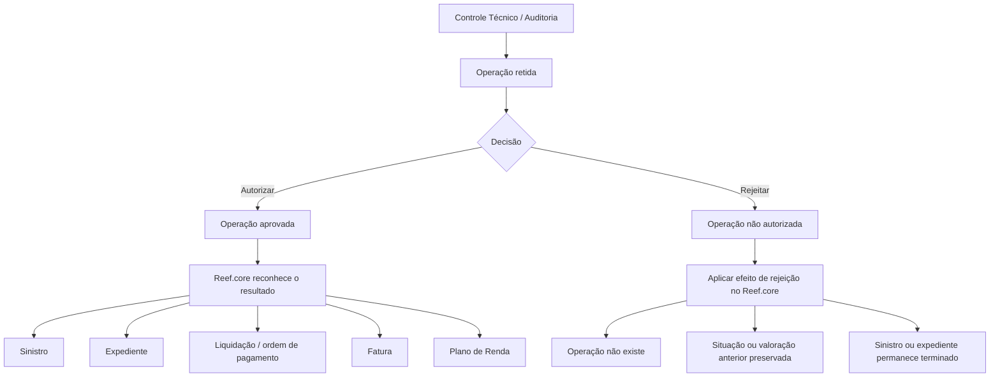

# Documentação de Operações de Controle Técnico de Sinistros — Automóvel / Reef.core

## 1. Metadados do Documento
- **Arquivo de Origem:** `Não identificado (texto bruto fornecido)`
- **Tipo de Documento:** `Procedimento Operacional`
- **Domínio / Sistema:** `Operações de sinistros — Controle Técnico — Reef.core`
- **Público-Alvo:** `Não identificado; conteúdo direcionado a operações de controle técnico`
- **Data/Versão Identificada:** `Não identificada`

---

## 2. Resumo Executivo & Contexto de Negócio

O documento descreve operações de **autorização** e **rejeição** aplicáveis a controles técnicos de auditoria no domínio de sinistros de automóvel. As operações abrangem sinistros, expedientes, liquidações, faturamento e planos de renda que permanecem retidos pelo controle técnico.

A autorização de uma operação retida faz com que a ação seja aprovada, validada quando aplicável, e reconhecida pelo restante do sistema **Reef.core**. Dependendo da operação, esse reconhecimento pode criar ou reabilitar um sinistro ou expediente, registrar uma alteração, aplicar uma nova valoração, reconhecer uma liquidação e ordem de pagamento, ou reconhecer uma fatura ou plano de renda.

A rejeição impede que a operação retida seja aceita no restante do Reef.core. O efeito depende da natureza da operação: aberturas, liquidações, faturas e planos de renda rejeitados passam a não existir; alterações de sinistro, valoração ou faturamento rejeitadas preservam a situação anterior; reabilitações rejeitadas mantêm sinistros ou expedientes como terminados.

O documento não detalha interfaces de usuário, métodos HTTP, contratos de integração, regras de permissão, responsáveis por aprovação, critérios de auditoria ou mecanismos técnicos usados para reter uma operação em controle técnico.

---

## 3. Arquitetura, Componentes & Tecnologias Envolvidas

O único sistema explicitamente citado é o **Reef.core**, que reconhece ou deixa de reconhecer operações após a decisão do controle técnico. O documento também menciona **Mapfredocument** e identifica `user:agonzalez_mapfre.com` como proprietário, mas não explica suas funções técnicas ou relações com o processo.

Componentes e conceitos identificados:

| Componente / Conceito | Papel identificado no documento |
| :--- | :--- |
| Controle Técnico | Retém operações para decisão de autorização ou rejeição. |
| Auditoria | Contexto associado aos controles técnicos. |
| Reef.core | Sistema que reconhece as operações autorizadas e aplica os efeitos descritos para operações rejeitadas. |
| Sinistro | Entidade submetida a abertura, modificação e reabilitação. |
| Expediente | Entidade submetida a abertura, mudança de valoração, reabilitação, liquidação, faturamento e plano de renda. |
| Liquidação | Operação de expediente que, quando autorizada, resulta no reconhecimento da nova liquidação e ordem de pagamento. |
| Faturamento | Criação ou modificação de fatura associada a expediente. |
| Plano de Renda | Plano criado para um expediente. |
| Mapfredocument | Nome citado na área de documentação; função não detalhada. |



> **Nota de Análise:** O documento lista operações funcionais do Reef.core, porém não detalha serviços, APIs, bancos de dados, tecnologias, ambientes, URLs, logs, contratos JSON ou protocolos de integração.

---

## 4. Regras de Negócio, Especificações Funcionais & Processos

### 4.1 Processo geral de Controle Técnico

1. Uma operação de sinistro, expediente, liquidação, faturamento ou plano de renda fica retida por controle técnico.
2. A operação é submetida a uma decisão de **autorizar** ou **rejeitar**.
3. Quando autorizada, a operação passa a ser aprovada — e validada no caso de criação de faturamento — e o restante do Reef.core reconhece o resultado.
4. Quando rejeitada, a operação não é autorizada; o Reef.core aplica o efeito específico definido para o tipo de operação.

### 4.2 Operações de Sinistro

#### Autorizar abertura de sinistro
- Um sinistro retido por controle técnico passa a estar aprovado.
- O restante do Reef.core reconhece o sinistro como existente.

#### Rejeitar abertura de sinistro
- Um sinistro retido por controle técnico não é autorizado.
- Para o Reef.core, o sinistro não existe nem existiu.

#### Autorizar modificação de sinistro
- Uma modificação de sinistro retida por controle técnico passa a estar aprovada.
- O restante do Reef.core reconhece a modificação do sinistro.

#### Rejeitar modificação de sinistro
- Uma modificação de sinistro retida por controle técnico não é autorizada.
- O texto informa que o restante do Reef.core “no existe”; o efeito é apresentado sem detalhamento adicional.

#### Autorizar reabilitação de sinistro
- Uma reabilitação de sinistro retida por controle técnico passa a estar aprovada.
- O restante do Reef.core reconhece que o sinistro volta a estar pendente.

#### Rejeitar reabilitação de sinistro
- Uma reabilitação de sinistro retida por controle técnico não é autorizada.
- O sinistro continua terminado para o restante do Reef.core.

### 4.3 Operações de Expediente

#### Autorizar abertura de expediente
- Um expediente retido por controle técnico passa a estar aprovado.
- O restante do Reef.core reconhece o expediente.

#### Rejeitar abertura de expediente
- Um expediente retido por controle técnico não é autorizado.
- Para o restante do Reef.core, o expediente não existe.

#### Autorizar mudança de valoração
- Uma modificação de valoração de expediente retida por controle técnico passa a estar aprovada.
- O restante do Reef.core reconhece a nova valoração do expediente.

#### Rejeitar mudança de valoração
- Uma modificação de valoração de expediente retida por controle técnico não é autorizada.
- O Reef.core permanece com a valoração anterior à mudança.

#### Autorizar reabilitação de expediente
- Uma reabilitação de expediente retida por controle técnico passa a estar aprovada.
- O restante do Reef.core reconhece que o expediente volta a estar pendente.

#### Rejeitar reabilitação de expediente
- Uma reabilitação de expediente retida por controle técnico não é autorizada.
- O expediente continua terminado para o restante do Reef.core.

### 4.4 Liquidação

#### Autorizar liquidação
- Uma liquidação realizada em expediente e retida por controle técnico passa a estar aprovada.
- O restante do Reef.core reconhece a nova liquidação e a ordem de pagamento do expediente.

#### Rejeitar liquidação
- Uma liquidação realizada em expediente e retida por controle técnico não é autorizada.
- Para o restante do Reef.core, a liquidação não existe.

### 4.5 Faturamento

#### Autorizar criação de faturamento
- A criação de uma fatura de expediente retida por controle técnico é autorizada e validada.
- O restante do Reef.core reconhece a nova fatura.

#### Rejeitar criação de faturamento
- A criação de uma fatura de expediente retida por controle técnico não é autorizada.
- A fatura não existe.

#### Autorizar modificação de faturamento
- Uma modificação de fatura de expediente retida por controle técnico é aceita.
- O restante do Reef.core reconhece a modificação da fatura.

#### Rejeitar modificação de faturamento
- Uma modificação de fatura retida por controle técnico não é autorizada.
- Para o restante do Reef.core, a modificação da fatura não existe.
- A fatura permanece na situação anterior à modificação.

### 4.6 Plano de Renda

#### Autorizar plano de renda
- Um plano de renda criado para um expediente e retido por controle técnico é autorizado.
- O restante do Reef.core reconhece o plano de renda.

#### Rejeitar plano de renda
- Um plano de renda criado para um expediente e retido por controle técnico não é autorizado.
- Para o restante do Reef.core, o plano de renda não existe.

---

## 5. Tabelas de Parâmetros, Ambientes e Estruturas de Dados

| Item / Parâmetro | Descrição / Função | Tipo / Valores / Formato | Ambiente / Observações |
| :--- | :--- | :--- | :--- |
| Controle Técnico | Mecanismo que retém operações para decisão posterior. | Processo operacional | Associado a auditoria. |
| Decisão de controle | Define o tratamento da operação retida. | `AUTORIZAR` ou `RECHAZAR` | Não há critérios de decisão descritos. |
| Abertura de sinistro | Criação de sinistro submetida ao controle técnico. | Operação de sinistro | Autorizada: sinistro reconhecido; rejeitada: não existe nem existiu. |
| Modificação de sinistro | Alteração de sinistro submetida ao controle técnico. | Operação de sinistro | Autorizada: modificação reconhecida; rejeitada: documento informa que não existe, sem maior detalhamento. |
| Reabilitação de sinistro | Reabilitação de sinistro submetida ao controle técnico. | Operação de sinistro | Autorizada: sinistro volta a pendente; rejeitada: sinistro segue terminado. |
| Abertura de expediente | Criação de expediente submetida ao controle técnico. | Operação de expediente | Autorizada: expediente reconhecido; rejeitada: expediente não existe. |
| Mudança de valoração | Alteração de valoração de expediente. | Operação de expediente | Autorizada: nova valoração reconhecida; rejeitada: valoração anterior preservada. |
| Reabilitação de expediente | Reabilitação de expediente retida por controle técnico. | Operação de expediente | Autorizada: expediente volta a pendente; rejeitada: expediente segue terminado. |
| Liquidação | Liquidação realizada em expediente. | Operação de expediente | Autorizada: nova liquidação e ordem de pagamento reconhecidas; rejeitada: liquidação não existe. |
| Criação de faturamento | Criação de fatura para expediente. | Operação de faturamento | Autorizada e validada: nova fatura reconhecida; rejeitada: fatura não existe. |
| Modificação de faturamento | Alteração de fatura de expediente. | Operação de faturamento | Autorizada: modificação reconhecida; rejeitada: situação anterior preservada. |
| Plano de Renda | Plano criado para um expediente. | Operação de expediente | Autorizado: plano reconhecido; rejeitado: plano não existe. |
| Reef.core | Sistema que reconhece os resultados das operações. | Sistema / domínio citado | Não há detalhes técnicos de arquitetura. |
| Owner | Proprietário exibido na documentação. | `user:agonzalez_mapfre.com` | Identificação literal da fonte. |
| Lifecycle | Estado exibido na documentação. | `Approved Source` | Significado do campo não detalhado. |
| Mapfredocument | Nome presente na documentação. | Não identificado | Função não detalhada. |

---

## 6. Bateria de Perguntas & Respostas para RAG (FAQ Sintético)

### P1: O que acontece quando uma abertura de sinistro é autorizada pelo controle técnico?
**R:** A abertura de sinistro retida por controle técnico passa a estar aprovada. Como consequência, o restante do Reef.core reconhece o sinistro como existente.

### P2: Qual é o efeito de rejeitar uma abertura de sinistro no Reef.core?
**R:** A abertura de sinistro não é autorizada. Para o Reef.core, o sinistro não existe nem existiu.

### P3: O que ocorre ao autorizar uma modificação de sinistro retida por controle técnico?
**R:** A modificação de sinistro passa a estar aprovada e o restante do Reef.core reconhece a modificação realizada no sinistro.

### P4: Como o Reef.core trata a rejeição de uma reabilitação de sinistro?
**R:** A reabilitação não é autorizada e o sinistro continua terminado para o restante do Reef.core.

### P5: Qual é o resultado de autorizar a abertura de um expediente?
**R:** O expediente retido por controle técnico passa a estar aprovado, fazendo com que o restante do Reef.core reconheça o expediente.

### P6: O que acontece quando uma mudança de valoração de expediente é rejeitada?
**R:** A mudança de valoração não é autorizada. O restante do Reef.core permanece com a valoração anterior à mudança rejeitada.

### P7: Qual é o efeito de autorizar uma reabilitação de expediente?
**R:** A reabilitação do expediente passa a estar aprovada, e o restante do Reef.core reconhece que o expediente volta a estar pendente.

### P8: O que o Reef.core reconhece quando uma liquidação é autorizada?
**R:** Quando uma liquidação de expediente retida por controle técnico é autorizada, o Reef.core reconhece a nova liquidação e a ordem de pagamento do expediente.

### P9: O que ocorre se uma liquidação for rejeitada pelo controle técnico?
**R:** A liquidação não é autorizada e, para o restante do Reef.core, essa liquidação não existe.

### P10: A criação de faturamento autorizada exige alguma condição adicional descrita?
**R:** Sim. O documento informa que a criação de uma fatura retida por controle técnico, quando autorizada, é também validada. Em seguida, o Reef.core reconhece a nova fatura.

### P11: O que acontece ao rejeitar uma modificação de faturamento?
**R:** A modificação da fatura não é autorizada. Para o restante do Reef.core, a modificação não existe e a fatura permanece na situação anterior à modificação.

### P12: Qual é o resultado de rejeitar um plano de renda?
**R:** O plano de renda criado para o expediente não é autorizado. Para o restante do Reef.core, o plano de renda não existe.

---

## 7. Glossário de Termos, Siglas & Conceitos-Chave

- **Reef.core:** Sistema citado como responsável por reconhecer os resultados das operações autorizadas e aplicar os efeitos funcionais associados às rejeições.
- **Controle Técnico:** Processo que retém operações para autorização ou rejeição.
- **Auditoria:** Contexto associado aos controles técnicos mencionados no documento.
- **Sinistro:** Entidade sujeita a abertura, modificação e reabilitação.
- **Expediente:** Entidade sujeita a abertura, mudança de valoração, reabilitação, liquidação, faturamento e plano de renda.
- **Reabilitação:** Operação que, se autorizada, faz sinistro ou expediente voltar a estar pendente.
- **Valoração:** Valor ou avaliação de um expediente; o documento descreve que a rejeição de uma mudança mantém a valoração anterior.
- **Liquidação:** Operação vinculada a expediente; sua autorização permite o reconhecimento de nova liquidação e ordem de pagamento.
- **Faturamento:** Criação ou modificação de fatura vinculada a expediente.
- **Plano de Renda:** Plano criado para um expediente, sujeito ao controle técnico.
- **Mapfredocument:** Termo exibido na documentação, sem definição funcional adicional.
- **VL:** Sigla exibida junto ao campo de origem, sem significado explicado no texto.

---

## 8. Notas Críticas, Riscos & Limitações

- O documento não apresenta critérios para autorizar ou rejeitar uma operação retida por controle técnico.
- Não há definição de perfis, permissões, responsáveis, trilha de auditoria, prazos ou escalonamentos para as decisões de controle técnico.
- Não são informados APIs, endpoints, contratos de mensagem, tecnologias, bancos de dados, logs, URLs, ambientes ou mecanismos de integração.
- A descrição de **RECHAZAR Modificación siniestro** contém a formulação “hace que el resto de Reef.core no existe”, sem detalhar explicitamente se a alteração é descartada, se a versão anterior é preservada ou se existe outro efeito.
- O texto extraído apresenta caracteres corrompidos em palavras como `modicación`; a interpretação funcional foi baseada no contexto em espanhol, preservando a transcrição literal na seção de referência.
- O documento não esclarece a diferença técnica ou de negócio entre os estados “aprovado”, “pendente”, “terminado”, “validado” e “reconhecido pelo Reef.core”.

---

## 9. Conteúdo Bruto Estruturado (Referência Fiel)

```text
--- [PÁGINA 1 DE 2] ---

DOCUMENTACIÓN OPERACIONES de SINIESTROS CONTROL
TÉCNICO (Automóvil)
CONTROL TÉCNICO
CONTROL TÉCNICO
Distintas operaciones de autorización y rechazo de controles técnicos de auditoría
AUTORIZAR Apertura Siniestro
Un siniestro que está retenido por control
técnico pasa a estar aprobado y por
consiguiente, hace que el resto de
Reef.core lo reconozca como siniestro
AUTORIZAR Modicación siniestro
Una modicación realizada a un siniestro
que se quedó retenida por control técnico,
pasa a estar aprobada y por consiguiente,
hace que el resto de Reef.core reconozca
la modicación del siniestro
AUTORIZAR Rehabilitación siniestro
La rehabilitación realizada a un siniestro
que se quedó retenida por control técnico,
pasa a estar aprobada y por consiguiente,
hace que el resto de Reef.core reconozca
que el siniestro vuelve a estar pendiente
AUTORIZAR Apertura expediente
Un expediente que está retenido por
control técnico pasa a estar aprobado y
por consiguiente, hace que el resto de
Reef.core lo reconozca como expediente
AUTORIZAR Cambio valoración
La modicación de valoración realizada a
un expediente que se quedó retenida por
control técnico, pasa a estar aprobada y
por consiguiente, hace que el resto de
Reef.core reconozca la nueva valoración
del expediente
AUTORIZAR Rehabilitación expediente
La rehabilitación realizada a un expediente
que se quedó retenida por control técnico,
pasa a estar aprobada y por consiguiente,
hace que el resto de Reef.core reconozca
que el expediente vuelva a estar pendiente
AUTORIZAR Liquidación
Una Liquidación realizada a un expediente
que se quedó retenida por control técnico,
pasa a estar aprobada y por consiguiente,
hace que el resto de Reef.core reconozca
RECHAZAR Apertura siniestro
Un siniestro que está retenido por control
técnico no es autorizado y por
consiguiente para el Reef.core no existe, ni
ha existido
RECHAZAR Modicación siniestro
Una modicación realizada a un siniestro
que se quedó retenida por control técnico,
no es autorizada y por consiguiente, hace
que el resto de Reef.core no existe
Documentation / DOCUMENTACIÓN Reef
DOCUMENTACIÓN Reef
Mapfredocument
DOCUMENTACIÓN Reef
Owner
user:agonzalez_mapfre.com
Lifecycle
Approved Source
 / 
 VL
Buscar Inicio Soluciones Arquitecturas APIs Componentes Cloud Documentación Zeus Reef Ayuda
ES


--- [PÁGINA 2 DE 2] ---

la nueva liquidación, orden de pago del
expediente
RECHAZAR Rehabilitación siniestro
La rehabilitación realizada a un siniestro
que se quedó retenida por control técnico,
no es autorizada y por consiguiente, hace
que el resto de Reef.core el siniestro sigue
terminado
RECHAZAR Apertura expediente
Un expediente que está retenido por
control técnico,no es autorizado y por
consiguiente, hace que el resto de
Reef.core ese expediente no existe
RECHAZAR Cambio valoración
La modicación de valoración realizada a
un expediente que se quedó retenida por
control técnico, no es autorizada y por
consiguiente, hace que el resto de
Reef.core se quede con la valoración
anterior a este cambio
RECHAZAR Rehabilitación expediente
La rehabilitación realizada a un expediente
que se quedó retenida por control técnico,
no es autorizada y por consiguiente, hace
que el resto de Reef.core el expediente
sigue terminado
RECHAZAR Liquidación
Una Liquidación realizada a un expediente
que se quedó retenida por control técnico,
no es autorizada y por consiguiente, hace
que para el resto de Reef.core esta
liquidación no exista
AUTORIZAR creación facturación
La creación de una factura de un
expediente que se quedó retenida por
control técnico, y es autorizada, validada y
por consiguiente, hace que el resto de
Reef.core reconozca la nueva factura
AUTORIZAR modicación facturación
La modicación de una factura realizada a
un expediente que se quedó retenida por
control técnico, es aceptada y por
consiguiente, hace que el resto de
Reef.core reconozca la modicación de
dicha factura
AUTORIZAR plan renta
Un Plan de Renta creado a un expediente
que se quedó retenida por control técnico,
es autorizada y por consiguiente, hace que
el resto de Reef.core reconozca el plan de
renta
RECHAZAR creación facturación
La creación de una factura de un
expediente que se quedó retenida por
control técnico,no es autorizada y por
consiguiente hace que esta factura no
exista
RECHAZAR modicación facturación
La modicación de una factura se quedó
retenida por control técnico,no es
autorizada y por consiguiente, hace que
para el resto de Reef.core la modicación
de la factura no exista, se queda con la
situación anterior a la modicación
RECHAZAR plan renta
Un Plan de Renta creado a un expediente
que se quedó retenida por control técnico,
no es autorizada y por consiguiente, hace
que para el resto de Reef.core plan de
renta no exista
```
