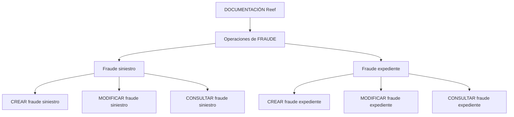

# Documentação de Operações de Sinistros de Automóvel — Fraude no Reef

## 1. Metadados do Documento
- **Arquivo de Origem:** `Não identificado`
- **Tipo de Documento:** `Manual Operacional`
- **Domínio / Sistema:** `Reef — Operações de Sinistros (Automóvel) / Fraude`
- **Público-Alvo:** `Não identificado`
- **Data/Versão Identificada:** `Não identificada`

---

## 2. Resumo Executivo & Contexto de Negócio

O documento apresenta a área de **Operações de Fraude** na documentação Reef, no contexto de **sinistros de automóvel**. O conteúdo descreve funcionalidades para registrar, modificar e consultar informações de fraude associadas a sinistros e expedientes.

A documentação distingue dois contextos de tratamento de fraude: **fraude em sinistro** e **fraude em expediente**. Para ambos os contextos, são disponibilizadas operações de criação, modificação e consulta, embora o texto fornecido detalhe explicitamente a criação, modificação e consulta de fraude para sinistros e expedientes.

O objetivo operacional identificado é permitir a manutenção e a visualização de informações de fraude vinculadas aos objetos de negócio “siniestro” e “expediente”. Não há detalhamento sobre autenticação, fluxos de aprovação, regras de elegibilidade, contratos de integração, campos de formulário ou persistência de dados.

A página está inserida no ambiente de documentação Reef e indica estado de ciclo de vida **Approved**. Também exibe a referência a `Mapfredocument` e o proprietário `user:agonzalez_mapfre.com`.

---

## 3. Arquitetura, Componentes & Tecnologias Envolvidas

| Componente / Termo | Papel identificado |
| :--- | :--- |
| Reef | Ambiente ou sistema de documentação identificado no conteúdo. |
| Operaciones de FRAUDE | Área funcional dedicada às operações de fraude. |
| Fraude siniestro | Fraude associada a um sinistro. |
| Fraude expediente | Fraude associada a um expediente. |
| Mapfredocument | Termo exibido na página de documentação; a função não é detalhada. |
| Owner `user:agonzalez_mapfre.com` | Proprietário indicado para o conteúdo documental. |
| Lifecycle `Approved` | Estado de ciclo de vida exibido para a documentação. |



**Nota de Análise:** o documento não descreve arquitetura de infraestrutura, serviços, APIs, bancos de dados, métodos HTTP, contratos JSON, filas, ambientes de execução ou tecnologias de implementação.

---

## 4. Regras de Negócio, Especificações Funcionais & Processos

### Operações sobre fraude de sinistro

1. **Criar fraude de sinistro**
   - A operação `CREAR fraude siniestro` permite registrar uma fraude em um sinistro.
   - O documento não especifica os dados obrigatórios, validações, responsáveis, estados ou efeito do registro de fraude.

2. **Modificar fraude de sinistro**
   - A operação `MODIFICAR fraude siniestro` permite modificar as informações de fraude de um sinistro.
   - O documento não informa quais atributos podem ser modificados, se existem restrições por estado ou se há trilha de auditoria.

3. **Consultar fraude de sinistro**
   - A operação `CONSULTAR fraude siniestro` mostra todas as informações de uma fraude associada a um sinistro.
   - O documento não detalha filtros, permissões, campos retornados ou critérios de consulta.

### Operações sobre fraude de expediente

1. **Criar fraude de expediente**
   - A operação `CREAR fraude expediente` permite registrar uma fraude em um expediente.
   - O documento não especifica campos, regras de validação, estados ou integrações envolvidos.

2. **Modificar fraude de expediente**
   - A operação `MODIFICAR fraude expediente` permite modificar as informações de fraude de um expediente.
   - Não há detalhamento adicional sobre atributos alteráveis, regras de autorização ou comportamento após a alteração.

3. **Consultar fraude de expediente**
   - A operação `CONSULTAR fraude expediente` mostra todas as informações de uma fraude associada a um expediente.
   - Não são descritos critérios de busca, dados exibidos, paginação ou regras de visibilidade.

---

## 5. Tabelas de Parâmetros, Ambientes e Estruturas de Dados

| Item / Parâmetro | Descrição / Função | Tipo / Valores / Formato | Ambiente / Observações |
| :--- | :--- | :--- | :--- |
| `CREAR fraude siniestro` | Registra uma fraude em um sinistro. | Operação funcional | Operaciones de FRAUDE |
| `MODIFICAR fraude siniestro` | Modifica informações de fraude de um sinistro. | Operação funcional | Operaciones de FRAUDE |
| `CONSULTAR fraude siniestro` | Mostra todas as informações de uma fraude associada a um sinistro. | Operação funcional | Operaciones de FRAUDE |
| `CREAR fraude expediente` | Registra uma fraude em um expediente. | Operação funcional | Operaciones de FRAUDE |
| `MODIFICAR fraude expediente` | Modifica informações de fraude de um expediente. | Operação funcional | Operaciones de FRAUDE |
| `CONSULTAR fraude expediente` | Mostra todas as informações de uma fraude associada a um expediente. | Operação funcional | Operaciones de FRAUDE |
| `Owner` | Proprietário da documentação. | `user:agonzalez_mapfre.com` | DOCUMENTACIÓN Reef |
| `Lifecycle` | Estado de ciclo de vida da documentação. | `Approved` | DOCUMENTACIÓN Reef |
| `Mapfredocument` | Termo exibido na página. | Não detalhado | DOCUMENTACIÓN Reef |
| `VL` | Termo exibido junto ao estado da documentação. | Não detalhado | Não há explicação no conteúdo |

---

## 6. Bateria de Perguntas & Respostas para RAG (FAQ Sintético)

### P1: Qual é o domínio funcional principal do documento?
**R:** O documento trata de operações de fraude no contexto de sinistros de automóvel, dentro da documentação Reef.

### P2: O que permite a operação `CREAR fraude siniestro`?
**R:** A operação `CREAR fraude siniestro` permite registrar uma fraude em um sinistro.

### P3: Qual operação deve ser usada para alterar informações de fraude de um sinistro?
**R:** A operação `MODIFICAR fraude siniestro` permite modificar as informações de fraude de um sinistro.

### P4: Como consultar informações de fraude associadas a um sinistro?
**R:** A operação `CONSULTAR fraude siniestro` mostra todas as informações de uma fraude associada a um sinistro.

### P5: O que permite a operação `CREAR fraude expediente`?
**R:** A operação `CREAR fraude expediente` permite registrar uma fraude em um expediente.

### P6: Como modificar as informações de fraude de um expediente?
**R:** A operação `MODIFICAR fraude expediente` permite modificar as informações de fraude de um expediente.

### P7: Qual funcionalidade apresenta os dados de fraude vinculados a um expediente?
**R:** A operação `CONSULTAR fraude expediente` mostra todas as informações de uma fraude associada a um expediente.

### P8: O documento define APIs, métodos HTTP ou contratos JSON para as operações de fraude?
**R:** Não. O conteúdo apenas lista e descreve funcionalmente as operações de criação, modificação e consulta de fraude para sinistros e expedientes; não há métodos HTTP, endpoints, contratos JSON ou especificações técnicas de integração.

### P9: Quem é o proprietário indicado para a documentação Reef?
**R:** O proprietário exibido no conteúdo é `user:agonzalez_mapfre.com`.

### P10: Qual é o ciclo de vida identificado para a documentação?
**R:** O ciclo de vida exibido para a documentação é `Approved`.

---

## 7. Glossário de Termos, Siglas & Conceitos-Chave

- **Reef:** nome do ambiente ou sistema de documentação identificado na página.
- **Fraude:** domínio funcional abordado pelas operações de criação, modificação e consulta.
- **Siniestro:** termo em espanhol utilizado para sinistro.
- **Expediente:** termo em espanhol utilizado para expediente; o documento não define seu significado de negócio.
- **DOCUMENTACIÓN Reef:** identificação da área documental exibida na página.
- **Mapfredocument:** termo exibido no conteúdo sem definição adicional.
- **Owner:** campo que identifica o proprietário da documentação.
- **Lifecycle:** campo que identifica o estado de ciclo de vida da documentação.
- **Approved:** valor de ciclo de vida informado para o documento.
- **VL:** termo exibido na página sem explicação no conteúdo fornecido.

---

## 8. Notas Críticas, Riscos & Limitações

- O conteúdo possui apenas uma página e descreve as operações em nível funcional resumido.
- Não há definição dos dados necessários para criar ou modificar uma fraude.
- Não há regras de validação, regras de permissão, estados de fraude, critérios de busca ou fluxos de aprovação.
- Não há endpoints, métodos HTTP, esquemas de dados, contratos JSON, logs, URLs de ambiente, servidores ou tecnologias de implementação.
- Os termos `Mapfredocument` e `VL` aparecem no conteúdo, mas não possuem detalhamento adicional.
- **Nota de Análise:** o documento lista operações de fraude para sinistros e expedientes, porém não detalha métodos técnicos, contratos de integração ou regras de negócio adicionais.

---

## 9. Conteúdo Bruto Estruturado (Referência Fiel)

```text
--- [PÁGINA 1 DE 1] ---

DOCUMENTACIÓN OPERACIONES de SINIESTROS (Automóvil) -
FRAUDE
FRAUDE
Operaciones de FRAUDE
CREAR fraude siniestro
Permite registrar un Fraude en un siniestro
MODIFICAR fraude siniestro
Permite modicar la información de
Fraude de un siniestro
CREAR fraude expediente
Permite registrar un Fraude en un
expediente
MODIFICAR fraude expediente
Permite modicar la información de
Fraude de un expediente
CONSULTAR fraude siniestro
Muestra toda la información de un Fraude
asociado a un siniestro
CONSULTAR fraude expediente
Muestra toda la información de un Fraude
asociado a un expediente
Documentation / DOCUMENTACIÓN Reef
DOCUMENTACIÓN Reef
Mapfredocument
DOCUMENTACIÓN Reef
Owner
user:agonzalez_mapfre.com
Lifecycle
Approved Source
 / 
 VL
Buscar Inicio Soluciones Arquitecturas APIs Componentes Cloud Documentación Zeus Reef Ayuda
ES
```
