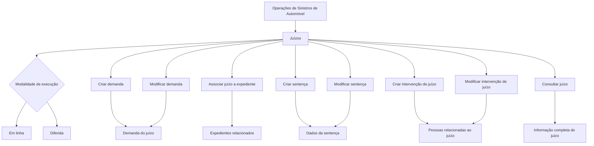

# Documentação de Operações de Sinistros (Automóvel) — Juízos no Reef

## 1. Metadados do Documento
- **Arquivo de Origem:** Não identificado no conteúdo fornecido
- **Tipo de Documento:** Manual Operacional
- **Domínio / Sistema:** Reef / Operações de Sinistros de Automóvel / Juízos
- **Público-Alvo:** Operação, Negócio, Analistas Funcionais e Desenvolvedores
- **Data/Versão Identificada:** Não identificada

---

## 2. Resumo Executivo & Contexto de Negócio

O documento apresenta as operações disponíveis para o domínio de **Juízos** dentro da documentação de operações de **Sinistros de Automóvel**. O conteúdo está associado à documentação Reef e é identificado visualmente como documentação Mapfre.

A regra operacional central é que todas as operações disponíveis para um juízo podem ser realizadas tanto **em linha** quanto de forma **diferida**. O documento não especifica os mecanismos técnicos, critérios de seleção, tempos de processamento ou contratos de integração dessas duas modalidades.

As funcionalidades cobrem o ciclo de gestão de uma demanda judicial: criação e alteração de demanda, associação entre juízo e expedientes, criação e alteração de sentença, gestão de intervenções de pessoas relacionadas e consulta integral de informações do juízo.

O material possui caráter resumido. Não há detalhamento de métodos HTTP, contratos JSON, autenticação, campos obrigatórios, validações, valores permitidos, ambientes técnicos, URLs de API ou procedimentos de tratamento de erro.

---

## 3. Arquitetura, Componentes & Tecnologias Envolvidas

Os elementos explicitamente identificados no conteúdo são:

- **Reef:** Contexto de documentação no qual as operações de Juízos são apresentadas.
- **Mapfredocument:** Identificador exibido na navegação da documentação.
- **Operações de Sinistros (Automóvel):** Área funcional à qual o conteúdo pertence.
- **Juízos:** Entidade ou domínio central das operações.
- **Demanda:** Informação de um juízo que pode ser criada ou modificada.
- **Expedientes:** Registros que podem ser associados a um juízo.
- **Sentença:** Informação de um juízo que pode ser criada ou modificada.
- **Intervenções de juízo:** Associação de pessoas relacionadas ao juízo, incluindo advogados e testemunhas.
- **Modalidades de execução:** Em linha e diferida.



> **Nota de Análise:** O documento descreve operações funcionais, mas não detalha a arquitetura técnica, os componentes de software, os serviços, os endpoints, os protocolos de integração ou os contratos de dados envolvidos.

---

## 4. Regras de Negócio, Especificações Funcionais & Processos

### Regra geral de modalidade operacional

Todas as operações que podem ser realizadas sobre um **juízo** podem ser executadas nas modalidades:

1. **Em linha**
2. **Diferida**

O documento não define a diferença funcional ou técnica entre operação em linha e operação diferida.

### Operações sobre Juízos

1. **Criar demanda**
   - Cria a demanda de um juízo.
   - O documento não especifica os dados exigidos para criação da demanda.

2. **Modificar demanda**
   - Permite alterar informações da demanda de um juízo.
   - A alteração inclui dados e valores.
   - O documento não detalha quais dados ou valores podem ser modificados.

3. **Associar juízo a expediente**
   - Indica quais expedientes estão relacionados ao juízo.
   - O documento não define se um expediente pode ser associado a mais de um juízo nem as regras de validação da associação.

4. **Criar sentença**
   - Gera os dados da sentença de um juízo.
   - Não são informados os campos, estados ou critérios necessários para criação de sentença.

5. **Modificar sentença**
   - Permite alterar as informações da sentença de um juízo.
   - A alteração inclui dados e valores.
   - O documento não apresenta regras de consistência ou restrições para alteração de sentença.

6. **Criar intervenção de juízo**
   - Associa ao juízo as pessoas relacionadas.
   - Os exemplos explícitos de pessoas relacionadas são advogados e testemunhas.
   - O documento também utiliza a expressão “etc.”, sem enumerar todas as categorias possíveis.

7. **Modificar intervenção de juízo**
   - Permite modificar intervenções e pessoas associadas ao juízo.
   - Não são especificadas as regras de inclusão, remoção, substituição ou validação de pessoas.

8. **Consultar juízo**
   - Exibe toda a informação de um juízo.
   - O documento não discrimina quais dados compõem a informação visualizada.

---

## 5. Tabelas de Parâmetros, Ambientes e Estruturas de Dados

| Item / Parâmetro | Descrição / Função | Tipo / Valores / Formato | Ambiente / Observações |
| :--- | :--- | :--- | :--- |
| Juízo | Entidade central das operações documentadas. | Não detalhado | Pertence às operações de Sinistros de Automóvel. |
| Modalidade de execução | Forma pela qual as operações de juízo podem ser realizadas. | Em linha; Diferida | Aplicável a todas as operações de juízo citadas. |
| Demanda | Informação associada a um juízo. | Dados e valores não detalhados | Pode ser criada e modificada. |
| Expediente | Registro relacionado a um juízo. | Não detalhado | Pode ser associado a um juízo. |
| Sentença | Informação de sentença de um juízo. | Dados e valores não detalhados | Pode ser criada e modificada. |
| Intervenção de juízo | Associação entre o juízo e pessoas relacionadas. | Pessoas relacionadas ao juízo | Inclui advogados, testemunhas e outras pessoas não especificadas. |
| Consulta de juízo | Operação de visualização das informações de um juízo. | Informação completa do juízo, sem estrutura detalhada | O conteúdo não apresenta filtros, campos ou critérios de consulta. |
| Owner | Identificação do proprietário exibida na documentação. | `user:agonzalez_mapfre.com` | Exibido na interface documental. |
| Lifecycle | Estado do ciclo de vida exibido. | `Approved Source` | Não há detalhamento do significado operacional desse estado. |
| Identificador adicional | Texto exibido próximo ao ciclo de vida. | `/ VL` | Significado não detalhado. |
| Navegação documental | Áreas disponíveis na interface apresentada. | Buscar, Inicio, Soluciones, Arquitecturas, APIs, Componentes, Cloud, Documentación, Zeus, Reef, Ayuda | Interface exibida em espanhol. |
| Idioma exibido | Idioma selecionado na interface documental. | `ES` | A documentação apresentada está em espanhol. |

---

## 6. Bateria de Perguntas & Respostas para RAG (FAQ Sintético)

### P1: Quais operações de Juízos podem ser realizadas nas operações de Sinistros de Automóvel?
**R:** O documento lista oito operações: criar demanda, modificar demanda, associar juízo a expediente, criar sentença, modificar sentença, criar intervenção de juízo, modificar intervenção de juízo e consultar juízo.

### P2: As operações de Juízos podem ser executadas de forma diferida?
**R:** Sim. O documento estabelece que todas as operações que podem ser realizadas sobre um juízo podem ser executadas tanto em linha quanto de forma diferida. O conteúdo não explica a diferença técnica ou operacional entre essas modalidades.

### P3: O que acontece na operação Criar demanda?
**R:** A operação Criar demanda cria a demanda de um juízo. O documento não informa quais campos, valores, validações ou condições são necessários para essa criação.

### P4: Quais informações podem ser alteradas ao modificar uma demanda?
**R:** A operação Modificar demanda permite alterar informações da demanda de um juízo, incluindo dados e valores. O documento não especifica quais campos ou valores são elegíveis para alteração.

### P5: Para que serve a operação Associar juízo a expediente?
**R:** A operação Associar juízo a expediente indica quais expedientes estão relacionados ao juízo. O documento não detalha regras de cardinalidade, validação ou desassociação entre juízos e expedientes.

### P6: Qual é a finalidade da operação Criar sentença?
**R:** A operação Criar sentença gera os dados da sentença de um juízo. O documento não apresenta a estrutura dos dados da sentença, seus campos obrigatórios ou critérios de criação.

### P7: O que pode ser modificado em uma sentença de juízo?
**R:** A operação Modificar sentença permite alterar informações da sentença de um juízo, incluindo dados e valores. Não há detalhamento sobre campos modificáveis, permissões ou restrições.

### P8: Quem pode ser associado a uma intervenção de juízo?
**R:** A operação Criar intervenção de juízo associa ao juízo as pessoas relacionadas a ele. O documento cita explicitamente advogados e testemunhas como exemplos, além de outras pessoas não enumeradas.

### P9: O que permite a operação Modificar intervenção de juízo?
**R:** A operação Modificar intervenção de juízo permite modificar as intervenções e as pessoas associadas ao juízo. O documento não descreve os tipos de alteração permitidos nem as regras de validação aplicáveis.

### P10: O que é apresentado ao consultar um juízo?
**R:** A operação Consultar juízo visualiza toda a informação de um juízo. O conteúdo não lista quais dados, histórico, intervenções, sentenças ou expedientes estão incluídos nessa visualização.

### P11: O documento fornece APIs ou métodos HTTP para as operações de Juízos?
**R:** Não. O documento apenas descreve as operações funcionais. Não há métodos HTTP, URLs, contratos JSON, parâmetros de requisição, respostas ou mecanismos de autenticação.

### P12: Quem é identificado como proprietário da documentação apresentada?
**R:** O campo Owner exibido na documentação identifica `user:agonzalez_mapfre.com`.

---

## 7. Glossário de Termos, Siglas & Conceitos-Chave

- **Reef:** Nome exibido no contexto da documentação, incluindo “DOCUMENTACIÓN Reef”.
- **Juízos:** Domínio funcional relacionado a operações judiciais dentro de Sinistros de Automóvel.
- **Demanda:** Informação de um juízo que pode ser criada e modificada.
- **Expediente:** Registro que pode ser relacionado a um juízo.
- **Sentença:** Conjunto de dados de sentença associado a um juízo.
- **Intervenção de juízo:** Associação entre um juízo e pessoas relacionadas, como advogados e testemunhas.
- **Em linha:** Modalidade de execução aplicável às operações de juízo, sem detalhamento adicional.
- **Diferida:** Modalidade de execução aplicável às operações de juízo, sem detalhamento adicional.
- **Owner:** Campo apresentado na documentação para identificação de proprietário.
- **Lifecycle:** Campo apresentado na documentação para indicar ciclo de vida.
- **Approved Source:** Valor exibido no campo Lifecycle.
- **ES:** Indicador de idioma exibido na interface, correspondente ao espanhol.

---

## 8. Notas Críticas, Riscos & Limitações

- O conteúdo é resumido e não apresenta detalhes de implementação técnica.
- Não são informados endpoints, métodos HTTP, contratos JSON, esquemas, URLs, portas, credenciais ou mecanismos de autenticação.
- Não há definição de permissões, perfis de acesso ou matriz de autorização para as operações de juízo.
- O documento não explica a diferença entre execução em linha e execução diferida.
- Não há campos obrigatórios, regras de consistência, mensagens de erro, códigos de retorno ou tratamento de exceções.
- Não são apresentados critérios para associação entre juízos e expedientes.
- Não são detalhadas as categorias completas de pessoas que podem participar de uma intervenção de juízo.
- A palavra “modicar” aparece com um caractere de extração corrompido no conteúdo bruto; pelo contexto, refere-se a “modificar”.
- O campo `/ VL` é exibido na documentação, mas seu significado não é explicado.

---

## 9. Conteúdo Bruto Estruturado (Referência Fiel)

```text
--- [PÁGINA 1 DE 1] ---

DOCUMENTACIÓN OPERACIONES de SINIESTROS (Automóvil) -
JUICIOS
JUICIOS
Todas las Operaciones que se pueden realizar con un Juicios, se pueden realizar tanto en línea como
diferido
CREAR demanda
En esta operación se crea la demanda de
un juicio
MODIFICAR demanda
Permite cambiar información de la
demanda de un juicio, datos e importes
ASOCIAR juicio expediente
En esta operación se indica que
expedientes están relacionados con el
juicio
CREAR Sentencia
En esta operación se generan los datos de
la sentencia de un juicio
MODIFICAR Sentencia
Permite cambiar la información de la
sentencia de un juicio, datos e importes
CREAR intervención juicio
Asociar al juicio las personas relacionadas
con el mismo, abogados, testigos.. etc
MODIFICAR intervención juicio
Permite modicar las intervenciones, las
personas asociadas al juicio
CONSULTAR juicio
Visualiza toda la información de un juicio
Documentation / DOCUMENTACIÓN Reef
DOCUMENTACIÓN Reef
Mapfredocument
DOCUMENTACIÓN Reef
Owner
user:agonzalez_mapfre.com
Lifecycle
Approved Source
 / 
 VL
Buscar Inicio Soluciones Arquitecturas APIs Componentes Cloud Documentación Zeus Reef Ayuda
ES
```
