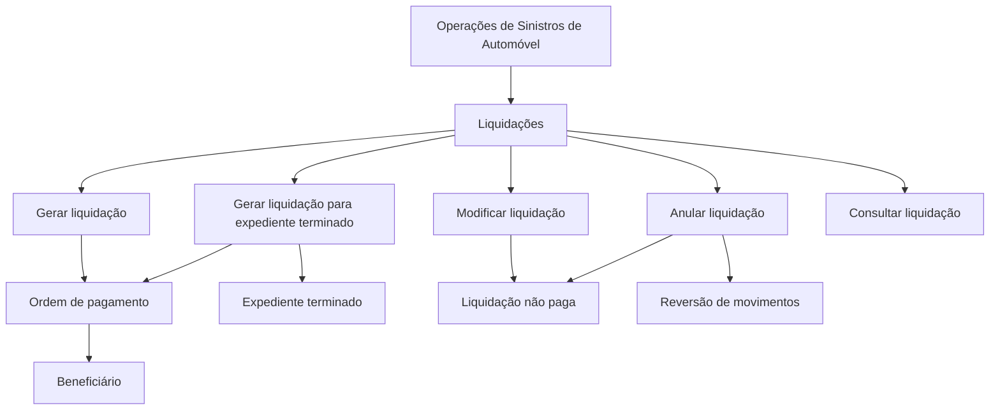

# Documentação de Operações de Sinistros de Automóvel — Liquidações

## 1. Metadados do Documento
- **Arquivo de Origem:** Não identificado no conteúdo fornecido
- **Tipo de Documento:** Procedimento
- **Domínio / Sistema:** Operações de Sinistros (Automóvel) — Liquidações; DOCUMENTACIÓN Reef
- **Público-Alvo:** Operação
- **Data/Versão Identificada:** Não identificada

---

## 2. Resumo Executivo & Contexto de Negócio

O documento descreve operações de **liquidações** no contexto de **sinistros de automóvel**. Uma liquidação é tratada como uma operação associada a um expediente e permite a criação, alteração, cancelamento ou consulta de informações de pagamento para um beneficiário.

As operações de liquidação podem ser realizadas em modalidade **em linha** ou **diferida**. O conteúdo apresenta cinco ações funcionais: gerar liquidação, gerar liquidação para expediente terminado, modificar liquidação, anular liquidação e consultar liquidação.

A geração de uma liquidação permite criar uma ordem de pagamento para um beneficiário. Quando o expediente está terminado, existe uma operação específica para gerar a ordem de pagamento nesse estado do expediente.

As operações de modificação e anulação possuem uma restrição explícita: a liquidação não pode estar paga. A modificação permite alterar dados e importes; a anulação cancela a liquidação e reverte seus movimentos.

> **Nota de Análise:** O documento não detalha telas, métodos HTTP, contratos de integração, estados completos do expediente, critérios de pagamento, campos da liquidação ou mecanismos técnicos para processamento em linha e diferido.

---

## 3. Arquitetura, Componentes & Tecnologias Envolvidas

Os elementos identificados no conteúdo são:

| Componente / Termo | Papel identificado no documento |
| :--- | :--- |
| Operações de Sinistros | Domínio operacional documentado. |
| Automóvel | Segmento de sinistros ao qual as liquidações se aplicam. |
| Liquidação | Entidade ou operação usada para criar, modificar, anular ou consultar dados relacionados a pagamento. |
| Expediente | Contexto associado à liquidação; pode estar terminado para a operação específica de geração. |
| Ordem de pagamento | Resultado da geração de liquidação para um beneficiário. |
| Beneficiário | Destinatário da ordem de pagamento. |
| DOCUMENTACIÓN Reef | Área ou contexto documental exibido no conteúdo. |
| Mapfredocument | Termo exibido na navegação do conteúdo. |
| Zeus | Termo exibido na navegação do conteúdo. |
| Cloud | Termo exibido na navegação do conteúdo. |



> **Nota de Análise:** O diagrama representa exclusivamente as relações funcionais explicitadas pelo documento. Não há arquitetura técnica de software, servidores, APIs, tecnologias de implementação, interfaces ou integrações detalhadas.

---

## 4. Regras de Negócio, Especificações Funcionais & Processos

### Operações de liquidação

As operações de liquidações de um expediente podem ser realizadas de duas formas:

1. **Em linha**
2. **Diferida**

O documento não detalha a diferença operacional, técnica ou temporal entre a execução em linha e a execução diferida.

### Gerar liquidação

A operação **GERAR liquidação** permite criar uma ordem de pagamento para um beneficiário.

Fluxo funcional extraído:

1. Existe um expediente no contexto de sinistros de automóvel.
2. É executada a operação de gerar liquidação.
3. A operação cria uma ordem de pagamento.
4. A ordem de pagamento é criada para um beneficiário.

### Gerar liquidação para expediente terminado

A operação **GERAR liquidação Expediente Terminado** permite criar uma ordem de pagamento para um beneficiário quando o expediente está terminado.

Regra explícita:

- A geração de liquidação por esta operação é aplicável quando o expediente está terminado.

### Modificar liquidação

A operação **MODIFICAR liquidação** permite alterar informações de uma liquidação, incluindo:

- Dados da liquidação.
- Importes da liquidação.

Restrição explícita:

- A liquidação somente pode ser modificada se **não estiver paga**.

### Anular liquidação

A operação **ANULAR liquidação** executa as seguintes ações:

- Cancela uma liquidação.
- Reverte os movimentos da liquidação.

Restrição explícita:

- A liquidação somente pode ser anulada se **não estiver paga**.

### Consultar liquidação

A operação **CONSULTAR liquidação** permite visualizar toda a informação de uma liquidação.

O documento não estabelece restrições de estado para a consulta de uma liquidação.

---

## 5. Tabelas de Parâmetros, Ambientes e Estruturas de Dados

| Item / Parâmetro | Descrição / Função | Tipo / Valores / Formato | Ambiente / Observações |
| :--- | :--- | :--- | :--- |
| Operação de liquidação | Operação realizada sobre liquidações de um expediente. | Em linha ou diferida. | Contexto de sinistros de automóvel. |
| GERAR liquidação | Cria uma ordem de pagamento para um beneficiário. | Operação funcional. | O documento não especifica condições adicionais. |
| GERAR liquidação Expediente Terminado | Cria uma ordem de pagamento para um beneficiário quando o expediente está terminado. | Operação funcional. | Requer expediente terminado. |
| MODIFICAR liquidação | Permite alterar dados e importes de uma liquidação. | Operação funcional. | Permitida somente se a liquidação não estiver paga. |
| ANULAR liquidação | Cancela uma liquidação e reverte seus movimentos. | Operação funcional. | Permitida somente se a liquidação não estiver paga. |
| CONSULTAR liquidação | Visualiza toda a informação de uma liquidação. | Operação funcional. | Sem restrições explicitadas. |
| Expediente | Elemento associado às operações de liquidação. | Estado mencionado: terminado. | O documento não detalha outros estados. |
| Liquidação | Elemento passível de geração, modificação, anulação e consulta. | Estado mencionado: paga ou não paga. | Não há campos ou estrutura de dados detalhados. |
| Ordem de pagamento | Resultado produzido pela geração de liquidação. | Associada a um beneficiário. | Não há formato, canal ou dados de pagamento informados. |
| Beneficiário | Destinatário da ordem de pagamento. | Não especificado. | Não há critérios de elegibilidade descritos. |
| Owner | Identificação exibida no conteúdo documental. | `user:agonzalez_mapfre.com` | Valor transcrito conforme o documento. |
| Lifecycle | Estado de ciclo de vida exibido. | `Approved` | Exibido no conteúdo documental. |
| Source | Campo de origem exibido. | `VL` | Exibido no conteúdo documental. |

---

## 6. Bateria de Perguntas & Respostas para RAG (FAQ Sintético)

### P1: Quais operações de liquidação são documentadas para sinistros de automóvel?
**R:** O documento apresenta cinco operações: gerar liquidação, gerar liquidação para expediente terminado, modificar liquidação, anular liquidação e consultar liquidação.

### P2: O que acontece ao gerar uma liquidação?
**R:** A operação de gerar liquidação permite criar uma ordem de pagamento para um beneficiário.

### P3: Quando deve ser usada a operação “GERAR liquidação Expediente Terminado”?
**R:** Essa operação é usada para criar uma ordem de pagamento para um beneficiário quando o expediente está terminado.

### P4: Uma liquidação paga pode ser modificada?
**R:** Não. O documento determina que a modificação de dados ou importes de uma liquidação é permitida somente quando a liquidação não está paga.

### P5: Uma liquidação paga pode ser anulada?
**R:** Não. A anulação somente pode ocorrer se a liquidação não estiver paga.

### P6: O que a operação de anular liquidação realiza?
**R:** A operação cancela a liquidação e reverte seus movimentos, desde que a liquidação não esteja paga.

### P7: Quais informações podem ser alteradas em uma liquidação?
**R:** A operação de modificar liquidação permite alterar os dados e os importes da liquidação, sempre que ela não esteja paga.

### P8: O que é possível consultar em uma liquidação?
**R:** A operação de consultar liquidação permite visualizar toda a informação disponível da liquidação. O documento não detalha quais campos compõem essa informação.

### P9: As operações de liquidação podem ser realizadas de quais formas?
**R:** O documento informa que as operações de liquidações de um expediente podem ser realizadas em linha ou de forma diferida.

### P10: O documento especifica APIs, métodos HTTP ou contratos JSON para as operações de liquidação?
**R:** Não. O documento descreve as operações em nível funcional e não informa APIs, métodos HTTP, contratos JSON, URLs, tecnologias de implementação ou detalhes de integração.

---

## 7. Glossário de Termos, Siglas & Conceitos-Chave

- **Liquidação:** Operação ou entidade relacionada à criação, alteração, anulação e consulta de informações associadas a uma ordem de pagamento.
- **Expediente:** Elemento associado às operações de liquidação; o documento menciona especificamente o estado de expediente terminado.
- **Expediente terminado:** Estado de expediente mencionado como condição para a operação “GERAR liquidação Expediente Terminado”.
- **Beneficiário:** Destinatário da ordem de pagamento criada por uma operação de geração de liquidação.
- **Ordem de pagamento:** Resultado criado ao gerar uma liquidação para um beneficiário.
- **Importes:** Valores de uma liquidação que podem ser modificados enquanto a liquidação não estiver paga.
- **Movimentos:** Movimentos associados a uma liquidação que são revertidos durante a anulação.
- **Em linha:** Modalidade de realização de operações de liquidação mencionada no documento, sem detalhamento adicional.
- **Diferida:** Modalidade de realização de operações de liquidação mencionada no documento, sem detalhamento adicional.
- **DOCUMENTACIÓN Reef:** Identificação do contexto documental exibido no conteúdo.
- **Mapfredocument:** Termo exibido na navegação do conteúdo, sem explicação funcional adicional.
- **Zeus:** Termo exibido na navegação do conteúdo, sem explicação funcional adicional.
- **VL:** Valor exibido no campo `Source`; o documento não expande a sigla.

---

## 8. Notas Críticas, Riscos & Limitações

- O documento não descreve a arquitetura técnica das operações de liquidação.
- Não são informados serviços, microsserviços, APIs, métodos HTTP, contratos JSON, bancos de dados, filas, URLs, portas, ambientes ou credenciais.
- Não há detalhamento sobre os critérios que definem quando uma liquidação é considerada paga.
- O documento não apresenta fluxo de aprovação, autorização, auditoria ou rastreabilidade para criação, modificação e anulação de liquidações.
- Não são especificados os dados de uma liquidação nem a composição dos importes.
- A diferença entre processamento em linha e processamento diferido não é detalhada.
- O documento menciona `Mapfredocument`, `Zeus`, `Cloud` e `VL`, mas não explica seus papéis funcionais ou técnicos.
- A restrição de não estar paga é explicitada para modificação e anulação; não devem ser inferidas restrições adicionais para geração ou consulta.

---

## 9. Conteúdo Bruto Estruturado (Referência Fiel)

```text
--- [PÁGINA 1 DE 1] ---

DOCUMENTACIÓN OPERACIONES de SINIESTROS (Automóvil) -
LIQUIDACIONES
LIQUIDACIÓN
Operaciones de liquidaciones de un expediente, se pueden realizar tanto en línea como diferido
GENERAR liquidación
Permite crear una orden de pago para un
beneciario
GENERAR liquidación Expediente
Terminado
Permite crear una orden de pago para un
beneciario,cuando el expediente está
terminado
MODIFICAR liquidación
Permite cambiar la información de una
liquidación, tanto datos, como importes
siempre que no esté pagada
ANULAR liquidación
Cancela una liquidación, revierte sus
movimientos siempre y cuando no esté
pagada
CONSULTAR liquidación
Visualiza toda la información de una
liquidación
Documentation / DOCUMENTACIÓN Reef
DOCUMENTACIÓN Reef
Mapfredocument
DOCUMENTACIÓN Reef
Owner
user:agonzalez_mapfre.com
Lifecycle
Approved Source
 / 
 VL
Buscar Inicio Soluciones Arquitecturas APIs Componentes Cloud Documentación Zeus Reef Ayuda
ES
```
