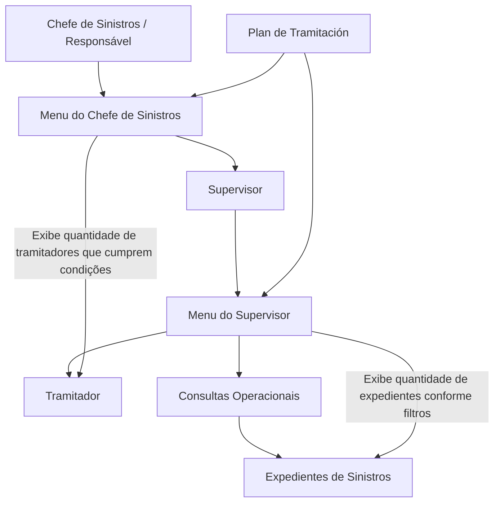

# Documentação Operações de Sinistros — Menu do Supervisor e Chefe de Sinistros

## 1. Metadados do Documento
- **Arquivo de Origem:** Não identificado no conteúdo fornecido
- **Tipo de Documento:** Manual Operacional
- **Domínio / Sistema:** Operações de Sinistros / Reef / Mapfredocument
- **Público-Alvo:** Supervisores, chefes de sinistros, responsáveis e tramitadores
- **Data/Versão Identificada:** Não identificada

---

## 2. Resumo Executivo & Contexto de Negócio

O documento descreve os menus de operação e auditoria usados por supervisores e chefes de sinistros. A ferramenta tem como base o “Plan de Tramitación” e é destinada a organizar o trabalho de gestão e auditoria executado por esses perfis.

O objetivo principal é controlar a gestão dos tramitadores. Para os responsáveis ou chefes de sinistros, a ferramenta também permite acompanhar a gestão realizada pelos supervisores sob sua responsabilidade.

No contexto do perfil de supervisor, as consultas exibem os tramitadores vinculados ao supervisor e a quantidade de expedientes que atendem às condições filtradas. No contexto do perfil de chefe de sinistros, as consultas exibem os supervisores e o número de tramitadores de cada supervisor que atendem às condições aplicáveis.

As operações documentadas permitem consultar avisos pendentes, trâmites pendentes, cartas geradas, expedientes sem atividade, expedientes atribuídos e o estado de controle de trâmites. O conteúdo não detalha a interface, os campos disponíveis para filtragem, contratos de integração, URLs, métodos HTTP ou persistência dos dados.

---

## 3. Arquitetura, Componentes & Tecnologias Envolvidas

Os componentes e conceitos explicitamente citados são:

- **Menu do Supervisor:** apresenta tramitadores e quantidades de expedientes que cumprem as condições filtradas.
- **Menu do Chefe de Sinistros:** apresenta supervisores e a quantidade de tramitadores dos supervisores que cumprem as condições.
- **Plan de Tramitación:** referência funcional usada como base para organização, gestão e auditoria.
- **Tramitadores:** usuários cuja carteira de expedientes é consultada e controlada.
- **Supervisores:** usuários que acompanham a gestão dos tramitadores.
- **Chefes de Sinistros / Responsáveis:** usuários que acompanham a gestão dos supervisores.
- **Reef / Mapfredocument:** nomes presentes na navegação e identificação documental.



> **Nota de Análise:** O documento não especifica a arquitetura técnica, tecnologias de implementação, bases de dados, APIs, integrações, servidores ou ambientes do sistema Reef/Mapfredocument.

---

## 4. Regras de Negócio, Especificações Funcionais & Processos

### Regras gerais dos menus

1. A ferramenta organiza atividades de gestão e auditoria para supervisores.
2. A ferramenta é baseada no **Plan de Tramitación**.
3. O objetivo principal declarado é o controle da gestão realizada pelos tramitadores.
4. Chefes de sinistros ou responsáveis usam a ferramenta para gerir ou acompanhar supervisores.
5. O menu do supervisor apresenta:
   - Os tramitadores do supervisor.
   - O número de expedientes que atendem às condições aplicadas.
6. O menu do chefe de sinistros apresenta:
   - Os supervisores.
   - O número de tramitadores pertencentes ao supervisor que atendem às condições.

### Consultar avisos pendentes totais

A consulta apresenta os tramitadores do supervisor e o número de expedientes que possuem aviso pendente. A seleção é condicionada aos filtros aplicados pelo supervisor.

### Consultar trâmites pendentes totais

A consulta apresenta os tramitadores do supervisor e o número de expedientes que possuem o trâmite indicado pendente. A seleção utiliza as condições filtradas pelo tramitador.

### Consultar cartas totais

A consulta apresenta os tramitadores do supervisor e o número de expedientes para os quais a carta indicada foi gerada. A seleção utiliza as condições filtradas pelo tramitador.

### Consultar expedientes sem atividade totais

A consulta apresenta os tramitadores do supervisor e o número de expedientes nos quais não foi realizada nenhuma operação. A seleção utiliza as condições filtradas pelo tramitador.

### Consultar expedientes atribuídos totais

A consulta apresenta os tramitadores do supervisor e o número de expedientes atribuídos ao tramitador que possuem um estado indicado. Os exemplos de estado fornecidos são:

- Pendente.
- Em juízo.
- Retido por c.t.

A seleção também considera as condições filtradas pelo tramitador.

### Consultar estado de controle de trâmites totais

A consulta apresenta os tramitadores do supervisor e o número de expedientes que possuem uma data de controle definida. A data de controle é descrita como o tempo máximo para que uma ação seja realizada.

A consulta considera:

1. O estado indicado pelo tramitador.
2. As condições filtradas pelo tramitador.
3. A existência de data de controle definida para o expediente.

> **Nota de Análise:** O documento não detalha quais estados adicionais podem ser selecionados, como a data de controle é calculada, quais filtros estão disponíveis ou quais ações devem ocorrer quando o tempo máximo é ultrapassado.

---

## 5. Tabelas de Parâmetros, Ambientes e Estruturas de Dados

| Item / Parâmetro | Descrição / Função | Tipo / Valores / Formato | Ambiente / Observações |
| :--- | :--- | :--- | :--- |
| Plan de Tramitación | Base funcional da ferramenta de gestão e auditoria. | Conceito/processo de referência. | Não detalhado. |
| Supervisor | Perfil que controla a gestão dos tramitadores. | Papel de usuário. | Visualiza tramitadores e quantidade de expedientes que atendem às condições. |
| Chefe de Sinistros / Responsável | Perfil que acompanha a gestão dos supervisores. | Papel de usuário. | Visualiza supervisores e quantidade de tramitadores que atendem às condições. |
| Tramitador | Usuário associado ao tratamento de expedientes. | Papel de usuário. | Pode aplicar condições de filtro em diversas consultas. |
| Expediente | Registro de sinistro contabilizado nas consultas. | Entidade de negócio. | Não há estrutura de dados detalhada. |
| Aviso pendente | Critério para consulta de expedientes. | Estado/condição do expediente. | Utilizado em “CONSULTAR avisos pendientes totales”. |
| Trâmite pendente | Critério para consulta de expedientes. | Estado/condição do expediente. | O trâmite deve ser indicado; não há lista de trâmites. |
| Carta indicada | Critério para consulta de cartas geradas. | Documento/carta. | Não há tipos de carta descritos. |
| Expediente sem atividade | Expediente no qual não foi realizada nenhuma operação. | Condição de atividade. | Utilizado em “CONSULTAR expedientes sin actividad totales”. |
| Estado do expediente | Estado usado na consulta de expedientes atribuídos. | Exemplos: pendente, em juízo, retido por c.t. | Lista completa de estados não especificada. |
| Data de controle | Data definida como tempo máximo para realização de uma ação. | Data; formato não informado. | Utilizada na consulta de estado de controle de trâmites. |
| Condições filtradas pelo supervisor | Filtros usados na consulta de avisos pendentes. | Não detalhado. | Aplicável à consulta de avisos pendentes totais. |
| Condições filtradas pelo tramitador | Filtros usados em consultas operacionais. | Não detalhado. | Aplicável a trâmites, cartas, expedientes sem atividade, expedientes atribuídos e controle de trâmites. |
| Reef | Nome presente na documentação e navegação. | Sistema/plataforma citada. | Não há descrição técnica adicional. |
| Mapfredocument | Nome presente na identificação documental. | Repositório ou identificação documental citada. | Não há descrição técnica adicional. |
| Owner | Proprietário indicado no documento. | `user:agonzalez_mapfre.com` | Conforme conteúdo original. |
| Lifecycle | Estado documental indicado. | `Approved Source / VL` | Significado de “VL” não detalhado. |

---

## 6. Bateria de Perguntas & Respostas para RAG (FAQ Sintético)

### P1: Qual é o objetivo principal do menu de supervisor e chefe de sinistros?
**R:** O objetivo principal é controlar a gestão dos tramitadores por meio de uma ferramenta de organização, gestão e auditoria baseada no “Plan de Tramitación”. Para chefes de sinistros ou responsáveis, a ferramenta também permite acompanhar a gestão dos supervisores.

### P2: O que o menu do supervisor apresenta?
**R:** O menu do supervisor apresenta os tramitadores vinculados ao supervisor e o número de expedientes que cumprem as condições aplicadas na consulta.

### P3: O que o menu do chefe de sinistros apresenta?
**R:** O menu do chefe de sinistros apresenta os supervisores e o número de tramitadores de cada supervisor que cumprem as condições aplicáveis.

### P4: Como funciona a consulta de avisos pendentes totais?
**R:** A consulta de avisos pendentes totais mostra os tramitadores do supervisor e o número de expedientes que possuem aviso pendente, considerando as condições filtradas pelo supervisor.

### P5: Qual consulta permite identificar trâmites pendentes?
**R:** A operação “CONSULTAR tramites pendientes totales” mostra os tramitadores do supervisor e o número de expedientes que possuem o trâmite indicado pendente, conforme as condições filtradas pelo tramitador.

### P6: Como são identificados os expedientes sem atividade?
**R:** A operação “CONSULTAR expedientes sin actividad totales” mostra os tramitadores do supervisor e o número de expedientes em que nenhuma operação foi realizada, considerando as condições filtradas pelo tramitador.

### P7: Quais estados de expediente são mencionados na consulta de expedientes atribuídos?
**R:** O documento menciona como exemplos os estados “pendente”, “em juízo” e “retido por c.t.”. A consulta contabiliza os expedientes do tramitador que possuem o estado selecionado e cumprem as condições filtradas pelo tramitador.

### P8: O que significa a data de controle na consulta de estado de controle de trâmites?
**R:** A data de controle é definida como o tempo máximo para a realização de uma ação. A consulta contabiliza expedientes que possuem data de controle definida no estado indicado pelo tramitador e que atendem às condições filtradas pelo tramitador.

### P9: A documentação informa quais filtros estão disponíveis para supervisores e tramitadores?
**R:** Não. O documento informa que supervisores e tramitadores aplicam condições de filtro nas consultas, mas não especifica os campos, operadores, valores permitidos ou lógica de composição desses filtros.

### P10: A documentação descreve APIs, métodos HTTP ou contratos JSON dos menus de sinistros?
**R:** Não. O documento descreve operações funcionais de consulta, mas não apresenta APIs, métodos HTTP, contratos JSON, integrações, bancos de dados ou detalhes de implementação técnica.

---

## 7. Glossário de Termos, Siglas & Conceitos-Chave

- **Aviso pendente:** Condição de expediente usada para contabilizar itens com aviso pendente.
- **Carta:** Documento cuja geração pode ser consultada por expediente.
- **Chefe de Sinistros:** Perfil responsável que acompanha supervisores e seus tramitadores.
- **c.t.:** Sigla citada no estado “retido por c.t.”; o significado não é detalhado no documento.
- **Data de controle:** Tempo máximo definido para a realização de uma ação em determinado estado.
- **Expediente:** Registro de sinistro utilizado nas consultas e contabilizações.
- **Mapfredocument:** Nome apresentado na identificação documental; sem definição adicional.
- **Plan de Tramitación:** Base de referência da ferramenta de gestão e auditoria.
- **Reef:** Nome apresentado na documentação e navegação; sem definição técnica adicional.
- **Supervisor:** Perfil que acompanha os tramitadores e suas quantidades de expedientes.
- **Tramitador:** Perfil que trata expedientes e aplica condições de filtro em consultas operacionais.
- **VL:** Sigla exibida no campo Lifecycle; significado não informado.

---

## 8. Notas Críticas, Riscos & Limitações

- O documento apresenta funcionalidades operacionais, mas não descreve a arquitetura técnica do sistema.
- Não há detalhes sobre APIs, integrações, autenticação, autorização, bancos de dados, logs, servidores, URLs, ambientes ou mecanismos de auditoria técnica.
- Os filtros aplicados por supervisor e tramitador são mencionados, mas seus campos, regras, operadores e valores permitidos não são especificados.
- A lista de estados de expedientes não é completa; somente “pendente”, “em juízo” e “retido por c.t.” são apresentados como exemplos.
- O significado da sigla **c.t.** não é fornecido.
- O significado de **VL** no campo Lifecycle não é fornecido.
- O documento não especifica o comportamento operacional para prazos de controle vencidos ou próximos do vencimento.
- O documento não detalha os tipos de carta, tipos de aviso, tipos de trâmite ou ações permitidas sobre os expedientes consultados.

---

## 9. Conteúdo Bruto Estruturado (Referência Fiel)

```text
--- [PÁGINA 1 DE 1] ---

DOCUMENTACIÓN OPERACIONES de
SINIESTROS - MENÚ DEL
SUPERVISOR AUDITORIA
MENÚ SUPERVISOR Y JEFE DE
SINIESTROS
Herramienta para organizar el trabajo de gestión y auditoria de los
supervisores, basado en el "Plan de Tramitación", cuyo principal objetivo
es el Control de la gestión de sus tramitadores y en el caso de los
responsables o jefes de siniestros la gestión de sus supervisores. A
continuación se detallan las distintas operaciones de ambos menús.
En el caso del supervisor lo que muestra son los tramitadores y el
número de expedientes que cumplen las condiciones, en el caso del jefe
del siniestros, muestra los supervisores, y el número de tramitadores del
supervisor que cumplen con las condiciones.
CONSULTAR avisos pendientes totales
Muestra los tramitadores del supervisor y el número de expedientes que tengan aviso pendiente, con las condiciones
que haya ltrado el supervisor
CONSULTAR tramites pendientes totales
Muestra los tramitadores del supervisor y el número expedientes que tengan el trámite indicado pendiente con las
condiciones que haya ltrado el tramitador
CONSULTAR cartas totales
Muestra los tramitadores del supervisor y el número expedientes a los que se les haya generado la carta indicada, con
las condiciones que haya ltrado el tramitador
CONSULTAR expedientes sin actividad totales
Muestra los tramitadores del supervisor y el número expedientes que no se haya realizado ninguna operación con
ellos, con las condiciones que haya ltrado el tramitador
CONSULTAR expedientes asignados totales
Muestra los tramitadores del supervisor y el número expedientes que tenga el tramitador con el estado (pendiente, en
juicio, retenido por c.t...) y las condiciones que haya ltrado el tramitador
CONSULTAR estado control tramites totales
Muestra los tramitadores del supervisor y el número expedientes que tengan denido fecha de control (tiempo
máximo para realizarse) en el estado que indique el tramitador y las condiciones que haya ltrado el tramitador
Documentation / DOCUMENTACIÓN Reef
DOCUMENTACIÓN Reef
Mapfredocument
DOCUMENTACIÓN Reef
Owner
user:agonzalez_mapfre.com
Lifecycle
Approved Source
 / 
 VL
Buscar Inicio Soluciones Arquitecturas APIs Componentes Cloud Documentación Zeus Reef Ayuda
ES
```
