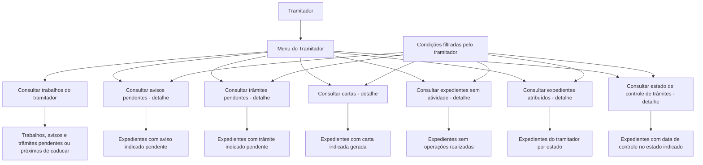

# Documentação de Operações de Sinistros — Menu do Tramitador

## 1. Metadados do Documento
- **Arquivo de Origem:** Não identificado no conteúdo fornecido
- **Tipo de Documento:** Manual Operacional
- **Domínio / Sistema:** Operações de Sinistros — Reef / Mapfre
- **Público-Alvo:** Tramitadores e equipes de operação de sinistros
- **Data/Versão Identificada:** Não identificada
- **Owner identificado:** `user:agonzalez_mapfre.com`
- **Lifecycle identificado:** Approved Source / VL

---

## 2. Resumo Executivo & Contexto de Negócio

O documento descreve o **Menu do Tramitador** dentro do contexto de operações de sinistros. O menu é apresentado como a ferramenta básica e fundamental na qual um tramitador realiza todo o seu trabalho operacional.

As funções documentadas são consultas voltadas à identificação e acompanhamento de trabalhos pendentes, avisos pendentes, trâmites pendentes, cartas geradas, expedientes sem atividade, expedientes atribuídos ao tramitador e estados de controle de trâmites.

As consultas permitem que o tramitador aplique condições de filtro. O conteúdo informa repetidamente que os resultados apresentados dependem das condições filtradas pelo tramitador, mas não especifica quais campos, operadores ou critérios de filtragem estão disponíveis.

O documento está associado à documentação Reef, ao ambiente ou portal Mapfredocument e à navegação corporativa que inclui itens como Soluções, Arquiteturas, APIs, Componentes, Cloud, Documentação, Zeus e Reef. Não há detalhamento técnico sobre integrações, tecnologias, contratos de API, banco de dados ou regras de autorização.

---

## 3. Arquitetura, Componentes & Tecnologias Envolvidas

### Componentes e contextos identificados

| Componente / Termo | Papel descrito no documento |
| :--- | :--- |
| Menu do Tramitador | Ferramenta básica e fundamental para execução do trabalho do tramitador. |
| Tramitador | Usuário operacional que consulta e acompanha trabalhos, avisos, trâmites, cartas e expedientes. |
| Operações de Sinistros | Domínio operacional tratado pelo menu. |
| Reef | Contexto de documentação identificado como “DOCUMENTACIÓN Reef”. |
| Mapfredocument | Plataforma ou contexto documental citado no conteúdo. |
| Zeus | Item de navegação citado, sem detalhamento funcional. |
| Expediente | Entidade consultada em diferentes operações, incluindo situação de pendência, atividade, atribuição e controle de trâmites. |
| Aviso | Item que pode permanecer pendente em expedientes. |
| Trâmite | Item que pode permanecer pendente ou possuir data de controle. |
| Carta | Item gerado para expedientes e disponível para consulta. |
| Estado de expediente | Condição de um expediente, com exemplos: pendente, em juízo e retido por c.t. |
| Data de controle | Data definida para um trâmite, associada ao tempo máximo para realização. |



> **Nota de Análise:** O documento não detalha a arquitetura técnica, os métodos HTTP, contratos JSON, tecnologias de implementação, persistência de dados ou integrações entre Reef, Mapfredocument e Zeus.

---

## 4. Regras de Negócio, Especificações Funcionais & Processos

### 4.1 Menu do Tramitador

1. O Menu do Tramitador é definido como a ferramenta básica e fundamental para o trabalho do tramitador.
2. O menu disponibiliza operações de consulta relacionadas à gestão de sinistros.
3. Diversas operações retornam expedientes conforme condições filtradas pelo tramitador.
4. O documento não descreve o procedimento de acesso ao menu, critérios de permissão, campos de filtro, ordenação, paginação ou ações posteriores sobre os resultados.

### 4.2 Consultar trabalhos do tramitador

A função **CONSULTAR trabalhos tramitador** mostra:
- Todos os trabalhos pendentes;
- Avisos pendentes;
- Trâmites próximos de caducar.

> **Nota de Análise:** O conteúdo não define o conceito temporal de “a ponto de caducar”, nem informa como a proximidade de vencimento é calculada.

### 4.3 Consultar avisos pendentes — detalhe

A função **CONSULTAR avisos pendientes detalle** mostra todos os expedientes que possuem o aviso indicado pendente.

A consulta considera as condições filtradas pelo tramitador.

> **Nota de Análise:** O texto extraído contém o termo corrompido `ltrado`, interpretado contextualmente como “filtrado”, devido à recorrência da expressão “condiciones que haya filtrado el tramitador”.

### 4.4 Consultar trâmites pendentes — detalhe

A função **CONSULTAR tramites pendientes detalle** mostra todos os expedientes que possuem o trâmite indicado pendente.

A consulta considera as condições filtradas pelo tramitador.

### 4.5 Consultar cartas — detalhe

A função **CONSULTAR cartas detalle** mostra todos os expedientes para os quais a carta indicada foi gerada.

A consulta considera as condições filtradas pelo tramitador.

### 4.6 Consultar expedientes sem atividade — detalhe

A função **CONSULTAR expedientes sin actividad detalle** mostra todos os expedientes nos quais nenhuma operação foi realizada.

A consulta considera as condições filtradas pelo tramitador.

> **Nota de Análise:** O documento não define quais tipos de ação constituem uma “operação” nem informa o intervalo de tempo usado para classificar um expediente como sem atividade.

### 4.7 Consultar expedientes atribuídos — detalhe

A função **CONSULTAR expedientes asignados detalle** mostra os expedientes atribuídos ao tramitador conforme o estado indicado.

Exemplos de estados mencionados:
- Pendente;
- Em juízo;
- Retido por c.t.

A consulta considera as condições filtradas pelo tramitador.

> **Nota de Análise:** O significado de “c.t.” não é definido no conteúdo original.

### 4.8 Consultar estado de controle de trâmites — detalhe

A função **CONSULTAR estado control tramites detalle** mostra os expedientes que:
1. Possuem data de controle definida;
2. Estão no estado indicado pelo tramitador;
3. Atendem às condições filtradas pelo tramitador.

A data de controle é definida como o tempo máximo para realização do trâmite.

> **Nota de Análise:** O documento não informa como a data de controle é criada, alterada, validada ou associada a alertas operacionais.

---

## 5. Tabelas de Parâmetros, Ambientes e Estruturas de Dados

| Item / Parâmetro | Descrição / Função | Tipo / Valores / Formato | Ambiente / Observações |
| :--- | :--- | :--- | :--- |
| Menu do Tramitador | Ferramenta de trabalho do tramitador para operações de sinistros. | Menu funcional | Documentação Reef / Mapfredocument. |
| Trabalhos pendentes | Trabalhos exibidos na consulta de trabalhos do tramitador. | Não especificado | Inclui avisos pendentes e trâmites próximos de caducar. |
| Aviso indicado | Aviso usado como critério para localizar expedientes com aviso pendente. | Não especificado | A consulta considera condições filtradas pelo tramitador. |
| Trâmite indicado | Trâmite usado como critério para localizar expedientes com trâmite pendente. | Não especificado | A consulta considera condições filtradas pelo tramitador. |
| Carta indicada | Carta usada como critério para localizar expedientes que receberam a carta. | Não especificado | A consulta considera condições filtradas pelo tramitador. |
| Expediente sem atividade | Expediente no qual nenhuma operação foi realizada. | Estado ou condição operacional | Não há definição de período sem atividade. |
| Expediente atribuído | Expediente associado ao tramitador. | Relação de atribuição | Pode ser consultado por estado. |
| Estado do expediente | Estado usado para consultar expedientes atribuídos ou com controle de trâmites. | Exemplos: pendente, em juízo, retido por c.t. | O catálogo completo de estados não foi informado. |
| Data de controle | Data definida para controle de um trâmite. | Data; formato não especificado | Representa o tempo máximo para realização. |
| Condições de filtro | Critérios aplicados pelo tramitador às consultas. | Não especificado | Campos, operadores e valores permitidos não foram documentados. |
| Owner | Proprietário identificado para o conteúdo documental. | `user:agonzalez_mapfre.com` | Registrado no bloco de metadados da fonte. |
| Lifecycle | Situação documental identificada. | Approved Source / VL | Significado de “VL” não informado. |
| Idioma da interface | Idioma indicado no cabeçalho da navegação. | ES | Interface ou conteúdo em espanhol. |

---

## 6. Bateria de Perguntas & Respostas para RAG (FAQ Sintético)

### P1: Qual é a finalidade do Menu do Tramitador nas operações de sinistros?
**R:** O Menu do Tramitador é descrito como a ferramenta básica e fundamental na qual o tramitador realiza todo o seu trabalho. O menu concentra consultas sobre trabalhos pendentes, avisos, trâmites, cartas e expedientes relacionados às operações de sinistros.

### P2: O que a consulta “Consultar trabalhos tramitador” apresenta?
**R:** A consulta mostra todos os trabalhos pendentes do tramitador, incluindo avisos pendentes e trâmites que estão próximos de caducar. O documento não detalha o critério usado para determinar que um trâmite está próximo de caducar.

### P3: Como consultar expedientes que possuem um aviso pendente?
**R:** A opção “CONSULTAR avisos pendientes detalle” mostra todos os expedientes que possuem o aviso indicado em situação pendente. O resultado é condicionado aos filtros aplicados pelo tramitador.

### P4: Como localizar expedientes com um trâmite pendente específico?
**R:** A opção “CONSULTAR tramites pendientes detalle” mostra os expedientes que possuem o trâmite indicado pendente. A consulta também considera as condições filtradas pelo tramitador.

### P5: Como verificar em quais expedientes uma carta foi gerada?
**R:** A opção “CONSULTAR cartas detalle” mostra todos os expedientes para os quais a carta indicada foi gerada. Os resultados dependem das condições de filtro definidas pelo tramitador.

### P6: O que caracteriza um expediente sem atividade no menu?
**R:** Um expediente sem atividade é apresentado como um expediente no qual não foi realizada nenhuma operação. O documento não especifica quais operações são consideradas nem qual período é analisado para determinar a ausência de atividade.

### P7: Quais estados de expediente são citados na consulta de expedientes atribuídos?
**R:** A consulta de expedientes atribuídos menciona os estados pendente, em juízo e retido por c.t. O documento não apresenta o catálogo completo de estados e não define o significado da sigla “c.t.”.

### P8: Qual é a finalidade da data de controle de trâmites?
**R:** A data de controle é definida como o tempo máximo para a realização de um trâmite. A consulta de estado de controle de trâmites mostra expedientes que possuem essa data definida, estão no estado indicado pelo tramitador e atendem aos filtros aplicados.

### P9: Quais consultas do Menu do Tramitador dependem de filtros aplicados pelo usuário?
**R:** O documento informa explicitamente que as consultas de avisos pendentes, trâmites pendentes, cartas, expedientes sem atividade, expedientes atribuídos e estado de controle de trâmites consideram as condições filtradas pelo tramitador.

### P10: O documento descreve APIs, métodos HTTP ou contratos de integração do Menu do Tramitador?
**R:** Não. O conteúdo fornecido descreve apenas funcionalidades operacionais de consulta. Não há métodos HTTP, URLs de API, contratos JSON, tecnologias de implementação ou detalhes de integração documentados.

---

## 7. Glossário de Termos, Siglas & Conceitos-Chave

- **Aviso:** Item que pode permanecer pendente em um expediente e ser consultado pelo Menu do Tramitador.
- **Carta:** Documento ou item gerado para um expediente, disponível para consulta pelo tipo de carta indicado.
- **c.t.:** Sigla citada no estado “retenido por c.t.”; o significado não é definido no documento.
- **Data de controle:** Data definida para um trâmite, correspondente ao tempo máximo para sua realização.
- **Expediente:** Entidade operacional consultada no contexto de sinistros.
- **Mapfredocument:** Nome citado no conteúdo como contexto ou plataforma de documentação, sem detalhamento adicional.
- **Menu do Tramitador:** Ferramenta central de trabalho do tramitador para consultas de operações de sinistros.
- **Reef:** Contexto documental identificado como “DOCUMENTACIÓN Reef”.
- **Sinistros:** Domínio de negócio das operações tratadas no menu.
- **Tramitador:** Usuário responsável por executar consultas e gerir seu trabalho operacional no Menu do Tramitador.
- **Trâmite:** Item operacional que pode estar pendente, próximo de caducar ou sujeito a uma data de controle.
- **VL:** Marcador exibido junto ao lifecycle “Approved Source / VL”; significado não definido.
- **Zeus:** Item citado na navegação do portal, sem detalhamento funcional.

---

## 8. Notas Críticas, Riscos & Limitações

- O documento não identifica o arquivo de origem, data, versão ou histórico de revisões.
- O conteúdo não documenta permissões, perfis de acesso ou matriz de autorização para as consultas.
- Os campos, operadores, valores permitidos e comportamento das condições de filtro não são especificados.
- Não há definição de SLA, cálculo de vencimento, alerta ou escalonamento para trâmites próximos de caducar.
- Não há detalhamento do ciclo de vida de um expediente, de um aviso, de uma carta ou de um trâmite.
- O significado da sigla **c.t.** não é informado.
- O significado do marcador **VL** em “Approved Source / VL” não é informado.
- A extração contém ocorrências de caracteres corrompidos em `ltrado` e `denido`; a interpretação contextual é “filtrado” e “definido”, respectivamente.
- Não há arquitetura técnica, integrações, URLs, ambientes, servidores, logs, contratos de API ou tecnologias descritas.

---

## 9. Conteúdo Bruto Estruturado (Referência Fiel)

```text
--- [PÁGINA 1 DE 1] ---

DOCUMENTACIÓN OPERACIONES de SINIESTROS - MENÚ DEL
TRAMITADOR
MENÚ DEL TRAMITADOR
Operaciones que se pueden realizar desde el menú del tamitador. Esta es la herramienta básica y
fundamental en la que un tramitador va a realizar todo su trabajo
CONSULTAR trabajos tramitador
Muestra todos los trabajos pendientes,
avisos pendientes, trámites a punto de
caducar... - CONSULTAR avisos
pendientes detalle
Muestra todos los expedientes que tengan
el aviso indicado pendiente, con las
condiciones que haya ltrado el tramitador
CONSULTAR tramites pendientes detalle
Muestra todos los expedientes que tengan
el trámite indicado pendiente con las
condiciones que haya ltrado el tramitador
CONSULTAR cartas detalle
Muestra todos los expedientes a los que
se les haya generado la carta indicada,
con las condiciones que haya ltrado el
tramitador
CONSULTAR expedientes sin actividad
detalle
Muestra todos los expedientes que no se
haya realizado ninguna operación con
ellos, con las condiciones que haya
ltrado el tramitador
CONSULTAR expedientes asignados
detalle
Muestra todos los expedientes que tenga
el tramitador con el estado (pendiente, en
juicio, retenido por c.t...) y las condiciones
que haya ltrado el tramitador
CONSULTAR estado control tramites
detalle
Muestra todos los expedientes que tengan
denido fecha de control (tiempo máximo
para realizarse) en el estado que indique
el tramitador y las condiciones que haya
ltrado el tramitador
Documentation / DOCUMENTACIÓN Reef
DOCUMENTACIÓN Reef
Mapfredocument
DOCUMENTACIÓN Reef
Owner
user:agonzalez_mapfre.com
Lifecycle
Approved Source
 / 
 VL
Buscar Inicio Soluciones Arquitecturas APIs Componentes Cloud Documentación Zeus Reef Ayuda
ES
```
