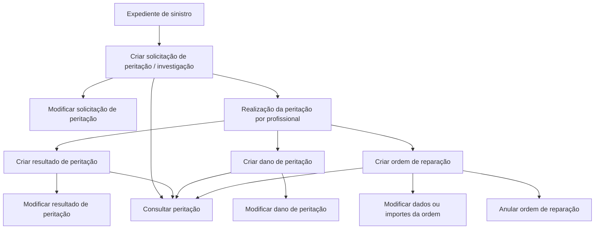

# Documentación de Operaciones de Siniestros — Peritaciones

## 1. Metadados do Documento
- **Arquivo de Origem:** `Não identificado no conteúdo fornecido`
- **Tipo de Documento:** `Manual Operacional`
- **Domínio / Sistema:** `Reef / Operações de Siniestros / Peritaciones`
- **Público-Alvo:** `Operação, negócio e profissionais envolvidos em peritações`
- **Data/Versão Identificada:** `Não identificada`

---

## 2. Resumo Executivo & Contexto de Negócio

O documento descreve operações de **peritación** associadas a um expediente de sinistro. As operações podem ser realizadas tanto **em linha** quanto de forma **diferida**, sem que o conteúdo fornecido detalhe critérios de escolha, regras de agendamento ou diferenças operacionais entre essas modalidades.

O fluxo funcional abrange o ciclo de vida de uma peritação: criação e modificação da solicitação, registro e alteração do resultado da avaliação profissional, cadastro e manutenção dos danos identificados e gestão de ordens de reparação.

A solicitação de peritação ou investigação formaliza o pedido para realização do trabalho profissional. Após a realização da peritação, o resultado pode ser criado e posteriormente modificado. Os danos podem estar relacionados, por exemplo, a veículos ou imóveis.

O documento também prevê a criação de uma ordem de reparação para viabilizar o pagamento de um profissional que tenha intervindo na peritação. Essa ordem permite alteração de dados e valores, além de poder ser anulada. A consulta de peritação centraliza a visualização das informações disponíveis sobre uma peritação.

---

## 3. Arquitetura, Componentes & Tecnologias Envolvidas

### Componentes e domínios identificados

| Componente / Termo | Papel identificado no documento |
| :--- | :--- |
| **Reef** | Contexto documental e sistema/plataforma associado à documentação apresentada. |
| **Operaciones de Siniestros** | Domínio operacional ao qual pertencem as operações de peritação. |
| **Expediente** | Registro ou processo no qual as operações de peritação são executadas. |
| **Peritación** | Processo de avaliação ou investigação associada a um expediente. |
| **Solicitud de peritación** | Solicitação para realização de uma peritação ou investigação. |
| **Resultado de peritación** | Dados do resultado de uma peritação realizada por um profissional. |
| **Daño de peritación** | Registro dos danos ocasionados, como danos em veículo ou imóvel. |
| **Orden de reparación** | Ordem criada para possibilitar o pagamento a um profissional participante da peritação. |
| **Professional** | Profissional que realiza ou intervém na peritação. |
| **Mapfredocument** | Termo exibido na seção de documentação; a função específica não é detalhada. |
| **Zeus** | Item de navegação exibido na interface documental; a função não é detalhada. |

### Fluxo funcional identificado



> **Nota de Análise:** O documento não descreve arquitetura técnica, serviços, APIs, métodos HTTP, contratos JSON, bancos de dados, autenticação, URLs de ambiente ou mecanismos de integração entre os componentes.

---

## 4. Regras de Negócio, Especificações Funcionais & Processos

### Operações de peritação

As operações de peritação são executadas sobre um expediente e podem ocorrer em modalidade **em linha** ou **diferida**.

### Criar solicitação de peritação

A operação **CREAR solicitud peritación** registra uma solicitação para que uma peritação ou investigação seja realizada.

**Regra funcional identificada:**
- A criação da solicitação é o mecanismo de registro do pedido de peritação ou investigação.

### Modificar solicitação de peritação

A operação **MODIFICAR solicitud** permite alterar informações existentes em uma solicitação de peritação.

**Regra funcional identificada:**
- Informações previamente registradas na solicitação de peritação podem ser modificadas.

### Criar resultado de peritação

A operação **CREAR resultado** gera os dados do resultado de uma peritação que foi realizada por um profissional.

**Regra funcional identificada:**
- O resultado está vinculado a uma peritação realizada por um profissional.

### Modificar resultado de peritação

A operação **MODIFICAR resultado** permite modificar as informações do resultado de uma peritação.

**Regra funcional identificada:**
- As informações do resultado de peritação podem ser alteradas após a sua criação.

### Criar dano de peritação

A operação **CREAR daño peritación** permite registrar danos ocasionados. O documento cita como exemplos danos em veículo e imóvel.

**Regra funcional identificada:**
- Os danos associados à peritação devem poder ser registrados.
- O documento não limita os tipos de bens danificados aos exemplos de veículo e imóvel.

### Modificar dano de peritação

A operação **MODIFICAR daño peritación** permite modificar os danos ocasionados em veículo, imóvel ou outros itens registrados no contexto da peritação.

**Regra funcional identificada:**
- Informações de danos já cadastrados podem ser modificadas.

### Criar ordem de reparação

A operação **CREAR orden reparación** permite gerar uma ordem para viabilizar o pagamento a um profissional que tenha intervindo na peritação.

**Regra funcional identificada:**
- A ordem de reparação possui finalidade de suportar o pagamento a um profissional participante da peritação.

### Modificar ordem de reparação

A operação **MODIFICAR orden reparación** permite modificar tanto os dados quanto os valores da ordem de reparação.

**Regra funcional identificada:**
- Dados cadastrais e valores monetários da ordem podem ser modificados.

### Anular ordem de reparação

A operação **ANULAR orden reparación** permite cancelar uma ordem de reparação.

**Regra funcional identificada:**
- Uma ordem de reparação pode ser cancelada.

### Consultar peritação

A operação **CONSULTAR peritación** visualiza todas as informações de uma peritação.

**Regra funcional identificada:**
- A consulta consolida as informações da peritação.
- O documento não define filtros, critérios de busca, perfis autorizados ou campos exibidos.

---

## 5. Tabelas de Parâmetros, Ambientes e Estruturas de Dados

| Item / Parâmetro | Descrição / Função | Tipo / Valores / Formato | Ambiente / Observações |
| :--- | :--- | :--- | :--- |
| Expediente | Registro no qual são realizadas operações de peritação. | Entidade de negócio; estrutura não detalhada. | Operações de sinistros. |
| Modalidade da operação | Forma de execução das operações de peritação. | `En línea` ou `diferido`. | Critérios de uso não detalhados. |
| Solicitud de peritación | Registro do pedido para execução de peritação ou investigação. | Entidade de negócio; campos não detalhados. | Pode ser criada e modificada. |
| Resultado de peritación | Dados resultantes da peritação realizada por um profissional. | Entidade de negócio; campos não detalhados. | Pode ser criado e modificado. |
| Daño de peritación | Registro de dano ocasionado. | Pode incluir dano em veículo ou imóvel. | Pode ser criado e modificado. |
| Orden de reparación | Ordem destinada a permitir pagamento a profissional participante da peritação. | Entidade de negócio; dados e importes. | Pode ser criada, modificada ou anulada. |
| Dados da ordem | Informações da ordem de reparação. | Não detalhado. | Alteráveis por meio de modificação da ordem. |
| Importes da ordem | Valores associados à ordem de reparação. | Valores monetários; formato não detalhado. | Alteráveis por meio de modificação da ordem. |
| Professional | Pessoa que realiza ou intervém na peritação. | Não detalhado. | Participa da peritação e pode ser destinatário de pagamento via ordem. |
| Owner | Proprietário indicado para a documentação Reef. | `user:agonzalez_mapfre.com` | Identificado na interface documental. |
| Lifecycle | Estado de ciclo de vida do documento. | `Approved Source` | Identificado na interface documental. |
| Idioma da interface | Idioma exibido na navegação. | `ES` | Interface em espanhol. |

---

## 6. Bateria de Perguntas & Respostas para RAG (FAQ Sintético)

### P1: Quais operações de peritação podem ser realizadas em um expediente de sinistro?
**R:** O documento identifica as operações de criar e modificar solicitação de peritação, criar e modificar resultado de peritação, criar e modificar dano de peritação, criar, modificar e anular ordem de reparação, além de consultar a peritação. Essas operações podem ser realizadas em linha ou de forma diferida.

### P2: Qual é a finalidade de criar uma solicitação de peritação?
**R:** Criar uma solicitação de peritação serve para registrar o pedido para que seja realizada uma peritação ou investigação. O documento não detalha os campos obrigatórios, os responsáveis pela aprovação ou os critérios de encaminhamento da solicitação.

### P3: É possível alterar uma solicitação de peritação já criada?
**R:** Sim. A operação de modificar solicitação permite alterar informações de uma solicitação de peritação. O conteúdo fornecido não especifica quais informações podem ser alteradas nem eventuais restrições conforme o estado da solicitação.

### P4: O que é registrado na criação de um resultado de peritação?
**R:** A criação de resultado gera os dados do resultado de uma peritação realizada por um profissional. O documento não descreve a estrutura dos dados, evidências, pareceres, valores ou critérios de validação do resultado.

### P5: Quais tipos de danos podem ser cadastrados em uma peritação?
**R:** O documento informa que a criação de dano de peritação permite registrar danos ocasionados e menciona danos em veículo e imóvel como exemplos. Não é apresentada uma taxonomia completa de tipos de danos.

### P6: Para que serve uma ordem de reparação no processo de peritação?
**R:** A ordem de reparação é gerada para viabilizar o pagamento a um profissional que tenha intervindo na peritação. O documento não detalha o processo de pagamento, integrações financeiras, regras de cálculo nem aprovação de valores.

### P7: Quais elementos de uma ordem de reparação podem ser modificados?
**R:** A operação de modificação da ordem de reparação permite alterar tanto os dados quanto os importes da ordem. O documento não identifica os campos específicos, limites de alteração ou controles de autorização.

### P8: Uma ordem de reparação pode ser cancelada?
**R:** Sim. A operação de anular ordem de reparação permite cancelar uma ordem de reparação. Não há detalhes sobre pré-requisitos para anulação, reversão financeira ou efeitos sobre o expediente de sinistro.

### P9: O que é apresentado pela consulta de peritação?
**R:** A consulta de peritação visualiza todas as informações de uma peritação. O texto não especifica se a consulta inclui solicitação, resultado, danos, ordem de reparação, histórico de alterações ou documentos anexos.

### P10: As operações de peritação são exclusivamente on-line?
**R:** Não. O documento informa que as operações de peritação de um expediente podem ser realizadas tanto em linha quanto de forma diferida. Não há detalhamento adicional sobre diferenças de processo ou disponibilidade entre as modalidades.

### P11: Existe uma API ou contrato técnico documentado para as operações de peritação?
**R:** Não no conteúdo fornecido. Embora a interface de documentação apresente itens de navegação como APIs e Componentes, o texto não apresenta endpoints, métodos HTTP, contratos JSON, autenticação, URLs ou especificações técnicas de integração.

---

## 7. Glossário de Termos, Siglas & Conceitos-Chave

- **Reef:** Nome associado ao contexto de documentação exibido no documento.
- **Siniestros:** Domínio de sinistros no qual se enquadram as operações de peritação.
- **Expediente:** Registro ou processo sobre o qual são realizadas as operações de peritação.
- **Peritación:** Processo de avaliação ou investigação relacionado a um expediente.
- **Solicitud de peritación:** Solicitação para realização de uma peritação ou investigação.
- **Resultado de peritación:** Dados do resultado de uma peritação realizada por um profissional.
- **Daño de peritación:** Registro de danos ocasionados no contexto de uma peritação.
- **Orden de reparación:** Ordem que permite pagar um profissional que interveio na peritação.
- **Importes:** Valores associados a uma ordem de reparação.
- **Professional:** Profissional que realiza ou intervém na peritação.
- **En línea:** Modalidade de execução em linha.
- **Diferido:** Modalidade de execução diferida.
- **Mapfredocument:** Termo apresentado na interface documental; significado funcional não detalhado.
- **Zeus:** Termo exibido na navegação da interface; significado funcional não detalhado.

---

## 8. Notas Críticas, Riscos & Limitações

- O conteúdo fornecido é resumido e não detalha arquitetura de software, componentes técnicos, APIs, integrações, tecnologias, bases de dados ou ambientes.
- Não há especificação de campos, validações, estados, perfis de acesso, regras de autorização ou trilha de auditoria para nenhuma operação.
- O documento não estabelece critérios para selecionar a execução em linha ou diferida.
- Não há informações sobre o ciclo de vida de solicitações, resultados, danos ou ordens de reparação.
- A criação e alteração de ordens envolve valores, mas não são descritas regras de cálculo, limites monetários, aprovações ou integração com pagamento.
- A operação de anulação de ordem não apresenta consequências operacionais, financeiras ou de auditoria.
- **Nota de Análise:** O documento não apresenta métodos HTTP, contratos JSON, URLs, portas, versões, logs ou procedimentos técnicos de suporte.

---

## 9. Conteúdo Bruto Estruturado (Referência Fiel)

```text
--- [PÁGINA 1 DE 1] ---

DOCUMENTACIÓN OPERACIONES de SINIESTROS - PERITACIONES
PERITACIONES
Operaciones de peritación de un expediente, se pueden realizar tanto en línea como diferido
CREAR solicitud peritación
En esta operación se registra la solicitud
para que se realice una peritación /
investigación
MODIFICAR solicitud
Permite cambiar información de la
solicitud de peritación
CREAR resultado
En esta operación se generan los datos
del resultado de la peritación realizada por
un profesional
MODIFICAR resultado
Permite cambiar la información del
resultado de la peritación
CREAR daño peritación
Permite registrar los daños ocasionados
del vehículo, del inmueble...
MODIFICAR daño peritación
Permite modicar los daños ocasionados
del vehículo, del inmueble...
CREAR orden reparación
Permite generar una orden para poder
pagar a un profesional que haya
intervenido en la peritación
MODIFICAR orden reparación
Permite modicar una orden tanto los
datos, como los importes de la misma
ANULAR orden reparación
Permite cancelar una orden de reparación
CONSULTAR peritación
Visualiza toda la información de una
peritación.
Documentation / DOCUMENTACIÓN Reef
DOCUMENTACIÓN Reef
Mapfredocument
DOCUMENTACIÓN Reef
Owner
user:agonzalez_mapfre.com
Lifecycle
Approved Source
 /
 VL
Buscar Inicio Soluciones Arquitecturas APIs Componentes Cloud Documentación Zeus Reef Ayuda
ES
```
