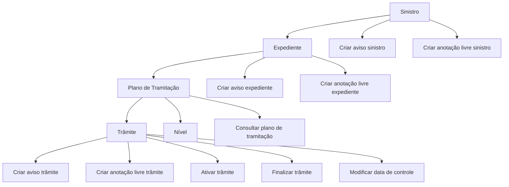

# Documentação de Operações de Sinistros — Plano de Tramitação

## 1. Metadados do Documento
- **Arquivo de Origem:** Não identificado
- **Tipo de Documento:** Manual Operacional
- **Domínio / Sistema:** Operações de Sinistros — Plano de Tramitação; Reef / Mapfre
- **Público-Alvo:** Operação, Negócio e usuários responsáveis pela tramitação de expedientes de sinistros
- **Data/Versão Identificada:** Não identificada

---

## 2. Resumo Executivo & Contexto de Negócio

O documento descreve as operações disponíveis no **Plano de Tramitação** de um expediente de sinistro. O Plano de Tramitação concentra ações para atribuir, consultar, incluir, ativar e finalizar elementos de tramitação vinculados a um expediente.

As operações abrangem a administração de **trâmites**, **níveis**, **avisos**, **anotações livres**, **cartas/e-mails** e **datas de controle**. Os avisos e anotações podem ser registrados nos níveis de sinistro, expediente ou trâmite, com visibilidades distintas conforme a entidade selecionada.

O documento afirma que um Plano de Tramitação pode ser criado para um expediente somente quando o expediente ainda não possuir um plano atribuído. Também informa que trâmites e níveis incluídos no Plano de Tramitação devem estar previamente definidos no plano.

A fonte menciona o ambiente documental **Reef**, a referência **Mapfredocument**, o proprietário `user:agonzalez_mapfre.com` e o ciclo de vida `Approved`. Não há detalhamento sobre permissões, telas, APIs, contratos, integrações, critérios de elegibilidade adicionais ou tratamento de erros.

---

## 3. Arquitetura, Componentes & Tecnologias Envolvidas

| Componente / Entidade | Papel descrito |
| :--- | :--- |
| Plano de Tramitação | Estrutura na qual são executadas operações para um expediente. |
| Expediente | Entidade à qual um Plano de Tramitação pode ser atribuído e onde podem ser criados avisos e anotações. |
| Sinistro | Entidade que pode receber avisos e anotações visíveis em todos os expedientes do sinistro. |
| Trâmite | Elemento do Plano de Tramitação que pode ser incluído, ativado, finalizado, receber aviso e anotação, e ter a data de controle modificada. |
| Nível | Elemento que pode ser incluído no Plano de Tramitação, desde que previamente definido no plano. |
| Aviso | Recordatório que pode estar associado a sinistro, expediente ou trâmite; pode ser finalizado ou atrasado. |
| Anotação livre | Registro textual que pode estar associado a sinistro, expediente ou trâmite. |
| Carta / e-mail | Operação que gera a carta ou texto. |
| Reef | Contexto documental citado como `DOCUMENTACIÓN Reef`. |
| Mapfredocument | Referência documental exibida no conteúdo bruto. |



**Nota de Análise:** O documento descreve operações funcionais e relações entre sinistro, expediente, Plano de Tramitação, trâmite, nível, avisos e anotações. O conteúdo não detalha arquitetura técnica, interfaces, métodos HTTP, bancos de dados, serviços, URLs, tecnologias de implementação ou contratos de integração.

---

## 4. Regras de Negócio, Especificações Funcionais & Processos

### 4.1 Criação e consulta do Plano de Tramitação

1. A operação **CREAR plan tramitación** permite atribuir um Plano de Tramitação a um expediente.
2. A atribuição é permitida quando o expediente **não tiver um plano atribuído**.
3. A operação **CONSULTAR plan tramitación** mostra toda a informação do Plano de Tramitação.

### 4.2 Inclusão e ciclo de vida de trâmites e níveis

1. A operação **INCLUIR trámite** permite adicionar um trâmite ao Plano de Tramitação.
2. O trâmite incluído deve estar **previamente definido no plano**.
3. A operação **INCLUIR nivel** permite adicionar um nível ao Plano de Tramitação.
4. O nível incluído deve estar **previamente definido no plano**.
5. A operação **ACTIVAR trámite** executa o trâmite.
6. A operação **FINALIZAR trámite** termina o trâmite.
7. A operação **MODIFICAR fecha control** permite alterar a data de controle do trâmite.

### 4.3 Avisos e recordatórios

| Operação | Entidade associada | Regra ou efeito descrito |
| :--- | :--- | :--- |
| CREAR aviso siniestro | Sinistro | Registra um recordatório ao sinistro, visível nos Planos de Tramitação de todos os expedientes. |
| CREAR aviso expediente | Expediente | Registra um recordatório ao expediente. |
| CREAR aviso trámite | Trâmite | Registra um recordatório ao trâmite. |
| FINALIZAR aviso siniestro | Sinistro | Termina o recordatório para que deixe de avisar. |
| FINALIZAR aviso expediente | Expediente | Termina o recordatório para que deixe de avisar. |
| FINALIZAR aviso trámite | Trâmite | Termina o recordatório para que deixe de avisar. |
| RETRASAR aviso | Sinistro | Posterga a data de aviso do sinistro. |
| RETRASAR aviso expediente | Expediente | Posterga a data de aviso do expediente. |
| RETRASAR aviso trámite | Trâmite | Posterga a data de aviso do trâmite. |

### 4.4 Anotações livres

| Operação | Entidade associada | Regra ou efeito descrito |
| :--- | :--- | :--- |
| CREAR anotación libre siniestro | Sinistro | Permite inserir uma anotação no sinistro, visível em todos os expedientes do sinistro. |
| CREAR anotación libre expediente | Expediente | Permite inserir uma anotação no expediente. |
| CREAR anotación libre trámite | Trâmite | Permite inserir uma anotação no trâmite. |

### 4.5 Geração de comunicações

A operação **CREAR carta, email** gera a carta ou o texto. O documento não especifica destinatário, canal efetivo de envio, modelo, conteúdo, condições de geração ou integração de e-mail.

---

## 5. Tabelas de Parâmetros, Ambientes e Estruturas de Dados

| Item / Parâmetro | Descrição / Função | Tipo / Valores / Formato | Ambiente / Observações |
| :--- | :--- | :--- | :--- |
| Plano de Tramitação | Plano atribuído a um expediente e consultado para visualizar suas informações. | Entidade funcional | A criação é permitida se o expediente não tiver plano atribuído. |
| Expediente | Entidade de tratamento de sinistro que pode receber Plano de Tramitação, avisos e anotações. | Entidade funcional | Um aviso de sinistro é visível nos planos de todos os expedientes. |
| Sinistro | Entidade que agrupa expedientes no contexto apresentado. | Entidade funcional | Anotações livres do sinistro são visíveis em todos os expedientes do sinistro. |
| Trâmite | Item do Plano de Tramitação. | Entidade funcional | Deve estar previamente definido no plano para ser incluído. Pode ser ativado, finalizado e ter data de controle modificada. |
| Nível | Item que pode ser incluído no Plano de Tramitação. | Entidade funcional | Deve estar previamente definido no plano para ser incluído. |
| Aviso de sinistro | Recordatório associado ao sinistro. | Aviso / recordatório | Pode ser criado, finalizado ou atrasado. |
| Aviso de expediente | Recordatório associado ao expediente. | Aviso / recordatório | Pode ser criado, finalizado ou atrasado. |
| Aviso de trâmite | Recordatório associado ao trâmite. | Aviso / recordatório | Pode ser criado, finalizado ou atrasado. |
| Anotação livre de sinistro | Anotação registrada no sinistro. | Texto / anotação | Visível em todos os expedientes do sinistro. |
| Anotação livre de expediente | Anotação registrada no expediente. | Texto / anotação | O documento não informa regras de visibilidade adicionais. |
| Anotação livre de trâmite | Anotação registrada no trâmite. | Texto / anotação | O documento não informa regras de visibilidade adicionais. |
| Data de controle | Data associada a um trâmite. | Data | Pode ser modificada. O formato não é informado. |
| Carta / e-mail | Comunicação ou texto gerado pela operação correspondente. | Carta ou texto | O documento não detalha canal de envio ou formato. |
| Owner | Proprietário exibido na fonte. | `user:agonzalez_mapfre.com` | Referência presente no conteúdo bruto. |
| Lifecycle | Estado de ciclo de vida exibido na fonte. | `Approved` | Referência presente no conteúdo bruto. |
| Fonte documental | Contexto e referência documental exibidos. | `DOCUMENTACIÓN Reef`; `Mapfredocument` | Não há URL, versão ou identificador adicional. |

---

## 6. Bateria de Perguntas & Respostas para RAG (FAQ Sintético)

### P1: Quando é possível criar um Plano de Tramitação para um expediente?
**R:** É possível criar e atribuir um Plano de Tramitação a um expediente quando esse expediente ainda não tiver um Plano de Tramitação atribuído.

### P2: O que acontece ao incluir um trâmite no Plano de Tramitação?
**R:** A operação **INCLUIR trámite** adiciona um trâmite ao Plano de Tramitação. O documento estabelece que o trâmite deve estar previamente definido no plano.

### P3: Qual é a condição para incluir um nível no Plano de Tramitação?
**R:** A operação **INCLUIR nivel** permite adicionar um nível ao Plano de Tramitação somente quando o nível já estiver previamente definido no plano.

### P4: Qual é a diferença entre ativar e finalizar um trâmite?
**R:** **ACTIVAR trámite** executa o trâmite. **FINALIZAR trámite** termina o trâmite. O documento não informa estados intermediários, pré-condições adicionais ou efeitos posteriores dessas operações.

### P5: Onde um aviso de sinistro fica visível?
**R:** Um aviso de sinistro é um recordatório registrado no sinistro e fica visível nos Planos de Tramitação de todos os expedientes associados ao sinistro.

### P6: Como impedir que um aviso continue emitindo lembretes?
**R:** Deve-se finalizar o aviso correspondente — de sinistro, expediente ou trâmite. A finalidade descrita para essas operações é terminar o recordatório para que ele não avise mais.

### P7: O que significa atrasar um aviso de expediente?
**R:** A operação **RETRASAR aviso expediente** posterga a data de aviso do expediente. O documento não define a regra de cálculo da nova data nem os limites de postergação.

### P8: Qual é a visibilidade de uma anotação livre criada no sinistro?
**R:** Uma anotação livre criada no sinistro fica visível em todos os expedientes pertencentes ao mesmo sinistro.

### P9: É possível registrar anotações em diferentes níveis da tramitação?
**R:** Sim. O documento prevê a criação de anotações livres no sinistro, no expediente e no trâmite. Apenas para a anotação de sinistro é explicitamente indicada a visibilidade em todos os expedientes do sinistro.

### P10: O que a operação “MODIFICAR fecha control” permite fazer?
**R:** A operação permite alterar a data de controle de um trâmite. O documento não informa o formato da data, permissões necessárias ou validações aplicadas à alteração.

### P11: O que é exibido ao consultar o Plano de Tramitação?
**R:** A operação **CONSULTAR plan tramitación** mostra toda a informação do Plano de Tramitação. O documento não enumera quais campos ou elementos compõem essa informação.

### P12: A operação “CREAR carta, email” envia efetivamente um e-mail?
**R:** O documento informa somente que a operação gera a carta ou o texto. Não há informação suficiente para afirmar que ocorre envio de e-mail, definição de destinatários ou integração com serviço de comunicação.

---

## 7. Glossário de Termos, Siglas & Conceitos-Chave

- **Plano de Tramitação:** Estrutura atribuída a um expediente para realizar operações de tramitação, incluindo inclusão de trâmites e níveis, consulta e gestão de elementos relacionados.
- **Sinistro:** Entidade de sinistro à qual podem ser associados avisos e anotações livres, com efeitos de visibilidade sobre todos os expedientes do sinistro.
- **Expediente:** Entidade que pode receber um Plano de Tramitação, avisos e anotações livres.
- **Trâmite:** Elemento do Plano de Tramitação que pode ser incluído, executado, finalizado, receber avisos e anotações, e ter sua data de controle alterada.
- **Nível:** Elemento que pode ser incluído em um Plano de Tramitação quando previamente definido no plano.
- **Aviso:** Recordatório associado a um sinistro, expediente ou trâmite.
- **Finalizar aviso:** Operação que encerra um recordatório para que ele não avise mais.
- **Atrasar aviso:** Operação que posterga a data de aviso de sinistro, expediente ou trâmite.
- **Anotação livre:** Registro inserido no sinistro, expediente ou trâmite.
- **Data de controle:** Data associada a um trâmite e passível de modificação.
- **Reef:** Referência documental exibida como `DOCUMENTACIÓN Reef`.
- **Mapfredocument:** Referência documental exibida no conteúdo.
- **Lifecycle:** Campo exibido como `Approved`; o documento não define seu significado operacional.
- **Owner:** Campo de proprietário exibido como `user:agonzalez_mapfre.com`.

---

## 8. Notas Críticas, Riscos & Limitações

- O conteúdo não identifica o nome do arquivo original, data, versão formal, autores além do campo `Owner`, ou histórico de alterações.
- O documento não descreve arquitetura de software, APIs, endpoints, métodos HTTP, contratos JSON, banco de dados, serviços, filas, eventos, autenticação ou autorização.
- Não são especificadas matrizes de permissão para criar, alterar, ativar, finalizar, consultar ou atrasar elementos do Plano de Tramitação.
- Não há detalhamento de estados do trâmite além das operações de ativação e finalização.
- Não são definidos formatos, regras de cálculo, fusos horários, validações ou limites para a data de controle e para o atraso de avisos.
- A operação **CREAR carta, email** informa geração de carta ou texto, mas não confirma envio de e-mail, canal de entrega, modelos, anexos ou rastreabilidade.
- Há sinais de extração textual imperfeita, como `previamente denido`; este relatório preserva o sentido apresentado como “previamente definido” apenas na estrutura analítica, mantendo o conteúdo bruto fiel na seção de referência.
- **Nota de Análise:** O documento lista operações funcionais, mas não detalha interfaces de usuário, métodos de execução, contratos ou efeitos transacionais.

---

## 9. Conteúdo Bruto Estruturado (Referência Fiel)

```text
--- [PÁGINA 1 DE 2] ---

DOCUMENTACIÓN OPERACIONES de SINIESTROS - PLAN
TRAMITACIÓN
PLAN TRAMITACIÓN
Operaciones que se pueden realizar dentro del Plan de tramitación de un expediente
CREAR plan tramitación
Permite asignar el plan de tramitación a
un expediente, si este no tuviera uno
asignado
INCLUIR trámite
Permite añadir un trámite al Plan,
previamente denido en el plan
INCLUIR nivel
Permite añadir un nivel al Plan,
previamente denido en el plan
ACTIVAR trámite
Ejecutar el trámite
FINALIZAR trámite
Terminar el trámite
CREAR aviso siniestro
Registrar un recordatorio al siniestro,
visible en los planes de tramitación de
todos los expedientes
CREAR aviso expediente
Registra un recordatorio al expediente
CREAR aviso trámite
Registra un recordatorio al trámite
CREAR anotación libre siniestro
Permite ingresar una anotación en el
siniestro visible en todos los expedientes
del siniestro
CREAR anotación libre expediente
Permite ingresar una anotación en el
expediente
CREAR anotación libre trámite
Permite ingresar una anotación en el
trámite
FINALIZAR aviso siniestro
Permite terminar el recordatorio para que
no avise más
FINALIZAR aviso expediente
 FINALIZAR aviso trámite
 RETRASAR aviso
Documentation / DOCUMENTACIÓN Reef
DOCUMENTACIÓN Reef
Mapfredocument
DOCUMENTACIÓN Reef
Owner
user:agonzalez_mapfre.com
Lifecycle
Approved Source
 / 
 VL
Buscar Inicio Soluciones Arquitecturas APIs Componentes Cloud Documentación Zeus Reef Ayuda
ES


--- [PÁGINA 2 DE 2] ---

Permite terminar el recordatorio para que
no avise más
Permite terminar el recordatorio para que
no avise más
Permite post-poner la fecha de aviso del
siniestro
RETRASAR aviso expediente
Permite post-poner la fecha de aviso del
expediente
RETRASAR aviso trámite
Permite post-poner la fecha de aviso del
trámite
CREAR carta, email
Genera la carta o texto
MODIFICAR fecha control
Permite cambiar la fecha de control del
trámite
CONSULTAR plan tramitación
Muestra toda la información del Plan de
tramitación
```
