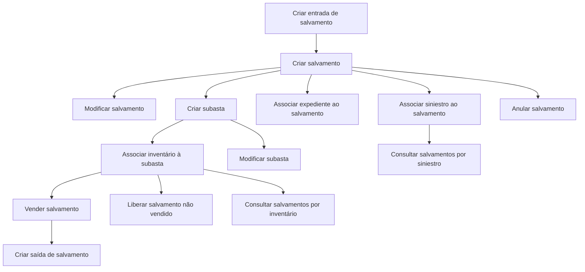

# Documentação de Operações de Sinistros (Automóvel) — Salvamentos

## 1. Metadados do Documento
- **Arquivo de Origem:** `Não identificado no conteúdo fornecido`
- **Tipo de Documento:** `Procedimento`
- **Domínio / Sistema:** `DOCUMENTACIÓN Reef / Mapfre — Operações de Sinistros (Automóvel) — Salvamentos`
- **Público-Alvo:** `Operação, negócio e equipes responsáveis por sinistros e salvamentos`
- **Data/Versão Identificada:** `Não identificada`

---

## 2. Resumo Executivo & Contexto de Negócio

O documento descreve operações possíveis para gestão de **salvamentos** no contexto de **sinistros de automóvel**. O fluxo operacional abrange o registro de entrada do bem salvado na companhia, o detalhamento das características do salvamento e sua vinculação a entidades de negócio relacionadas.

A documentação prevê associação de um salvamento a um **siniestro** e a um **expediente**, além da preparação para venda por meio da criação de subastas e associação de inventário de subasta. O processo também permite modificar dados de salvamentos e subastas.

Após a venda, a operação registra informações como comprador e valor da venda. O documento também contempla a criação da saída do salvamento, a liberação de um salvamento não vendido de uma subasta e a anulação de um salvamento em situações como erro de cadastro ou ausência de venda.

A consulta de salvamentos pode ser realizada por sinistro ou por inventário. A documentação identifica referências a **DOCUMENTACIÓN Reef**, **Mapfredocument** e um ciclo de vida marcado como **Approved**.

---

## 3. Arquitetura, Componentes & Tecnologias Envolvidas

Os componentes, domínios e referências explicitamente citados são:

| Componente / Referência | Papel identificado |
| :--- | :--- |
| DOCUMENTACIÓN Reef | Repositório ou contexto documental identificado no conteúdo. |
| Mapfredocument | Referência exibida no documento. Não há detalhamento funcional adicional. |
| Salvamentos | Entidade central das operações descritas. |
| Siniestro | Entidade usada para associar e consultar informações de salvamento. |
| Expediente | Entidade que pode ser vinculada a um salvamento. |
| Subasta | Entidade para registrar informações de venda de salvamentos, como data e localização. |
| Inventario de subasta | Conjunto de salvamentos pendentes associado a uma subasta. |



> **Nota de Análise:** O diagrama representa relações e operações explicitamente listadas no documento. O documento não especifica componentes técnicos, APIs, métodos HTTP, contratos JSON, bancos de dados, tecnologias de infraestrutura ou ambientes de execução.

---

## 4. Regras de Negócio, Especificações Funcionais & Processos

### Operações de cadastro e manutenção

1. **Criar entrada de salvamento**
   - Registra o ingresso do bem salvado na companhia.

2. **Criar salvamento**
   - Detalha as características do salvamento.

3. **Modificar salvamento**
   - Permite alterar as características do bem salvado.

4. **Associar siniestro ao salvamento**
   - É necessário para vincular o sinistro ao salvamento registrado.

5. **Associar expediente ao salvamento**
   - Permite vincular o expediente ao salvamento.

### Operações de subasta e inventário

6. **Criar subasta**
   - Registra informações de subastas destinadas à venda de salvamentos.
   - O documento menciona, entre os dados registrados, **data** e **localização**.

7. **Associar inventário à subasta**
   - Vincula à subasta os salvamentos pendentes de venda.

8. **Modificar subasta**
   - Permite modificar os dados da subasta.

9. **Liberar salvamento**
   - Permite desvincular um salvamento da subasta quando o salvamento não tiver sido vendido.
   - Após a liberação, o salvamento pode ser associado a outra subasta.

### Operações de venda, saída e anulação

10. **Vender salvamento**
    - Registra a venda de um salvamento.
    - O registro inclui para quem o salvamento foi vendido e por quanto foi vendido, entre outras informações não detalhadas no documento.

11. **Criar saída de salvamento**
    - Registra a saída do salvamento quando o salvamento é vendido.

12. **Anular salvamento**
    - Permite eliminar o salvamento.
    - O documento apresenta como motivos: o salvamento não ser vendido ou o salvamento estar incorreto.

### Operações de consulta

13. **Consultar salvamentos por siniestro**
    - Mostra todas as informações do bem salvado mediante a introdução do siniestro.

14. **Consultar salvamentos por inventário**
    - Mostra todas as informações do bem salvado mediante a introdução de sua identificação.

---

## 5. Tabelas de Parâmetros, Ambientes e Estruturas de Dados

| Item / Parâmetro | Descrição / Função | Tipo / Valores / Formato | Ambiente / Observações |
| :--- | :--- | :--- | :--- |
| Entrada de salvamento | Registra o ingresso do bem salvado na companhia. | Operação | Não há campos detalhados. |
| Salvamento | Registra e detalha as características do bem salvado. | Entidade / operação | Não há estrutura de dados detalhada. |
| Características do salvamento | Dados que podem ser detalhados na criação e alterados na modificação. | Não especificado | O documento não enumera as características. |
| Siniestro | Entidade vinculada ao salvamento e critério de consulta. | Identificador / entidade | A associação é indicada como necessária para vincular siniestro e salvamento. |
| Expediente | Entidade que pode ser vinculada ao salvamento. | Entidade | Não há atributos ou regras adicionais. |
| Subasta | Registro para venda de salvamentos. | Entidade / operação | Inclui data e localização, entre outros dados não especificados. |
| Data da subasta | Informação registrada na criação da subasta. | Não especificado | Formato não informado. |
| Localização da subasta | Informação registrada na criação da subasta. | Não especificado | Formato não informado. |
| Inventário de subasta | Agrupa ou vincula salvamentos pendentes de venda a uma subasta. | Entidade / relação | Não há estrutura de inventário detalhada. |
| Venda do salvamento | Registra a venda de um salvamento. | Operação | Inclui comprador e valor da venda. |
| Comprador | Destinatário da venda do salvamento. | Não especificado | O documento não informa formato ou identificação. |
| Valor da venda | Montante pelo qual o salvamento foi vendido. | Não especificado | Moeda e regras de cálculo não informadas. |
| Saída de salvamento | Registra a saída quando o salvamento é vendido. | Operação | Não há campos detalhados. |
| Identificação do salvamento | Critério para consultar salvamentos por inventário. | Identificador | Formato não informado. |
| Lifecycle | Estado documental apresentado na página. | `Approved` | Associado ao conteúdo DOCUMENTACIÓN Reef. |
| Owner | Proprietário exibido na página. | `user:agonzalez_mapfre.com` | Referência literal presente no conteúdo. |

---

## 6. Bateria de Perguntas & Respostas para RAG (FAQ Sintético)

### P1: Qual é o objetivo da operação “Criar entrada de salvamento”?
**R:** A operação “Criar entrada de salvamento” registra o ingresso do bem salvado na companhia.

### P2: O que é registrado ao criar um salvamento?
**R:** Ao criar um salvamento, são detalhadas as características do bem salvado. O documento não especifica quais características ou campos devem ser informados.

### P3: É possível alterar um salvamento já registrado?
**R:** Sim. A operação “Modificar salvamento” permite alterar as características do bem salvado.

### P4: Para que serve associar um siniestro a um salvamento?
**R:** A associação de siniestro ao salvamento é necessária para vincular o sinistro ao salvamento registrado.

### P5: Qual é a finalidade de associar um expediente ao salvamento?
**R:** A operação permite vincular um expediente ao salvamento. O documento não detalha critérios, obrigatoriedade ou campos dessa vinculação.

### P6: Quais informações de subasta são mencionadas na documentação?
**R:** A criação de uma subasta registra informações para venda de salvamentos, incluindo data e localização. O documento usa “etc.” e não detalha os demais dados da subasta.

### P7: Como os salvamentos pendentes são incluídos em uma subasta?
**R:** A operação “Associar inventário subasta” vincula à subasta os salvamentos pendentes de venda.

### P8: Quando um salvamento pode ser liberado de uma subasta?
**R:** Um salvamento pode ser liberado de uma subasta quando não foi vendido. A liberação desvincula o salvamento da subasta para que ele possa ser associado a outra subasta.

### P9: Quais dados são registrados quando um salvamento é vendido?
**R:** A venda de salvamento registra que o salvamento foi vendido, para quem foi vendido e por quanto foi vendido. O documento não informa formatos, validações ou campos adicionais.

### P10: Quando deve ser criada uma saída de salvamento?
**R:** A saída de salvamento deve ser registrada quando o salvamento é vendido.

### P11: Em quais situações um salvamento pode ser anulado?
**R:** A anulação permite eliminar o salvamento quando ele não é vendido ou quando está incorreto.

### P12: Como consultar salvamentos por siniestro?
**R:** A consulta por siniestro mostra todas as informações do bem salvado mediante a introdução do siniestro.

### P13: Como consultar salvamentos por inventário?
**R:** A consulta por inventário mostra todas as informações do bem salvado mediante a introdução da identificação do próprio salvamento.

---

## 7. Glossário de Termos, Siglas & Conceitos-Chave

- **DOCUMENTACIÓN Reef:** Referência documental exibida no conteúdo fornecido.
- **Mapfredocument:** Referência apresentada na navegação ou identificação do conteúdo; não há definição adicional.
- **Salvamento / salvado:** Bem salvado gerenciado nas operações de sinistros de automóvel.
- **Siniestro:** Termo usado no documento para a entidade de sinistro associável ao salvamento e utilizável em consultas.
- **Expediente:** Entidade que pode ser vinculada a um salvamento.
- **Subasta:** Registro de leilão para venda de salvamentos.
- **Inventario:** Inventário associado à subasta, contendo salvamentos pendentes de venda.
- **Lifecycle:** Campo de ciclo de vida documental, apresentado com valor `Approved`.
- **Owner:** Campo de proprietário do conteúdo, apresentado como `user:agonzalez_mapfre.com`.

---

## 8. Notas Críticas, Riscos & Limitações

- O conteúdo não identifica o nome do arquivo de origem, data, versão ou autores além do campo `Owner`.
- Não há especificação de arquitetura técnica, integrações, APIs, tecnologias, autenticação, perfis de acesso, bancos de dados ou ambientes.
- O documento não apresenta campos obrigatórios, regras de validação, estados formais, tratamento de erros ou critérios de autorização para as operações.
- A operação de anulação é descrita como eliminação do salvamento; o documento não esclarece se a eliminação é lógica ou física, nem os impactos em associações existentes.
- O documento lista dados de venda como comprador e valor, mas não informa moeda, formato, auditoria ou regras de cálculo.
- O estado `Approved` aparece como ciclo de vida documental, sem detalhamento sobre processo de aprovação ou governança.

---

## 9. Conteúdo Bruto Estruturado (Referência Fiel)

```text
--- [PÁGINA 1 DE 2] ---

DOCUMENTACIÓN OPERACIONES de SINIESTROS (Automóvil) -
SALVAMENTOS
SALVAMENTOS
Operaciones posibles de salvamentos
CREAR entrada salvamento
Se Registra el ingreso del salvado a la
compañía
CREAR salvamento
Se detalla las características del
salvamento
MODIFICAR salvamento
Permite cambiar las características del
salvado
ASOCIAR siniestro al salvamento
Se necesita para vincular el siniestro al
salvamento registrado
ASOCIAR expediente al salvamento
Permite vincular el expediente al
salvamento.
CREAR subasta
Se registra la información de las subastas
para la venta de salvamentos, fecha,
ubicación, etc
ASOCIAR inventario subasta
Se vinculan los salvamentos pendientes
para ser vendidos
MODIFICAR subasta
Permite cambiar los datos de la subasta
VENDER salvamento
Si un salvamento es vendido se registra su
venta, a quien se le ha vendido, por cuanto,
etc
LIBERAR salvamento
Permite desvincular el salvamento de la
subasta si este no ha sido vendido para
poder asociarse a otra subasta
ANULAR salvamento
Esta operación permite eliminar el
salvamento, porque no se vende, porque
está erróneo
CREAR salida salvamento
Permite registrar la salida del salvamento
cuando es vendido
CONSULTAR salvamentos (Por Siniestro)
 CONSULTAR salvamentos (Por Inventario)
Documentation / DOCUMENTACIÓN Reef
DOCUMENTACIÓN Reef
Mapfredocument
DOCUMENTACIÓN Reef
Owner
user:agonzalez_mapfre.com
Lifecycle
Approved Source
 / 
 VL
Buscar Inicio Soluciones Arquitecturas APIs Componentes Cloud Documentación Zeus Reef Ayuda
ES


--- [PÁGINA 2 DE 2] ---

Muestra toda la información del salvado
introduciendo el siniestro
Muestra toda la información del salvado,
introduciendo la identicación del mismo
```
