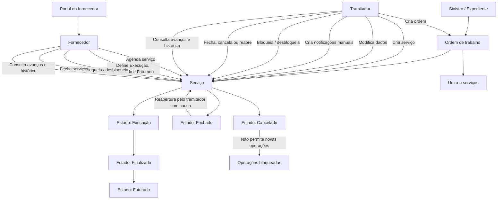

# Documentação de Operações de Sinistros (Automóvel) — Serviços Reef

## 1. Metadados do Documento
- **Arquivo de Origem:** Não identificado no conteúdo fornecido
- **Tipo de Documento:** Manual Operacional
- **Domínio / Sistema:** Reef — Operações de Sinistros de Automóvel / Serviços
- **Público-Alvo:** Tramitadores e fornecedores que utilizam o portal do fornecedor
- **Data/Versão Identificada:** Não identificada
- **Owner identificado:** `user:agonzalez_mapfre.com`
- **Lifecycle identificado:** Approved Source / VL

---

## 2. Resumo Executivo & Contexto de Negócio

O documento descreve as operações disponíveis para gestão de serviços associados a sinistros ou expedientes de automóvel no contexto da plataforma Reef. A operação central é a criação de uma ordem de trabalho, que pode agrupar de um a “n” serviços necessários para atender uma necessidade relacionada ao sinistro.

Os serviços representam pedidos de realização de trabalho direcionados a um profissional ou fornecedor. Cada serviço está obrigatoriamente contido em uma ordem. O documento apresenta ações de criação, agendamento, alteração, bloqueio, encerramento, cancelamento, reabertura e consulta de acompanhamento e histórico.

A divisão de responsabilidades é explícita entre o **tramitador** e o **fornecedor**, que acessa funcionalidades pelo portal. Algumas ações pertencem exclusivamente ao tramitador, como modificar dados do serviço, criar notificações manuais, cancelar serviços e reabrir serviços fechados. Outras ações podem ser executadas tanto pelo tramitador quanto pelo fornecedor, dependendo da operação.

O fluxo operacional controla a evolução do serviço por estados, incluindo Execução, Finalizado, Faturado, Fechado e Cancelado. O estado Cancelado possui uma restrição operacional crítica: após o cancelamento, não é possível realizar novas operações sobre o serviço.

---

## 3. Arquitetura, Componentes & Tecnologias Envolvidas

### Componentes e atores identificados

| Componente / Ator | Descrição |
| :--- | :--- |
| Reef | Sistema ou domínio documental no qual as operações de sinistros e serviços são apresentadas. |
| Sinistro / Expediente | Entidade à qual uma ordem de trabalho pode ser associada. |
| Ordem de trabalho | Agrupador de serviços necessários para satisfazer uma demanda vinculada a um sinistro ou expediente. |
| Serviço | Pedido de realização de trabalho a um profissional; sempre está incluído em uma ordem. |
| Tramitador | Ator responsável por criar, modificar, notificar, bloquear, desbloquear, fechar, cancelar e reabrir serviços, conforme as permissões documentadas. |
| Fornecedor | Prestador que pode executar determinadas operações por meio do portal do fornecedor. |
| Portal do fornecedor | Canal pelo qual o fornecedor pode agendar, alterar determinados estados, bloquear, desbloquear, fechar, consultar avanços e consultar histórico. |
| Profissional | Destinatário da solicitação de realização de trabalho criada por meio de um serviço. |



> **Nota de Análise:** O documento não detalha arquitetura técnica de infraestrutura, APIs, métodos HTTP, contratos JSON, banco de dados, integrações, tecnologias de desenvolvimento, URLs de ambiente ou mecanismos de autenticação.

---

## 4. Regras de Negócio, Especificações Funcionais & Processos

### 4.1 Criação de ordem de trabalho

1. Uma ordem de trabalho pode ser criada e associada a um sinistro ou expediente.
2. Para satisfazer uma ordem de trabalho, podem ser necessários de um a “n” serviços.
3. A ordem de trabalho funciona como entidade agrupadora dos serviços relacionados ao atendimento do sinistro ou expediente.

### 4.2 Criação de serviço

1. O serviço permite gerar um pedido para realização de trabalho por um profissional.
2. Todo serviço deve estar incluído em uma ordem de trabalho.
3. O documento não descreve campos obrigatórios, formato da solicitação, critérios de seleção do profissional ou contratos de dados do serviço.

### 4.3 Agendamento de serviço

1. A operação de atribuição ou agendamento permite definir dia e hora para o fornecedor iniciar o trabalho.
2. O tramitador pode realizar o agendamento.
3. O fornecedor também pode realizar o agendamento por meio do portal do fornecedor.
4. Os exemplos apresentados são:
   - Agendar uma oficina para o momento de entrada de um veículo.
   - Agendar um pedreiro para comparecer a um domicílio.

### 4.4 Modificação de serviço

1. O tramitador pode modificar os dados de um serviço quando considerar necessário.
2. O documento não identifica quais campos do serviço podem ser modificados.
3. O documento não apresenta condições, estados permitidos ou trilha de auditoria para a modificação de dados.

### 4.5 Modificação de estados pelo fornecedor

1. Pelo portal, somente o fornecedor pode colocar o serviço nos estados:
   - **Execução**
   - **Finalizado**
   - **Faturado**
2. O documento não descreve a ordem obrigatória entre os estados Execução, Finalizado e Faturado.
3. O documento não detalha validações, pré-requisitos ou efeitos de negócio associados a cada transição de estado.

### 4.6 Notificações manuais

1. O tramitador pode criar notificações manualmente para o fornecedor.
2. O tramitador pode visualizar se a notificação foi lida pelo fornecedor.
3. O documento não informa canais de envio, conteúdo, prazo de leitura ou consequências de uma notificação não lida.

### 4.7 Gestão de bloqueios

1. O tramitador pode intervir para paralisar ou bloquear a execução de um serviço.
2. O bloqueio pode ocorrer por motivos catalogados.
3. O tramitador pode desbloquear o serviço.
4. Pelo portal, o fornecedor também pode bloquear e desbloquear o serviço.
5. O documento não apresenta o catálogo de motivos de bloqueio.

### 4.8 Fechamento de serviço

1. O tramitador pode fechar um serviço.
2. O estado Fechado indica que o serviço está terminado e pendente de faturamento.
3. O fornecedor também pode executar a funcionalidade de fechamento pelo portal.
4. O documento não especifica se o fechamento exige que o serviço esteja nos estados Execução, Finalizado ou Faturado.

### 4.9 Cancelamento de serviço

1. O tramitador pode cancelar um serviço.
2. O estado Cancelado indica a suspensão da realização do serviço.
3. Após o cancelamento, não podem ser realizadas novas operações com o serviço.
4. O documento não atribui ao fornecedor permissão para cancelar serviços.

### 4.10 Reabertura de serviço

1. O tramitador pode reabrir um serviço que esteja fechado.
2. A reabertura exige a indicação das causas.
3. O documento não informa se há catálogo de causas, aprovação adicional, limite de reaberturas ou estado de destino após a reabertura.

### 4.11 Consulta de avanços

1. A consulta de avanços mostra os diferentes movimentos realizados dentro do estado de Execução.
2. A funcionalidade está habilitada para o tramitador.
3. A funcionalidade também está habilitada no portal do fornecedor.

### 4.12 Consulta de histórico de movimentos

1. A consulta de histórico de movimentos mostra todos os estados pelos quais um serviço passou.
2. A funcionalidade está habilitada para o tramitador.
3. A funcionalidade também está habilitada no portal do fornecedor.

---

## 5. Tabelas de Parâmetros, Ambientes e Estruturas de Dados

### 5.1 Operações disponíveis por ator

| Item / Parâmetro | Descrição / Função | Tipo / Valores / Formato | Ambiente / Observações |
| :--- | :--- | :--- | :--- |
| Criar ordem | Gera uma ordem de trabalho associada a um sinistro ou expediente. | Operação funcional | Executada no contexto de serviços de sinistros. |
| Criar serviço | Gera a solicitação de realização de trabalho para um profissional. | Operação funcional | O serviço sempre pertence a uma ordem. |
| Atribuir / agendar serviço | Define dia e hora para início do trabalho do fornecedor. | Operação funcional | Disponível para tramitador e fornecedor via portal. |
| Modificar serviço | Altera dados de um serviço. | Operação funcional | Permitida ao tramitador. Campos modificáveis não detalhados. |
| Modificar estados | Altera o estado operacional do serviço. | Execução, Finalizado, Faturado | Pelo portal, somente o fornecedor pode definir esses estados. |
| Criar notificações manuais | Envia notificações manuais ao fornecedor. | Operação funcional | O tramitador pode verificar se a notificação foi lida. |
| Gerir bloqueios | Paralisa, bloqueia ou desbloqueia a execução do serviço. | Operação funcional | Tramitador e fornecedor, pelo portal, podem bloquear e desbloquear. |
| Fechar serviço | Indica serviço terminado e pendente de faturamento. | Estado: Fechado | Disponível para tramitador e fornecedor via portal. |
| Cancelar serviço | Suspende a realização do serviço. | Estado: Cancelado | Permitida ao tramitador; impede qualquer operação posterior. |
| Reabrir serviço | Reabre um serviço fechado mediante indicação de causa. | Operação funcional | Permitida ao tramitador. |
| Consultar avanços | Exibe movimentos no estado de Execução. | Consulta | Disponível ao tramitador e ao portal do fornecedor. |
| Consultar histórico de movimentos | Exibe todos os estados pelos quais o serviço passou. | Consulta | Disponível ao tramitador e ao portal do fornecedor. |

### 5.2 Estados e restrições identificados

| Item / Parâmetro | Descrição / Função | Tipo / Valores / Formato | Ambiente / Observações |
| :--- | :--- | :--- | :--- |
| Execução | Estado no qual são registrados e consultados avanços ou movimentos do serviço. | Estado de serviço | O fornecedor pode estabelecer esse estado pelo portal. |
| Finalizado | Estado que o fornecedor pode estabelecer pelo portal. | Estado de serviço | Não há detalhamento adicional. |
| Faturado | Estado que o fornecedor pode estabelecer pelo portal. | Estado de serviço | Não há detalhamento adicional. |
| Fechado | Indica serviço acabado e pendente de faturamento. | Estado de serviço | Pode ser fechado pelo tramitador ou fornecedor via portal. |
| Cancelado | Indica suspensão da realização do serviço. | Estado de serviço | Após o cancelamento, não podem ocorrer novas operações. |
| Bloqueado | Condição de paralisação da execução do serviço. | Condição operacional | Pode ocorrer por motivos catalogados; catálogo não fornecido. |
| Reabertura | Ação para reabrir serviço fechado. | Operação sobre estado | Exige indicação das causas pelo tramitador. |

### 5.3 Entidades de negócio

| Item / Parâmetro | Descrição / Função | Tipo / Valores / Formato | Ambiente / Observações |
| :--- | :--- | :--- | :--- |
| Sinistro / Expediente | Registro ao qual a ordem de trabalho é associada. | Entidade de negócio | O documento usa ambos os termos. |
| Ordem de trabalho | Agrupa os serviços requeridos para atender uma necessidade. | Entidade de negócio | Uma ordem pode requerer de um a “n” serviços. |
| Serviço | Solicitação de trabalho direcionada a um profissional. | Entidade de negócio | Sempre está inserido em uma ordem. |
| Profissional | Responsável por realizar o trabalho solicitado. | Ator operacional | Não há critérios de cadastro ou designação detalhados. |
| Tramitador | Usuário responsável por operações de gestão do serviço. | Papel / perfil | Possui permissões específicas documentadas. |
| Fornecedor | Prestador que opera determinadas funcionalidades no portal. | Papel / perfil | Pode agendar, atualizar determinados estados, bloquear, desbloquear, fechar e consultar. |

### 5.4 Ambientes, servidores e rotas

| Item / Parâmetro | Descrição / Função | Tipo / Valores / Formato | Ambiente / Observações |
| :--- | :--- | :--- | :--- |
| Ambientes | Não identificados. | Não informado | O documento não contém URLs, servidores ou ambientes. |
| Rotas de log | Não identificadas. | Não informado | O documento não contém caminhos de log. |
| APIs e endpoints | Não identificados. | Não informado | O documento não detalha APIs, métodos HTTP ou contratos. |

---

## 6. Bateria de Perguntas & Respostas para RAG (FAQ Sintético)

### P1: O que é uma ordem de trabalho no processo de serviços de sinistros Reef?
**R:** Uma ordem de trabalho é uma entidade criada para ser associada a um sinistro ou expediente. Para satisfazer uma ordem de trabalho, podem ser necessários de um a “n” serviços.

### P2: Um serviço pode existir sem uma ordem de trabalho?
**R:** Não. O documento estabelece que o serviço representa o pedido de realização de um trabalho a um profissional e que esse serviço sempre estará englobado dentro de uma ordem.

### P3: Quem pode agendar a data e a hora de início de um serviço?
**R:** O agendamento pode ser realizado pelo tramitador. O fornecedor também pode realizar essa operação pelo portal do fornecedor. O agendamento define dia e hora para o fornecedor iniciar o trabalho.

### P4: Quais estados de serviço somente o fornecedor pode estabelecer pelo portal?
**R:** Pelo portal, somente o fornecedor pode colocar o serviço nos estados de Execução, Finalizado e Faturado.

### P5: Quais operações o tramitador pode realizar sobre os dados de um serviço?
**R:** O tramitador pode modificar dados do serviço quando considerar necessário. O documento não especifica quais campos podem ser alterados nem as condições de estado aplicáveis para essa modificação.

### P6: Quem pode criar notificações manuais ao fornecedor e acompanhar sua leitura?
**R:** O tramitador pode criar notificações manualmente para o fornecedor e também pode visualizar se a notificação foi lida pelo fornecedor.

### P7: Quem pode bloquear ou desbloquear a execução de um serviço?
**R:** O tramitador pode paralisar, bloquear ou desbloquear a execução de um serviço, inclusive por motivos catalogados. Pelo portal, o fornecedor também pode bloquear e desbloquear o serviço.

### P8: O que significa fechar um serviço?
**R:** Fechar um serviço indica que o serviço está terminado, porém pendente de faturamento. Essa funcionalidade pode ser realizada pelo tramitador e também pelo fornecedor por meio do portal.

### P9: O que acontece depois que um serviço é cancelado?
**R:** O estado Cancelado indica que a realização do serviço foi suspensa. A partir desse estado, não é possível executar mais operações com o serviço.

### P10: Quem pode reabrir um serviço fechado e qual informação é obrigatória?
**R:** O tramitador pode reabrir um serviço que esteja fechado. Para reabrir o serviço, o tramitador deve indicar as causas da reabertura.

### P11: O que é exibido na consulta de avanços do serviço?
**R:** A consulta de avanços mostra os diferentes movimentos ocorridos dentro do estado de Execução. Essa consulta está habilitada para o tramitador e para o portal do fornecedor.

### P12: Qual é a diferença entre consultar avanços e consultar histórico de movimentos?
**R:** A consulta de avanços mostra movimentos dentro do estado de Execução. A consulta de histórico de movimentos mostra todos os estados pelos quais o serviço passou. Ambas estão habilitadas para o tramitador e para o portal do fornecedor.

---

## 7. Glossário de Termos, Siglas & Conceitos-Chave

- **Reef:** Nome do sistema ou domínio documental identificado no material para operações de sinistros e serviços.
- **Sinistro:** Evento ou registro de sinistro ao qual uma ordem de trabalho pode ser associada.
- **Expediente:** Termo utilizado no documento como entidade que também pode ser associada a uma ordem de trabalho.
- **Ordem de trabalho:** Estrutura que pode reunir de um a “n” serviços para atendimento de uma necessidade.
- **Serviço:** Solicitação de realização de trabalho destinada a um profissional e obrigatoriamente incluída em uma ordem.
- **Tramitador:** Ator responsável por diversas operações de gestão do serviço.
- **Fornecedor:** Prestador que pode executar determinadas operações por meio do portal do fornecedor.
- **Portal do fornecedor:** Canal utilizado pelo fornecedor para agendar, alterar determinados estados, bloquear, desbloquear, fechar e consultar informações de serviços.
- **Execução:** Estado do serviço no qual existem movimentos que podem ser consultados como avanços.
- **Finalizado:** Estado de serviço que pode ser definido pelo fornecedor no portal.
- **Faturado:** Estado de serviço que pode ser definido pelo fornecedor no portal.
- **Fechado:** Estado que indica serviço acabado, porém pendente de faturamento.
- **Cancelado:** Estado que suspende a realização do serviço e impede novas operações.
- **Reabertura:** Operação de reabrir um serviço fechado, com indicação de causa pelo tramitador.
- **Bloqueio:** Paralisação da execução do serviço por motivos catalogados ou por ação operacional.
- **Histórico de movimentos:** Consulta de todos os estados pelos quais um serviço passou.

---

## 8. Notas Críticas, Riscos & Limitações

- O documento não identifica o arquivo de origem, data, versão, ambiente, URL, servidor, rota de log ou endpoint de API.
- Não há detalhamento técnico sobre métodos HTTP, contratos JSON, modelos de dados, autenticação, autorização técnica, banco de dados ou integrações entre sistemas.
- O documento afirma que a ordem pode requerer de um a “n” serviços, mas não detalha limites máximos, regras de criação, dependências ou critérios de conclusão da ordem.
- O documento menciona motivos catalogados para bloqueio, mas não apresenta o catálogo de motivos.
- O documento não define a sequência obrigatória entre os estados Execução, Finalizado, Faturado e Fechado.
- O documento não detalha os campos que o tramitador pode modificar em um serviço.
- O cancelamento é uma operação irreversível do ponto de vista operacional descrito: após um serviço ser cancelado, não podem ser realizadas novas operações.
- A reabertura é descrita apenas para serviços fechados e exige indicação de causas; não há informação sobre reabertura de serviços cancelados.
- **Nota de Análise:** O material não informa se o fornecedor pode realizar cancelamento ou reabertura de serviço; portanto, essas permissões não devem ser assumidas.
- **Nota de Análise:** O material apresenta a operação de “modificar estados” limitada aos estados Execução, Finalizado e Faturado pelo fornecedor no portal, mas não detalha quem realiza transições para outros estados.

---

## 9. Conteúdo Bruto Estruturado (Referência Fiel)

```text
--- [PÁGINA 1 DE 2] ---

DOCUMENTACIÓN OPERACIONES de SINIESTROS (Automóvil) -
SERVICIOS
SERVICIOS
Operaciones se pueden realizar con los servicios de los proveedores
CREAR orden
Permite generar una orden de trabajo y
asociarla a un siniestro/expediente. Para
satisfacer una orden puede necesitarse de
uno a "n" servicios
CREAR servicio
Permite generar la petición de la
realización de un trabajo a un profesional,
que siempre estará englobado dentro una
orden
ASIGNAR Servicio
Agendar día y hora para que el proveedor
comience el trabajo. Ejemplo: Agendar al
taller cuando entra un vehículo, agendar a
una albañil cuando tiene que ir a un
domicilio...
Desde el portal, el proveedor también
puede realizar esta operación.
MODIFICAR servicio
El tramitador podrá modicar datos del
servicio cuando así lo considere
MODIFICAR estados
Desde el portal el proveedor y sólo el
proveedor, podrá poner el servicio en
Ejecución, Finalizado y Facturado.
CREAR noticaciones manuales
El tramitador puede generar noticaciones
manualmente al proveedor. El tramitador
puede visualizar si esta ha sido leída por
el proveedor
GESTIONAR Bloqueos
El tramitador, puede intervenir para
paralizar, bloquear la ejecución del
servicio, por motivos catalogados o para
desbloquear el mismo.
Desde el portal, el proveedor también
puede realizar ambas operaciones,
CERRAR servicio
El tramitador puede cerrar el servicio, este
estado indica que el servicio está
acabado, pendiente de facturar.
Desde el portal, el proveedor también
puede realizar esta funcionalidad
CANCELAR servicio
El tramitador puede cancelar el servicio.
Este estado indica que se suspende la
realización del servicio, desde este estado
ya no se puede realizar más operaciones
con el servicio
Documentation / DOCUMENTACIÓN Reef
DOCUMENTACIÓN Reef
Mapfredocument
DOCUMENTACIÓN Reef
Owner
user:agonzalez_mapfre.com
Lifecycle
Approved Source
 / 
 VL
Buscar Inicio Soluciones Arquitecturas APIs Componentes Cloud Documentación Zeus Reef Ayuda
ES


--- [PÁGINA 2 DE 2] ---

bloquear y desbloquear el servicio.
 Desde el portal, el proveedor también
puede realizar esta funcionalidad
RE-APERTURAR servicio
El tramitador puede reaperturar un servicio
que está cerrado, indicando las causas
CONSULTAR avances
Muestra los diferentes movimientos
dentro del estado de Ejecución. Habilitado
para el tramitador y el portal del proveedor
CONSULTAR Histórico Mvtos.
Muestra todos los estados por los que ha
pasado un servicio. Habilitado para el
tramitador y el portal del proveedor
```
