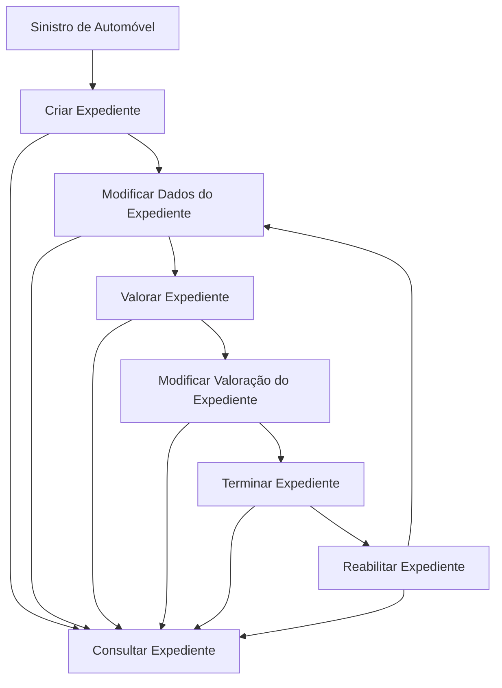

# Documentación Reef — Operaciones de Siniestros de Automóvil: Tramitación de Expedientes

## 1. Metadados do Documento
- **Arquivo de Origem:** `Não identificado no conteúdo extraído`
- **Tipo de Documento:** Manual Operacional
- **Domínio / Sistema:** Reef — Operações de Siniestros (Automóvil)
- **Público-Alvo:** Operação, analistas funcionais e utilizadores responsáveis pela tramitação de expedientes
- **Data/Versão Identificada:** Não identificada

---

## 2. Resumo Executivo & Contexto de Negócio

O documento apresenta as operações disponíveis para a tramitação de expedientes associados a sinistros de automóvel no contexto da documentação Reef. Um expediente concentra informações sobre os danos ocasionados por um sinistro e permite a respetiva gestão ao longo do ciclo operacional.

As operações sobre expedientes podem ser realizadas tanto **em linha** como de forma **diferida**. O conteúdo identifica funcionalidades para criar, modificar, valorar, consultar, terminar e reabilitar expedientes.

A funcionalidade de valoração permite reservar um importe para um expediente, considerando cobertura e conceito de reserva. A modificação de valoração permite alterar essa reserva usando os mesmos critérios de cobertura e conceito.

O ciclo inclui a finalização do expediente, com reajuste da reserva, e a possibilidade de reabrir um expediente previamente terminado. O documento não detalha regras de autorização, contratos de integração, campos obrigatórios, métodos HTTP, formatos de dados ou critérios de cálculo das reservas.

---

## 3. Arquitetura, Componentes & Tecnologias Envolvidas

Os elementos explicitamente identificados no conteúdo são:

- **Reef:** contexto de documentação e domínio associado às operações.
- **Operaciones de Siniestros (Automóvil):** área funcional descrita.
- **Expediente:** unidade operacional gerida durante a tramitação de sinistros.
- **Mapfredocument:** termo exibido na navegação ou identificação documental.
- **Owner:** `user:agonzalez_mapfre.com`
- **Lifecycle:** `Approved`
- **Source:** `VL`

O documento não descreve arquitetura técnica, serviços, bases de dados, APIs, protocolos, ambientes de execução ou tecnologias de implementação.



**Nota de Análise:** o diagrama representa exclusivamente as operações e relações de ciclo operacional descritas no conteúdo. O documento não especifica integração técnica entre componentes.

---

## 4. Regras de Negócio, Especificações Funcionais & Processos

### Operações disponíveis para expedientes

1. **Criar Expediente**
   - Regista os distintos danos ocasionados pelo sinistro.
   - O documento não define campos, validações ou dados obrigatórios para o registo dos danos.

2. **Modificar Dados do Expediente**
   - Permite alterar a informação e os dados registados num expediente.
   - O conteúdo não especifica quais dados podem ser alterados nem restrições para alteração.

3. **Valorar Expediente**
   - Permite reservar um importe num expediente.
   - A reserva é associada a uma **cobertura** e a um **conceito de reserva**.
   - O conteúdo não apresenta fórmula, moeda, limites ou critérios de aprovação para o importe reservado.

4. **Modificar Valoração do Expediente**
   - Permite modificar a reserva de um expediente.
   - A modificação é realizada por cobertura e por conceito de reserva.
   - Não são descritas regras para aumento, redução ou bloqueio da reserva.

5. **Terminar Expediente**
   - Finaliza expedientes.
   - A finalização implica reajuste da reserva.
   - O documento não define condições de encerramento nem o mecanismo de reajuste.

6. **Reabilitar Expediente**
   - Reabre um expediente que esteja terminado.
   - O conteúdo não informa pré-condições, permissões ou impactos da reabertura sobre reservas e dados.

7. **Consultar Expediente**
   - Mostra toda a informação do expediente.
   - O documento não especifica quais atributos, reservas, danos ou histórico são apresentados na consulta.

### Modalidade de execução

- As operações sobre os possíveis expedientes de sinistro podem ser executadas:
  - **Em linha**
  - **De forma diferida**

**Nota de Análise:** o documento não define a diferença operacional ou técnica entre execução em linha e execução diferida.

---

## 5. Tabelas de Parâmetros, Ambientes e Estruturas de Dados

| Item / Parâmetro | Descrição / Função | Tipo / Valores / Formato | Ambiente / Observações |
| :--- | :--- | :--- | :--- |
| Expediente | Registo operacional associado a um sinistro | Entidade funcional | Pode ser criado, modificado, valorado, terminado, reabilitado e consultado |
| Sinistro | Ocorrência que ocasiona danos e origina a tramitação | Conceito funcional | Contexto: Automóvel |
| Danos | Danos ocasionados pelo sinistro | Informação registada no expediente | Registados na criação do expediente |
| Cobertura | Critério usado para reservar ou modificar uma reserva | Conceito funcional | Associada à valoração do expediente |
| Conceito de reserva | Critério usado para reservar ou modificar uma reserva | Conceito funcional | Associado à cobertura |
| Importe | Valor reservado no expediente | Valor não especificado | Não há moeda, formato ou fórmula descritos |
| Reserva | Valor associado ao expediente por cobertura e conceito | Informação financeira funcional | É criada/definida na valoração, modificável e reajustada no término |
| Modalidade de operação | Forma de execução das operações | Em linha; diferido | Sem detalhamento adicional |
| Owner | Proprietário indicado na documentação | `user:agonzalez_mapfre.com` | Metadado exibido no conteúdo |
| Lifecycle | Estado de ciclo de vida do documento | `Approved` | Metadado exibido no conteúdo |
| Source | Origem indicada no documento | `VL` | Metadado exibido no conteúdo |

---

## 6. Bateria de Perguntas & Respostas para RAG (FAQ Sintético)

### P1: Quais operações podem ser realizadas sobre um expediente de sinistro de automóvel?
**R:** O documento identifica as operações de criar expediente, modificar dados do expediente, valorar expediente, modificar valoração do expediente, terminar expediente, reabilitar expediente e consultar expediente.

### P2: O que é registado ao criar um expediente?
**R:** A criação de um expediente regista os distintos danos ocasionados pelo sinistro. O documento não detalha os campos ou dados específicos usados para representar esses danos.

### P3: Como funciona a valoração de um expediente?
**R:** A valoração permite reservar um importe para um expediente. A reserva é realizada considerando cobertura e conceito de reserva.

### P4: É possível alterar uma reserva já existente num expediente?
**R:** Sim. A operação “Modificar Valoração Expediente” permite modificar a reserva de um expediente por cobertura e conceito de reserva.

### P5: O que ocorre quando um expediente é terminado?
**R:** A operação “Terminar Expediente” finaliza o expediente e reajusta a respetiva reserva. O documento não explica como o reajuste é calculado ou aplicado.

### P6: Um expediente terminado pode voltar a ser aberto?
**R:** Sim. A operação “Reabilitar Expediente” reabre um expediente que tenha sido terminado.

### P7: Que informação está disponível na consulta de um expediente?
**R:** A operação “Consultar Expediente” mostra toda a informação do expediente. O conteúdo não enumera os campos, danos, reservas ou histórico apresentados.

### P8: As operações sobre expedientes são apenas síncronas?
**R:** Não. O documento declara que as operações podem ser realizadas tanto em linha como de forma diferida.

### P9: O documento define regras de validação para criar ou terminar expedientes?
**R:** Não. O conteúdo descreve as funções das operações, mas não apresenta validações, pré-condições, campos obrigatórios, perfis de acesso ou regras de autorização.

### P10: O documento especifica APIs, métodos HTTP ou contratos JSON para as operações de expediente?
**R:** Não. O conteúdo não descreve APIs, métodos HTTP, endpoints, contratos JSON, sistemas integrados ou detalhes técnicos de implementação.

---

## 7. Glossário de Termos, Siglas & Conceitos-Chave

- **Reef:** nome do contexto de documentação apresentado no conteúdo.
- **Siniestro:** sinistro; ocorrência que ocasiona danos e requer tramitação de expediente.
- **Automóvil:** domínio de sinistros de automóvel referido no documento.
- **Expediente:** entidade operacional usada para registar, gerir, valorar, terminar, reabilitar e consultar informações de um sinistro.
- **Valorar:** operação que permite reservar um importe num expediente por cobertura e conceito de reserva.
- **Reserva:** importe reservado para um expediente, associado a cobertura e conceito de reserva.
- **Cobertura:** critério de associação da reserva no processo de valoração.
- **Concepto de reserva:** critério complementar à cobertura para identificação da reserva.
- **Rehabilitar:** reabrir um expediente terminado.
- **En línea:** modalidade de execução indicada para as operações.
- **Diferido:** modalidade de execução indicada para as operações.
- **Lifecycle:** metadado de ciclo de vida do documento; o valor apresentado é `Approved`.
- **Source:** metadado de origem do documento; o valor apresentado é `VL`.

---

## 8. Notas Críticas, Riscos & Limitações

- O conteúdo não identifica o ficheiro de origem, data, versão ou autor documental completo.
- O documento não apresenta campos de dados, tipos, estruturas, modelos de informação ou requisitos obrigatórios do expediente.
- Não há definição de regras de validação, autorização, segregação de funções ou perfis permitidos para executar cada operação.
- Não são descritos critérios de cálculo, moeda, limites, aprovação ou auditoria para reservas e respetivos reajustes.
- O conceito de execução em linha e diferida é citado, mas não é detalhado.
- Não há informação sobre arquitetura de software, APIs, integrações, serviços, URLs, ambientes, logs, tratamento de erros ou mecanismos de recuperação.
- **Nota de Análise:** o documento lista operações funcionais de expediente, porém não detalha métodos HTTP, contratos JSON, persistência, eventos ou integrações técnicas expostas.

---

## 9. Conteúdo Bruto Estruturado (Referência Fiel)

```text
--- [PÁGINA 1 DE 1] ---

DOCUMENTACIÓN OPERACIONES de SINIESTROS (Automóvil) -
TRAMITACIÓN EXPEDIENTES
EXPEDIENTE
Operaciones que se pueden realizar a cada uno de los posibles expedientes del siniestro, se pueden realizar
tanto en línea como diferido
CREAR Expediente
En esta operación se registran los
distintos daños que ha ocasionado el
siniestro
MODIFICAR Datos del Expediente
Permite cambiar la información, los datos
registrados de un expediente
VALORAR Expediente
Permite reservar un importe a un
expediente por cobertura y concepto de
reserva
MODIFICAR Valoración Expediente
Permite cambiar la reserva de un
expediente por cobertura y concepto de
reserva
TERMINAR Expediente
Finaliza expedientes reajustando su
reserva
REHABILITAR Expediente
Reabre un Expediente Terminado
CONSULTAR Expediente
Muestra toda la información del
Expediente
Documentation / DOCUMENTACIÓN Reef
DOCUMENTACIÓN Reef
Mapfredocument
DOCUMENTACIÓN Reef
Owner
user:agonzalez_mapfre.com
Lifecycle
Approved Source
 / 
 VL
Buscar Inicio Soluciones Arquitecturas APIs Componentes Cloud Documentación Zeus Reef Ayuda
ES
```
