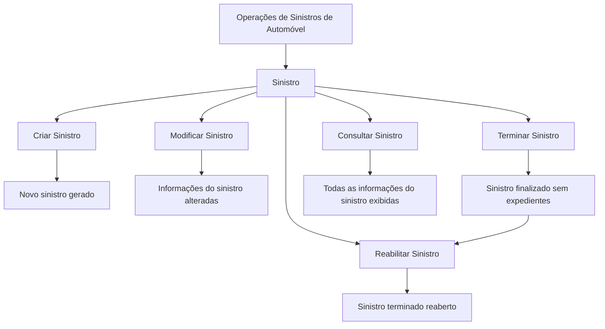
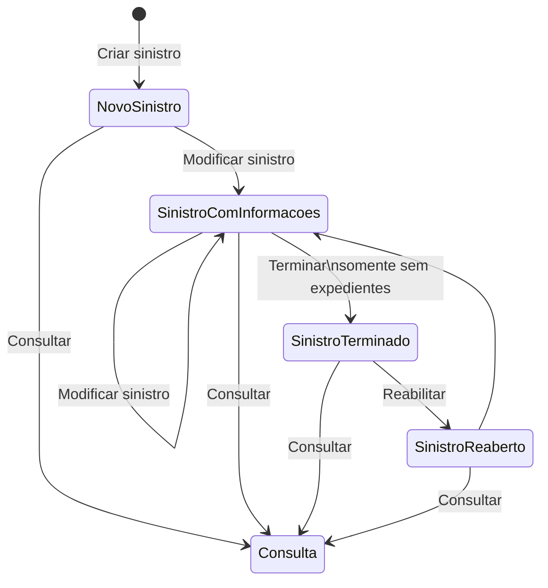

# Documentação de Operações de Sinistros de Automóvel — Tramitação de Sinistros

## 1. Metadados do Documento
- **Arquivo de Origem:** Não identificado no conteúdo fornecido
- **Tipo de Documento:** Manual Operacional
- **Domínio / Sistema:** Operações de Sinistros de Automóvel; documentação Reef; Mapfredocument
- **Público-Alvo:** Operação, analistas funcionais e utilizadores responsáveis pela tramitação de sinistros
- **Data/Versão Identificada:** Não identificada
- **Owner identificado:** `user:agonzalez_mapfre.com`
- **Lifecycle identificado:** Approved Source

---

## 2. Resumo Executivo & Contexto de Negócio

O documento descreve operações disponíveis para a tramitação de sinistros no domínio de **Sinistros de Automóvel**. O conteúdo indica que as operações podem ser realizadas em dois modos: **em linha** ou **diferido**.

A entidade funcional central é o **sinistro**. O manual lista cinco operações: criar, modificar, terminar, reabilitar e consultar um sinistro. Cada operação possui uma finalidade operacional explícita, embora o documento não detalhe telas, permissões, contratos de integração, campos obrigatórios ou regras de validação.

A operação de criação permite gerar um novo sinistro. A modificação permite alterar informações de um sinistro existente. O término encerra sinistros que não possuem expedientes, enquanto a reabilitação reabre sinistros previamente terminados. A consulta apresenta todas as informações do sinistro.

O conteúdo também referencia os contextos de documentação **Reef** e **Mapfredocument**, com estado de ciclo de vida identificado como “Approved Source”. Não há detalhamento adicional sobre a arquitetura técnica, fluxos de persistência, serviços, APIs ou ambientes.

---

## 3. Arquitetura, Componentes & Tecnologias Envolvidas

Os componentes, contextos e elementos explicitamente identificados no documento são:

| Componente / Termo | Papel identificado |
| :--- | :--- |
| Operações de Sinistros | Conjunto de ações aplicáveis a um sinistro |
| Sinistro | Entidade funcional manipulada pelas operações documentadas |
| Sinistros de Automóvel | Domínio de negócio citado no título |
| Tramitação de Sinistros | Processo operacional abordado pelo documento |
| Reef | Contexto/plataforma de documentação citado na navegação e identificação documental |
| Mapfredocument | Nome citado no conteúdo como referência documental |
| Owner `user:agonzalez_mapfre.com` | Proprietário identificado na documentação |
| Lifecycle `Approved Source` | Estado de ciclo de vida indicado para a fonte |



**Nota de Análise:** O documento lista operações funcionais sobre sinistros, mas não detalha microsserviços, tecnologias, APIs, métodos HTTP, contratos JSON, bases de dados, autenticação, mecanismos de auditoria ou infraestrutura de execução.

---

## 4. Regras de Negócio, Especificações Funcionais & Processos

### 4.1 Modalidades de execução

As operações aplicáveis a um sinistro podem ser executadas:

1. **Em linha**
2. **De forma diferida**

O documento não define a diferença operacional, técnica ou temporal entre a execução em linha e a execução diferida.

### 4.2 Operações disponíveis para sinistros

#### Criar Sinistro
- **Finalidade:** gerar um novo sinistro.
- **Resultado explicitamente informado:** criação de um novo sinistro.
- **Não detalhado:** dados necessários para criação, campos obrigatórios, validações, identificador gerado, origem da solicitação ou regras de duplicidade.

#### Modificar Sinistro
- **Finalidade:** alterar as informações de um sinistro.
- **Resultado explicitamente informado:** mudança de informações do sinistro.
- **Não detalhado:** quais informações podem ser modificadas, restrições após o término, histórico de alterações ou perfis autorizados.

#### Terminar Sinistro
- **Finalidade:** finalizar sinistros sem expedientes.
- **Regra explícita:** a operação de término é aplicável a sinistros que não possuem expedientes.
- **Não detalhado:** definição de “expediente”, efeitos do término, condições complementares, validações, reversibilidade ou notificações.

#### Reabilitar Sinistro
- **Finalidade:** reabrir um sinistro terminado.
- **Regra explícita:** a reabilitação incide sobre sinistros no estado de terminado.
- **Não detalhado:** critérios de elegibilidade, autorizações necessárias, prazo para reabilitação ou estado resultante após a reabertura.

#### Consultar Sinistro
- **Finalidade:** mostrar todas as informações do sinistro.
- **Resultado explicitamente informado:** apresentação de todas as informações do sinistro.
- **Não detalhado:** filtros de busca, campos exibidos, mascaramento de dados, permissões ou formatos de saída.

### 4.3 Fluxo funcional inferido exclusivamente das operações listadas



**Nota de Análise:** O diagrama representa relações operacionais sustentadas pelas descrições “criar”, “modificar”, “terminar”, “reabilitar” e “consultar”. O documento não fornece uma máquina de estados formal nem define todos os estados internos do sinistro.

---

## 5. Tabelas de Parâmetros, Ambientes e Estruturas de Dados

| Item / Parâmetro | Descrição / Função | Tipo / Valores / Formato | Ambiente / Observações |
| :--- | :--- | :--- | :--- |
| Domínio | Área funcional do documento | Sinistros de Automóvel | Citado no título |
| Processo | Processo abordado | Tramitação de Sinistros | Citado no título |
| Entidade principal | Objeto das operações | Sinistro | Operações aplicáveis ao sinistro |
| Modalidade de execução | Forma de realizar operações | Em linha; diferido | Sem detalhamento adicional |
| Criar Sinistro | Gera um novo sinistro | Operação funcional | Sem campos ou validações descritos |
| Modificar Sinistro | Altera informações do sinistro | Operação funcional | Sem campos modificáveis descritos |
| Terminar Sinistro | Finaliza sinistros sem expedientes | Operação funcional | Restrição explícita: ausência de expedientes |
| Reabilitar Sinistro | Reabre um sinistro terminado | Operação funcional | Aplicável a sinistro terminado |
| Consultar Sinistro | Mostra todas as informações de um sinistro | Operação funcional | Sem filtros ou regras de acesso descritos |
| Documentação Reef | Referência de documentação | Reef | Citado no conteúdo e navegação |
| Mapfredocument | Referência documental | Nome próprio | Sem função técnica detalhada |
| Owner | Proprietário identificado | `user:agonzalez_mapfre.com` | Conforme conteúdo bruto |
| Lifecycle | Estado de ciclo de vida | `Approved Source` | Conforme conteúdo bruto |
| Idioma exibido | Idioma de navegação indicado | `ES` | Conforme conteúdo bruto |

---

## 6. Bateria de Perguntas & Respostas para RAG (FAQ Sintético)

### P1: Quais operações podem ser realizadas sobre um sinistro de automóvel?
**R:** O documento lista cinco operações aplicáveis a um sinistro: criar, modificar, terminar, reabilitar e consultar.

### P2: As operações de sinistro podem ser executadas em quais modalidades?
**R:** As operações sobre sinistros podem ser realizadas em linha ou de forma diferida. O documento não especifica diferenças técnicas ou operacionais entre essas modalidades.

### P3: Qual é a finalidade da operação Criar Sinistro?
**R:** A operação Criar Sinistro permite gerar um novo sinistro.

### P4: O que a operação Modificar Sinistro permite fazer?
**R:** A operação Modificar Sinistro permite alterar a informação de um sinistro. O documento não informa quais campos podem ser alterados nem quais validações são aplicadas.

### P5: Em que condição um sinistro pode ser terminado?
**R:** A operação Terminar Sinistro finaliza sinistros sem expedientes. A ausência de expedientes é a condição explicitamente informada no documento.

### P6: O que significa reabilitar um sinistro?
**R:** Reabilitar um sinistro significa reabrir um sinistro que se encontra terminado.

### P7: Qual informação é apresentada na consulta de um sinistro?
**R:** A operação Consultar Sinistro mostra todas as informações do sinistro, segundo o conteúdo do documento.

### P8: O documento descreve APIs, métodos HTTP ou contratos JSON para as operações de sinistro?
**R:** Não. O documento apresenta apenas as operações funcionais de criar, modificar, terminar, reabilitar e consultar sinistros. Não há detalhamento de APIs, métodos HTTP, contratos JSON ou integrações técnicas.

### P9: Quem é o proprietário identificado para a documentação?
**R:** O proprietário identificado no conteúdo é `user:agonzalez_mapfre.com`.

### P10: Qual é o estado de ciclo de vida indicado para a fonte documental?
**R:** O conteúdo identifica o lifecycle como `Approved Source`.

---

## 7. Glossário de Termos, Siglas & Conceitos-Chave

- **Sinistro:** Entidade principal sobre a qual são realizadas as operações de criação, modificação, término, reabilitação e consulta.
- **Sinistros de Automóvel:** Domínio funcional indicado pelo documento.
- **Tramitação de Sinistros:** Processo operacional relacionado ao tratamento de sinistros.
- **Em linha:** Modalidade de execução mencionada para operações de sinistro; não detalhada no documento.
- **Diferido:** Modalidade de execução mencionada para operações de sinistro; não detalhada no documento.
- **Expedientes:** Elemento citado como critério para o término de um sinistro; o documento não apresenta definição adicional.
- **Reabilitar:** Operação que reabre um sinistro terminado.
- **Reef:** Nome associado à documentação e à navegação apresentada no conteúdo bruto.
- **Mapfredocument:** Nome citado como referência documental; sem detalhamento de função ou tecnologia.
- **Owner:** Campo de propriedade da documentação, associado a `user:agonzalez_mapfre.com`.
- **Lifecycle:** Campo que representa o estado de ciclo de vida da documentação, identificado como `Approved Source`.
- **ES:** Indicador de idioma exibido na navegação; presumivelmente referente ao contexto de idioma, sem expansão explícita no documento.

---

## 8. Notas Críticas, Riscos & Limitações

- O documento contém uma lista resumida de operações funcionais, sem detalhamento técnico ou operacional aprofundado.
- Não são apresentados requisitos de autenticação, autorização, perfis de acesso ou matriz de permissões para criar, modificar, terminar, reabilitar ou consultar sinistros.
- Não há definição de dados de entrada, campos obrigatórios, formatos de dados, mensagens de erro, códigos de retorno ou critérios de validação.
- A condição “sinistros sem expedientes” é citada para a operação de término, mas o conceito de expediente não é definido.
- Não há descrição de integrações, serviços, APIs, bancos de dados, ambientes, URLs, logs, monitoramento ou mecanismos de auditoria.
- Não há detalhamento sobre o comportamento posterior à reabilitação de um sinistro terminado.
- **Nota de Análise:** O documento lista o processo de tramitação de sinistros e suas operações, porém não detalha os fluxos internos, transições formais de estado ou contratos técnicos expostos.

---

## 9. Conteúdo Bruto Estruturado (Referência Fiel)

```text
--- [PÁGINA 1 DE 1] ---

DOCUMENTACIÓN OPERACIONES de SINIESTROS (Automóvil) -
TRAMITACIÓN SINIESTROS
SINIESTRO
Operaciones que se pueden realizar a un siniestro, se pueden realizar tanto en línea como diferido
CREAR Siniestro
Permite generar un nuevo siniestro
MODIFICAR Siniestro
Permite cambiar la información del
siniestro
TERMINAR Siniestro
Finaliza siniestros sin expedientes
REHABILITAR Siniestro
Reabre un siniestro Terminado
CONSULTAR Siniestro
Muestra toda la información del siniestro
Documentation / DOCUMENTACIÓN Reef
DOCUMENTACIÓN Reef
Mapfredocument
DOCUMENTACIÓN Reef
Owner
user:agonzalez_mapfre.com
Lifecycle
Approved Source
 / 
 VL
Buscar Inicio Soluciones Arquitecturas APIs Componentes Cloud Documentación Zeus Reef Ayuda
ES
```
