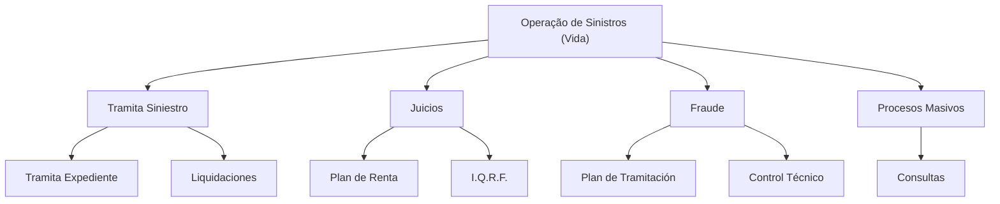

# Documentação de Operação de Sinistros (Vida) — Reef

## 1. Metadados do Documento
- **Arquivo de Origem:** `Não identificado no conteúdo fornecido`
- **Tipo de Documento:** `Manual Operacional / Material de Formação`
- **Domínio / Sistema:** `Operação de Sinistros (Vida), Reef, Mapfre`
- **Público-Alvo:** `Operação e negócio`
- **Data/Versão Identificada:** `Não identificada`

---

## 2. Resumo Executivo & Contexto de Negócio

O documento apresenta material de formação orientado à operação e ao tipo de negócio de **Sinistros (Vida)**. O conteúdo associa a documentação ao contexto **Reef** e contém referências a **Mapfredocument** e ao portal de documentação Mapfre.

A estrutura principal é organizada por tipos de operação e módulos. Os módulos explicitamente listados são **Tramita Siniestro**, **Juicios**, **Fraude** e **Procesos Masivos**. Para cada agrupamento, o conteúdo apresenta itens operacionais relacionados, sem detalhar procedimentos, critérios de execução ou responsabilidades.

O material também evidencia que a documentação possui ciclo de vida classificado como **Approved Source**, com referência a **VL**. O proprietário indicado é `agonzalez_mapfre.com`.

Não há detalhamento adicional sobre arquitetura de software, métodos de integração, interfaces, contratos técnicos, URLs de ambientes, permissões, regras de cálculo ou fluxos de aprovação. A utilidade primária do conteúdo fornecido é a identificação dos domínios operacionais e dos módulos documentados.

---

## 3. Arquitetura, Componentes & Tecnologias Envolvidas

Os componentes e contextos explicitamente citados são:

- **Reef:** contexto associado à documentação.
- **Mapfredocument:** referência documental exibida no conteúdo.
- **Operação de Sinistros (Vida):** domínio de negócio da formação.
- **Tramita Siniestro:** módulo/tipo de operação listado.
- **Juicios:** módulo/tipo de operação listado.
- **Fraude:** módulo/tipo de operação listado.
- **Procesos Masivos:** módulo/tipo de operação listado.
- **VL:** identificador apresentado junto ao ciclo de vida da documentação.
- **Approved Source:** estado de ciclo de vida apresentado.
- **Zeus:** item disponível na navegação do portal, sem detalhamento funcional.

O conteúdo não descreve uma arquitetura técnica, integrações, APIs, bancos de dados, protocolos ou fluxos de dados. O diagrama abaixo representa exclusivamente a hierarquia operacional indicada pelo material.



> **Nota de Análise:** O documento lista módulos e tópicos operacionais, mas não especifica relações técnicas, ordem de execução, métodos HTTP, contratos JSON, infraestrutura ou dependências entre sistemas.

---

## 4. Regras de Negócio, Especificações Funcionais & Processos

O conteúdo disponibilizado não define regras de negócio, validações, cálculos, condições de elegibilidade, etapas obrigatórias, exceções ou critérios de decisão.

A estrutura operacional identificada é:

1. **Tramita Siniestro**
   - **Tramita Expediente**
   - **Liquidaciones**

2. **Juicios**
   - **Plan de Renta**
   - **I.Q.R.F.**

3. **Fraude**
   - **Plan de Tramitación**
   - **Control Técnico**

4. **Procesos Masivos**
   - **Consultas**

> **Nota de Análise:** Os nomes dos módulos e itens foram preservados no idioma original porque o documento não fornece traduções ou definições funcionais equivalentes. Não é possível determinar, exclusivamente a partir do conteúdo, como cada operação deve ser executada.

---

## 5. Tabelas de Parâmetros, Ambientes e Estruturas de Dados

| Item / Parâmetro | Descrição / Função | Tipo / Valores / Formato | Ambiente / Observações |
| :--- | :--- | :--- | :--- |
| DOCUMENTACIÓN de OPERACIÓN de SINIESTROS (Vida) | Título apresentado para o material de formação operacional. | Texto | Associado ao domínio de Sinistros (Vida). |
| Formación orientada a la operación y tipo de negocio | Descrição do direcionamento da formação. | Texto | Não há detalhamento de conteúdo programático. |
| Tramita Siniestro | Tipo de operação ou módulo listado. | Módulo / operação | Contém Tramita Expediente e Liquidaciones. |
| Tramita Expediente | Item listado sob Tramita Siniestro. | Processo / tópico | Sem descrição adicional. |
| Liquidaciones | Item listado sob Tramita Siniestro. | Processo / tópico | Sem descrição adicional. |
| Juicios | Tipo de operação ou módulo listado. | Módulo / operação | Contém Plan de Renta e I.Q.R.F. |
| Plan de Renta | Item listado sob Juicios. | Processo / tópico | Sem descrição adicional. |
| I.Q.R.F. | Item listado sob Juicios. | Sigla / tópico | O significado da sigla não é informado. |
| Fraude | Tipo de operação ou módulo listado. | Módulo / operação | Contém Plan de Tramitación e Control Técnico. |
| Plan de Tramitación | Item listado sob Fraude. | Processo / tópico | Sem descrição adicional. |
| Control Técnico | Item listado sob Fraude. | Processo / tópico | Sem descrição adicional. |
| Procesos Masivos | Tipo de operação ou módulo listado. | Módulo / operação | Contém Consultas. |
| Consultas | Item listado sob Procesos Masivos. | Processo / tópico | Sem descrição adicional. |
| Reef | Referência de documentação e item de navegação. | Sistema / contexto documental | Sem definição funcional adicional. |
| Mapfredocument | Referência exibida no conteúdo. | Repositório ou contexto documental | Natureza exata não detalhada. |
| Owner | Campo de propriedade da documentação. | Metadado | Valor indicado: `user:agonzalez_mapfre.com`. |
| Lifecycle | Campo de ciclo de vida da documentação. | Metadado | Valor indicado: `Approved Source / VL`. |
| Approved Source | Estado exibido no ciclo de vida. | Estado documental | Sem critérios de aprovação informados. |
| VL | Identificador exibido junto ao ciclo de vida. | Sigla / identificador | Significado não informado. |
| Zeus | Item exibido na navegação do portal. | Sistema / seção de navegação | Sem descrição funcional. |
| ES | Idioma exibido no portal. | Código de idioma | Interpretado apenas como texto exibido; o documento não define formalmente o código. |

---

## 6. Bateria de Perguntas & Respostas para RAG (FAQ Sintético)

### P1: Qual é o domínio de negócio abordado pela documentação Reef?
**R:** A documentação aborda a **operação de sinistros de Vida**, conforme o título “DOCUMENTACIÓN de OPERACIÓN de SINIESTROS (Vida)”. O conteúdo caracteriza o material como uma formação orientada à operação e ao tipo de negócio.

### P2: Quais módulos de operação são listados no documento de Sinistros (Vida)?
**R:** O documento lista quatro agrupamentos operacionais: **Tramita Siniestro**, **Juicios**, **Fraude** e **Procesos Masivos**.

### P3: Quais itens estão associados ao módulo Tramita Siniestro?
**R:** O módulo **Tramita Siniestro** apresenta os itens **Tramita Expediente** e **Liquidaciones**. O documento não especifica o fluxo, as regras ou os responsáveis por esses itens.

### P4: Quais tópicos são relacionados ao módulo Juicios?
**R:** O módulo **Juicios** contém os tópicos **Plan de Renta** e **I.Q.R.F.**. O documento não expande o significado de I.Q.R.F. nem descreve os procedimentos de Juicios.

### P5: O que está listado no módulo Fraude?
**R:** O módulo **Fraude** inclui **Plan de Tramitación** e **Control Técnico**. Não há critérios de fraude, mecanismos de detecção, regras de validação ou etapas operacionais descritos no conteúdo fornecido.

### P6: Qual item aparece dentro de Procesos Masivos?
**R:** O único item explicitamente listado sob **Procesos Masivos** é **Consultas**. O documento não informa tipos de consulta, periodicidade, dados consultados ou ferramentas utilizadas.

### P7: Quem é o proprietário identificado da documentação?
**R:** O campo **Owner** apresenta o valor `user:agonzalez_mapfre.com`. O conteúdo não informa nome completo, papel organizacional ou responsabilidades desse proprietário.

### P8: Qual é o ciclo de vida indicado para a documentação?
**R:** O campo **Lifecycle** exibe **Approved Source / VL**. O documento não define o significado de VL, nem descreve o processo que levou ao estado Approved Source.

### P9: O documento descreve APIs, integrações ou contratos técnicos?
**R:** Não. O conteúdo menciona Reef, Mapfredocument, Zeus e itens de navegação documental, mas não apresenta endpoints, APIs, protocolos, contratos, formatos de mensagem, credenciais ou detalhes de integração.

### P10: Existe um procedimento operacional detalhado para Liquidaciones?
**R:** Não. **Liquidaciones** é apenas listado como item associado a **Tramita Siniestro**. O documento não fornece etapas, entradas, saídas, regras de cálculo, aprovações ou exceções.

### P11: O que significa a sigla I.Q.R.F. neste documento?
**R:** O significado de **I.Q.R.F.** não é definido no conteúdo fornecido. A sigla aparece somente como um item relacionado ao módulo **Juicios**.

### P12: Qual é a relação identificável entre Reef e a documentação de Sinistros (Vida)?
**R:** O texto inclui as referências “Documentation / DOCUMENTACIÓN Reef” e “DOCUMENTACIÓN Reef”, indicando associação documental com Reef. O conteúdo não descreve se Reef é uma aplicação, repositório, portal ou componente técnico.

---

## 7. Glossário de Termos, Siglas & Conceitos-Chave

- **Approved Source:** Estado de ciclo de vida apresentado para a documentação. O documento não define seus critérios.
- **Consultas:** Item listado dentro de Procesos Masivos.
- **Control Técnico:** Item listado dentro do módulo Fraude.
- **ES:** Texto exibido na navegação do portal; o significado formal não é definido.
- **Fraude:** Módulo ou tipo de operação listado no contexto de Sinistros (Vida).
- **I.Q.R.F.:** Sigla listada dentro do módulo Juicios. O significado não é informado.
- **Juicios:** Módulo ou tipo de operação listado no contexto de Sinistros (Vida).
- **Liquidaciones:** Item listado dentro de Tramita Siniestro.
- **Mapfredocument:** Referência documental exibida no conteúdo, sem definição adicional.
- **Plan de Renta:** Item listado dentro do módulo Juicios.
- **Plan de Tramitación:** Item listado dentro do módulo Fraude.
- **Procesos Masivos:** Módulo ou tipo de operação que contém Consultas.
- **Reef:** Contexto ou referência documental citada no material.
- **Sinestros (Vida):** Domínio de operação de sinistros relacionado ao negócio de Vida.
- **Tramita Expediente:** Item listado dentro de Tramita Siniestro.
- **Tramita Siniestro:** Módulo ou tipo de operação que contém Tramita Expediente e Liquidaciones.
- **VL:** Identificador exibido ao lado de Approved Source; o significado não é informado.
- **Zeus:** Item apresentado na navegação do portal, sem descrição funcional.

---

## 8. Notas Críticas, Riscos & Limitações

- O conteúdo fornecido é resumido e não apresenta procedimentos operacionais detalhados.
- Não há regras de negócio, critérios de validação, exceções, papéis, responsabilidades ou SLAs.
- Não são apresentados detalhes de arquitetura, integrações, APIs, infraestrutura, bancos de dados ou ambientes.
- As siglas **I.Q.R.F.** e **VL** não possuem expansão ou definição no documento.
- Não é possível inferir a função técnica de **Reef**, **Mapfredocument** ou **Zeus** além das referências textuais exibidas.
- Não há data, versão formal, autoria completa ou histórico de alterações identificável.
- A relação hierárquica entre módulos e itens foi preservada conforme a formatação do conteúdo; não há fluxo operacional explicitamente definido.

---

## 9. Conteúdo Bruto Estruturado (Referência Fiel)

```text
--- [PÁGINA 1 DE 1] ---

DOCUMENTACIÓN de OPERACIÓN de SINIESTROS (Vida)
 Formación orientada a la operación y tipo de negocio
TIPOS DE OPERACIÓN por MÓDULO
 TRAMITA SINIESTRO
  TRAMITA EXPEDIENTE
  LIQUIDACIONES
 JUICIOS
  PLAN DE RENTA
  I.Q.R.F.
 FRAUDE
  PLAN DE TRAMITACIÓN
  CONTROL TÉCNICO
 PROCESOS MASIVOS
  CONSULTAS
Documentation / DOCUMENTACIÓN Reef
DOCUMENTACIÓN Reef
Mapfredocument
DOCUMENTACIÓN Reef
Owner
user:agonzalez_mapfre.com
Lifecycle
Approved Source
 / 
 VL
Buscar Inicio Soluciones Arquitecturas APIs Componentes Cloud Documentación Zeus Reef Ayuda
ES
```
