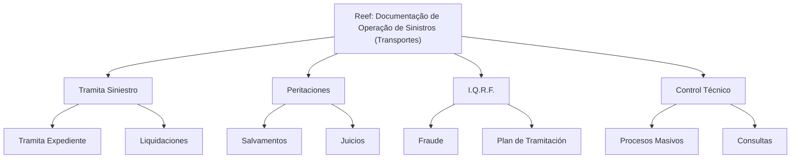

# Documentação de Operação de Sinistros (Transportes) no Reef

## 1. Metadados do Documento
- **Arquivo de Origem:** `Não identificado no conteúdo fornecido`
- **Tipo de Documento:** `Manual Operacional / Material de Formação`
- **Domínio / Sistema:** `Reef — Operação de Sinistros (Transportes)`
- **Público-Alvo:** `Operação de sinistros; público adicional não identificado`
- **Data/Versão Identificada:** `Não identificada`
- **Owner identificado:** `user:agonzalez_mapfre.com`
- **Lifecycle identificado:** `Approved Source / VL`

---

## 2. Resumo Executivo & Contexto de Negócio

O conteúdo apresenta uma documentação voltada à operação de sinistros no segmento de Transportes. O material declara que a formação é orientada à operação e ao tipo de negócio, mas não apresenta procedimentos detalhados, regras de cálculo, contratos técnicos ou responsabilidades por etapa.

A estrutura funcional está organizada por módulos de operação. O módulo **Tramita Siniestro** contém **Tramita Expediente** e **Liquidaciones**. O módulo **Peritaciones** contém **Salvamentos** e **Juicios**. O módulo **I.Q.R.F.** contém **Fraude** e **Plan de Tramitación**. O módulo **Control Técnico** contém **Procesos Masivos** e **Consultas**.

O sistema ou domínio documental referenciado é **Reef**, também citado como “Documentation / DOCUMENTACIÓN Reef”. O conteúdo menciona ainda “Mapfredocument” e itens de navegação de um portal, incluindo Soluciones, Arquitecturas, APIs, Componentes, Cloud, Documentación, Zeus, Reef e Ayuda.

**Nota de Análise:** o material fornecido atua como índice ou visão resumida de módulos operacionais. Não há detalhamento adicional sobre fluxos de telas, métodos, APIs, dados de entrada, dados de saída, regras de negócio específicas ou integrações técnicas.

---

## 3. Arquitetura, Componentes & Tecnologias Envolvidas

Os componentes funcionais explicitamente citados são:

- **Reef:** domínio/sistema associado à documentação.
- **Operação de Sinistros (Transportes):** contexto de negócio e operação.
- **Tramita Siniestro:** módulo operacional.
- **Tramita Expediente:** subcomponente listado sob Tramita Siniestro.
- **Liquidaciones:** subcomponente listado sob Tramita Siniestro.
- **Peritaciones:** módulo operacional.
- **Salvamentos:** subcomponente listado sob Peritaciones.
- **Juicios:** subcomponente listado sob Peritaciones.
- **I.Q.R.F.:** módulo operacional.
- **Fraude:** subcomponente listado sob I.Q.R.F.
- **Plan de Tramitación:** subcomponente listado sob I.Q.R.F.
- **Control Técnico:** módulo operacional.
- **Procesos Masivos:** subcomponente listado sob Control Técnico.
- **Consultas:** subcomponente listado sob Control Técnico.
- **Mapfredocument:** termo citado sem descrição funcional.
- **Zeus:** item de navegação citado sem descrição funcional.



**Nota de Análise:** o diagrama representa somente a hierarquia de módulos indicada no conteúdo. O documento não descreve comunicação entre serviços, protocolos, APIs, bancos de dados, ambientes, URLs ou tecnologias de implementação.

---

## 4. Regras de Negócio, Especificações Funcionais & Processos

O conteúdo estabelece os seguintes elementos funcionais:

1. A documentação é destinada à **operação de sinistros de Transportes**.
2. A formação é orientada à **operação** e ao **tipo de negócio**.
3. As operações são classificadas por módulo:
   - **Tramita Siniestro**
     - Tramita Expediente
     - Liquidaciones
   - **Peritaciones**
     - Salvamentos
     - Juicios
   - **I.Q.R.F.**
     - Fraude
     - Plan de Tramitación
   - **Control Técnico**
     - Procesos Masivos
     - Consultas
4. O conteúdo está associado à documentação do **Reef**.
5. O lifecycle indicado é **Approved Source / VL**.

**Nota de Análise:** não foram fornecidas regras condicionais, validações, critérios de elegibilidade, fórmulas, sequências operacionais passo a passo, perfis de acesso ou tratamento de exceções. Portanto, não é possível inferir regras adicionais sem extrapolar o conteúdo original.

---

## 5. Tabelas de Parâmetros, Ambientes e Estruturas de Dados

| Item / Parâmetro | Descrição / Função | Tipo / Valores / Formato | Ambiente / Observações |
| :--- | :--- | :--- | :--- |
| Domínio documental | Documentação Reef | Texto | Associado à operação de sinistros de Transportes |
| Formação | Formação orientada à operação e ao tipo de negócio | Texto | Sem detalhamento adicional |
| Módulo | Tramita Siniestro | Nome de módulo | Possui Tramita Expediente e Liquidaciones |
| Submódulo | Tramita Expediente | Nome de operação/submódulo | Listado sob Tramita Siniestro |
| Submódulo | Liquidaciones | Nome de operação/submódulo | Listado sob Tramita Siniestro |
| Módulo | Peritaciones | Nome de módulo | Possui Salvamentos e Juicios |
| Submódulo | Salvamentos | Nome de operação/submódulo | Listado sob Peritaciones |
| Submódulo | Juicios | Nome de operação/submódulo | Listado sob Peritaciones |
| Módulo | I.Q.R.F. | Sigla/nome de módulo | Possui Fraude e Plan de Tramitación |
| Submódulo | Fraude | Nome de operação/submódulo | Listado sob I.Q.R.F. |
| Submódulo | Plan de Tramitación | Nome de operação/submódulo | Listado sob I.Q.R.F. |
| Módulo | Control Técnico | Nome de módulo | Possui Procesos Masivos e Consultas |
| Submódulo | Procesos Masivos | Nome de operação/submódulo | Listado sob Control Técnico |
| Submódulo | Consultas | Nome de operação/submódulo | Listado sob Control Técnico |
| Owner | user:agonzalez_mapfre.com | Identificador textual | Owner exibido no conteúdo |
| Lifecycle | Approved Source / VL | Status/identificador textual | Significado de “VL” não detalhado |
| Referência | Mapfredocument | Nome textual | Função não detalhada |
| Referência | Zeus | Nome textual | Aparece como item de navegação |
| Idioma exibido | ES | Código textual | Exibido no portal/documentação |

---

## 6. Bateria de Perguntas & Respostas para RAG (FAQ Sintético)

### P1: Qual é o escopo da documentação Reef apresentada?
**R:** A documentação está voltada à operação de sinistros no contexto de Transportes. O conteúdo também informa que a formação é orientada à operação e ao tipo de negócio.

### P2: Quais são os módulos de operação de sinistros listados no documento?
**R:** Os módulos listados são Tramita Siniestro, Peritaciones, I.Q.R.F. e Control Técnico.

### P3: Quais operações ou submódulos pertencem a Tramita Siniestro?
**R:** Tramita Siniestro possui os itens Tramita Expediente e Liquidaciones.

### P4: Quais operações estão associadas ao módulo Peritaciones?
**R:** O módulo Peritaciones possui os itens Salvamentos e Juicios.

### P5: O documento descreve quais funções pertencem a I.Q.R.F.?
**R:** Sim. I.Q.R.F. contém Fraude e Plan de Tramitación. O significado expandido da sigla I.Q.R.F. não é informado no conteúdo fornecido.

### P6: Quais funcionalidades são listadas sob Control Técnico?
**R:** Control Técnico contém Procesos Masivos e Consultas.

### P7: Há detalhes sobre APIs, métodos HTTP ou contratos de integração do Reef?
**R:** Não. O conteúdo cita itens de navegação como APIs, Componentes, Cloud e Arquitecturas, mas não fornece detalhes técnicos, endpoints, métodos HTTP, payloads ou contratos de integração.

### P8: Quem é o owner identificado para a documentação?
**R:** O owner identificado no conteúdo é `user:agonzalez_mapfre.com`.

### P9: Qual lifecycle é informado para o documento?
**R:** O conteúdo apresenta o lifecycle como `Approved Source / VL`. O documento não explica o significado operacional de “VL”.

### P10: O documento informa URLs, ambientes, servidores ou caminhos de log?
**R:** Não. Não há URLs, ambientes técnicos, servidores, portas, diretórios, rotas de log ou configurações de infraestrutura no material fornecido.

### P11: Mapfredocument e Zeus são componentes tecnicamente descritos?
**R:** Não. Mapfredocument e Zeus aparecem no conteúdo, mas suas funções, responsabilidades e integrações não são detalhadas.

### P12: O documento apresenta um processo completo de tratamento de sinistro?
**R:** Não. O documento lista módulos e submódulos de operação, mas não descreve a sequência ponta a ponta para abertura, tramitação, perícia, liquidação, salvamento, juízo, fraude ou controle técnico.

---

## 7. Glossário de Termos, Siglas & Conceitos-Chave

- **Reef:** sistema, domínio ou área documental citada como “Documentation / DOCUMENTACIÓN Reef”.
- **Sinistros:** contexto de operação explicitamente associado a Transportes.
- **Transportes:** tipo de negócio mencionado na documentação.
- **Tramita Siniestro:** módulo de operação listado no documento.
- **Tramita Expediente:** item listado sob Tramita Siniestro.
- **Liquidaciones:** item listado sob Tramita Siniestro.
- **Peritaciones:** módulo de operação listado no documento.
- **Salvamentos:** item listado sob Peritaciones.
- **Juicios:** item listado sob Peritaciones.
- **I.Q.R.F.:** módulo listado no documento; a expansão da sigla não é informada.
- **Fraude:** item listado sob I.Q.R.F.
- **Plan de Tramitación:** item listado sob I.Q.R.F.
- **Control Técnico:** módulo de operação listado no documento.
- **Procesos Masivos:** item listado sob Control Técnico.
- **Consultas:** item listado sob Control Técnico.
- **Mapfredocument:** termo citado sem definição no conteúdo.
- **Zeus:** termo citado como item de navegação, sem definição funcional.
- **Approved Source / VL:** lifecycle exibido para o conteúdo; “VL” não é explicado.
- **ES:** código exibido no portal; o conteúdo não fornece interpretação adicional.

---

## 8. Notas Críticas, Riscos & Limitações

- O conteúdo possui caráter resumido e não descreve procedimentos operacionais detalhados.
- Não foram identificados contratos de integração, APIs, tecnologias, versões, servidores, URLs, ambientes ou caminhos de logs.
- Não há regras de negócio detalhadas para Tramita Expediente, Liquidaciones, Peritaciones, Salvamentos, Juicios, Fraude, Plan de Tramitación, Procesos Masivos ou Consultas.
- Não é possível inferir a expansão da sigla **I.Q.R.F.** apenas com o material fornecido.
- Não é possível determinar o significado de **VL** no lifecycle “Approved Source / VL”.
- Mapfredocument e Zeus são citados, mas não possuem descrição de responsabilidade, arquitetura ou relação com Reef.
- O documento não informa data, versão, autor além do owner exibido, nem histórico de alterações.

---

## 9. Conteúdo Bruto Estruturado (Referência Fiel)

```text
--- [PÁGINA 1 DE 1] ---

DOCUMENTACIÓN de OPERACIÓN de SINIESTROS (Transportes)
 Formación orientada a la operación y tipo de negocio
TIPOS DE OPERACIÓN por MÓDULO
 TRAMITA SINIESTRO
  TRAMITA EXPEDIENTE
  LIQUIDACIONES
 PERITACIONES
  SALVAMENTOS
  JUICIOS
 I.Q.R.F.
  FRAUDE
  PLAN DE TRAMITACIÓN
 CONTROL TÉCNICO
  PROCESOS MASIVOS
  CONSULTAS
Documentation / DOCUMENTACIÓN Reef
DOCUMENTACIÓN Reef
Mapfredocument
DOCUMENTACIÓN Reef
Owner
user:agonzalez_mapfre.com
Lifecycle
Approved Source
 / 
 VL
Buscar Inicio Soluciones Arquitecturas APIs Componentes Cloud Documentación Zeus Reef Ayuda
ES
```
