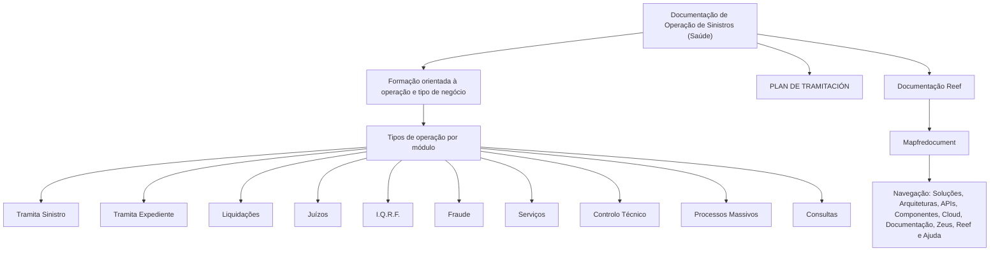

# Documentação de Operação de Sinistros (Saúde) — Reef / Mapfredocument

## 1. Metadados do Documento
- **Arquivo de Origem:** Não identificado no conteúdo extraído
- **Tipo de Documento:** Manual Operacional
- **Domínio / Sistema:** Operação de Sinistros (Saúde), Reef e Mapfredocument
- **Público-Alvo:** Operação, Negócio e usuários de documentação corporativa
- **Data/Versão Identificada:** Não identificada

---

## 2. Resumo Executivo & Contexto de Negócio

O documento apresenta uma referência de formação orientada à operação de sinistros no domínio de Saúde. O conteúdo classifica os tipos de operação por módulo e organiza as capacidades operacionais associadas à tramitação de sinistros.

A estrutura operacional cita os módulos de tramitação de sinistro, tramitação de expediente, liquidações, juízos, I.Q.R.F., fraude, serviços, controlo técnico, processos massivos e consultas. A apresentação não descreve o comportamento detalhado, regras de entrada, regras de saída ou responsabilidades de cada módulo.

O documento também referencia “PLAN DE TRAMITACIÓN” e “Imagen TRAMITACIÓN”, indicando a existência de uma representação visual ou plano associado à tramitação. Contudo, o conteúdo bruto extraído não contém detalhes suficientes para reconstruir essa imagem ou definir o fluxo operacional entre os módulos.

A documentação é associada a Reef e disponibilizada no contexto Mapfredocument. O conteúdo apresenta ainda elementos de navegação de uma base documental corporativa, incluindo Soluções, Arquiteturas, APIs, Componentes, Cloud, Documentação, Zeus, Reef e Ajuda.

> **Nota de Análise:** O documento enumera módulos operacionais, mas não detalha métodos, integrações, contratos de dados, permissões, regras de decisão, ambientes ou tecnologias de implementação.

---

## 3. Arquitetura, Componentes & Tecnologias Envolvidas

Os componentes e contextos explicitamente citados são:

- **Operação de Sinistros (Saúde):** domínio funcional da formação e documentação.
- **Módulos operacionais:** tramitação de sinistro, tramitação de expediente, liquidações, juízos, I.Q.R.F., fraude, serviços, controlo técnico, processos massivos e consultas.
- **PLAN DE TRAMITACIÓN:** elemento citado como plano de tramitação.
- **Reef:** contexto de documentação identificado no material.
- **Mapfredocument:** contexto ou repositório documental citado.
- **Zeus:** item disponível na navegação da documentação.
- **Soluções, Arquiteturas, APIs, Componentes e Cloud:** categorias de navegação apresentadas na interface documental.



> **Nota de Análise:** O diagrama representa exclusivamente a relação de agrupamento e contexto documental observada no conteúdo. O documento não especifica dependências, sequência de execução ou troca de dados entre os módulos.

---

## 4. Regras de Negócio, Especificações Funcionais & Processos

O conteúdo não apresenta regras de negócio detalhadas, critérios de validação, fórmulas, condições de elegibilidade, fluxos sequenciais ou contratos funcionais.

As especificações funcionais identificáveis limitam-se à classificação de tipos de operação por módulo:

1. **Tramita Siniestro:** módulo listado como tipo de operação.
2. **Tramita Expediente:** módulo listado como tipo de operação.
3. **Liquidaciones:** módulo listado como tipo de operação.
4. **Juicios:** módulo listado como tipo de operação.
5. **I.Q.R.F.:** módulo ou categoria listada como tipo de operação.
6. **Fraude:** módulo ou categoria listada como tipo de operação.
7. **Servicios:** módulo ou categoria listada como tipo de operação.
8. **Control Técnico:** módulo ou categoria listada como tipo de operação.
9. **Procesos Masivos:** módulo ou categoria listada como tipo de operação.
10. **Consultas:** módulo ou categoria listada como tipo de operação.

O documento declara que a formação é orientada à operação e ao tipo de negócio. Não há detalhamento adicional sobre o conteúdo da formação, responsáveis, duração, pré-requisitos ou critérios de conclusão.

> **Nota de Análise:** Não é possível afirmar como cada módulo processa sinistros, expedientes, liquidações, processos judiciais, fraude, serviços ou consultas, porque o documento não fornece etapas, regras ou evidências operacionais para esses comportamentos.

---

## 5. Tabelas de Parâmetros, Ambientes e Estruturas de Dados

| Item / Parâmetro | Descrição / Função | Tipo / Valores / Formato | Ambiente / Observações |
| :--- | :--- | :--- | :--- |
| Domínio funcional | Operação de sinistros no contexto de Saúde | Texto | Apresentado no título do documento |
| Orientação da formação | Formação orientada à operação e ao tipo de negócio | Texto | Não há cronograma, público detalhado ou material programático |
| Tramita Siniestro | Tipo de operação por módulo | Módulo / categoria | Sem detalhamento funcional |
| Tramita Expediente | Tipo de operação por módulo | Módulo / categoria | Sem detalhamento funcional |
| Liquidaciones | Tipo de operação por módulo | Módulo / categoria | Sem detalhamento funcional |
| Juicios | Tipo de operação por módulo | Módulo / categoria | Sem detalhamento funcional |
| I.Q.R.F. | Tipo de operação por módulo | Módulo / categoria | Sigla não expandida no conteúdo |
| Fraude | Tipo de operação por módulo | Módulo / categoria | Sem detalhamento funcional |
| Servicios | Tipo de operação por módulo | Módulo / categoria | Sem detalhamento funcional |
| Control Técnico | Tipo de operação por módulo | Módulo / categoria | Sem detalhamento funcional |
| Procesos Masivos | Tipo de operação por módulo | Módulo / categoria | Sem detalhamento funcional |
| Consultas | Tipo de operação por módulo | Módulo / categoria | Sem detalhamento funcional |
| PLAN DE TRAMITACIÓN | Plano de tramitação mencionado | Texto / elemento visual citado | O plano não está descrito no texto extraído |
| Imagen TRAMITACIÓN | Imagem de tramitação mencionada | Elemento visual citado | Conteúdo visual não disponível na extração |
| Reef | Contexto de documentação | Sistema / área documental | Citado como “Documentación Reef” |
| Mapfredocument | Contexto documental | Sistema / repositório documental | Citado no rodapé ou navegação |
| Owner | Responsável indicado na página | `user:agonzalez_mapfre.com` | Valor preservado conforme conteúdo extraído |
| Lifecycle | Estado de ciclo de vida | `Approved Source` | Apresentado na interface documental |
| Idioma | Idioma exibido na interface | `ES` | Interface apresentada em espanhol |

---

## 6. Bateria de Perguntas & Respostas para RAG (FAQ Sintético)

### P1: Qual é o domínio de negócio da documentação apresentada?
**R:** A documentação está associada à operação de sinistros no domínio de Saúde, conforme o título “DOCUMENTACIÓN de OPERACIÓN de SINIESTROS (Salud)”.

### P2: Qual é a finalidade declarada da formação mencionada no documento?
**R:** A formação é declarada como orientada à operação e ao tipo de negócio. O conteúdo não informa duração, participantes, pré-requisitos ou conteúdos programáticos adicionais.

### P3: Quais tipos de operação por módulo são listados para a operação de sinistros?
**R:** O documento lista: Tramita Siniestro, Tramita Expediente, Liquidaciones, Juicios, I.Q.R.F., Fraude, Servicios, Control Técnico, Procesos Masivos e Consultas.

### P4: O documento descreve o fluxo detalhado de tramitação de sinistros?
**R:** Não. O documento cita “TRAMITA SINIESTRO”, “PLAN DE TRAMITACIÓN” e “Imagen TRAMITACIÓN”, mas não apresenta as etapas, transições, responsáveis, regras de entrada ou regras de saída do fluxo.

### P5: Existem regras funcionais para liquidações no conteúdo extraído?
**R:** Não. “LIQUIDACIONES” aparece apenas como um tipo de operação por módulo. Não há regras de cálculo, critérios de aprovação, campos, integrações ou procedimentos detalhados.

### P6: O que significa a sigla I.Q.R.F. no documento?
**R:** I.Q.R.F. é listada como um tipo de operação por módulo, mas o documento não fornece a expansão da sigla nem descreve sua função operacional.

### P7: O documento fornece detalhes operacionais sobre fraude e juízos?
**R:** Não. “FRAUDE” e “JUICIOS” aparecem na lista de tipos de operação por módulo, sem fluxo, regras de negócio, responsabilidades ou dados associados.

### P8: Qual é a relação entre Reef e a documentação de operação de sinistros?
**R:** O conteúdo apresenta “Documentation / DOCUMENTACIÓN Reef” e “DOCUMENTACIÓN Reef”, indicando que Reef é um contexto documental relacionado ao material. Não há detalhes sobre a arquitetura ou funcionalidades de Reef.

### P9: Qual sistema ou repositório documental é citado no material?
**R:** O material cita “Mapfredocument”. A extração não especifica se Mapfredocument é uma aplicação, repositório, portal ou outro tipo de componente.

### P10: Qual é o estado de ciclo de vida identificado para o documento?
**R:** O estado de ciclo de vida exibido é “Approved Source”.

### P11: Quais áreas de navegação são visíveis na interface documental?
**R:** A interface apresenta as áreas Buscar, Inicio, Soluciones, Arquitecturas, APIs, Componentes, Cloud, Documentación, Zeus, Reef, Ayuda e o idioma ES.

---

## 7. Glossário de Termos, Siglas & Conceitos-Chave

- **Sinistros (Siniestros):** domínio operacional citado no título do documento, no contexto de Saúde.
- **Saúde (Salud):** domínio de negócio associado à operação de sinistros.
- **Tramita Siniestro:** tipo de operação por módulo listado no documento.
- **Tramita Expediente:** tipo de operação por módulo listado no documento.
- **Liquidaciones:** tipo de operação por módulo listado no documento.
- **Juicios:** tipo de operação por módulo listado no documento.
- **I.Q.R.F.:** sigla listada como tipo de operação por módulo; o significado não é informado.
- **Fraude:** tipo de operação por módulo listado no documento.
- **Servicios:** tipo de operação por módulo listado no documento.
- **Control Técnico:** tipo de operação por módulo listado no documento.
- **Procesos Masivos:** tipo de operação por módulo listado no documento.
- **Consultas:** tipo de operação por módulo listado no documento.
- **PLAN DE TRAMITACIÓN:** plano de tramitação mencionado, sem detalhamento no texto.
- **Reef:** contexto de documentação mencionado no material.
- **Mapfredocument:** sistema ou contexto documental citado; sua natureza não é especificada.
- **Zeus:** item de navegação citado na interface; sua função não é especificada.
- **Lifecycle:** campo de ciclo de vida documental exibido como “Approved Source”.

---

## 8. Notas Críticas, Riscos & Limitações

- O conteúdo extraído é breve e predominantemente enumerativo; não há especificações técnicas, contratos de API, estruturas de dados, URLs, ambientes, servidores ou rotas de logs.
- A imagem de tramitação e o plano de tramitação são citados, mas não foram disponibilizados em forma interpretável no conteúdo bruto.
- Não há definição para a sigla **I.Q.R.F.**; qualquer expansão seria especulativa.
- Não há relação explícita de dependência, sequência, integração ou troca de dados entre os módulos listados.
- Não há informações sobre autenticação, autorização, matriz de perfis, auditoria, monitoramento, tratamento de exceções ou requisitos não funcionais.
- O valor de proprietário foi preservado como aparece no conteúdo original, sem validação de identidade ou domínio.
- O documento está em espanhol e não apresenta data, versão, autor formal ou nome de arquivo.

---

## 9. Conteúdo Bruto Estruturado (Referência Fiel)

```text
--- [PÁGINA 1 DE 1] ---

DOCUMENTACIÓN de OPERACIÓN de SINIESTROS (Salud)
 Formación orientada a la operación y tipo de negocio
TIPOS DE OPERACIÓN por MÓDULO
 TRAMITA SINIESTRO
  TRAMITA EXPEDIENTE
  LIQUIDACIONES
 JUICIOS
  I.Q.R.F.
  FRAUDE
Imagen TRAMITACIÓN PLAN DE
TRAMITACIÓN
  SERVICIOS
  CONTROL TÉCNICO
 PROCESOS MASIVOS
  CONSULTAS
Documentation / DOCUMENTACIÓN Reef
DOCUMENTACIÓN Reef
Mapfredocument
DOCUMENTACIÓN Reef
Owner
user:agonzalez_mapfre.com
Lifecycle
Approved Source
 / 
 VL
Buscar Inicio Soluciones Arquitecturas APIs Componentes Cloud Documentación Zeus Reef Ayuda
ES
```
