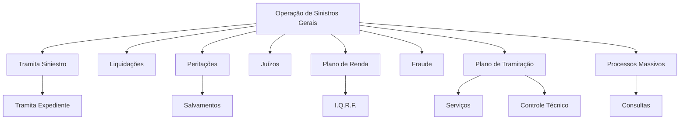

# Documentação de Operação de Sinistros (Generais) — Módulos e Tipos de Operação REEF

## 1. Metadados do Documento
- **Arquivo de Origem:** Não identificado no conteúdo extraído
- **Tipo de Documento:** Apresentação Executiva
- **Domínio / Sistema:** REEF — Operação de Sinistros (Generais)
- **Público-Alvo:** Operação e negócio
- **Data/Versão Identificada:** Não identificada

---

## 2. Resumo Executivo & Contexto de Negócio

O documento apresenta uma visão resumida da documentação de operação de sinistros gerais no contexto do sistema REEF. O conteúdo é caracterizado como uma formação orientada à operação e ao tipo de negócio.

A estrutura principal organiza os tipos de operação por módulo. Os módulos citados abrangem tramitação de sinistros e expedientes, liquidações, peritações, salvamentos, juízos, plano de renda, I.Q.R.F., fraude, plano de tramitação, serviços, controle técnico, processos massivos e consultas.

O conteúdo também evidencia a existência de referências documentais denominadas “Documentation Reef”, “DOCUMENTACIÓN Reef” e “Mapfredocument”. A interface ou repositório exibido contém categorias de navegação como Soluções, Arquiteturas, APIs, Componentes, Cloud, Documentação, Zeus e Reef.

O documento não descreve fluxos operacionais detalhados, responsabilidades por módulo, regras de cálculo, contratos de integração, ambientes, URLs, métodos de API ou procedimentos de execução. Portanto, a informação disponível deve ser interpretada como uma taxonomia de operação de sinistros, e não como um manual operacional completo.

---

## 3. Arquitetura, Componentes & Tecnologias Envolvidas

Os componentes e áreas funcionais explicitamente citados são:

- REEF
- Operação de Sinistros (Generais)
- Tramita Siniestro
- Tramita Expediente
- Liquidações
- Peritações
- Salvamentos
- Juízos
- Plano de Renda
- I.Q.R.F.
- Fraude
- Plano de Tramitação
- Serviços
- Controle Técnico
- Processos Massivos
- Consultas
- Zeus
- Mapfredocument

O documento não fornece uma arquitetura técnica de software, tecnologias de implementação, protocolos, integrações ou relações de dependência entre os módulos. O diagrama abaixo representa exclusivamente a hierarquia de módulos apresentada.



> **Nota de Análise:** O conteúdo não detalha como os módulos REEF se comunicam, quais dados trafegam entre eles, nem se “Tramita Siniestro”, “Tramita Expediente”, “Liquidações” ou os demais itens representam aplicações, menus, capacidades funcionais ou processos.

---

## 4. Regras de Negócio, Especificações Funcionais & Processos

O documento não apresenta regras de negócio explícitas, critérios de elegibilidade, fórmulas de cálculo, validações, estados processuais ou procedimentos operacionais passo a passo.

A organização funcional apresentada contém os seguintes agrupamentos:

1. **Tramita Siniestro**
   - Inclui o item **Tramita Expediente**.

2. **Peritações**
   - Inclui o item **Salvamentos**.

3. **Plano de Renda**
   - Inclui o item **I.Q.R.F.**.

4. **Plano de Tramitação**
   - Inclui os itens **Serviços** e **Controle Técnico**.

5. **Processos Massivos**
   - Inclui o item **Consultas**.

6. **Itens sem subitens explicitados**
   - Liquidações.
   - Juízos.
   - Fraude.

> **Nota de Análise:** O documento lista áreas de operação, mas não descreve as ações permitidas em cada área, a sequência operacional, as regras aplicáveis aos sinistros, os papéis responsáveis ou os resultados esperados para cada processo.

---

## 5. Tabelas de Parâmetros, Ambientes e Estruturas de Dados

| Item / Parâmetro | Descrição / Função | Tipo / Valores / Formato | Ambiente / Observações |
| :--- | :--- | :--- | :--- |
| REEF | Sistema ou domínio documental citado no conteúdo. | Nome de sistema/domínio. | Associado à documentação de operação de sinistros. |
| Operação de Sinistros (Generais) | Tema central da documentação. | Área operacional / domínio de negócio. | O documento informa que a formação é orientada à operação e ao tipo de negócio. |
| Tramita Siniestro | Tipo de operação por módulo. | Módulo ou capacidade funcional. | Contém Tramita Expediente como subitem. |
| Tramita Expediente | Item associado a Tramita Siniestro. | Módulo ou capacidade funcional. | Não há detalhamento adicional. |
| Liquidações | Tipo de operação por módulo. | Módulo ou capacidade funcional. | Não há detalhamento adicional. |
| Peritações | Tipo de operação por módulo. | Módulo ou capacidade funcional. | Contém Salvamentos como subitem. |
| Salvamentos | Item associado a Peritações. | Módulo ou capacidade funcional. | Não há detalhamento adicional. |
| Juízos | Tipo de operação por módulo. | Módulo ou capacidade funcional. | Não há detalhamento adicional. |
| Plano de Renda | Tipo de operação por módulo. | Módulo ou capacidade funcional. | Contém I.Q.R.F. como subitem. |
| I.Q.R.F. | Item associado ao Plano de Renda. | Sigla não expandida no documento. | Não há detalhamento adicional. |
| Fraude | Tipo de operação por módulo. | Módulo ou capacidade funcional. | Não há detalhamento adicional. |
| Plano de Tramitação | Tipo de operação por módulo. | Módulo ou capacidade funcional. | Contém Serviços e Controle Técnico como subitens. |
| Serviços | Item associado ao Plano de Tramitação. | Módulo ou capacidade funcional. | Não há detalhamento adicional. |
| Controle Técnico | Item associado ao Plano de Tramitação. | Módulo ou capacidade funcional. | Não há detalhamento adicional. |
| Processos Massivos | Tipo de operação por módulo. | Módulo ou capacidade funcional. | Contém Consultas como subitem. |
| Consultas | Item associado a Processos Massivos. | Módulo ou capacidade funcional. | Não há detalhamento adicional. |
| Mapfredocument | Referência documental exibida no conteúdo. | Repositório, produto ou rótulo documental não especificado. | Não há detalhamento adicional. |
| Zeus | Categoria exibida na navegação documental. | Sistema, domínio ou categoria não especificada. | Não há relação funcional descrita com REEF. |
| Owner | Campo de propriedade documental. | `user:agonzalez_mapfre.com` | Valor exibido literalmente no conteúdo. |
| Lifecycle | Campo de ciclo de vida documental. | `Approved Source` | Valor exibido literalmente no conteúdo. |
| Idioma | Seletor de idioma exibido na interface. | `ES` | O conteúdo está predominantemente em espanhol. |

---

## 6. Bateria de Perguntas & Respostas para RAG (FAQ Sintético)

### P1: Qual é o tema principal da documentação REEF apresentada?
**R:** A documentação aborda a operação de sinistros gerais no contexto de REEF. O conteúdo descreve uma formação orientada à operação e ao tipo de negócio, organizada por módulos e tipos de operação.

### P2: Quais módulos ou tipos de operação são citados para sinistros gerais?
**R:** O documento cita Tramita Siniestro, Tramita Expediente, Liquidações, Peritações, Salvamentos, Juízos, Plano de Renda, I.Q.R.F., Fraude, Plano de Tramitação, Serviços, Controle Técnico, Processos Massivos e Consultas.

### P3: Qual item está associado ao módulo Tramita Siniestro?
**R:** O documento apresenta Tramita Expediente como item subordinado ou associado a Tramita Siniestro. Não há descrição das operações disponíveis em Tramita Expediente.

### P4: Quais itens pertencem ao Plano de Tramitação?
**R:** O Plano de Tramitação contém os itens Serviços e Controle Técnico. O documento não define o escopo funcional, os responsáveis ou as regras de execução desses itens.

### P5: Qual é a relação entre Peritações e Salvamentos?
**R:** Salvamentos aparece como subitem de Peritações na hierarquia de tipos de operação por módulo. O conteúdo não explica o fluxo operacional entre Peritações e Salvamentos.

### P6: O documento descreve regras de cálculo ou critérios para Liquidações?
**R:** Não. Liquidações é listado como um tipo de operação por módulo, mas o conteúdo não apresenta regras de cálculo, critérios de aprovação, dados de entrada, dados de saída ou responsáveis.

### P7: O que significa a sigla I.Q.R.F. no documento?
**R:** O documento apresenta I.Q.R.F. como item associado ao Plano de Renda, mas não fornece a expansão nem uma definição da sigla. Não é possível determinar seu significado sem fonte adicional.

### P8: Existem informações sobre APIs, URLs, ambientes ou integrações do REEF?
**R:** Não. Embora a navegação exibida mencione APIs, Arquiteturas, Componentes e Cloud, o conteúdo não fornece endpoints, URLs, ambientes, protocolos, métodos HTTP, contratos ou integrações técnicas.

### P9: Qual é o status de ciclo de vida exibido para a documentação?
**R:** O campo “Lifecycle” apresenta o valor “Approved Source”. O conteúdo não explica o significado operacional desse status nem seu processo de aprovação.

### P10: Quem é indicado como proprietário do documento?
**R:** O campo “Owner” apresenta literalmente o valor `user:agonzalez_mapfre.com`. O documento não fornece nome completo, área responsável ou responsabilidades associadas ao proprietário.

### P11: Quais operações são relacionadas a Processos Massivos?
**R:** O item Consultas aparece subordinado a Processos Massivos. Não há detalhamento sobre agendamento, volume, processamento, entrada de dados ou resultados dessas consultas.

---

## 7. Glossário de Termos, Siglas & Conceitos-Chave

- **REEF:** Sistema, domínio ou referência documental associada à operação de sinistros gerais; o documento não expande o nome.
- **Sinistros:** Termo central do domínio de negócio mencionado como “SINIESTROS (Generales)”.
- **Tramita Siniestro:** Tipo de operação por módulo listado no documento.
- **Tramita Expediente:** Item associado a Tramita Siniestro.
- **Liquidações:** Tipo de operação por módulo listado no documento.
- **Peritações:** Tipo de operação por módulo listado no documento.
- **Salvamentos:** Item associado a Peritações.
- **Juízos:** Tipo de operação por módulo listado no documento.
- **Plano de Renda:** Tipo de operação por módulo listado no documento.
- **I.Q.R.F.:** Sigla associada ao Plano de Renda; significado não definido no conteúdo.
- **Fraude:** Tipo de operação por módulo listado no documento.
- **Plano de Tramitação:** Tipo de operação por módulo que agrupa Serviços e Controle Técnico.
- **Serviços:** Item associado ao Plano de Tramitação.
- **Controle Técnico:** Item associado ao Plano de Tramitação.
- **Processos Massivos:** Tipo de operação por módulo que agrupa Consultas.
- **Consultas:** Item associado a Processos Massivos.
- **Mapfredocument:** Referência documental mencionada sem definição adicional.
- **Zeus:** Categoria, sistema ou domínio presente na navegação exibida; não definido no conteúdo.
- **Lifecycle:** Campo de ciclo de vida documental exibido com o valor “Approved Source”.

---

## 8. Notas Críticas, Riscos & Limitações

- O conteúdo extraído é resumido e não contém detalhamento funcional suficiente para execução operacional autônoma.
- Não há descrição de fluxos de trabalho, estados de sinistro, regras de negócio, critérios de validação ou responsabilidades por papel.
- Não são informados ambientes, servidores, credenciais, rotas de log, URLs, APIs, contratos de dados, versões ou tecnologias.
- A sigla **I.Q.R.F.** é apresentada sem expansão ou definição.
- A natureza exata de REEF, Zeus e Mapfredocument não é definida no conteúdo.
- A relação entre os módulos é apenas hierárquica conforme a listagem; dependências técnicas ou de processo não são especificadas.
- O status “Approved Source” é exibido, porém o documento não define suas implicações de governança, validade ou aprovação.
- O proprietário indicado é apresentado como `user:agonzalez_mapfre.com`, sem contexto adicional sobre área, contato ou responsabilidades.

---

## 9. Conteúdo Bruto Estruturado (Referência Fiel)

```text
--- [PÁGINA 1 DE 1] ---

DOCUMENTACIÓN de OPERACIÓN de SINIESTROS (Generales)
 Formación orientada a la operación y tipo de negocio
TIPOS DE OPERACIÓN por MÓDULO
 TRAMITA SINIESTRO
  TRAMITA EXPEDIENTE
  LIQUIDACIONES
 PERITACIONES
  SALVAMENTOS
  JUICIOS
 PLAN DE RENTA
  I.Q.R.F.
  FRAUDE
 PLAN DE TRAMITACIÓN
  SERVICIOS
  CONTROL TÉCNICO
 PROCESOS MASIVOS
  CONSULTAS
Documentation / DOCUMENTACIÓN Reef
DOCUMENTACIÓN Reef
Mapfredocument
DOCUMENTACIÓN Reef
Owner
user:agonzalez_mapfre.com
Lifecycle
Approved Source
 / 
 VL
Buscar Inicio Soluciones Arquitecturas APIs Componentes Cloud Documentación Zeus Reef Ayuda
ES
```
