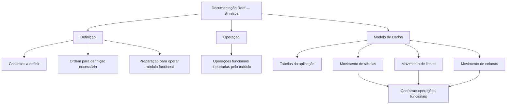

# Documentação Reef — Sinistros

## 1. Metadados do Documento
- **Arquivo de Origem:** Não identificado no conteúdo fornecido
- **Tipo de Documento:** Manual Operacional / Documentação Funcional
- **Domínio / Sistema:** Reef — Sinistros
- **Público-Alvo:** Operação, Negócio, Desenvolvedores e Arquitetos
- **Data/Versão Identificada:** Não identificada

---

## 2. Resumo Executivo & Contexto de Negócio

O documento apresenta a organização da documentação funcional do domínio de **Sinistros** no sistema Reef. A documentação é estruturada para cobrir conceitos necessários à configuração de módulos funcionais, operações funcionais suportadas e elementos do modelo de dados da aplicação.

A seção **Definição** reúne documentos que descrevem os conceitos que devem ser definidos e a sequência necessária para que um módulo funcional esteja preparado para operação. O conteúdo fornecido não detalha quais conceitos, entidades ou módulos específicos devem ser configurados.

A seção **Operação** concentra documentos relacionados às operações funcionais que o módulo suporta. Não há, no trecho disponível, descrição de fluxos operacionais, usuários responsáveis, condições de entrada ou resultados das operações.

A seção **Modelo de Dados** é orientada às tabelas da aplicação. O documento afirma que essa documentação detalha o movimento de tabelas, linhas e colunas conforme as operações funcionais. Contudo, não são informados nomes de tabelas, campos, tipos de dados, relacionamentos ou regras de persistência.

---

## 3. Arquitetura, Componentes & Tecnologias Envolvidas

Os componentes e áreas explicitamente citados são:

- **Reef:** Sistema ou domínio de documentação referenciado.
- **Sinistros:** Área funcional abordada pela documentação.
- **Definição:** Categoria documental para configuração conceitual de módulos funcionais.
- **Operação:** Categoria documental para operações funcionais suportadas.
- **Modelo de Dados:** Categoria documental relacionada às tabelas da aplicação, linhas e colunas.
- **Mapfredocument:** Elemento exibido na navegação ou identificação documental.
- **Zeus:** Item presente no menu de navegação, sem relação funcional detalhada no conteúdo.
- **VL:** Valor apresentado no campo de ciclo de vida, sem expansão do significado.



**Nota de Análise:** O conteúdo não descreve arquitetura de software, integrações, APIs, microsserviços, protocolos, tecnologias de implementação ou ambientes técnicos.

---

## 4. Regras de Negócio, Especificações Funcionais & Processos

### Estrutura documental do domínio de Sinistros

1. A documentação de Sinistros aborda aspectos relacionados à funcionalidade do sistema.
2. As informações são divididas em três grupos:
   - Definição;
   - Operação;
   - Modelo de Dados.
3. A documentação de **Definição** deve apresentar:
   - conceitos que precisam ser definidos;
   - a ordem a ser seguida para atingir a definição necessária;
   - condições documentais para permitir a operação de um módulo funcional.
4. A documentação de **Operação** deve reunir operações funcionais suportadas pelo módulo.
5. A documentação de **Modelo de Dados** deve ser orientada às tabelas da aplicação.
6. A documentação de Modelo de Dados também deve detalhar os movimentos de:
   - tabelas;
   - linhas;
   - colunas.
7. Os movimentos de tabelas, linhas e colunas devem ser analisados em função das operações funcionais.

**Nota de Análise:** O documento não fornece regras condicionais detalhadas, critérios de validação, cálculos, estados, exceções, contratos de interface ou procedimentos operacionais passo a passo.

---

## 5. Tabelas de Parâmetros, Ambientes e Estruturas de Dados

| Item / Parâmetro | Descrição / Função | Tipo / Valores / Formato | Ambiente / Observações |
| :--- | :--- | :--- | :--- |
| Documentação Reef — Sinistros | Área documental relacionada à funcionalidade do sistema no domínio de Sinistros | Documentação funcional | Não há ambiente técnico identificado |
| Definição | Documentos sobre conceitos a definir e a ordem necessária para permitir a operação de um módulo funcional | Categoria documental | Não há conceitos específicos descritos |
| Operação | Documentos relacionados às operações funcionais suportadas pelo módulo | Categoria documental | Não há operações específicas descritas |
| Modelo de Dados | Documentação orientada às tabelas da aplicação | Categoria documental / dados | Não há tabelas ou campos identificados |
| Tabelas | Elementos da aplicação abordados pelo Modelo de Dados | Estrutura de dados | Nomes não informados |
| Linhas | Elementos cujo movimento é descrito em relação às operações funcionais | Estrutura de dados | Regras de movimentação não informadas |
| Colunas | Elementos cujo movimento é descrito em relação às operações funcionais | Estrutura de dados | Campos, tipos e valores não informados |
| Owner | Proprietário exibido na página documental | `user:agonzalez_mapfre.com` | Identificador apresentado literalmente no conteúdo |
| Lifecycle | Campo de ciclo de vida exibido na página documental | `VL` | Significado de `VL` não detalhado |
| Idioma | Idioma exibido na navegação | `ES` | O conteúdo bruto está em espanhol |

---

## 6. Bateria de Perguntas & Respostas para RAG (FAQ Sintético)

### P1: Qual é o objetivo da documentação de Sinistros no Reef?
**R:** A documentação de Sinistros no Reef aborda aspectos relacionados à funcionalidade do sistema. Ela organiza as informações em Definição, Operação e Modelo de Dados.

### P2: Quais são as divisões da documentação de Sinistros?
**R:** A documentação é dividida em três apartados: Definição, Operação e Modelo de Dados.

### P3: O que a seção Definição documenta?
**R:** A seção Definição contém documentos que detalham os conceitos que devem ser definidos e a ordem que deve ser seguida para alcançar a definição necessária para operar um módulo funcional.

### P4: O documento informa quais conceitos devem ser configurados na seção Definição?
**R:** Não. O documento informa que existem conceitos a definir, mas não identifica esses conceitos, entidades, parâmetros ou módulos funcionais específicos.

### P5: Qual é o escopo da seção Operação?
**R:** A seção Operação reúne documentos relacionados às operações funcionais suportadas pelo módulo.

### P6: Quais operações funcionais o módulo de Sinistros suporta?
**R:** O conteúdo fornecido não lista operações funcionais específicas. Ele apenas afirma que a documentação de Operação trata das operações suportadas pelo módulo.

### P7: O que é coberto pela documentação de Modelo de Dados?
**R:** A documentação de Modelo de Dados é orientada às tabelas da aplicação e descreve com detalhe o movimento de tabelas, linhas e colunas de acordo com as operações funcionais.

### P8: O documento apresenta nomes de tabelas, campos ou tipos de dados?
**R:** Não. O conteúdo descreve o objetivo da documentação de Modelo de Dados, mas não apresenta nomes de tabelas, colunas, tipos, chaves ou relacionamentos.

### P9: Como os movimentos de tabelas, linhas e colunas são contextualizados?
**R:** Os movimentos de tabelas, linhas e colunas são descritos considerando as operações funcionais realizadas pelo módulo.

### P10: Há informações sobre APIs, microsserviços ou integrações do Reef?
**R:** Não. O conteúdo não descreve APIs, métodos HTTP, contratos JSON, microsserviços, integrações, URLs ou tecnologias de comunicação.

### P11: Quem aparece como proprietário da documentação?
**R:** O campo Owner apresenta o valor `user:agonzalez_mapfre.com`.

### P12: Qual é o ciclo de vida identificado na página documental?
**R:** O campo Lifecycle apresenta o valor `VL`. O significado da sigla ou valor `VL` não é detalhado no conteúdo fornecido.

---

## 7. Glossário de Termos, Siglas & Conceitos-Chave

- **Reef:** Sistema ou contexto documental mencionado no conteúdo.
- **Sinistros:** Domínio funcional tratado pela documentação.
- **Definição:** Categoria de documentos destinada a descrever conceitos a configurar e sua ordem de definição para operação de módulos funcionais.
- **Operação:** Categoria de documentos referente às operações funcionais suportadas por um módulo.
- **Modelo de Dados:** Categoria documental voltada às tabelas da aplicação e ao movimento de tabelas, linhas e colunas.
- **Módulo Funcional:** Módulo que pode ser operado após a definição necessária dos conceitos correspondentes.
- **VL:** Valor apresentado no campo Lifecycle; significado não identificado no conteúdo.
- **ES:** Indicador de idioma apresentado na navegação; corresponde ao contexto em espanhol exibido no documento.

---

## 8. Notas Críticas, Riscos & Limitações

- O arquivo de origem, a data e a versão do documento não foram identificados no conteúdo fornecido.
- O conteúdo é introdutório e não detalha configurações, regras de negócio específicas, telas, usuários, permissões ou procedimentos operacionais.
- Não foram fornecidos nomes de módulos funcionais, operações, tabelas, linhas, colunas ou atributos de dados.
- Não há evidências de APIs, endpoints, contratos de integração, tecnologias, servidores, URLs, portas, logs ou ambientes.
- O significado do campo de ciclo de vida `VL` não é explicado.
- Os itens de navegação como **Zeus**, **Cloud**, **APIs**, **Componentes** e **Mapfredocument** aparecem no conteúdo bruto, mas suas relações com Sinistros não são detalhadas.
- **Nota de Análise:** O documento lista categorias de documentação, porém não detalha os conteúdos técnicos e funcionais internos de cada categoria.

---

## 9. Conteúdo Bruto Estruturado (Referência Fiel)

```text
--- [PÁGINA 1 DE 1] ---

DOCUMENTACIÓN - SINIESTROS
En este apartado se aborda todo aquello relacionado con la funcionalidad del sistema. La información se encuentra dividida en los apartados
siguientes:
Denición
Operación
Modelo de datos
DEFINICIÓN
Documentos que detallan aquellos conceptos que se han de denir y el orden que se ha de seguir para conseguir la denición necesaria con
lo que poder operar un módulo funcional.
OPERACIÓN
Documentos relacionados con las operaciones funcionales que el módulo soporta.
MODELO DE DATOS
Documentación orientada hacia las tablas de la aplicación. Adicionalmente, se describe con detalle el movimiento de distintos elementos
como tablas, las y columnas atendiendo a las operaciones funcionales.
Documentation / DOCUMENTACIÓN Reef
DOCUMENTACIÓN Reef
Mapfredocument
DOCUMENTACIÓN Reef
Owner
user:agonzalez_mapfre.com
Lifecycle
Approved Source
 / 
 VL
Buscar Inicio Soluciones Arquitecturas APIs Componentes Cloud Documentación Zeus Reef Ayuda
ES
```
