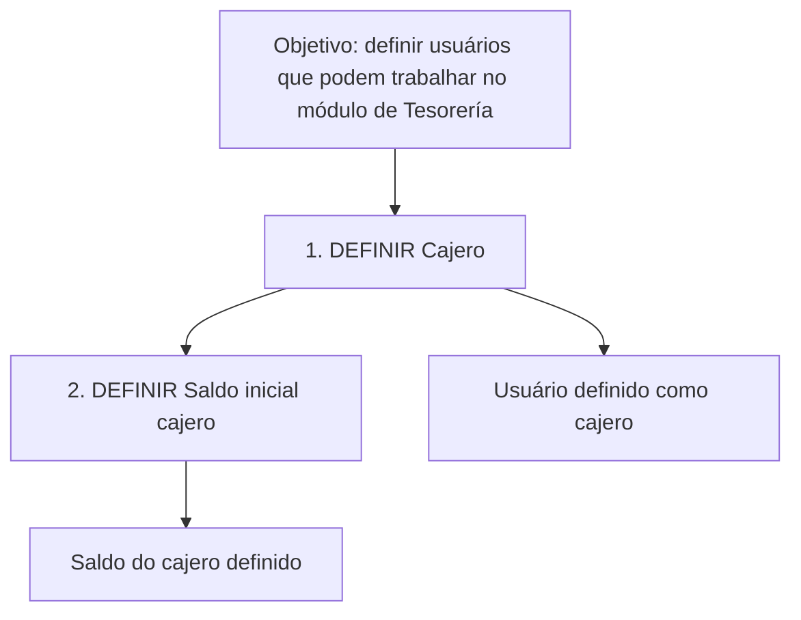

# Definição de Cajero — Usuários e Saldo Inicial no Módulo de Tesorería

## 1. Metadados do Documento
- **Arquivo de Origem:** Não identificado no conteúdo fornecido.
- **Tipo de Documento:** Procedimento / Documentação funcional.
- **Domínio / Sistema:** Reef / módulo de Tesorería / Mapfre.
- **Público-Alvo:** Usuários do sistema, analistas funcionais e equipes de operação do módulo de Tesorería.
- **Data/Versão Identificada:** Não identificada.
- **Status identificado:** `Approved Source`.
- **Owner identificado:** `user:agonzalez_mapfre.com`.
- **Idioma predominante:** Espanhol, com elementos de interface em português.

---

## 2. Resumo Executivo & Contexto de Negócio

O documento apresenta um procedimento denominado **“DEFINICIÓN de cajero”**, associado ao sistema **Reef** e ao módulo de **Tesorería**. O objetivo explicitamente declarado é definir os usuários do sistema que podem trabalhar com o módulo de Tesorería.

O procedimento é composto por duas definições sequenciais: **DEFINIR Cajero** e **DEFINIR Saldo cajero**. A primeira definição é identificada como “DEFINIR Cajero”; a segunda é descrita como “DEFINIR Saldo inicial cajero”, indicando que o processo cobre tanto a identificação do usuário como cajero quanto a definição de seu saldo inicial.

O conteúdo contém referências de navegação e classificação documental do ambiente Reef, incluindo “Documentación”, “Zeus”, “Reef”, “Ayuda”, “Soluciones”, “Arquitecturas”, “APIs”, “Componentes” e “Cloud”. Essas referências demonstram que o procedimento está publicado em um repositório ou portal de documentação corporativa.

Não há detalhes no conteúdo fornecido sobre telas, campos obrigatórios, permissões específicas, critérios de validação, métodos de cálculo do saldo, trilha de auditoria, integrações ou tratamento de erros. O documento somente estabelece o objetivo e a sequência de alto nível para definir cajeros e seus saldos iniciais.

---

## 3. Arquitetura, Componentes & Tecnologias Envolvidas

Os componentes e contextos explicitamente citados são:

| Componente / Termo | Papel identificado no conteúdo |
| :--- | :--- |
| Reef | Sistema ou área de documentação associada ao procedimento. |
| Módulo de Tesorería | Módulo no qual usuários definidos como cajero podem trabalhar. |
| Cajero | Usuário do sistema definido para atuar no módulo de Tesorería. |
| Saldo cajero | Saldo associado ao cajero. |
| Saldo inicial cajero | Etapa de definição inicial do saldo do cajero. |
| Mapfre | Referência organizacional presente em `Mapfredocument`. |
| Zeus | Item presente na navegação da documentação. |
| Documentación Reef | Área ou classificação de documentação exibida no conteúdo. |

O fluxo funcional explicitamente apresentado é:



> **Nota de Análise:** O conteúdo não descreve arquitetura técnica, microsserviços, APIs, bancos de dados, protocolos, ambientes, tecnologias de implementação ou contratos de integração. O diagrama representa exclusivamente a sequência funcional declarada.

---

## 4. Regras de Negócio, Especificações Funcionais & Processos

### Objetivo funcional declarado

A finalidade do procedimento é realizar a:

> “Definición de los usuarios del sistema que pueden trabajar con el módulo de Tesorería.”

Em termos funcionais, o documento estabelece que existem usuários do sistema habilitados para trabalhar no módulo de Tesorería, e que esses usuários devem ser definidos como **cajero**.

### Processo apresentado

O conteúdo enumera duas etapas:

1. **DEFINIR Cajero**
2. **DEFINIR Saldo cajero**

A segunda etapa também é apresentada como:

> “DEFINIR Saldo inicial cajero”

### Sequência operacional identificada

| Ordem | Etapa | Resultado explicitamente indicado |
| :--- | :--- | :--- |
| 1 | DEFINIR Cajero | Definição do cajero, relacionado aos usuários que podem trabalhar com Tesorería. |
| 2 | DEFINIR Saldo cajero / DEFINIR Saldo inicial cajero | Definição do saldo inicial associado ao cajero. |

### Regras e restrições identificadas

- O documento associa a definição de cajero à habilitação de usuários para trabalho no módulo de Tesorería.
- O documento apresenta a definição de saldo do cajero após a definição do cajero.
- O texto utiliza as expressões “Saldo cajero” e “Saldo inicial cajero”; não informa se ambas representam o mesmo atributo, processos distintos ou nomenclaturas alternativas.
- O texto não especifica valores monetários, moeda, limites, regras de cálculo, critérios para alteração do saldo, validações ou aprovações.
- O texto não detalha os atributos que identificam um usuário, um cajero ou um saldo.
- O texto não apresenta condições de entrada, pré-requisitos, saídas técnicas ou fluxos de exceção.

> **Nota de Análise:** O documento lista as etapas “DEFINIR Cajero” e “DEFINIR Saldo inicial cajero”, mas não detalha telas, operações, permissões, campos, métodos de cálculo ou validações aplicáveis a essas etapas.

---

## 5. Tabelas de Parâmetros, Ambientes e Estruturas de Dados

### Entidades e conceitos funcionais

| Item / Parâmetro | Descrição / Função | Tipo / Valores / Formato | Ambiente / Observações |
| :--- | :--- | :--- | :--- |
| Cajero | Usuário do sistema que pode trabalhar com o módulo de Tesorería. | Não especificado. | Associado ao processo “DEFINIR Cajero”. |
| Saldo cajero | Saldo relacionado ao cajero. | Não especificado. | Citado como segunda etapa do processo. |
| Saldo inicial cajero | Saldo inicial a ser definido para o cajero. | Não especificado. | Citado na seção “2. DEFINIR Saldo inicial cajero”. |
| Usuários do sistema | Usuários que podem trabalhar com o módulo de Tesorería. | Não especificado. | O documento não informa identificadores, perfis ou permissões. |
| Módulo de Tesorería | Módulo funcional no qual os usuários definidos podem trabalhar. | Não especificado. | Não há descrição de funcionalidades internas. |

### Identificadores documentais e de navegação

| Item / Parâmetro | Descrição / Função | Tipo / Valores / Formato | Ambiente / Observações |
| :--- | :--- | :--- | :--- |
| Owner | Responsável identificado pelo conteúdo. | `user:agonzalez_mapfre.com` | Valor exibido no documento. |
| Lifecycle | Estado do ciclo de vida da documentação. | `Approved Source` | Valor exibido no documento. |
| Documentación Reef | Referência à documentação Reef. | Texto de navegação/classificação. | Repetida no conteúdo. |
| Mapfredocument | Referência documental associada a Mapfre. | Texto literal. | Não há detalhamento adicional. |
| VL | Texto exibido junto a `Approved Source`. | `VL` | Significado não especificado. |
| ES | Código exibido na interface. | `ES` | Possível indicador de idioma, mas o documento não confirma esse significado. |
| Buscar | Item de interface. | Texto literal. | Não há detalhamento adicional. |
| Inicio | Item de interface. | Texto literal. | Não há detalhamento adicional. |
| Soluciones | Item de navegação. | Texto literal. | Não há detalhamento adicional. |
| Arquitecturas | Item de navegação. | Texto literal. | Não há detalhamento adicional. |
| APIs | Item de navegação. | Texto literal. | Não há APIs especificadas. |
| Componentes | Item de navegação. | Texto literal. | Não há componentes técnicos especificados. |
| Cloud | Item de navegação. | Texto literal. | Não há ambiente cloud especificado. |
| Ayuda | Item de navegação. | Texto literal. | Não há detalhamento adicional. |

### Ambientes, URLs, logs e servidores

| Item / Parâmetro | Descrição / Função | Tipo / Valores / Formato | Ambiente / Observações |
| :--- | :--- | :--- | :--- |
| URLs | Não identificadas. | Não aplicável. | O conteúdo não informa endereços. |
| Servidores | Não identificados. | Não aplicável. | O conteúdo não informa nomes, IPs ou hosts. |
| Ambientes | Não identificados. | Não aplicável. | Não há distinção entre desenvolvimento, homologação ou produção. |
| Rotas de logs | Não identificadas. | Não aplicável. | O conteúdo não informa caminhos ou ferramentas de observabilidade. |
| APIs / contratos | Não detalhados. | Não aplicável. | “APIs” aparece somente como item de navegação. |

---

## 6. Bateria de Perguntas & Respostas para RAG (FAQ Sintético)

### P1: Qual é o objetivo do procedimento “DEFINICIÓN de cajero”?
**R:** O objetivo do procedimento é definir os usuários do sistema que podem trabalhar com o módulo de Tesorería. O documento relaciona essa habilitação à definição de um cajero.

### P2: Quais etapas são apresentadas para a definição de cajero?
**R:** O documento apresenta duas etapas: primeiro, “DEFINIR Cajero”; segundo, “DEFINIR Saldo cajero”. A segunda etapa também aparece descrita como “DEFINIR Saldo inicial cajero”.

### P3: Qual etapa deve ocorrer antes da definição do saldo inicial do cajero?
**R:** A etapa “DEFINIR Cajero” aparece como a primeira etapa do processo. A definição de “Saldo cajero” ou “Saldo inicial cajero” aparece como a segunda etapa.

### P4: O documento informa quais campos devem ser preenchidos para definir um cajero?
**R:** Não. O conteúdo somente indica a etapa “DEFINIR Cajero” e o objetivo de definir usuários que podem trabalhar com Tesorería. Não há lista de campos, telas, formatos ou validações.

### P5: O documento explica como calcular o saldo inicial do cajero?
**R:** Não. O documento menciona “DEFINIR Saldo inicial cajero”, mas não descreve fórmula, moeda, limites, critérios de cálculo, origem dos valores ou regras de aprovação.

### P6: Qual sistema ou domínio é mencionado no documento?
**R:** O conteúdo cita Reef, “DOCUMENTACIÓN Reef”, o módulo de Tesorería, Mapfre por meio de `Mapfredocument` e Zeus como item de navegação. O texto não detalha a relação técnica entre esses elementos.

### P7: Quem é o owner identificado no documento?
**R:** O owner exibido no conteúdo é `user:agonzalez_mapfre.com`.

### P8: Qual é o status de ciclo de vida identificado na documentação?
**R:** O campo “Lifecycle” apresenta o valor `Approved Source`.

### P9: O documento fornece URLs, nomes de servidores ou ambientes de implantação?
**R:** Não. O conteúdo não apresenta URLs, servidores, endereços IP, portas, rotas de logs ou identificação de ambientes como desenvolvimento, homologação ou produção.

### P10: Existem APIs ou integrações descritas para o processo de definição de cajero?
**R:** Não. Embora “APIs” apareça como item de navegação, o documento não descreve endpoints, métodos HTTP, contratos, integrações ou troca de dados.

### P11: O termo “Saldo cajero” é diferente de “Saldo inicial cajero”?
**R:** O conteúdo apresenta “Saldo cajero” nos passos gerais e “Saldo inicial cajero” na enumeração da segunda etapa. O documento não esclarece se os termos são sinônimos ou se representam conceitos funcionais distintos.

### P12: Quais restrições operacionais são documentadas para um cajero?
**R:** A única condição funcional explicitamente apresentada é que o cajero está relacionado aos usuários do sistema que podem trabalhar com o módulo de Tesorería. Não são informadas restrições adicionais, perfis, alçadas ou matrizes de permissão.

---

## 7. Glossário de Termos, Siglas & Conceitos-Chave

- **Cajero:** Usuário do sistema definido para poder trabalhar com o módulo de Tesorería, conforme o objetivo declarado no documento.
- **Saldo cajero:** Saldo associado ao cajero, mencionado como segunda etapa do processo.
- **Saldo inicial cajero:** Saldo inicial do cajero, mencionado na segunda definição do procedimento.
- **Tesorería:** Módulo citado como o contexto no qual determinados usuários podem trabalhar.
- **Reef:** Sistema, domínio ou área de documentação citada no conteúdo como “Documentation / DOCUMENTACIÓN Reef”.
- **Mapfre:** Referência organizacional presente no texto `Mapfredocument`.
- **Zeus:** Item de navegação presente no conteúdo; o documento não define seu papel.
- **API:** Sigla exibida no item de navegação “APIs”; não há definição ou interface de programação descrita.
- **Cloud:** Item de navegação exibido; não há provedor, arquitetura ou ambiente cloud descrito.
- **Lifecycle:** Campo de ciclo de vida documental cujo valor apresentado é `Approved Source`.
- **Owner:** Campo que identifica o responsável pelo documento, com o valor `user:agonzalez_mapfre.com`.
- **VL:** Sigla ou código exibido junto a `Approved Source`; o significado não é definido no conteúdo.
- **ES:** Código exibido na interface; o documento não declara formalmente seu significado.

---

## 8. Notas Críticas, Riscos & Limitações

- O conteúdo é resumido e não contém detalhamento operacional suficiente para executar o procedimento de definição de cajero sem acesso ao sistema ou a documentação complementar.
- Não há especificação de campos, telas, parâmetros, regras de validação, mensagens de erro, trilhas de auditoria ou critérios de aprovação.
- Não há informação sobre como identificar os usuários do sistema, como conceder ou remover a capacidade de trabalhar no módulo de Tesorería, ou quais permissões são necessárias.
- Não há definição técnica de “Saldo cajero” e “Saldo inicial cajero”, nem indicação sobre moeda, valores permitidos, cálculo, saldo negativo ou processos de ajuste.
- Não são identificados ambientes, URLs, servidores, bancos de dados, integrações, APIs, logs ou mecanismos de monitoramento.
- O termo `Denición` contém um caractere não textual ou corrompido entre “De” e “nición”. A transcrição foi preservada fielmente no conteúdo bruto.
- Os itens “Zeus”, “APIs”, “Componentes” e “Cloud” aparecem somente como elementos de navegação; não devem ser interpretados como tecnologias efetivamente utilizadas pelo processo.
- O valor `VL` é apresentado no documento, mas seu significado não é informado.

---

## 9. Conteúdo Bruto Estruturado (Referência Fiel)

```text
--- [PÁGINA 1 DE 1] ---

DEFINICIÓN de cajero
Objetivo
Denición de los usuarios del sistema que pueden trabajar con el módulo de Tesorería.
Pasos a seguir
DEFINIR
Cajero
(1)
DEFINIR
Saldo cajero
(2)
1. DEFINIR Cajero
2. DEFINIR Saldo inicial cajero
Documentation / DOCUMENTACIÓN Reef
DOCUMENTACIÓN Reef
Mapfredocument
DOCUMENTACIÓN Reef
Owner
user:agonzalez_mapfre.com
Lifecycle
Approved Source
 / 
 VL
Buscar Inicio Soluciones Arquitecturas APIs Componentes Cloud Documentación Zeus Reef Ayuda
ES
```
