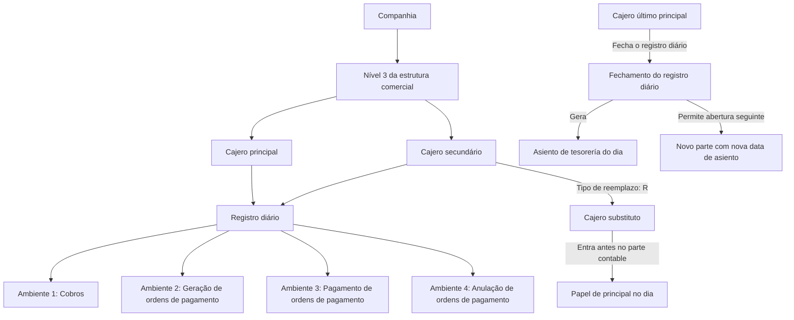

# Definição de Cajero no Reef: Perfis, Acessos, Estado e Auditoria do Registro Diário

## 1. Metadados do Documento
- **Arquivo de Origem:** Não identificado no conteúdo extraído
- **Tipo de Documento:** Especificação Técnica / Manual Funcional
- **Domínio / Sistema:** Reef — operações de tesouraria e contabilização
- **Público-Alvo:** Desenvolvedores, Arquitetos, Operação e Negócio
- **Data/Versão Identificada:** Não identificada

---

## 2. Resumo Executivo & Contexto de Negócio

O documento define o conceito de **cajero** no sistema Reef. O objetivo declarado é identificar os usuários da aplicação autorizados a acessar operações de tesouraria e realizar a respetiva contabilização no registro diário.

A definição do cajero é estruturada em quatro grupos de propriedades: propriedades gerais, propriedades de acesso a ambientes, propriedades de estado do cajero e propriedades de auditoria. Essas propriedades determinam a identidade do cajero, sua posição na estrutura comercial, as funções autorizadas, a capacidade de substituição de um cajero principal, o estado operacional e o histórico de habilitação.

O modelo funcional diferencia cajeros principais e secundários. Para cada terceiro nível da estrutura comercial, deve existir um cajero principal e tantos cajeros secundários quanto forem necessários. O cajero principal é o único perfil que pode fechar o registro diário, embora um cajero secundário configurado como substituto possa assumir o papel principal no dia se acessar o parte contable antes do principal da oficina comercial.

O fechamento do registro diário possui dependências corporativas: todos os cajeros da companhia devem ter fechado seus movimentos e devem estar quadrados. O cajero marcado como último principal é responsável pelo fechamento final do registro diário e pela geração do asiento de tesorería do dia. Após o fechamento do parte contable, somente o cajero último principal pode abrir o próximo parte, utilizando a nova data de asiento.

---

## 3. Arquitetura, Componentes & Tecnologias Envolvidas

O conteúdo descreve o domínio funcional do **Reef**, especificamente a gestão de cajeros vinculados a operações de tesouraria, registro diário, parte contable, cobranças e ordens de pagamento.

### Componentes e conceitos identificados

| Componente / Conceito | Descrição sustentada pelo documento |
| :--- | :--- |
| Reef | Sistema ou domínio documental no qual está definida a configuração de cajeros. |
| Cajero | Usuário da aplicação que pode receber acesso a operações de tesouraria e à contabilização dessas operações. |
| Companhia | Entidade identificada por uma chave para a qual o cajero pode trabalhar. |
| Estrutura comercial | Estrutura organizacional com, no mínimo, referências aos níveis 2 e 3. |
| Nível 3 da estrutura comercial | Unidade organizacional à qual o cajero pertence; também há referência a um cajero principal por nível 3. |
| Registro diário | Registro operacional no qual o cajero atua por ambientes. |
| Parte contable | Parte associado às operações do cajero; possui regras de entrada, fechamento, quadratura e abertura posterior. |
| Asiento de tesorería | Lançamento de tesouraria gerado pelo cajero último principal no fechamento do registro diário. |
| Ambiente 1 | Ambiente do registro diário destinado a cobros. |
| Ambiente 2 | Ambiente do registro diário destinado à geração de ordens de pagamento. |
| Ambiente 3 | Ambiente do registro diário destinado ao pagamento de ordens de pagamento. |
| Ambiente 4 | Ambiente do registro diário destinado à anulação de ordens de pagamento. |
| Ordem de pagamento | Ordem que pode ser gerada, paga diretamente quando autorizado ou anulada conforme os ambientes habilitados. |
| Cobranza | Operação de cobrança; pode envolver alteração de fecha de valor para obtenção de tipo de cambio em moeda estrangeira. |
| Oficina central contábil | Nível 3 identificado em cada país como oficina central a nível contábil. |
| Processos automáticos de cobro | Processos que podem utilizar um cajero identificado como externo. |



**Nota de Análise:** O documento descreve propriedades funcionais, regras de autorização e fluxo de fechamento. O conteúdo não detalha tecnologias de implementação, métodos HTTP, contratos JSON, bancos de dados, URLs, servidores, versões ou integrações técnicas.

---

## 4. Regras de Negócio, Especificações Funcionais & Processos

### 4.1. Objetivo do cadastro de cajero

O cajero identifica usuários da aplicação que poderão acessar operações de tesouraria e sua contabilização.

### 4.2. Tipos de cajero

O atributo **Tipo de cajero** identifica como o cajero pode atuar na aplicação:

- **P — Cajero principal**
- **S — Cajero secundário**

Para cada terceiro nível da estrutura comercial, deve existir:

1. Um cajero principal.
2. Tantos cajeros secundários quanto forem necessários.

O cajero principal é o único cajero que pode fechar o registro diário.

### 4.3. Regras de substituição do cajero principal

O atributo **Tipo de reemplazo** informa se o cajero pode substituir o cajero principal:

- **P — Principal:** valor que somente pode ser indicado quando o cajero é principal.
- **R — Reemplazante:** valor atribuído a cajeros secundários que podem substituir o cajero principal.
- **Sem valor:** indica que o cajero não pode substituir o cajero principal.

Quando um cajero secundário configurado como reemplazante entra no parte contable antes do cajero principal da oficina comercial, o cajero secundário assume o papel de cajero principal naquele dia.

### 4.4. Regras de fechamento do registro diário

Pode existir mais de um cajero principal dentro da mesma companhia, pois há um cajero principal para cada nível 3 da estrutura comercial.

O atributo **Último** identifica qual cajero principal é o último principal da companhia. Esse cajero é responsável por:

1. Fechar o registro diário.
2. Gerar o asiento de tesorería do dia.

Para permitir o fechamento do registro diário:

1. Todos os cajeros da companhia devem ter fechado.
2. Todos os cajeros da companhia devem estar cuadrados.

Após o fechamento do parte contable:

1. O próximo parte somente pode ser aberto pelo cajero último principal.
2. O novo parte deve utilizar a nova fecha de asiento.

### 4.5. Consulta por estrutura comercial

O atributo **Principal de nivel 2** identifica se um cajero é principal para o nível 2 da estrutura comercial.

Um cajero principal de nível 2 pode consultar movimentos dos cajeros de todos os níveis 3 pertencentes à sua estrutura comercial.

### 4.6. Regras para cobranças em moeda estrangeira

O atributo **Fecha de valor** indica se o cajero pode modificar a data dos cobros durante operações de cobranza.

A finalidade descrita para essa modificação é obter o tipo de cambio em cobros realizados em moeda estrangeira.

### 4.7. Regras para cajero central

O atributo **Cajero central** identifica se o cajero pertence ao nível 3 da estrutura comercial reconhecido por cada país como oficina central em nível contábil.

Um cajero central pode pagar qualquer tipo de ordem de pagamento, incluindo:

- Ordens de pagamento de siniestros.
- Ordens de pagamento de tesorería.
- Ordens de pagamento de agente.
- Outros tipos, conforme indicado pela expressão “etc.” no documento.

### 4.8. Regras de pagamento direto e transferências

- **Pago directo:** autoriza o cajero a realizar o pagamento diretamente a partir da geração da ordem de pagamento.
- **Traspasos de caja a banco:** autoriza o cajero a realizar transferências de tesouraria de caixa para banco.
- **Externo:** identifica o cajero utilizado em processos automáticos de cobro.

### 4.9. Regras de acesso aos ambientes do registro diário

O acesso aos ambientes é controlado individualmente por cajero:

1. **Entorno 1:** operação no ambiente de cobros.
2. **Entorno 2:** operação no ambiente de geração de ordens de pagamento.
3. **Entorno 3:** operação no ambiente de pagamento de ordens de pagamento.
4. **Entorno 4:** operação no ambiente de anulação de ordens de pagamento.

### 4.10. Regras de estado operacional

- **Activo:** informa se o cajero está trabalhando com o registro diário. O estado ativo indica que está trabalhando; o estado não ativo indica que não está trabalhando.
- **Cuadrado:** informa se todos os apuntes realizados pelo cajero no parte contable estão quadrados.
- O atributo **Cuadrado** é atualizado em cada fechamento.
- A atualização de **Cuadrado** verifica se não existe diferença entre o saldo acreedor e o saldo deudor de todas as operações realizadas pelo cajero no parte contable.
- **Entorno:** armazena o código do último ambiente do registro diário em que o cajero trabalhou. Esse atributo é atualizado nos processos do registro diário.
- Os atributos de último número de operação são atualizados nos processos do registro diário.

### 4.11. Regras de auditoria e habilitação

- **Inhabilitado:** informa se o cajero está habilitado para trabalhar.
- Um cajero inhabilitado não pode acessar o registro diário de operações.
- **Fecha de alta:** informa a data em que o usuário da aplicação foi identificado como cajero.
- **Fecha de baja:** informa o momento em que o cajero foi inabilitado.
- **Observaciones:** armazena comentários incluídos durante a inabilitação; normalmente é utilizado para indicar o motivo da inabilitação.

---

## 5. Tabelas de Parâmetros, Ambientes e Estruturas de Dados

| Item / Parâmetro | Descrição / Função | Tipo / Valores / Formato | Ambiente / Observações |
| :--- | :--- | :--- | :--- |
| Compañía | Chave que identifica a companhia para a qual o cajero pode trabalhar. | Chave não detalhada | Propriedade geral. |
| Cajero | Chave que identifica o usuário da aplicação. | Chave não detalhada | Propriedade geral. |
| Nombre del cajero | Nome do cajero. Pode manter o nome criado para o usuário ou receber nome específico para identificar o cajero. | Texto | Propriedade geral. |
| Tipo de cajero | Define como o cajero atua na aplicação. | P = principal; S = secundário | Deve existir um principal por nível 3 e tantos secundários quanto necessário. |
| Tipo de reemplazo | Define se o cajero pode substituir o cajero principal. | P = principal; R = reemplazante; sem valor = não substitui | P somente pode ser informado para cajero principal. R é destinado a cajero secundário substituto. |
| Último | Indica se o cajero é o último principal da companhia. | Indicador não detalhado | Último principal fecha o registro diário e gera o asiento de tesorería do dia. |
| Principal de nivel 2 | Indica se o cajero é principal no nível 2 da estrutura comercial. | Indicador não detalhado | Permite consultar movimentos dos cajeros de todos os níveis 3 da estrutura comercial. |
| Fecha de valor | Indica se o cajero pode modificar a data dos cobros. | Indicador não detalhado | Usado em cobranza para obter tipo de cambio em moeda estrangeira. |
| Cajero central | Indica pertencimento à oficina central contábil do país. | Indicador não detalhado | Pode pagar qualquer tipo de ordem de pagamento. |
| Pago directo | Indica autorização de pagamento direto. | Indicador não detalhado | Permite pagar diretamente a partir da geração da ordem de pagamento. |
| Nivel 3 de la estructura comercial | Código do nível 3 da estrutura comercial ao qual o cajero pertence. | Código não detalhado | Associado ao usuário quando este é criado na aplicação. |
| Traspasos de caja a banco | Indica se o cajero pode realizar transferências de tesouraria de caixa para banco. | Indicador não detalhado | Propriedade geral. |
| Externo | Identifica cajero usado em processos automáticos de cobro. | Indicador não detalhado | Propriedade geral. |
| Entorno 1 | Autoriza operação no ambiente 1 do registro diário. | Indicador não detalhado | Cobros. |
| Entorno 2 | Autoriza operação no ambiente 2 do registro diário. | Indicador não detalhado | Geração de ordens de pagamento. |
| Entorno 3 | Autoriza operação no ambiente 3 do registro diário. | Indicador não detalhado | Pagamento de ordens de pagamento. |
| Entorno 4 | Autoriza operação no ambiente 4 do registro diário. | Indicador não detalhado | Anulação de ordens de pagamento. |
| Activo | Indica se o cajero está trabalhando com o registro diário. | Ativo / não ativo | Propriedade de estado. |
| Cuadrado | Indica se os apuntes do cajero no parte contable estão quadrados. | Indicador não detalhado | Atualizado a cada fechamento por validação de saldo acreedor e saldo deudor. |
| Entorno | Código do último ambiente do registro diário em que o cajero trabalhou. | Código não detalhado | Atualizado nos processos do registro diário. |
| Último número de recibo | Último número de transação realizado pelo cajero no ambiente de cobros. | Número de transação | Atualizado nos processos do registro diário. |
| Última orden de pago | Último número de transação realizado pelo cajero no ambiente de pagamento de ordens de pagamento. | Número de transação | Atualizado nos processos do registro diário. |
| Último número de giro | Último número de transação realizado pelo cajero no ambiente de geração de ordens de pagamento. | Número de transação | Atualizado nos processos do registro diário. |
| Último número de anulación | Último número de transação realizado pelo cajero no ambiente de anulação de ordens de pagamento. | Número de transação | Atualizado nos processos do registro diário. |
| Inhabilitado | Indica se o cajero está habilitado para trabalhar. | Indicador não detalhado | Cajero inabilitado não acessa o registro diário de operações. |
| Fecha de alta | Data em que o usuário da aplicação foi identificado como cajero. | Data não detalhada | Propriedade de auditoria. |
| Fecha de baja | Momento em que o cajero foi inabilitado. | Data/hora não detalhada | Propriedade de auditoria. |
| Observaciones | Comentários incluídos ao inabilitar o cajero. | Texto | Normalmente registra o motivo da inabilitação. |

---

## 6. Bateria de Perguntas & Respostas para RAG (FAQ Sintético)

### P1: Qual é o objetivo da definição de cajero no sistema Reef?
**R:** A definição de cajero tem como objetivo identificar os usuários da aplicação que podem acessar operações de tesouraria e a contabilização dessas operações.

### P2: Quais são os tipos de cajero previstos no documento?
**R:** O atributo Tipo de cajero admite os valores P para cajero principal e S para cajero secundário. Para cada terceiro nível da estrutura comercial deve existir um cajero principal e tantos cajeros secundários quanto forem necessários.

### P3: Quem pode fechar o registro diário?
**R:** O cajero principal é o único perfil que pode fechar o registro diário. Entre os cajeros principais da companhia, o cajero marcado como último principal é o responsável pelo fechamento do registro diário e pela geração do asiento de tesorería do dia.

### P4: Em que situação um cajero secundário assume o papel de principal?
**R:** Um cajero secundário pode assumir o papel de principal no dia quando possui o valor R, Reemplazante, no atributo Tipo de reemplazo e entra no parte contable antes do cajero principal da oficina comercial.

### P5: Quais condições devem ser atendidas para fechar o registro diário?
**R:** Para fechar o registro diário, todos os cajeros da companhia devem ter fechado e devem estar cuadrados. O estado Cuadrado é verificado para assegurar que não exista diferença entre saldo acreedor e saldo deudor das operações realizadas pelo cajero no parte contable.

### P6: Quem pode abrir o próximo parte contable após o fechamento?
**R:** Após o fechamento do parte contable, o próximo parte somente pode ser aberto pelo cajero último principal, utilizando a nova fecha de asiento.

### P7: O que autoriza o atributo Fecha de valor?
**R:** O atributo Fecha de valor autoriza o cajero a modificar a data dos cobros durante operações de cobranza. Essa capacidade é utilizada para obter o tipo de cambio em cobros realizados em moeda estrangeira.

### P8: O que um cajero central pode fazer?
**R:** Um cajero central pertence ao nível 3 da estrutura comercial identificado por cada país como oficina central em nível contábil. Esse cajero pode pagar qualquer tipo de ordem de pagamento, incluindo ordens de siniestros, tesorería e agente.

### P9: Quais operações são controladas pelos quatro ambientes do registro diário?
**R:** O Entorno 1 é destinado a cobros; o Entorno 2 à geração de ordens de pagamento; o Entorno 3 ao pagamento de ordens de pagamento; e o Entorno 4 à anulação de ordens de pagamento.

### P10: O que significa um cajero estar cuadrado?
**R:** Um cajero cuadrado possui todos os apuntes realizados no parte contable em equilíbrio. Esse atributo é atualizado a cada fechamento, verificando que não exista diferença entre saldo acreedor e saldo deudor de todas as operações realizadas pelo cajero.

### P11: Um cajero inabilitado pode acessar o registro diário?
**R:** Não. O atributo Inhabilitado indica se o cajero está habilitado para trabalhar, e um cajero inabilitado não pode acessar o registro diário de operações.

### P12: Quais informações de sequência operacional são armazenadas para cada cajero?
**R:** O documento prevê o armazenamento do último número de recibo no ambiente de cobros, da última orden de pago no ambiente de pagamento, do último número de giro no ambiente de geração de ordens de pagamento e do último número de anulación no ambiente de anulação. Todos esses atributos são atualizados nos processos do registro diário.

---

## 7. Glossário de Termos, Siglas & Conceitos-Chave

- **Cajero:** Usuário da aplicação identificado para acessar operações de tesouraria e sua contabilização.
- **Cajero principal:** Cajero do tipo P; é o único perfil que pode fechar o registro diário.
- **Cajero secundario:** Cajero do tipo S; pode ser configurado como reemplazante do cajero principal.
- **Reemplazante:** Cajero secundário que pode substituir o cajero principal.
- **Registro diário:** Registro operacional no qual o cajero trabalha pelos ambientes de cobros, geração, pagamento e anulação de ordens de pagamento.
- **Parte contable:** Parte associado às operações do cajero, sujeito a entrada, fechamento, quadratura e abertura subsequente.
- **Asiento de tesorería:** Lançamento de tesouraria gerado no fechamento do registro diário pelo cajero último principal.
- **Cuadrado:** Estado que indica a inexistência de diferença entre saldo acreedor e saldo deudor das operações do cajero no parte contable.
- **Cobros:** Operações de cobrança realizadas no Entorno 1.
- **Cobranza:** Processo de cobrança no qual a Fecha de valor pode ser alterada para obtenção de tipo de cambio em moeda estrangeira.
- **Orden de pago:** Ordem de pagamento que pode ser gerada, paga ou anulada conforme as permissões de ambiente.
- **Siniestros:** Tipo de ordem de pagamento explicitamente citado entre as operações que podem ser pagas pelo cajero central.
- **Nivel 2:** Nível da estrutura comercial cujo cajero principal pode consultar movimentos dos cajeros de todos os níveis 3 da sua estrutura.
- **Nivel 3:** Nível da estrutura comercial ao qual o cajero pertence e para o qual deve existir um cajero principal.
- **Oficina central:** Nível 3 identificado por cada país como oficina central em nível contábil.
- **Tipo de cambio:** Taxa de câmbio obtida em cobros de moeda estrangeira mediante alteração autorizada da Fecha de valor.
- **Pago directo:** Capacidade de realizar pagamento diretamente a partir da geração da ordem de pagamento.
- **Traspasos de caja a banco:** Transferências de tesouraria de caixa para banco.
- **Externo:** Cajero utilizado para processos automáticos de cobro.

---

## 8. Notas Críticas, Riscos & Limitações

- O fechamento do registro diário depende de todos os cajeros da companhia terem fechado e estarem cuadrados; essa condição pode bloquear o fechamento final enquanto houver pendências de qualquer cajero.
- O cajero último principal concentra a responsabilidade de fechar o registro diário, gerar o asiento de tesorería e abrir o próximo parte contable com a nova fecha de asiento.
- A substituição do cajero principal é condicionada à configuração Reemplazante e à ordem de entrada no parte contable. O documento não detalha mecanismos de controle de concorrência, auditoria específica da substituição ou reversão do papel assumido.
- A permissão de alteração da Fecha de valor afeta cobros em moeda estrangeira para obtenção de tipo de cambio. O documento não detalha limites de data, fonte cambial, critérios de aprovação ou trilha de auditoria dessa alteração.
- O documento não apresenta formatos técnicos, tipos de dados, interfaces, URLs, servidores, tecnologias, mecanismos de autenticação, contratos de integração ou persistência dos atributos.
- O documento referencia vínculos para definição de companhia, estrutura comercial, usuários da aplicação e perguntas frequentes, mas o conteúdo desses documentos relacionados não foi fornecido.

---

## 9. Conteúdo Bruto Estruturado (Referência Fiel)

```text
--- [PÁGINA 1 DE 4] ---

DEFINICIÓN de cajero
Objetivo
Identicar los usuarios de la aplicación que podrán tener acceso a las operaciones de tesorería y su contabilización.
Propiedades generales
Propiedades de acceso a entornos
Propiedades del estado del cajero
Propiedades de auditoría
Propiedades Generales
Compañía
Este atributo contiene la clave que identica la compañía para la que puede trabajar el cajero.
Cajero
Este atributo contiene la clave con la que se identica el usuario de la aplicación.
Nombre del cajero
Este atributo contiene el nombre del cajero, puede mantenerse el mismo nombre con el que se creó el usuario al darle de alta en la aplicación,
o pude indicarse un nombre especíco para identicar al cajero.
Tipo de cajero
Este atributo identica como puede actuar el cajero en la aplicación, pudiendo ser:
P: Cajero principal
S: Cajero secundario
Por cada tercer nivel de la estructura comercial, debe existir un cajero principal y tantos secundarios como sea necesario.
El cajero principal es el único que puede cerrar el registro diario.
Tipo de reemplazo
Este atributo indica si el cajero puede reemplazar al cajero principal, tomando los valores:
P: Principal
Este valor solamente se podrá indicar cuando el cajero es principal.
Documentation / DOCUMENTACIÓN Reef
DOCUMENTACIÓN Reef
Mapfredocument
DOCUMENTACIÓN Reef
Owner
user:agonzalez_mapfre.com
Lifecycle
Approved Source
 / 
 VL
Buscar Inicio Soluciones Arquitecturas APIs Componentes Cloud Documentación Zeus Reef Ayuda
ES


--- [PÁGINA 2 DE 4] ---

R: Reemplazante
Se dará este valor a los cajeros secundarios que puedan reemplazar al cajero principal.
Sin valor
Indica que el cajero no puede reemplazar al cajero principal.
Si un cajero secundario, que puede ser reemplazante, entra en el parte contable antes que el cajero principal de la ocina comercial, éste
tomará el rol de principal por ese día.
Último
Este atributo indica si el cajero es el último principal de la compañía.
Debido a que puede haber más de un cajero principal dentro de la compañía (uno por cada nivel 3 de la estructura comercial), es necesario
indicar cuál de ellos es el último principal y por lo tanto, será el encargado de cerrar el registro diario, generando el asiento de tesorería del
día.
Para poder cerrar el registro diario, todos los cajeros de la compañía deben haber cerrado y estar cuadrados.
Una vez cerrado el parte contable, el siguiente parte solo lo podrá abrir el cajero último principal con la nueva fecha de asiento.
Principal de nivel 2
Este atributo indica si el cajero es principal para el nivel 2 de la estructura comercial, pudiendo consultar movimientos de los cajeros de todos
los niveles 3 de su estructura comercial.
Fecha de valor
Este atributo indica si el cajero puede modicar la fecha de los cobros, durante las operaciones de cobranza, para obtener el tipo de cambio,
en los cobros en moneda extranjera.
Cajero central
Este atributo indica si el cajero pertenece al nivel 3 de la estructura comercial que cada país tenga identicado como ocina central a nivel
contable. Este cajero podrá pagar cualquier tipo de orden de pago (de siniestros, tesorería, agente, etc.).
Pago directo
Este atributo indica si el cajero puede realizar el pago directamente desde la generación de la orden de pago.
Nivel 3 de la estructura comercial
Este atributo contiene el código del nivel 3 de la estructura comercial al que pertenece el cajero, es el que se le ha asociado cuando se le ha
dado de alta como usuario de la aplicación.
Traspasos de caja a banco
Este atributo indica si el cajero puede hacer traspasos de tesoreria de caja a banco.
Externo
Este atributo identica el cajero que se utiliza para para procesos automáticos de cobro.
Propiedades de Acceso a entornos
Entorno 1
Este atributo indica si el cajero puede operar en el entorno 1 del registro diario (Cobros).
Entorno 2
Este atributo indica si el cajero puede operar en el entorno 2 del registro diario (Generación de órdenes de pago).
Entorno 3
Este atributo indica si el cajero puede operar en el entorno 3 del registro diario (Pago de órdenes de pago).


--- [PÁGINA 3 DE 4] ---

Entorno 4
Este atributo indica si el cajero puede operar en el entorno 4 del registro diario (Anulación de órdenes de pago).
Propiedades de Estado del cajero
Activo
Este atributo indica si el cajero está trabajado con el registro diario (está activo) o no (no está activo).
Cuadrado
Este atributo indica si si todos los apuntes que ha realizados el cajero en el parte contable cuadran.
El valor de este atributo se actualiza en cada cierre, vericando que no exista diferencia entre el saldo acreedor y el saldo deudor de todas las
operaciones realizadas por el cajero en el parte contable.
Entorno
Este atributo contiene el código del último entorno del registro diario en el que ha trabajado el cajero.
Se actualiza en los procesos del registro diario.
Último número de recibo
Este atributo contiene el último número de transacción que ha hecho el cajero en el entorno de cobros.
Se actualiza en los procesos del registro diario.
Última orden de pago
Este atributo contiene el último número de transacción que ha hecho el cajero en el entorno de pago de órdenes de pago.
Se actualiza en los procesos del registro diario.
Último número de giro
Este atributo contiene el último número de transacción que ha hecho el cajero en el entorno de generación de órdenes de pago.
Se actualiza en los procesos del registro diario.
Último número de anulación
Este atributo contiene el último número de transacción que ha hecho el cajero en el entorno de anulación de órdenes de pago.
Se actualiza en los procesos del registro diario.
Propiedades de Auditoría
Inhabilitado
Este atributo indica si el cajero está habilitado o no, para poder trabajar. Un cajero inhabilitado no podrá acceder al registro diario de
operaciones.
Fecha de alta
Este atributo indica la fecha en la que el usuario de la aplicación se ha identicado como cajero.
Fecha de baja
Esta fecha indica el momento en el que se ha inhabilitado el cajero.
Observaciones
Este atributo contiene cualquier comentario que se quiera incluir al inhabilitar el cajero, normalmente se utiliza para indicar el motivo por el
cual se ha inhabilitado.


--- [PÁGINA 4 DE 4] ---

Vínculos
DEFINICION de compañía
DEFINICION de estructura comercial
Denición de usuarios aplicacación
Preguntas frecuentes
```
