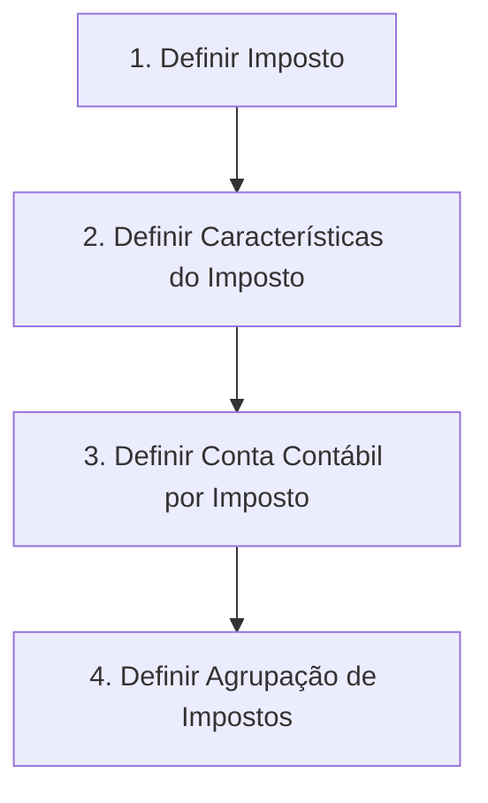

# Definição de Impostos — Documentação Reef

## 1. Metadados do Documento
- **Arquivo de Origem:** Não identificado
- **Tipo de Documento:** Procedimento
- **Domínio / Sistema:** Reef / Mapfre
- **Público-Alvo:** Negócio, Operação e equipes responsáveis pela definição de impostos
- **Data/Versão Identificada:** Não identificada

---

## 2. Resumo Executivo & Contexto de Negócio

O documento descreve o processo de **definição de impostos** no contexto da documentação Reef. O objetivo declarado é estabelecer os tipos de obrigações tributárias que devem ser considerados, incluindo as respectivas características e formas de cálculo.

O fluxo apresentado organiza a definição tributária em quatro etapas sequenciais: definir o imposto, definir as características do imposto, definir a conta contábil por imposto e definir o agrupamento de impostos. Essas etapas indicam que a configuração tributária envolve tanto atributos funcionais quanto tratamento contábil e mecanismos de agrupamento.

O conteúdo disponível é resumido e não apresenta detalhamento sobre regras de cálculo, tipos específicos de impostos, campos de cadastro, critérios de agrupamento, contas contábeis concretas ou responsáveis por cada etapa. Também não há contratos técnicos, APIs, integrações, URLs de ambiente ou instruções operacionais detalhadas.

A documentação está identificada visualmente como documentação Reef e apresenta referências a Mapfre e Mapfredocument. O ciclo de vida exibido é **Approved Source**, com proprietário identificado como `user:agonzalez_mapfre.com`.

---

## 3. Arquitetura, Componentes & Tecnologias Envolvidas

O documento não descreve uma arquitetura de software, componentes técnicos, microsserviços, bancos de dados, APIs, tecnologias de infraestrutura ou integrações entre sistemas.

Os elementos contextuais explicitamente citados são:

| Componente / Referência | Papel identificado no documento | Observações |
| :--- | :--- | :--- |
| Reef | Contexto da documentação | Exibido como “Documentation / DOCUMENTACIÓN Reef”. |
| Mapfre | Referência corporativa | Exibido como “Mapfredocument”. |
| Mapfredocument | Referência documental | Não há detalhamento funcional ou técnico. |
| Owner | Responsável pelo documento | Valor exibido: `user:agonzalez_mapfre.com`. |
| Lifecycle | Estado do ciclo de vida documental | Valor exibido: `Approved Source`. |
| VL | Referência exibida na interface documental | Significado não detalhado. |

O único fluxo identificável é o processo sequencial de definição de impostos:



> **Nota de Análise:** o documento não detalha os dados de entrada, responsáveis, regras de validação, sistemas envolvidos ou resultados gerados em cada etapa do fluxo.

---

## 4. Regras de Negócio, Especificações Funcionais & Processos

### Objetivo funcional

O procedimento tem como objetivo definir:

1. Os tipos de obrigações tributárias que devem ser considerados.
2. As características dos impostos.
3. As formas de cálculo dos impostos.
4. A conta contábil associada a cada imposto.
5. O agrupamento de impostos.

### Processo apresentado

#### Etapa 1 — Definir Imposto

A primeira etapa consiste em definir o imposto. O documento não especifica quais atributos, categorias, códigos, classificações tributárias ou critérios devem ser usados para realizar essa definição.

#### Etapa 2 — Definir Características do Imposto

A segunda etapa consiste em definir as características do imposto. O documento declara que as características fazem parte da definição das obrigações tributárias, mas não informa quais características são obrigatórias, opcionais ou calculadas.

#### Etapa 3 — Definir Conta Contábil por Imposto

A terceira etapa consiste em definir uma conta contábil por imposto. O documento estabelece a existência dessa associação, porém não apresenta plano de contas, formato da conta contábil, regras de derivação, vigência ou critérios de contabilização.

#### Etapa 4 — Definir Agrupação de Impostos

A quarta etapa consiste em definir o agrupamento de impostos. O documento não informa as categorias de agrupamento disponíveis, se um imposto pode pertencer a mais de um grupo, nem os efeitos operacionais, fiscais ou contábeis dessa classificação.

### Restrições e lacunas documentais

- Não são apresentados tipos concretos de impostos.
- Não são apresentadas fórmulas, alíquotas, bases de cálculo ou exemplos de cálculo.
- Não são apresentados campos, layouts, telas, APIs ou contratos de dados.
- Não são apresentados critérios de validação.
- Não são apresentados fluxos de aprovação, papéis ou permissões.
- Não são indicados ambientes, servidores, URLs, portas ou caminhos de log.

---

## 5. Tabelas de Parâmetros, Ambientes e Estruturas de Dados

| Item / Parâmetro | Descrição / Função | Tipo / Valores / Formato | Ambiente / Observações |
| :--- | :--- | :--- | :--- |
| Imposto | Elemento a ser definido na primeira etapa do processo | Não detalhado | Relacionado às obrigações tributárias. |
| Características do imposto | Atributos do imposto a serem definidos | Não detalhado | O documento não lista características específicas. |
| Forma de cálculo | Mecanismo de cálculo associado às obrigações tributárias | Não detalhado | O documento informa que formas de cálculo devem ser consideradas, sem apresentar fórmulas. |
| Conta contábil por imposto | Associação contábil para cada imposto | Não detalhado | Não há plano de contas ou formato informado. |
| Agrupação de impostos | Classificação ou agrupamento de impostos | Não detalhado | Não há regras ou categorias de agrupamento descritas. |
| Owner | Responsável exibido na documentação | `user:agonzalez_mapfre.com` | Metadado da página documental. |
| Lifecycle | Estado de ciclo de vida exibido | `Approved Source` | Metadado da página documental. |
| Idioma | Idioma exibido na interface | `ES` | A interface apresentada contém referências em espanhol. |
| VL | Referência exibida na página | `VL` | Significado não detalhado no conteúdo. |

---

## 6. Bateria de Perguntas & Respostas para RAG (FAQ Sintético)

### P1: Qual é o objetivo da documentação de definição de impostos?
**R:** O objetivo é definir os tipos de obrigações tributárias que devem ser considerados, bem como suas características e formas de cálculo.

### P2: Quais são as etapas do processo de definição de impostos?
**R:** O processo possui quatro etapas: definir o imposto, definir as características do imposto, definir a conta contábil por imposto e definir o agrupamento de impostos.

### P3: O documento apresenta fórmulas ou alíquotas para cálculo dos impostos?
**R:** Não. O documento afirma que as formas de cálculo devem ser consideradas, mas não fornece fórmulas, alíquotas, bases de cálculo ou exemplos numéricos.

### P4: Como deve ser definida a conta contábil de um imposto?
**R:** O documento determina que deve existir uma etapa para definir a conta contábil por imposto. Contudo, não especifica contas contábeis, regras de associação, plano de contas ou critérios de derivação.

### P5: Quais características de imposto precisam ser cadastradas?
**R:** O documento informa que as características do imposto devem ser definidas, mas não lista quais características, campos ou atributos são necessários.

### P6: Quais impostos pertencem a cada agrupamento?
**R:** O documento prevê a definição de agrupamentos de impostos, mas não apresenta grupos concretos, critérios de classificação ou relacionamentos entre impostos e agrupamentos.

### P7: Existe uma arquitetura técnica ou integração de sistemas descrita?
**R:** Não. O conteúdo não descreve microsserviços, APIs, bancos de dados, servidores, ambientes, URLs, tecnologias ou fluxos de integração.

### P8: Quem é o proprietário identificado para a documentação?
**R:** O proprietário exibido na página é `user:agonzalez_mapfre.com`.

### P9: Qual é o estado de ciclo de vida identificado no documento?
**R:** O estado de ciclo de vida exibido é `Approved Source`.

### P10: A documentação identifica uma versão ou data de vigência?
**R:** Não. Não há data, versão, período de vigência ou histórico de alterações identificado no conteúdo fornecido.

---

## 7. Glossário de Termos, Siglas & Conceitos-Chave

- **Imposto:** elemento tributário que deve ser definido no processo apresentado.
- **Obrigação tributária:** tipo de obrigação que deve ser considerado na definição de impostos.
- **Características do imposto:** atributos associados ao imposto; o documento não detalha quais são esses atributos.
- **Forma de cálculo:** mecanismo usado para calcular um imposto; o documento não apresenta fórmulas ou regras específicas.
- **Conta contábil por imposto:** conta contábil associada a um imposto.
- **Agrupação de impostos:** classificação ou agrupamento aplicável aos impostos; sem critérios detalhados.
- **Reef:** contexto ou sistema documental citado como “DOCUMENTACIÓN Reef”.
- **Mapfre:** referência corporativa exibida no conteúdo.
- **VL:** sigla ou referência apresentada na interface; significado não definido no documento.
- **Lifecycle:** metadado de ciclo de vida documental, exibido com o valor `Approved Source`.
- **Owner:** metadado que identifica o responsável pelo documento.

---

## 8. Notas Críticas, Riscos & Limitações

- O documento apresenta somente um fluxo resumido de quatro etapas e não oferece instruções operacionais detalhadas para sua execução.
- Não há definição de impostos específicos, obrigações tributárias, alíquotas, bases de cálculo, fórmulas ou regras de arredondamento.
- Não há detalhamento de campos obrigatórios, modelos de dados, interfaces, APIs, arquivos ou integrações.
- Não há critérios de validação para impedir associações incorretas entre impostos, contas contábeis e agrupamentos.
- Não há definição de papéis, permissões, responsáveis operacionais ou fluxo de aprovação.
- Não há informações de ambiente, URLs, servidores, credenciais, logs ou procedimentos de suporte.
- **Nota de Análise:** o documento lista a definição de conta contábil por imposto e agrupação de impostos, porém não detalha as regras funcionais ou contábeis que governam essas configurações.

---

## 9. Conteúdo Bruto Estruturado (Referência Fiel)

```text
--- [PÁGINA 1 DE 1] ---

DEFINICIÓN de impuestos
Objetivo
Se denen los tipos de obligaciones tributarias que se deben tener en cuenta, así como sus características y formas de cálculo.
Pasos a seguir
DEFINIR
Impuesto
(1)
DEFINIR
Características
impuestos
(2)
DEFINIR
Cuenta contable
por impuesto
(3)
DEFINIR
Agrupación
impuestos
(4)
1. DEFINIR Impuesto
2. DEFINIR Características impuesto
3. DEFINIR Cuenta contable por impuesto
4. DEFINIR Agrupación impuestos
Documentation / DOCUMENTACIÓN Reef
DOCUMENTACIÓN Reef
Mapfredocument
DOCUMENTACIÓN Reef
Owner
user:agonzalez_mapfre.com
Lifecycle
Approved Source
 / 
 VL
Buscar Inicio Soluciones Arquitecturas APIs Componentes Cloud Documentación Zeus Reef Ayuda
ES
```
