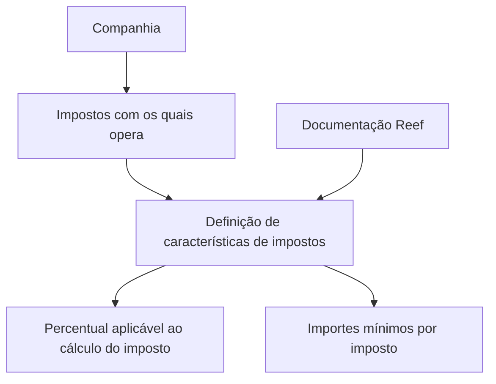

# Definição de Características de Impostos — Documentação Reef

## 1. Metadados do Documento
- **Arquivo de Origem:** Não informado
- **Tipo de Documento:** Especificação Técnica
- **Domínio / Sistema:** Reef / Mapfre
- **Público-Alvo:** Desenvolvedores, Arquitetos, Negócio
- **Data/Versão Identificada:** Não identificada

---

## 2. Resumo Executivo & Contexto de Negócio

O documento apresenta a funcionalidade de **definição de características de impostos** no contexto da documentação Reef. O objetivo declarado é estabelecer o percentual aplicável ao cálculo de impostos e os valores mínimos para cada imposto com o qual a companhia opera.

A informação disponível indica que a definição de impostos envolve propriedades associadas a cada tributo. Contudo, o conteúdo bruto não descreve quais propriedades existem, os formatos aceitos, regras de validação, fórmulas completas de cálculo ou fluxos de manutenção dessas características.

A documentação está identificada como aprovada, com proprietário indicado como `user:agonzalez_mapfre.com`. A navegação exibida inclui áreas como Soluções, Arquiteturas, APIs, Componentes, Cloud, Documentação, Zeus e Reef.

O material está marcado como **“EN CONSTRUCCIÓN”**, indicando que o conteúdo pode estar incompleto ou em elaboração.

---

## 3. Arquitetura, Componentes & Tecnologias Envolvidas

Os elementos explicitamente citados são:

- **Reef:** contexto ou sistema ao qual a documentação pertence.
- **Mapfre:** referência corporativa presente na interface/documentação.
- **Mapfredocument:** item mencionado na navegação ou identificação documental.
- **Zeus:** área disponível na navegação, sem relação funcional detalhada.
- **Documentação Reef:** repositório ou seção documental relacionada ao conteúdo.
- **Características de impostos:** funcionalidade para definição de percentuais e valores mínimos por imposto.



> **Nota de Análise:** O documento não especifica arquitetura de software, APIs, microsserviços, bancos de dados, protocolos de integração, tecnologias de implementação ou ambientes técnicos.

---

## 4. Regras de Negócio, Especificações Funcionais & Processos

### Objetivo funcional identificado

A funcionalidade de definição de características de impostos possui os seguintes objetivos explícitos:

1. Estabelecer o **percentual** que deve ser aplicado ao cálculo do imposto.
2. Estabelecer os **importes mínimos** para cada imposto operado pela companhia.
3. Associar propriedades à definição dos impostos.

### Regras extraídas

- Cada imposto com o qual a companhia opera deve possuir uma definição de características.
- A definição de características deve contemplar um percentual utilizado no cálculo do imposto.
- A definição de características deve contemplar importes mínimos por imposto.
- O documento menciona “Propiedades”, mas não detalha a lista, obrigatoriedade, tipo, origem ou comportamento dessas propriedades.

> **Nota de Análise:** O documento não informa a fórmula matemática do imposto, o critério de aplicação do valor mínimo, regras de arredondamento, periodicidade, moeda, vigência, perfis autorizados para manutenção ou fluxo de aprovação.

---

## 5. Tabelas de Parâmetros, Ambientes e Estruturas de Dados

| Item / Parâmetro | Descrição / Função | Tipo / Valores / Formato | Ambiente / Observações |
| :--- | :--- | :--- | :--- |
| Percentual de imposto | Percentual a ser aplicado no cálculo do imposto. | Não especificado. | Aplicável por imposto com o qual a companhia opera. |
| Importes mínimos | Valores mínimos definidos para cada imposto. | Não especificado. | O documento não define a regra de uso do mínimo. |
| Propriedades | Características associadas à definição de impostos. | Não especificado. | O documento apenas cita “Propiedades”. |
| Owner | Proprietário identificado na documentação. | `user:agonzalez_mapfre.com` | Exibido como proprietário do conteúdo. |
| Lifecycle | Estado de ciclo de vida documental. | `Approved` | Indica conteúdo aprovado na interface exibida. |
| Status do conteúdo | Estado de elaboração indicado no material. | `EN CONSTRUCCIÓN` | Pode indicar documentação incompleta. |
| Idioma da interface | Idioma exibido na navegação. | `ES` | O conteúdo principal está em espanhol. |

---

## 6. Bateria de Perguntas & Respostas para RAG (FAQ Sintético)

### P1: Qual é o objetivo da definição de características de impostos?
**R:** O objetivo é estabelecer o percentual que deve ser aplicado ao cálculo do imposto e os importes mínimos para cada imposto com o qual a companhia opera.

### P2: Quais dados de imposto são explicitamente mencionados no documento?
**R:** O documento menciona o percentual aplicável ao cálculo do imposto, os importes mínimos por imposto e propriedades associadas à definição de impostos.

### P3: O documento informa a fórmula completa de cálculo do imposto?
**R:** Não. O documento informa apenas que deve ser estabelecido um percentual para cálculo do imposto; não apresenta fórmula, base de cálculo, regras de arredondamento ou tratamento de exceções.

### P4: Como os importes mínimos devem ser aplicados no cálculo do imposto?
**R:** O documento afirma que devem ser estabelecidos importes mínimos por imposto, mas não detalha quando esses valores devem ser aplicados nem como interagem com o percentual calculado.

### P5: O que são as propriedades de imposto mencionadas na documentação?
**R:** O documento cita “Propiedades” como parte da definição de características de impostos, mas não especifica quais propriedades existem, seus tipos, valores permitidos ou regras de manutenção.

### P6: Qual sistema ou domínio está associado à documentação de impostos?
**R:** A documentação está associada ao contexto Reef, com referências também a Mapfre e à área de documentação Reef.

### P7: Qual é o estado de ciclo de vida identificado para o conteúdo?
**R:** A interface exibida identifica o campo `Lifecycle` com o valor `Approved`.

### P8: A documentação de definição de impostos está completa?
**R:** Não é possível afirmar que esteja completa. O conteúdo apresenta a indicação “EN CONSTRUCCIÓN”, além de não detalhar propriedades, fórmulas de cálculo, validações ou fluxos operacionais.

### P9: Quem é identificado como proprietário da documentação?
**R:** O proprietário exibido no documento é `user:agonzalez_mapfre.com`.

### P10: O documento descreve APIs ou integrações para manutenção de impostos?
**R:** Não. Embora a navegação da interface contenha uma seção denominada “APIs”, o documento não descreve endpoints, métodos HTTP, contratos, integrações ou serviços relacionados à definição de impostos.

---

## 7. Glossário de Termos, Siglas & Conceitos-Chave

- **Reef:** Sistema, domínio ou área de documentação mencionada no documento; o significado expandido não é informado.
- **Mapfre:** Referência corporativa presente na documentação e na interface exibida.
- **Mapfredocument:** Termo exibido no conteúdo; sua finalidade não é detalhada.
- **Zeus:** Área ou item de navegação mencionado na interface; não há definição funcional no documento.
- **Percentual de imposto:** Percentual que deve ser aplicado ao cálculo do imposto.
- **Importe mínimo:** Valor mínimo estabelecido para cada imposto com o qual a companhia opera.
- **Lifecycle:** Campo de ciclo de vida documental, apresentado com o valor `Approved`.
- **Approved:** Estado de aprovação apresentado para a documentação.
- **EN CONSTRUCCIÓN:** Indicação em espanhol de que o conteúdo está em construção.

---

## 8. Notas Críticas, Riscos & Limitações

- O conteúdo está identificado como **“EN CONSTRUCCIÓN”**, o que representa risco de incompletude ou alteração futura.
- Não há detalhamento sobre as propriedades de impostos citadas.
- Não há fórmula de cálculo, base de incidência, moeda, regra de arredondamento ou critério de prevalência entre percentual e importe mínimo.
- Não há informação sobre APIs, integrações, persistência de dados, trilhas de auditoria ou controles de acesso.
- Não são informadas versões, datas de vigência, ambientes, servidores, URLs ou responsáveis técnicos além do proprietário documental exibido.
- A presença das opções de navegação “APIs”, “Cloud”, “Zeus” e “Reef” não permite inferir integração funcional entre elas.

---

## 9. Conteúdo Bruto Estruturado (Referência Fiel)

```text
--- [PÁGINA 1 DE 1] ---

EN CONSTRUCCIÓN
DEFINICIÓN de características de impuestos
Objetivo
Establecer el porcentaje que se debe aplicar para el cálculo del impuesto y los importes mínimos, por cada impuesto con el que opera la
compañía
-Propiedades
Propiedades
Documentation / DOCUMENTACIÓN Reef
DOCUMENTACIÓN Reef
Mapfredocument
DOCUMENTACIÓN Reef
Owner
user:agonzalez_mapfre.com
Lifecycle
Approved Source
 /
VL
Buscar Inicio Soluciones Arquitecturas APIs Componentes Cloud Documentación Zeus Reef Ayuda
ES
```
