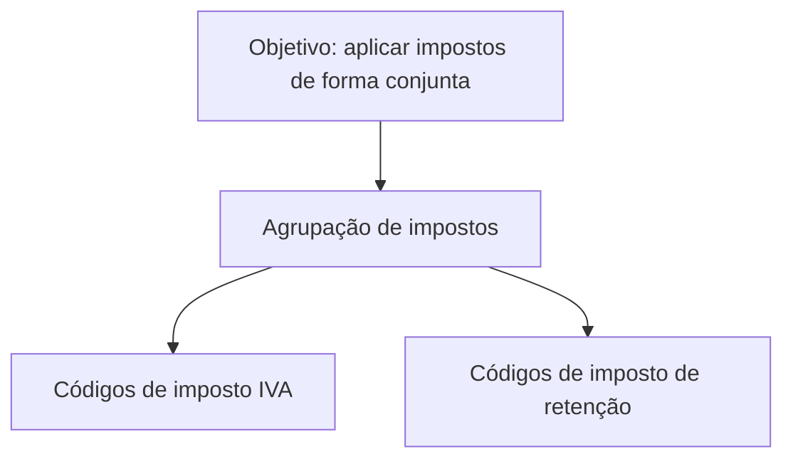

# Definição de Agrupamento de Impostos — Documentação Reef

## 1. Metadados do Documento
- **Arquivo de Origem:** `Não identificado no conteúdo fornecido`
- **Tipo de Documento:** `Especificação Funcional`
- **Domínio / Sistema:** `Reef / Mapfre`
- **Público-Alvo:** `Não identificado no conteúdo fornecido`
- **Data/Versão Identificada:** `Não identificada`

---

## 2. Resumo Executivo & Contexto de Negócio

O documento descreve a definição de uma funcionalidade de **agrupamento de impostos** no contexto da documentação Reef associada a Mapfre. O objetivo declarado é identificar impostos que devem ser aplicados conjuntamente em uma mesma agrupação.

A regra central permite agrupar códigos de imposto de tipo **IVA** e códigos de **retenção**. Uma agrupação pode conter simultaneamente códigos de IVA e códigos de retenção, sem que o texto apresente restrições adicionais sobre quantidade, prioridade, cálculo, vigência ou ordem de aplicação.

O conteúdo fornecido é conciso e apresenta principalmente o objetivo funcional da agrupação de impostos. O documento também contém referências de navegação e metadados de uma plataforma documental, incluindo “Documentation / DOCUMENTACIÓN Reef”, “Mapfredocument”, ciclo de vida “Approved” e proprietário `user:agonzalez_mapfre.com`.

Não há detalhamento adicional sobre interfaces, serviços, contratos de integração, persistência de dados, métodos HTTP, APIs, regras de cálculo, ambientes técnicos ou procedimentos operacionais.

---

## 3. Arquitetura, Componentes & Tecnologias Envolvidas

Os elementos explicitamente citados são:

| Componente / Termo | Papel identificado no conteúdo |
| :--- | :--- |
| Reef | Contexto documental e sistema/domínio referido pela documentação. |
| Mapfre | Referência corporativa presente em “Mapfredocument”. |
| Agrupação de impostos | Estrutura funcional destinada a reunir códigos de impostos aplicados de forma conjunta. |
| Código de imposto IVA | Tipo de código de imposto que pode pertencer a uma agrupação. |
| Código de imposto de retenção | Tipo de código de imposto que pode pertencer a uma agrupação. |
| Documentation / DOCUMENTACIÓN Reef | Referência à área ou repositório de documentação Reef. |
| Zeus | Item de navegação citado, sem detalhamento funcional ou técnico. |
| Cloud | Item de navegação citado, sem detalhamento funcional ou técnico. |
| APIs | Item de navegação citado, sem APIs ou contratos descritos. |
| Componentes | Item de navegação citado, sem componentes técnicos especificados. |



> **Nota de Análise:** O conteúdo não descreve arquitetura de software, microsserviços, bases de dados, ambientes, integrações ou tecnologias de implementação. O diagrama representa somente a relação funcional explicitamente indicada entre uma agrupação de impostos, códigos de IVA e códigos de retenção.

---

## 4. Regras de Negócio, Especificações Funcionais & Processos

### Regra funcional principal

A funcionalidade de agrupação de impostos deve permitir identificar impostos que precisam ser aplicados conjuntamente.

### Composição permitida de uma agrupação

Uma mesma agrupação de impostos pode reunir:

1. Códigos de imposto do tipo IVA.
2. Códigos de imposto de retenção.
3. Códigos de imposto IVA e códigos de imposto de retenção simultaneamente.

### Restrições e detalhes não especificados

O conteúdo original não informa:

- Como uma agrupação de impostos é criada, alterada, consultada ou removida.
- Quais atributos identificam uma agrupação de impostos.
- Se existem limites de códigos por agrupação.
- Se um mesmo código de imposto pode participar de mais de uma agrupação.
- A ordem de aplicação entre IVA e retenção.
- Fórmulas, percentuais, bases de cálculo ou regras de arredondamento.
- Critérios de validação, mensagens de erro ou autorizações.
- Integrações com APIs, processos batch, serviços ou sistemas externos.
- Regras de vigência temporal, aprovação ou publicação de agrupações.

> **Nota de Análise:** O documento estabelece a possibilidade de combinar códigos de IVA e de retenção em uma mesma agrupação, mas não detalha o comportamento operacional nem os critérios técnicos para aplicação dos impostos agrupados.

---

## 5. Tabelas de Parâmetros, Ambientes e Estruturas de Dados

| Item / Parâmetro | Descrição / Função | Tipo / Valores / Formato | Ambiente / Observações |
| :--- | :--- | :--- | :--- |
| Agrupação de impostos | Reúne impostos que devem ser aplicados conjuntamente. | Agrupação funcional. | Não há identificador, estrutura ou persistência especificados. |
| Código de imposto IVA | Código de imposto que pode ser incluído em uma agrupação. | Código de imposto do tipo IVA. | O documento não define formato, valor ou cálculo. |
| Código de imposto de retenção | Código de imposto que pode ser incluído em uma agrupação. | Código de imposto de retenção. | O documento não define formato, valor ou cálculo. |
| Owner | Proprietário indicado para o conteúdo documental. | `user:agonzalez_mapfre.com` | Metadado exibido no conteúdo bruto. |
| Lifecycle | Estado do ciclo de vida documental. | `Approved` | Metadado exibido no conteúdo bruto. |
| Source | Referência de origem exibida. | `/ VL` | Significado de `VL` não especificado. |
| Idioma | Idioma indicado na navegação documental. | `ES` | O conteúdo funcional está em espanhol. |
| Busca | Item de navegação documental. | `Buscar` | Não há comportamento detalhado. |
| Seções de navegação | Entradas de navegação do portal. | `Inicio`, `Soluciones`, `Arquitecturas`, `APIs`, `Componentes`, `Cloud`, `Documentación`, `Zeus`, `Reef`, `Ayuda` | Referências de interface; sem especificação funcional adicional. |

---

## 6. Bateria de Perguntas & Respostas para RAG (FAQ Sintético)

### P1: Qual é o objetivo da funcionalidade de agrupamento de impostos?
**R:** O objetivo é identificar impostos que devem ser aplicados de forma conjunta, organizando esses impostos em uma mesma agrupação.

### P2: Uma agrupação de impostos pode conter códigos de IVA?
**R:** Sim. O documento informa que uma agrupação pode incluir códigos de imposto do tipo IVA.

### P3: Uma agrupação de impostos pode conter códigos de retenção?
**R:** Sim. O documento informa que uma agrupação pode incluir códigos de imposto de retenção.

### P4: É permitido combinar códigos de IVA e códigos de retenção na mesma agrupação?
**R:** Sim. O documento declara explicitamente que uma mesma agrupação pode conter códigos de imposto IVA e códigos de imposto de retenção.

### P5: O documento define a ordem de aplicação entre IVA e retenções?
**R:** Não. O conteúdo apenas permite que códigos de IVA e de retenção coexistam em uma mesma agrupação; não descreve ordem, precedência ou fórmula de aplicação.

### P6: Quais APIs ou métodos HTTP são disponibilizados para administrar agrupações de impostos?
**R:** O documento não especifica APIs, endpoints, métodos HTTP, contratos JSON ou mecanismos técnicos para criação e manutenção das agrupações de impostos.

### P7: O documento informa os percentuais ou as bases de cálculo dos impostos agrupados?
**R:** Não. Não são apresentados percentuais, fórmulas, bases de cálculo, regras de arredondamento ou parâmetros tributários.

### P8: Qual sistema ou domínio é mencionado na documentação de agrupamento de impostos?
**R:** O conteúdo menciona a documentação Reef e a referência “Mapfredocument”, associando o material ao contexto Reef / Mapfre.

### P9: Quem é indicado como proprietário do conteúdo documental?
**R:** O metadado “Owner” indica `user:agonzalez_mapfre.com`.

### P10: Qual é o estado do ciclo de vida do documento?
**R:** O campo “Lifecycle” está identificado como `Approved`.

### P11: O que significa a referência “VL” exibida no campo Source?
**R:** O conteúdo apresenta o campo “Source” com o valor `/ VL`, mas não explica o significado da sigla ou referência `VL`.

### P12: O documento descreve como criar ou editar uma agrupação de impostos?
**R:** Não. O conteúdo define o objetivo e os tipos de códigos que podem compor uma agrupação, mas não descreve operações de criação, alteração, exclusão ou consulta.

---

## 7. Glossário de Termos, Siglas & Conceitos-Chave

- **Agrupação de impostos:** Estrutura funcional usada para reunir impostos que devem ser aplicados conjuntamente.
- **IVA:** Tipo de código de imposto que pode integrar uma agrupação. A expansão da sigla não é fornecida no conteúdo original.
- **Retenção:** Tipo de código de imposto que pode integrar uma agrupação.
- **Reef:** Nome citado no contexto da documentação e da navegação; o documento não define tecnicamente o sistema.
- **Mapfre:** Referência corporativa presente no termo “Mapfredocument”.
- **Lifecycle:** Campo de metadado que indica o ciclo de vida do conteúdo documental.
- **Approved:** Valor apresentado para o campo “Lifecycle”.
- **Owner:** Campo de metadado que identifica o proprietário do conteúdo.
- **VL:** Referência apresentada no campo “Source”, sem expansão ou explicação no documento.
- **Zeus:** Item citado na navegação documental, sem definição adicional.

---

## 8. Notas Críticas, Riscos & Limitações

- O documento tem escopo funcional resumido e não apresenta especificação técnica de implementação.
- Não há informações sobre cálculo tributário, percentuais, sequência de aplicação, prioridade entre códigos ou regras de conflito.
- Não há definição de modelo de dados, identificadores, formatos de códigos ou validações.
- Não são fornecidos contratos de API, integrações, serviços, microsserviços, logs, URLs, servidores ou ambientes.
- Não há detalhes sobre permissões, papéis de usuários, auditoria ou processo de aprovação de agrupações de impostos.
- O trecho “Identicar” contém um caractere corrompido na extração original; pelo contexto, corresponde ao termo exibido literalmente na transcrição.
- O documento lista itens de navegação como “APIs”, “Cloud”, “Zeus” e “Componentes”, mas não fornece detalhes que permitam inferir suas funções ou relações com o agrupamento de impostos.

---

## 9. Conteúdo Bruto Estruturado (Referência Fiel)

```text
--- [PÁGINA 1 DE 1] ---

EN CONSTRUCCIÓN
DEFINICIÓN de agrupación de impuestos
Objetivo
Identicar impuestos que se deben aplicar de forma conjunta, pudiendo agrupar tanto códigos de impuesto de tipo IVA como retenciones, en
una misma agrupación.
En una misma agrupación pueden existir códigos de impuesto de IVA y de retención.
-Propiedades
Propiedades
Documentation / DOCUMENTACIÓN Reef
DOCUMENTACIÓN Reef
Mapfredocument
DOCUMENTACIÓN Reef
Owner
user:agonzalez_mapfre.com
Lifecycle
Approved Source
 / 
 VL
Buscar Inicio Soluciones Arquitecturas APIs Componentes Cloud Documentación Zeus Reef Ayuda
ES
```
