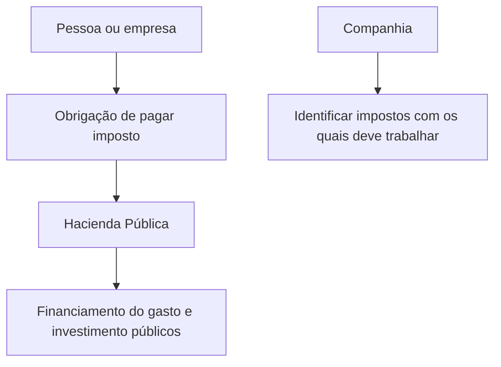

# Definição de Imposto — Conteúdo de Construção na Documentação Reef

## 1. Metadados do Documento
- **Arquivo de Origem:** Não identificado no conteúdo fornecido
- **Tipo de Documento:** Documento conceitual em construção
- **Domínio / Sistema:** Documentação Reef / Mapfre
- **Público-Alvo:** Negócio, analistas funcionais e usuários da documentação Reef
- **Data/Versão Identificada:** Não identificada

---

## 2. Resumo Executivo & Contexto de Negócio

O conteúdo apresenta uma definição de imposto sob o título “DEFINICIÓN de impuesto” e indica que o material está em construção (“EN CONSTRUCCIÓN”). O objetivo expresso é caracterizar impostos como quantias de dinheiro que uma pessoa ou empresa tem obrigação de pagar à Hacienda Pública.

Segundo o texto, o pagamento de impostos contribui para o financiamento do gasto e do investimento públicos. A definição relaciona explicitamente os contribuintes — pessoas ou empresas — à obrigação de pagamento em favor da Hacienda Pública.

O documento também estabelece que a companhia deve identificar os impostos com os quais precisa trabalhar. Entretanto, o conteúdo extraído não lista quais impostos devem ser identificados, nem descreve critérios de classificação, cálculo, obrigações acessórias, prazos ou processos operacionais.

O material está associado à documentação Reef e apresenta referências visuais ou de navegação para “Mapfredocument”, “DOCUMENTACIÓN Reef”, “Zeus”, “Cloud”, “APIs”, “Componentes” e “Arquitecturas”. O texto não detalha a função técnica ou funcional dessas referências.

---

## 3. Arquitetura, Componentes & Tecnologias Envolvidas

O conteúdo não descreve arquitetura de software, tecnologias, interfaces, APIs, ambientes, microsserviços ou integrações técnicas. As únicas referências identificadas são elementos de documentação e navegação: Reef, Mapfredocument, Zeus, Cloud, APIs, Componentes e Arquitecturas.

O fluxo conceitual explicitamente apresentado é o seguinte:



**Nota de Análise:** O documento não detalha como a companhia identifica impostos, quais sistemas suportam essa identificação ou como os elementos “Reef”, “Mapfredocument” e “Zeus” se integram.

---

## 4. Regras de Negócio, Especificações Funcionais & Processos

1. Um imposto é uma quantia de dinheiro que uma pessoa ou empresa está obrigada a pagar.
2. O destinatário do pagamento é a Hacienda Pública.
3. A finalidade indicada para o pagamento de impostos é contribuir para o financiamento do gasto e do investimento públicos.
4. A companhia deve identificar os impostos com os quais deve trabalhar.
5. O documento contém o marcador “Propiedades”, mas não apresenta propriedades, atributos, regras de validação ou valores associados.
6. O documento está identificado como “EN CONSTRUCCIÓN”; portanto, não há detalhamento adicional sobre processos, responsabilidades, cálculos, exceções ou critérios de decisão.

---

## 5. Tabelas de Parâmetros, Ambientes e Estruturas de Dados

| Item / Parâmetro | Descrição / Função | Tipo / Valores / Formato | Ambiente / Observações |
| :--- | :--- | :--- | :--- |
| Imposto | Quantia de dinheiro obrigatória paga por pessoa ou empresa. | Conceito de negócio | Definição apresentada no documento. |
| Pagador | Pessoa ou empresa obrigada a pagar imposto. | Entidade / contribuinte | O texto não especifica critérios de elegibilidade. |
| Destinatário | Hacienda Pública, em favor da qual o imposto deve ser pago. | Entidade pública | O documento utiliza o termo em espanhol. |
| Finalidade | Contribuir com o financiamento do gasto e do investimento públicos. | Finalidade de negócio | Não há detalhamento de alocação financeira. |
| Companhia | Deve identificar os impostos com os quais deve trabalhar. | Responsável organizacional | Não são definidos processo, equipe ou sistema responsável. |
| Propiedades | Seção ou marcador citado no conteúdo. | Não detalhado | Não foram extraídas propriedades associadas. |
| DOCUMENTACIÓN Reef | Referência à documentação Reef. | Portal ou área de documentação | Sem descrição funcional adicional. |
| Mapfredocument | Referência exibida no conteúdo. | Não detalhado | O texto não explica sua finalidade. |
| Owner | `user:agonzalez_mapfre.com` | Metadado exibido | Valor transcrito conforme o conteúdo bruto. |
| Lifecycle | `Approved` | Metadado exibido | Não há explicação sobre o ciclo de vida. |
| Source | `VL` | Metadado exibido | Não há explicação sobre o significado de `VL`. |
| Navegação | Buscar, Inicio, Soluciones, Arquitecturas, APIs, Componentes, Cloud, Documentación, Zeus, Reef, Ayuda. | Itens de navegação | Referências de interface sem detalhamento técnico. |
| Idioma | `ES` | Código de idioma exibido | O conteúdo principal está em espanhol. |

---

## 6. Bateria de Perguntas & Respostas para RAG (FAQ Sintético)

### P1: Como o documento define imposto?
**R:** O documento define imposto como uma quantia de dinheiro que uma pessoa ou empresa está obrigada a pagar em favor da Hacienda Pública, contribuindo para o financiamento do gasto e do investimento públicos.

### P2: Quem pode ter obrigação de pagar imposto segundo o documento?
**R:** Segundo o conteúdo, uma pessoa ou uma empresa pode estar obrigada a pagar imposto. O documento não apresenta critérios adicionais para determinar quais pessoas ou empresas estão sujeitas a essa obrigação.

### P3: Para quem deve ser pago o imposto?
**R:** O imposto deve ser pago em favor da Hacienda Pública, conforme a definição apresentada no documento.

### P4: Qual é a finalidade do pagamento de impostos descrita no material?
**R:** A finalidade descrita é contribuir para a financiación do gasto e do investimento públicos. O documento não especifica categorias orçamentárias, repartições públicas ou mecanismos de distribuição desses recursos.

### P5: Qual responsabilidade é atribuída à companhia?
**R:** A companhia deve identificar os impostos com os quais deve trabalhar. O documento não informa quais impostos são aplicáveis, nem estabelece um processo, uma ferramenta ou responsáveis por essa identificação.

### P6: O documento descreve propriedades ou atributos dos impostos?
**R:** Não. Embora o termo “Propiedades” apareça no conteúdo, não são fornecidas propriedades, campos, tipos de dados, regras de preenchimento ou valores associados aos impostos.

### P7: O documento apresenta regras de cálculo de impostos?
**R:** Não. O conteúdo define o conceito de imposto e a responsabilidade da companhia de identificar os impostos relevantes, mas não informa alíquotas, bases de cálculo, isenções, fórmulas ou datas de vencimento.

### P8: Qual é o estado de maturidade do conteúdo apresentado?
**R:** O documento contém a indicação “EN CONSTRUCCIÓN”, sinalizando que o conteúdo está em construção. Não há versão, data de publicação ou escopo de pendências explicitamente informado.

### P9: O que é DOCUMENTACIÓN Reef no contexto do conteúdo?
**R:** “DOCUMENTACIÓN Reef” é uma referência apresentada no material, aparentemente relacionada a uma área ou portal de documentação. O texto não detalha sua arquitetura, finalidade funcional, público responsável ou integração com outros sistemas.

### P10: O que significam os metadados Owner, Lifecycle e Source exibidos?
**R:** O conteúdo exibe `Owner` com o valor `user:agonzalez_mapfre.com`, `Lifecycle` com o valor `Approved` e `Source` com o valor `VL`. O documento não define a semântica operacional desses metadados.

---

## 7. Glossário de Termos, Siglas & Conceitos-Chave

- **Hacienda Pública:** Entidade pública em favor da qual pessoas ou empresas devem pagar impostos, conforme a definição do documento.
- **Imposto:** Quantia de dinheiro que uma pessoa ou empresa está obrigada a pagar à Hacienda Pública.
- **DOCUMENTACIÓN Reef:** Referência a uma documentação ou área documental denominada Reef; sem detalhamento adicional.
- **Mapfredocument:** Termo exibido no conteúdo sem definição funcional.
- **Owner:** Metadado apresentado com o valor `user:agonzalez_mapfre.com`.
- **Lifecycle:** Metadado apresentado com o valor `Approved`.
- **Source:** Metadado apresentado com o valor `VL`.
- **ES:** Código de idioma exibido na interface.
- **VL:** Valor apresentado no campo `Source`; seu significado não é definido no conteúdo.

---

## 8. Notas Críticas, Riscos & Limitações

- O documento está marcado como “EN CONSTRUCCIÓN”, indicando conteúdo potencialmente incompleto.
- Não há identificação do arquivo de origem, data, versão ou autoria documental completa.
- O texto não enumera impostos específicos com os quais a companhia deve trabalhar.
- Não há regras de cálculo, alíquotas, bases de cálculo, exceções, prazos, obrigações acessórias ou controles de conformidade.
- As seções ou referências “Propiedades”, “Mapfredocument”, “DOCUMENTACIÓN Reef”, “Zeus”, “Cloud”, “APIs”, “Componentes” e “Arquitecturas” não possuem explicação técnica ou funcional adicional.
- **Nota de Análise:** O documento menciona que a companhia deve identificar impostos aplicáveis, porém não detalha o método de identificação, os responsáveis, os sistemas envolvidos ou os critérios regulatórios utilizados.

---

## 9. Conteúdo Bruto Estruturado (Referência Fiel)

```text
--- [PÁGINA 1 DE 1] ---

EN CONSTRUCCIÓN
DEFINICIÓN de impuesto
Objetivo
Son aquellas cantidades de dinero que una persona o empresa está obligada a pagar a favor de la Hacienda Pública para contribuir con la
nanciación del gasto y la inversión pública.
La compañía debe identicar los impuestos con los que debe trabajar.
-Propiedades
Propiedades
Documentation / DOCUMENTACIÓN Reef
DOCUMENTACIÓN Reef
Mapfredocument
DOCUMENTACIÓN Reef
Owner
user:agonzalez_mapfre.com
Lifecycle
Approved Source
 / 
 VL
Buscar Inicio Soluciones Arquitecturas APIs Componentes Cloud Documentación Zeus Reef Ayuda
ES
```
