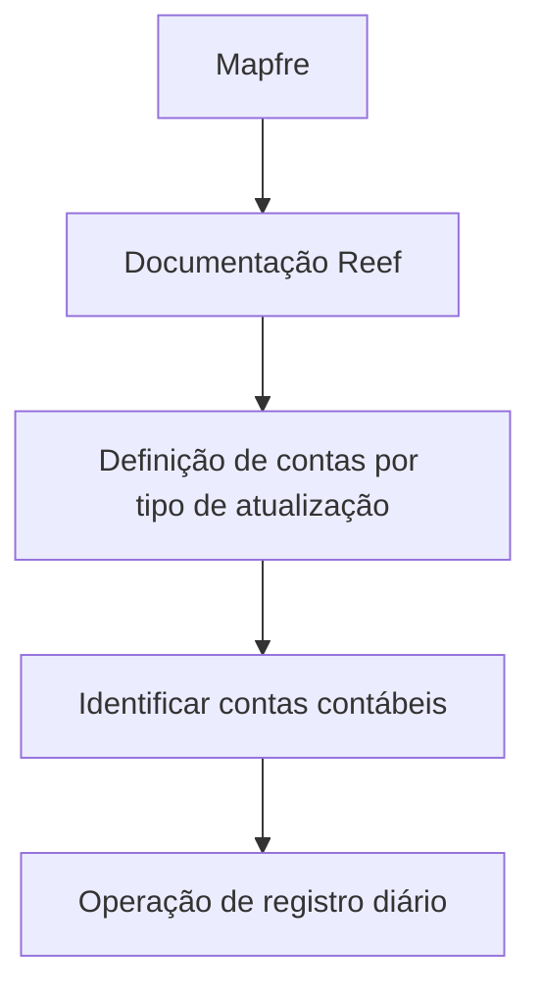

# Definição de Contas por Tipo de Atualização — Documentação Reef

## 1. Metadados do Documento
- **Arquivo de Origem:** Não identificado
- **Tipo de Documento:** Especificação Técnica em construção
- **Domínio / Sistema:** Reef / Mapfre
- **Público-Alvo:** Não identificado
- **Data/Versão Identificada:** Não identificada

---

## 2. Resumo Executivo & Contexto de Negócio

O documento apresenta a definição de contas contábeis por tipo de atualização no contexto da documentação Reef. O objetivo declarado é identificar quais contas contábeis devem ser utilizadas de acordo com a operação de registro diário.

O conteúdo está marcado como “EN CONSTRUCCIÓN”, indicando que a documentação ainda está em elaboração. Não há detalhamento sobre os tipos de atualização, regras de mapeamento contábil, lançamentos específicos ou critérios de seleção das contas.

A página também contém referências à área de documentação Reef, ao contexto Mapfre e a metadados de governança documental, incluindo owner e lifecycle “Approved Source”. A navegação apresentada menciona áreas como Soluções, Arquiteturas, APIs, Componentes, Cloud, Documentação, Zeus e Reef.

---

## 3. Arquitetura, Componentes & Tecnologias Envolvidas

Os elementos identificados no conteúdo são:

| Componente / Elemento | Evidência no documento | Detalhamento disponível |
| :--- | :--- | :--- |
| Reef | “DOCUMENTACIÓN Reef” | Sistema ou domínio documental citado, sem descrição técnica adicional. |
| Mapfre | “Mapfredocument” e e-mail do owner | Contexto corporativo citado, sem arquitetura detalhada. |
| Contas contábeis | Objetivo do documento | Devem ser identificadas conforme a operação de registro diário. |
| Registro diário | Objetivo do documento | Operação que determina as contas contábeis aplicáveis. |
| Zeus | Menu de navegação | Apenas citado como item de navegação. |
| APIs | Menu de navegação | Apenas citado como categoria de navegação. |
| Cloud | Menu de navegação | Apenas citado como categoria de navegação. |



> **Nota de Análise:** o documento não descreve interfaces, APIs, tecnologias, protocolos, bancos de dados, ambientes, métodos HTTP ou contratos de integração. O diagrama representa somente a relação conceitual explicitamente indicada pelo objetivo e pelas referências documentais.

---

## 4. Regras de Negócio, Especificações Funcionais & Processos

1. O objetivo declarado consiste em identificar as contas contábeis que serão utilizadas conforme a operação de registro diário.
2. A seleção das contas contábeis depende do tipo de atualização, conforme indicado pelo título “DEFINICIÓN de cuentas por tipo de actualización”.
3. O documento não apresenta:
   - Tipos de atualização existentes.
   - Lista de contas contábeis.
   - Regras de associação entre operação e conta.
   - Condições de validação.
   - Fórmulas de cálculo.
   - Exemplos de registros diários.
   - Fluxo operacional detalhado.
   - Responsáveis pela manutenção das regras contábeis.

> **Nota de Análise:** embora o documento indique que as contas contábeis variam conforme a operação de registro diário, não há detalhamento suficiente para implementar, validar ou operar esse mapeamento.

---

## 5. Tabelas de Parâmetros, Ambientes e Estruturas de Dados

| Item / Parâmetro | Descrição / Função | Tipo / Valores / Formato | Ambiente / Observações |
| :--- | :--- | :--- | :--- |
| Objetivo | Identificar contas contábeis a utilizar | Texto funcional | Relacionado à operação do registro diário. |
| Tipo de atualização | Critério indicado no título para definição de contas | Não detalhado | Nenhum tipo de atualização foi listado. |
| Operação do registro diário | Contexto que determina a conta contábil aplicável | Não detalhado | Não há catálogo de operações. |
| Owner | Responsável identificado na documentação | `user:agonzalez_mapfre.com` | Exibido nos metadados documentais. |
| Lifecycle | Estado de ciclo de vida documental | `Approved Source` | Exibido nos metadados documentais. |
| Idioma | Idioma exibido na navegação | `ES` | Interface/documentação em espanhol. |
| Documentação | Referência à documentação Reef | `DOCUMENTACIÓN Reef` | Repetida no conteúdo. |
| Categorias de navegação | Áreas disponíveis no menu | Buscar, Inicio, Soluciones, Arquitecturas, APIs, Componentes, Cloud, Documentación, Zeus, Reef, Ayuda | Não representam necessariamente componentes técnicos integrados. |

---

## 6. Bateria de Perguntas & Respostas para RAG (FAQ Sintético)

### P1: Qual é o objetivo da definição de contas por tipo de atualização?
**R:** O objetivo é identificar as contas contábeis que devem ser utilizadas de acordo com a operação de registro diário.

### P2: O documento especifica quais contas contábeis devem ser utilizadas?
**R:** Não. O documento declara que as contas contábeis devem ser identificadas conforme a operação do registro diário, mas não apresenta uma lista de contas, códigos contábeis ou regras de mapeamento.

### P3: Quais tipos de atualização estão previstos na documentação?
**R:** O conteúdo somente menciona “tipo de atualização” no título. Não há enumeração, definição ou detalhamento dos tipos de atualização.

### P4: Como uma operação de registro diário determina a conta contábil?
**R:** O documento afirma que a conta contábil deve ser utilizada “según la operación del registro diario”, mas não fornece critérios, condições, exemplos ou tabelas que expliquem essa determinação.

### P5: Qual é o sistema ou domínio associado à documentação?
**R:** A documentação referencia o domínio ou sistema Reef, por meio das expressões “Documentation / DOCUMENTACIÓN Reef” e “DOCUMENTACIÓN Reef”.

### P6: O documento descreve APIs ou integrações do sistema Reef?
**R:** Não. “APIs” aparece apenas como item de navegação. O conteúdo não descreve endpoints, métodos HTTP, autenticação, contratos de dados ou integrações.

### P7: Quem é o owner identificado no documento?
**R:** O owner apresentado nos metadados é `user:agonzalez_mapfre.com`.

### P8: Qual é o estado de ciclo de vida da documentação?
**R:** O campo “Lifecycle” apresenta o valor `Approved Source`.

### P9: A documentação está concluída?
**R:** Não é possível considerá-la concluída, pois o conteúdo inicia com a indicação “EN CONSTRUCCIÓN”, sinalizando que está em construção.

### P10: Há informações sobre ambiente, servidor, URL ou configuração técnica?
**R:** Não. O documento não apresenta URLs, servidores, ambientes, portas, variáveis de configuração ou caminhos de log.

---

## 7. Glossário de Termos, Siglas & Conceitos-Chave

- **Reef:** Nome citado na documentação; o conteúdo não define sua função técnica ou de negócio.
- **Mapfre:** Referência corporativa presente no conteúdo e no identificador do owner.
- **Conta contábil:** Conta que deve ser utilizada conforme a operação de registro diário; não há definição adicional no documento.
- **Registro diário:** Operação mencionada como critério para identificar a conta contábil aplicável.
- **Tipo de atualização:** Critério citado no título; não detalhado.
- **Lifecycle:** Campo de ciclo de vida documental com valor `Approved Source`.
- **Approved Source:** Valor apresentado para o lifecycle; o significado operacional não é explicado no documento.
- **Zeus:** Item presente na navegação; não possui detalhamento adicional.
- **API:** Categoria de navegação citada; não há especificação de interfaces de programação.

---

## 8. Notas Críticas, Riscos & Limitações

- O documento está identificado como “EN CONSTRUCCIÓN”.
- Não há mapeamento entre tipos de atualização, operações de registro diário e contas contábeis.
- Não há exemplos de lançamentos ou cenários contábeis.
- Não há dados técnicos de implementação, APIs, integrações, ambientes, URLs, logs ou contratos.
- O papel técnico e funcional de Reef não é definido.
- O significado operacional do status `Approved Source` não é explicado.
- A ausência de regras explícitas impede usar o conteúdo como especificação implementável de mapeamento contábil.

---

## 9. Conteúdo Bruto Estruturado (Referência Fiel)

```text
--- [PÁGINA 1 DE 1] ---

EN CONSTRUCCIÓN
DEFINICIÓN de cuentas por tipo de actualización
Objetivo
Identicar las cuentas contables que se utilizarán según la operación del registro diario.
Propiedades generales
Propiedades generales
Documentation / DOCUMENTACIÓN Reef
DOCUMENTACIÓN Reef
Mapfredocument
DOCUMENTACIÓN Reef
Owner
user:agonzalez_mapfre.com
Lifecycle
Approved Source
 / 
 VL
Buscar Inicio Soluciones Arquitecturas APIs Componentes Cloud Documentación Zeus Reef Ayuda
ES
```
