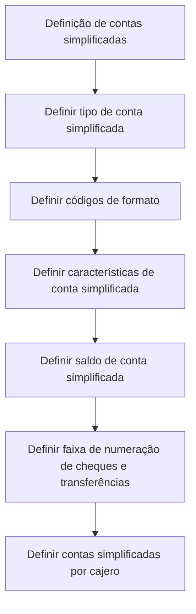

# Definição de Contas Simplificadas — Documentação Reef

## 1. Metadados do Documento
- **Arquivo de Origem:** Não identificado no conteúdo fornecido
- **Tipo de Documento:** Procedimento
- **Domínio / Sistema:** Reef / Mapfre
- **Público-Alvo:** Negócio, Operação e equipes responsáveis pela configuração de contas contábeis
- **Data/Versão Identificada:** Não identificada

---

## 2. Resumo Executivo & Contexto de Negócio

O documento descreve a **definição de contas simplificadas** no contexto da documentação Reef. O objetivo explícito é definir os códigos que identificam contas contábeis.

O procedimento está organizado em seis atividades de definição. As atividades abrangem tipo de conta simplificada, códigos de formato, características, saldo, faixa de numeração de cheques e transferências, e contas simplificadas por caixa.

O conteúdo fornecido apresenta uma visão sequencial de configuração, mas não detalha regras de validação, telas, campos obrigatórios, valores permitidos, contratos técnicos, integrações ou responsabilidades por perfil de usuário.

A página está registrada como documentação Reef, com ciclo de vida **Approved Source** e proprietário identificado como `user:agonzalez_mapfre.com`. Não há versão, data de publicação ou ambiente técnico identificados no texto.

---

## 3. Arquitetura, Componentes & Tecnologias Envolvidas

Os elementos identificados são:

| Componente / Elemento | Descrição sustentada pelo documento |
| :--- | :--- |
| Reef | Contexto da documentação apresentada. |
| Mapfre | Referência exibida na navegação/documentação. |
| Contas contábeis | Entidades identificadas por códigos definidos no procedimento. |
| Contas simplificadas | Objeto principal do procedimento documentado. |
| Cheques e transferências | Elementos associados à definição de uma faixa de numeração. |
| Cajero | Termo utilizado no passo de definição de contas simplificadas por caixa. |
| Zeus | Item de navegação mencionado na página, sem detalhamento funcional. |
| Cloud | Item de navegação mencionado na página, sem detalhamento funcional. |
| APIs | Item de navegação mencionado na página, sem detalhamento funcional. |



> **Nota de Análise:** O documento não descreve arquitetura de software, microsserviços, bancos de dados, APIs, protocolos, tecnologias de implementação ou fluxos de integração.

---

## 4. Regras de Negócio, Especificações Funcionais & Processos

O objetivo declarado do procedimento é definir códigos que identifiquem contas contábeis.

O processo apresentado contém os seguintes passos, na ordem exibida:

1. **Definir tipo de conta simplificada.**
2. **Definir códigos de formato.**
3. **Definir características de conta simplificada.**
4. **Definir saldo de conta simplificada.**
5. **Definir faixa de numeração de cheques e transferências.**
6. **Definir contas simplificadas por cajero.**

Não foram identificadas no conteúdo fornecido regras explícitas sobre:

- Critérios para classificação do tipo de conta simplificada.
- Estrutura, tamanho, máscara ou semântica dos códigos de formato.
- Características configuráveis de uma conta simplificada.
- Regras de cálculo, atualização ou validação de saldo.
- Limites, formato ou critérios de atribuição da faixa numérica de cheques e transferências.
- Relacionamento, elegibilidade ou restrições entre contas simplificadas e cajeros.
- Tratamento de exceções, mensagens de erro ou fluxo de aprovação.

> **Nota de Análise:** O documento lista as seis etapas de configuração, mas não fornece detalhamento adicional sobre entradas, saídas, responsáveis, regras condicionais ou resultados esperados de cada etapa.

---

## 5. Tabelas de Parâmetros, Ambientes e Estruturas de Dados

| Item / Parâmetro | Descrição / Função | Tipo / Valores / Formato | Ambiente / Observações |
| :--- | :--- | :--- | :--- |
| Tipo de conta simplificada | Elemento a ser definido no primeiro passo do processo. | Não especificado. | Sem detalhamento adicional. |
| Códigos de formato | Elemento a ser definido no segundo passo do processo. | Não especificado. | Sem detalhamento adicional. |
| Características de conta simplificada | Elemento a ser definido no terceiro passo do processo. | Não especificado. | Sem detalhamento adicional. |
| Saldo de conta simplificada | Elemento a ser definido no quarto passo do processo. | Não especificado. | Sem regra de cálculo ou validação apresentada. |
| Faixa de numeração de cheques e transferências | Elemento a ser definido no quinto passo do processo. | Não especificado. | Não há intervalos numéricos, formatos ou limites informados. |
| Contas simplificadas por cajero | Elemento a ser definido no sexto passo do processo. | Não especificado. | O termo `cajero` não é definido no conteúdo. |
| Lifecycle | Estado do documento na plataforma de documentação. | `Approved Source` | Exibido na página. |
| Owner | Proprietário identificado na página. | `user:agonzalez_mapfre.com` | Exibido na página. |
| Idioma | Idioma de navegação identificado. | `ES` | Exibido na página. |

---

## 6. Bateria de Perguntas & Respostas para RAG (FAQ Sintético)

### P1: Qual é o objetivo da documentação de contas simplificadas?
**R:** O objetivo declarado é definir os códigos que identificam as contas contábeis.

### P2: Quantos passos compõem o processo de definição de contas simplificadas?
**R:** O processo contém seis passos: definir tipo de conta simplificada, códigos de formato, características, saldo, faixa de numeração de cheques e transferências, e contas simplificadas por cajero.

### P3: Qual é o primeiro passo do procedimento de contas simplificadas?
**R:** O primeiro passo é definir o tipo de conta simplificada.

### P4: Em qual etapa são definidos os códigos de formato?
**R:** Os códigos de formato são definidos na segunda etapa do procedimento.

### P5: O documento informa quais formatos ou valores são permitidos para os códigos de formato?
**R:** Não. O documento apenas determina a atividade de definir códigos de formato, sem informar estruturas, máscaras, valores permitidos ou regras de validação.

### P6: O documento descreve como calcular ou validar o saldo de uma conta simplificada?
**R:** Não. A definição do saldo de conta simplificada aparece como a quarta etapa, mas não há regras de cálculo, atualização ou validação do saldo.

### P7: O que deve ser definido para cheques e transferências?
**R:** Deve ser definida uma faixa de numeração para cheques e transferências. O documento não informa os intervalos, formatos ou regras de utilização dessa faixa.

### P8: O documento explica o que significa “cajero”?
**R:** Não. O termo aparece na etapa “definir contas simplificadas por cajero”, sem definição adicional no conteúdo fornecido.

### P9: Qual é o status de ciclo de vida identificado para a documentação?
**R:** O ciclo de vida exibido na página é `Approved Source`.

### P10: Quem é o proprietário identificado para a documentação Reef?
**R:** O proprietário exibido é `user:agonzalez_mapfre.com`.

### P11: O documento apresenta APIs, microsserviços ou contratos técnicos relacionados às contas simplificadas?
**R:** Não. Embora a navegação mencione APIs e outros itens, o conteúdo não detalha APIs, microsserviços, métodos HTTP, contratos JSON, bancos de dados ou integrações técnicas.

---

## 7. Glossário de Termos, Siglas & Conceitos-Chave

- **Reef:** Nome presente no contexto da documentação e na navegação da página.
- **Conta contábil:** Conta identificada por códigos, conforme o objetivo declarado do documento.
- **Conta simplificada:** Entidade central do procedimento de definição apresentado.
- **Código de formato:** Elemento de configuração listado como segunda etapa do procedimento; sem definição adicional.
- **Saldo de conta simplificada:** Elemento de configuração listado como quarta etapa; sem regra detalhada.
- **Cajero:** Termo utilizado para a definição de contas simplificadas por cajero; não definido no conteúdo.
- **Lifecycle:** Campo exibido na página para indicar o ciclo de vida do documento.
- **Approved Source:** Valor exibido para o campo `Lifecycle`.
- **Owner:** Campo exibido na página para indicar o proprietário do documento.
- **Mapfre:** Nome exibido no contexto de navegação/documentação.
- **Zeus:** Item de navegação citado sem detalhamento no documento.

---

## 8. Notas Críticas, Riscos & Limitações

- O documento apresenta apenas os nomes das seis etapas do procedimento, sem detalhar execução, critérios de aceite, responsáveis ou dependências.
- Não há parâmetros técnicos, exemplos de códigos, faixas numéricas, formatos de dados ou regras de validação.
- Não há informações sobre ambiente, URL, servidor, permissões, perfis de acesso ou auditoria operacional.
- Não foram identificadas integrações, APIs, contratos, modelos de dados ou componentes de arquitetura.
- O termo `cajero` é mencionado sem definição contextual.
- A ausência de detalhamento impede derivar regras de negócio adicionais sem risco de alucinação.
- Não foram identificadas data, versão ou nome do arquivo de origem.

---

## 9. Conteúdo Bruto Estruturado (Referência Fiel)

```text
--- [PÁGINA 1 DE 1] ---

DEFINICIÓN de cuentas simplificadas

Objetivo

Se definen los códigos que identifican las cuentas contables.

Pasos a seguir

DEFINIR
Tipo de cuenta
simplificada
(1)

DEFINIR
Códigos de
formato
(2)

DEFINIR
Características de
cuenta simplificada
(3)

DEFINIR
Saldo de cuenta
simplificada
(4)

DEFINIR
Rango numeración de
cheques y transferencias
(5)

DEFINIR
Cuentas simplificadas
por cajero
(6)

1. DEFINIR Tipo de cuenta simplificada
2. DEFINIR Códigos de formato
3. DEFINIR Características de cuenta simplificada
4. DEFINIR Saldo de cuenta simplificada
5. DEFINIR Rango numeración de cheques y transferencias
6. DEFINIR Cuentas simplificadas por cajero

Checking links...

Documentation / DOCUMENTACIÓN Reef
DOCUMENTACIÓN Reef
Mapfredocument
DOCUMENTACIÓN Reef

Owner
user:agonzalez_mapfre.com

Lifecycle
Approved Source
/
VL

Buscar Inicio Soluciones Arquitecturas APIs Componentes Cloud Documentación Zeus Reef Ayuda

ES
```
