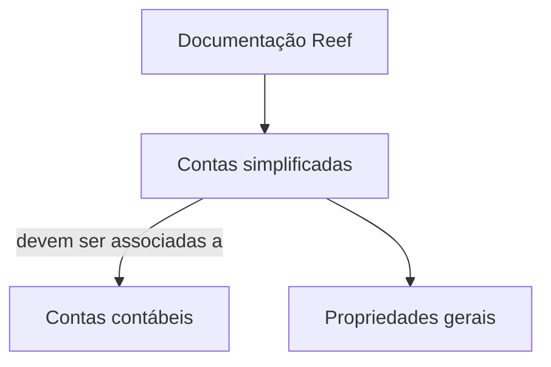

# Definição de Características de Contas Simplificadas — Documentação Reef

## 1. Metadados do Documento
- **Arquivo de Origem:** Não informado
- **Tipo de Documento:** Especificação Técnica
- **Domínio / Sistema:** Reef / Mapfre
- **Público-Alvo:** Não identificado
- **Data/Versão Identificada:** Não identificada

---

## 2. Resumo Executivo & Contexto de Negócio

O documento apresenta a definição de características para **contas simplificadas**. O objetivo explicitamente declarado é associar contas simplificadas a contas contábeis e definir as propriedades dessas contas simplificadas.

O conteúdo está associado à área de documentação do **Reef**, dentro de um contexto identificado visualmente como **Mapfre**. A página indica o estado de ciclo de vida **Approved**, mas não fornece versão, data de publicação, responsáveis técnicos adicionais ou histórico de mudanças.

A especificação menciona “propriedades gerais” duas vezes, porém não enumera quais propriedades devem ser configuradas, seus formatos, valores permitidos, regras de validação ou impactos operacionais.

**Nota de Análise:** O documento não detalha o modelo de dados das contas simplificadas, os critérios de associação às contas contábeis, interfaces, métodos HTTP, contratos JSON, persistência ou fluxos de aprovação.

---

## 3. Arquitetura, Componentes & Tecnologias Envolvidas

Os elementos identificados no conteúdo são:

| Componente / Elemento | Papel identificado |
| :--- | :--- |
| Contas simplificadas | Entidade cuja associação e propriedades devem ser definidas. |
| Contas contábeis | Entidade à qual as contas simplificadas devem ser associadas. |
| Reef | Área ou sistema de documentação mencionado na página. |
| Mapfre | Contexto corporativo identificado no cabeçalho visual. |
| Documentation / DOCUMENTACIÓN Reef | Referência à documentação associada ao Reef. |
| Lifecycle: Approved | Estado de ciclo de vida exibido na página. |



**Nota de Análise:** O diagrama representa exclusivamente a relação declarada no objetivo do documento. Não há descrição de sistemas integrados, bancos de dados, APIs, serviços, ambientes ou tecnologias de implementação.

---

## 4. Regras de Negócio, Especificações Funcionais & Processos

1. As **contas simplificadas** devem ser associadas às **contas contábeis**.
2. As propriedades das contas simplificadas devem ser definidas.
3. O documento menciona **propriedades gerais**, mas não descreve:
   - nomes das propriedades;
   - tipos de dados;
   - valores obrigatórios;
   - valores permitidos;
   - regras de cálculo;
   - regras de validação;
   - responsáveis pela manutenção;
   - fluxo de criação, alteração, aprovação ou exclusão.
4. A página apresenta o ciclo de vida como **Approved**.

**Nota de Análise:** Não há processo operacional passo a passo nem regras funcionais adicionais no conteúdo extraído.

---

## 5. Tabelas de Parâmetros, Ambientes e Estruturas de Dados

| Item / Parâmetro | Descrição / Função | Tipo / Valores / Formato | Ambiente / Observações |
| :--- | :--- | :--- | :--- |
| Contas simplificadas | Contas que devem ser associadas a contas contábeis. | Não especificado | Contexto Reef / Mapfre. |
| Contas contábeis | Contas associadas às contas simplificadas. | Não especificado | Critérios de associação não detalhados. |
| Propriedades gerais | Propriedades mencionadas para as contas simplificadas. | Não especificado | Listadas no documento sem detalhamento. |
| Lifecycle | Estado do documento. | `Approved` | Exibido na página da documentação. |
| Owner | Proprietário exibido no documento. | `user:agonzalez_mapfre.com` | Valor apresentado literalmente no conteúdo. |
| Idioma | Idioma exibido na navegação. | `ES` | A maior parte do conteúdo está em espanhol. |

---

## 6. Bateria de Perguntas & Respostas para RAG (FAQ Sintético)

### P1: Qual é o objetivo da definição de características de contas simplificadas?
**R:** O objetivo é associar contas simplificadas a contas contábeis e definir as propriedades das contas simplificadas.

### P2: A quais entidades as contas simplificadas devem ser associadas?
**R:** As contas simplificadas devem ser associadas às contas contábeis.

### P3: Quais propriedades gerais de contas simplificadas são definidas no documento?
**R:** O documento menciona “propriedades gerais”, mas não informa os nomes, tipos, valores ou regras dessas propriedades.

### P4: O documento descreve como executar a associação entre contas simplificadas e contas contábeis?
**R:** Não. O documento declara que a associação deve existir, mas não especifica o procedimento, critérios, modelo de dados ou mecanismo técnico para realizá-la.

### P5: O documento informa APIs ou métodos HTTP para administrar contas simplificadas?
**R:** Não. Não há métodos HTTP, endpoints, contratos JSON ou interfaces técnicas descritos no conteúdo.

### P6: Qual é o sistema ou contexto documental citado para a definição de contas simplificadas?
**R:** O conteúdo cita a documentação Reef e apresenta a identificação visual de Mapfre.

### P7: Qual é o estado de ciclo de vida exibido para o documento?
**R:** O estado de ciclo de vida exibido é `Approved`.

### P8: Quem aparece como proprietário do documento?
**R:** O proprietário exibido é `user:agonzalez_mapfre.com`.

### P9: Há informações sobre ambientes, servidores ou URLs?
**R:** Não. O documento extraído não apresenta ambientes, servidores, URLs, portas ou configurações de infraestrutura.

### P10: Há regras de validação para as propriedades das contas simplificadas?
**R:** Não. O conteúdo não detalha regras de validação, obrigatoriedade, formatos ou valores permitidos para as propriedades.

---

## 7. Glossário de Termos, Siglas & Conceitos-Chave

- **Contas simplificadas:** Contas que, conforme o objetivo do documento, devem ser associadas a contas contábeis.
- **Contas contábeis:** Contas às quais as contas simplificadas devem ser associadas.
- **Reef:** Nome citado como contexto de documentação; o documento não expande ou define o termo.
- **Lifecycle:** Campo de ciclo de vida do documento, apresentado com o valor `Approved`.
- **Approved:** Estado de ciclo de vida exibido para o documento.
- **Mapfre:** Nome corporativo exibido no conteúdo; não há detalhamento adicional sobre seu papel.

---

## 8. Notas Críticas, Riscos & Limitações

- A extração contém apenas uma página e conteúdo funcional extremamente resumido.
- O documento não define as propriedades gerais mencionadas.
- Não há critérios de mapeamento entre contas simplificadas e contas contábeis.
- Não há informações de arquitetura técnica, integrações, APIs, persistência, segurança, ambientes ou observabilidade.
- Não há versão ou data identificada.
- Parte do texto contém caracteres de extração inválidos (``), o que pode indicar falha de OCR ou codificação.
- O estado `Approved` é exibido, mas o conteúdo disponível não permite validar o escopo ou a completude da aprovação.

---

## 9. Conteúdo Bruto Estruturado (Referência Fiel)

```text
--- [PÁGINA 1 DE 1] ---

EN CONSTRUCCIÓN
DEFINICIÓN de características de cuentas simplicadas
Objetivo
Asociar las cuentas simplicadas a las cuentas contables y denir sus propiedades.
Propiedades generales
Propiedades generales
Documentation / DOCUMENTACIÓN Reef
DOCUMENTACIÓN Reef
Mapfredocument
DOCUMENTACIÓN Reef
Owner
user:agonzalez_mapfre.com
Lifecycle
Approved Source
 / 
 VL
Buscar Inicio Soluciones Arquitecturas APIs Componentes Cloud Documentación Zeus Reef Ayuda
ES
```
