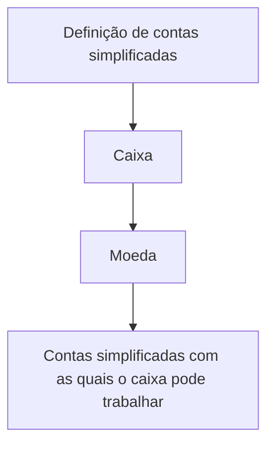

# Definição de Contas Simplificadas por Caixa no Reef

## 1. Metadados do Documento
- **Arquivo de Origem:** Não identificado
- **Tipo de Documento:** Não identificado
- **Domínio / Sistema:** Reef / documentação Mapfre
- **Público-Alvo:** Não identificado
- **Data/Versão Identificada:** Não identificada

---

## 2. Resumo Executivo & Contexto de Negócio

O conteúdo descreve uma definição em construção para determinar as contas simplificadas com as quais cada caixa pode operar, considerando a moeda. O objetivo declarado é associar contas simplificadas a cada caixa por moeda.

O material está identificado como documentação Reef e também contém a referência “Mapfredocument”. O estado “EN CONSTRUCCIÓN” indica que o conteúdo apresentado está em elaboração.

Não há detalhamento sobre critérios de elegibilidade, regras de cálculo, integração com outros sistemas, interfaces de usuário, contratos de API, persistência de dados ou procedimentos operacionais.

---

## 3. Arquitetura, Componentes & Tecnologias Envolvidas

Os elementos explicitamente citados são: documentação Reef, contas simplificadas, caixa e moeda. O conteúdo permite representar apenas a relação conceitual entre a determinação de contas e a operação de cada caixa por moeda.



**Nota de Análise:** o documento não detalha componentes de software, microsserviços, APIs, bancos de dados, tecnologias, ambientes ou protocolos de integração.

---

## 4. Regras de Negócio, Especificações Funcionais & Processos

1. O objetivo declarado é determinar as contas simplificadas disponíveis para trabalho de cada caixa.
2. A determinação das contas simplificadas deve considerar a moeda.
3. O texto não informa:
   - Quais contas são classificadas como simplificadas.
   - Como um caixa é identificado.
   - Quais moedas são permitidas.
   - Como ocorre a associação entre caixa, moeda e conta simplificada.
   - Regras de validação, aprovação, exceção ou bloqueio.
   - Responsáveis pelo cadastro, manutenção ou auditoria dessas associações.

**Nota de Análise:** o conteúdo apresenta apenas o objetivo funcional; não há processo passo a passo adicional.

---

## 5. Tabelas de Parâmetros, Ambientes e Estruturas de Dados

| Item / Parâmetro | Descrição / Função | Tipo / Valores / Formato | Ambiente / Observações |
| :--- | :--- | :--- | :--- |
| Contas simplificadas | Contas que podem ser determinadas para operação de cada caixa. | Não especificado | O documento não define a estrutura das contas. |
| Caixa | Entidade que trabalha com contas simplificadas. | Não especificado | A identificação e os atributos do caixa não são detalhados. |
| Moeda | Critério para determinar as contas simplificadas disponíveis ao caixa. | Não especificado | O documento não lista moedas suportadas. |
| Objetivo | Determinar as contas simplificadas com as quais cada caixa pode trabalhar por moeda. | Objetivo funcional | Texto apresentado no documento. |
| Lifecycle | Estado de ciclo de vida apresentado na página. | `Approved Source` | Associado à área de documentação Reef. |
| Owner | Proprietário apresentado no conteúdo. | `user:agonzalez_mapfre.com` | Valor literal extraído. |
| Idioma da interface | Idioma exibido na navegação. | `ES` | A navegação contém termos em espanhol. |
| Estado do conteúdo | Estado indicado no topo do material. | `EN CONSTRUCCIÓN` | Indica conteúdo em construção. |

---

## 6. Bateria de Perguntas & Respostas para RAG (FAQ Sintético)

### P1: Qual é o objetivo da definição de contas simplificadas por caixa?
**R:** O objetivo é determinar as contas simplificadas com as quais cada caixa pode trabalhar, considerando a moeda.

### P2: A moeda influencia quais contas simplificadas um caixa pode utilizar?
**R:** Sim. O objetivo informa que as contas simplificadas devem ser determinadas para cada caixa por moeda.

### P3: O documento lista as moedas suportadas?
**R:** Não. O conteúdo apenas informa que a determinação ocorre por moeda, sem listar moedas específicas.

### P4: O documento explica como uma conta é classificada como conta simplificada?
**R:** Não. O texto menciona “contas simplificadas”, mas não apresenta definição, atributos ou critérios de classificação.

### P5: O documento descreve APIs ou microsserviços relacionados às contas simplificadas?
**R:** Não. Não há métodos HTTP, contratos JSON, APIs, microsserviços ou tecnologias de integração detalhados.

### P6: Qual é o estado do conteúdo apresentado?
**R:** O conteúdo está marcado como `EN CONSTRUCCIÓN`, indicando que está em construção.

### P7: Qual sistema ou área documental é mencionada no conteúdo?
**R:** O conteúdo menciona “DOCUMENTACIÓN Reef” e também a referência “Mapfredocument”.

### P8: Quem é o owner indicado na documentação?
**R:** O owner indicado é `user:agonzalez_mapfre.com`.

### P9: Qual lifecycle é apresentado para a documentação?
**R:** O lifecycle exibido é `Approved Source`.

### P10: O documento fornece um processo operacional para configurar contas por caixa e moeda?
**R:** Não. O conteúdo apresenta o objetivo funcional, mas não descreve etapas de configuração, validação, aprovação ou manutenção.

---

## 7. Glossário de Termos, Siglas & Conceitos-Chave

- **Reef:** Nome presente nas referências “Documentation / DOCUMENTACIÓN Reef” e “DOCUMENTACIÓN Reef”; o documento não expande ou define o termo.
- **Conta simplificada:** Conta que pode ser determinada para utilização por um caixa; o documento não fornece definição adicional.
- **Caixa:** Entidade para a qual são determinadas contas simplificadas por moeda; o documento não detalha suas propriedades.
- **Moeda:** Critério associado à determinação das contas simplificadas disponíveis para cada caixa.
- **Approved Source:** Valor de lifecycle exibido na documentação.
- **Owner:** Campo que identifica o proprietário da documentação.
- **EN CONSTRUCCIÓN:** Indicação de que o conteúdo está em construção.

---

## 8. Notas Críticas, Riscos & Limitações

- O conteúdo está explicitamente marcado como `EN CONSTRUCCIÓN`.
- Não há definição formal de “conta simplificada”.
- Não há lista de caixas, moedas, contas ou relacionamentos permitidos.
- Não há regras de validação, exceções, permissões ou critérios de aprovação.
- Não há especificações técnicas de APIs, métodos HTTP, contratos de dados, logs, URLs, servidores ou ambientes.
- A referência a Reef e Mapfredocument não é detalhada; não é possível inferir responsabilidades técnicas ou funcionais adicionais.

---

## 9. Conteúdo Bruto Estruturado (Referência Fiel)

```text
--- [PÁGINA 1 DE 1] ---

EN CONSTRUCCIÓN
DEFINICIÓN de cuentas simplicadas por cajero
Objetivo
Determinar las cuentas simplicadas con las que puede trabajar cada cajero por moneda.
Propiedades generales
Propiedades generales
Documentation / DOCUMENTACIÓN Reef
DOCUMENTACIÓN Reef
Mapfredocument
DOCUMENTACIÓN Reef
Owner
user:agonzalez_mapfre.com
Lifecycle
Approved Source
 / 
 VL
Buscar Inicio Soluciones Arquitecturas APIs Componentes Cloud Documentación Zeus Reef Ayuda
ES
```
