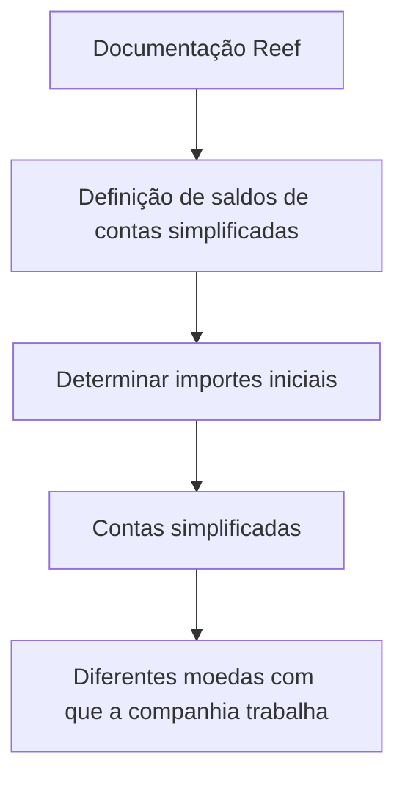

# Definição de Saldos de Contas Simplificadas — Documentação Reef

## 1. Metadados do Documento
- **Arquivo de Origem:** Não identificado
- **Tipo de Documento:** Especificação Técnica
- **Domínio / Sistema:** Reef / Mapfre
- **Público-Alvo:** Não identificado
- **Data/Versão Identificada:** Não identificada

---

## 2. Resumo Executivo & Contexto de Negócio

O conteúdo descreve o objetivo de determinar os valores iniciais das contas simplificadas nas diferentes moedas utilizadas pela companhia. O tema é apresentado sob o título “Definición de saldos de cuentas simplificadas”.

A documentação está associada ao contexto “Reef”, com referências a “DOCUMENTACIÓN Reef”, “Mapfredocument” e ao portal de documentação corporativa que disponibiliza áreas como Soluções, Arquiteturas, APIs, Componentes, Cloud, Zeus e Reef.

O trecho identifica o estado de ciclo de vida como “Approved Source” e atribui a propriedade do conteúdo ao usuário `agonzalez_mapfre.com`.

O material extraído não detalha regras de cálculo, fontes de dados, moedas suportadas, estruturas de contas, APIs, contratos, ambientes ou mecanismos de atualização dos saldos iniciais.

---

## 3. Arquitetura, Componentes & Tecnologias Envolvidas

Componentes e termos explicitamente citados:

| Componente / Termo | Contexto identificado |
| :--- | :--- |
| Reef | Contexto de documentação e domínio associado ao documento |
| Mapfredocument | Referência apresentada no cabeçalho ou navegação |
| Zeus | Área referenciada na navegação do portal |
| Cloud | Área referenciada na navegação do portal |
| APIs | Área referenciada na navegação do portal |
| Componentes | Área referenciada na navegação do portal |
| Arquiteturas | Área referenciada na navegação do portal |
| Soluções | Área referenciada na navegação do portal |



> **Nota de Análise:** O conteúdo não descreve arquitetura de software, integrações, microsserviços, banco de dados, APIs ou fluxos técnicos adicionais.

---

## 4. Regras de Negócio, Especificações Funcionais & Processos

### Objetivo funcional identificado

A definição de saldos de contas simplificadas tem como objetivo:

1. Determinar os importes iniciais.
2. Aplicar a determinação às contas simplificadas.
3. Considerar as diferentes moedas com as quais a companhia trabalha.

### Regras e restrições explicitamente disponíveis

| Regra / Condição | Detalhamento |
| :--- | :--- |
| Objeto da determinação | Importes iniciais das contas simplificadas |
| Escopo monetário | Diferentes moedas utilizadas pela companhia |
| Fórmula de cálculo | Não detalhada |
| Fonte dos saldos iniciais | Não detalhada |
| Periodicidade de apuração | Não detalhada |
| Critérios de validação | Não detalhados |
| Tratamento de conversão cambial | Não detalhado |
| Processo operacional | Não detalhado |

> **Nota de Análise:** O documento declara o objetivo da definição de saldos, mas não apresenta passos operacionais, fórmulas, regras de conversão ou critérios de validação.

---

## 5. Tabelas de Parâmetros, Ambientes e Estruturas de Dados

| Item / Parâmetro | Descrição / Função | Tipo / Valores / Formato | Ambiente / Observações |
| :--- | :--- | :--- | :--- |
| Contas simplificadas | Entidades para as quais devem ser determinados importes iniciais | Não especificado | Escopo central do documento |
| Importes iniciais | Valores a serem determinados para as contas simplificadas | Não especificado | Não há fórmula ou origem informada |
| Moedas | Diferentes moedas com que a companhia trabalha | Não especificadas | O documento não lista códigos, moedas ou critérios cambiais |
| Owner | Proprietário indicado para o conteúdo | `user:agonzalez_mapfre.com` | Apresentado na interface documental |
| Lifecycle | Estado do ciclo de vida do conteúdo | `Approved Source` | Apresentado na interface documental |
| Idioma | Idioma exibido na navegação | `ES` | Conteúdo principal em espanhol |

---

## 6. Bateria de Perguntas & Respostas para RAG (FAQ Sintético)

### P1: Qual é o objetivo da definição de saldos de contas simplificadas?
**R:** O objetivo é determinar os importes iniciais das contas simplificadas para as diferentes moedas com as quais a companhia trabalha.

### P2: O documento informa quais moedas são usadas pela companhia?
**R:** Não. O documento afirma que a companhia trabalha com diferentes moedas, mas não relaciona quais são essas moedas.

### P3: Quais contas estão no escopo da definição de saldos?
**R:** O escopo mencionado é formado pelas contas simplificadas. O conteúdo não apresenta identificadores, categorias ou uma lista dessas contas.

### P4: Como os importes iniciais das contas simplificadas são calculados?
**R:** O documento não fornece fórmula, algoritmo, critérios, fontes de dados ou regras de cálculo para os importes iniciais.

### P5: Há instruções sobre conversão entre moedas?
**R:** Não. Embora o objetivo considere diferentes moedas, não há detalhamento sobre taxas cambiais, conversão, arredondamento ou moeda base.

### P6: Qual é o status do ciclo de vida da documentação?
**R:** O estado exibido para o ciclo de vida é `Approved Source`.

### P7: Quem é indicado como owner da documentação?
**R:** O owner indicado é `user:agonzalez_mapfre.com`.

### P8: Qual sistema ou domínio está associado ao documento?
**R:** O documento está associado à “DOCUMENTACIÓN Reef”, com referência adicional a “Mapfredocument”.

### P9: O documento especifica APIs ou integrações para consultar ou atualizar saldos?
**R:** Não. A navegação do portal cita APIs, mas o conteúdo extraído não descreve endpoints, métodos HTTP, contratos ou integrações.

### P10: Existem ambientes técnicos identificados para a definição de saldos?
**R:** Não. O conteúdo não identifica ambientes como desenvolvimento, homologação, produção ou seus respectivos URLs e servidores.

---

## 7. Glossário de Termos, Siglas & Conceitos-Chave

- **Contas simplificadas:** Contas para as quais o documento indica que devem ser determinados importes iniciais.
- **Importes iniciais:** Valores iniciais que devem ser determinados para as contas simplificadas.
- **Reef:** Nome associado à documentação apresentada.
- **Mapfredocument:** Termo exibido no contexto da documentação.
- **Approved Source:** Estado de ciclo de vida exibido para o conteúdo.
- **Owner:** Campo que identifica o proprietário do conteúdo documental.
- **Zeus:** Área ou referência apresentada na navegação do portal documental.

---

## 8. Notas Críticas, Riscos & Limitações

- O trecho extraído é resumido e não descreve o método de determinação dos importes iniciais.
- Não há lista de moedas, contas simplificadas, parâmetros, fórmulas ou fontes de dados.
- Não há informação sobre integrações, APIs, contratos, ambientes, logs ou responsabilidades operacionais.
- Não é possível inferir regras de conversão cambial, periodicidade, validações ou tratamento de exceções sem extrapolar o conteúdo.
- Alguns caracteres do texto extraído apresentam codificação incorreta, como em `simplicadas`; o contexto indica a expressão “simplificadas”.

---

## 9. Conteúdo Bruto Estruturado (Referência Fiel)

```text
--- [PÁGINA 1 DE 1] ---

EN CONSTRUCCIÓN
DEFINICIÓN de saldos de cuentas simplicadas
Objetivo
Determinar los importes iniciales de las cuentas simplicadas por las distintas monedas con las que trabaja la compañía.
Propiedades generales
Propiedades generales
Documentation / DOCUMENTACIÓN Reef
DOCUMENTACIÓN Reef
Mapfredocument
DOCUMENTACIÓN Reef
Owner
user:agonzalez_mapfre.com
Lifecycle
Approved Source
 / 
 VL
Buscar Inicio Soluciones Arquitecturas APIs Componentes Cloud Documentación Zeus Reef Ayuda
ES
```
