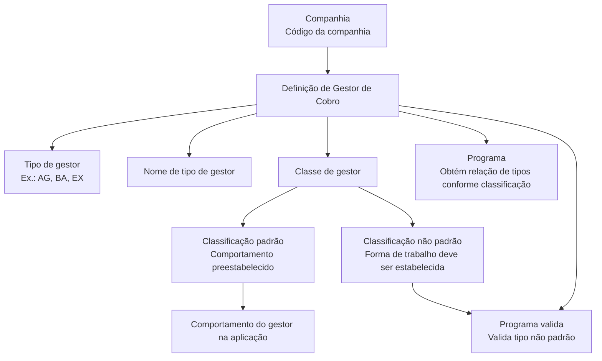

# Definição de Gestor de Cobro — Classificação e Comportamento na Aplicação Reef

## 1. Metadados do Documento
- **Arquivo de Origem:** Não identificado no conteúdo fornecido
- **Tipo de Documento:** Especificação Técnica
- **Domínio / Sistema:** Reef / Mapfre
- **Público-Alvo:** Não identificado explicitamente; conteúdo direcionado à definição e configuração de tipos de gestores de cobrança
- **Data/Versão Identificada:** Não identificada

---

## 2. Resumo Executivo & Contexto de Negócio

O documento define o conceito de **Gestor de cobro** no contexto da aplicação Reef. O objetivo é determinar a classificação aplicável a pessoas ou entidades que atuam como gestores para a cobrança de recibos.

A aplicação permite criar tipos de gestores de cobrança associados a uma classificação padrão. Quando um tipo de gestor utiliza uma classificação padrão, o comportamento do gestor já está preestabelecido pela aplicação. Os valores padrão abrangem classificações como agente, banco, cobrador, débito automático em conta, gestor direto, gestor piloto de cosseguro, escritório comercial, débito com cartão de crédito e gestor de inadimplência.

Também é possível criar tipos de gestores de cobrança com uma classificação diferente das classificações padrão. Esses tipos são considerados não padronizados e exigem a definição da forma de trabalho aplicável. Para gestores não padronizados, o documento prevê uma lógica de negócio de validação específica.

A definição de um tipo de gestor de cobrança inclui a companhia, o código do tipo de gestor, o nome descritivo, a classe do gestor e as lógicas de negócio associadas à obtenção e validação dos tipos de gestor. O documento também estabelece um vínculo com a definição de companhia.

---

## 3. Arquitetura, Componentes & Tecnologias Envolvidas

Os componentes e atributos explicitamente citados são:

- **Reef:** aplicação/documentação em que a definição de Gestor de cobro está inserida.
- **Companhia:** entidade identificada por código e associada à definição do tipo de gestor de cobrança.
- **Tipo de gestor:** código que identifica o tipo de gestor na aplicação, como `AG`, `BA` ou `EX`.
- **Nome de tipo de gestor:** descrição legível do tipo de gestor.
- **Classe de gestor:** classificação que determina o comportamento do gestor na aplicação.
- **Programa:** lógica de negócio que obtém a relação de tipos de gestores de cobrança conforme sua classificação.
- **Programa valida:** lógica de negócio que valida tipos de gestor não classificados no padrão.
- **Definição de companhia:** vínculo documental ou funcional associado à definição do Gestor de cobro.



> **Nota de Análise:** O documento menciona as lógicas de negócio `Programa` e `Programa valida`, mas não detalha tecnologias, nomes técnicos de programas, métodos, interfaces, contratos de entrada/saída ou regras internas dessas lógicas.

---

## 4. Regras de Negócio, Especificações Funcionais & Processos

### Objetivo funcional

A definição de Gestor de cobro determina a classificação que pode ser atribuída a pessoas ou entidades que atuam como gestores para a cobrança de recibos.

### Criação de tipos de gestores de cobrança

1. Podem ser criados tipos de gestores de cobrança associados à classificação padrão da aplicação.
2. Um tipo de gestor associado a uma classificação padrão possui comportamento preestabelecido na aplicação.
3. Podem ser criados novos tipos de gestores com classificação distinta da classificação padrão.
4. Um tipo de gestor cuja classificação não pertence à lista padrão é considerado um gestor não padrão.
5. Para um gestor não padrão, é necessário estabelecer a forma de trabalho aplicável ao tipo de gestor.
6. A validação de um tipo de gestor não padrão é realizada pela lógica de negócio indicada no atributo **Programa valida**.

### Regras dos atributos

#### Companhia
- Contém o código da companhia para a qual está sendo definido o tipo de gestor de cobrança.

#### Tipo de gestor
- Contém o tipo de gestor de cobrança que está sendo definido.
- O código do tipo de gestor é o identificador utilizado pela aplicação.
- Exemplos apresentados: `AG` e `BA`.

#### Nome de tipo de gestor
- Contém a descrição do tipo de gestor de cobrança definido.
- Exemplos apresentados:
  - Tipo de gestor `AG` → nome `Agente`.
  - Tipo de gestor `BA` → nome `Banco`.

#### Classe de gestor
- Contém a classificação do gestor.
- A classe de gestor determina o comportamento do gestor dentro da aplicação.
- Classes padrão possuem comportamento preestabelecido.
- Uma classe que não pertença à classificação padrão indica que o gestor não é padrão.

#### Programa
- Contém a lógica de negócio que obtém a relação de tipos de gestores de cobrança conforme a classificação do gestor.

#### Programa valida
- Contém a lógica de negócio que valida o tipo de gestor de cobrança quando o gestor não está classificado no padrão.

### Exemplos de classificação

- Tipo de gestor `AG`, nome `Agente`, classe `1 (AGENTE)`.
- Tipo de gestor `BA`, nome `Banco`, classe `2 (BANCO)`.
- Tipo de gestor `EX`, nome `Cobrador especial externo`, classe `9 (não é um gestor padrão)`.

---

## 5. Tabelas de Parâmetros, Ambientes e Estruturas de Dados

| Item / Parâmetro | Descrição / Função | Tipo / Valores / Formato | Ambiente / Observações |
| :--- | :--- | :--- | :--- |
| Companhia | Código da companhia para a qual o tipo de gestor de cobrança está sendo definido | Código de companhia; formato não detalhado | Associado à definição do tipo de gestor |
| Tipo de gestor | Identifica o tipo de gestor de cobrança na aplicação | Código; exemplos: `AG`, `BA`, `EX` | Identificador do tipo de gestor |
| Nome de tipo de gestor | Descrição do tipo de gestor de cobrança | Texto; exemplos: `Agente`, `Banco`, `Cobrador especial externo` | Associado ao código do tipo de gestor |
| Classe de gestor | Classificação que determina o comportamento do gestor na aplicação | Valor numérico de classificação | Valores fora da lista padrão caracterizam gestor não padrão |
| Programa | Lógica de negócio para obter a relação de tipos de gestores conforme sua classificação | Lógica de negócio; nome técnico não detalhado | Não foram especificados programa, linguagem ou contrato |
| Programa valida | Lógica de negócio para validar tipos de gestores não padrão | Lógica de negócio; nome técnico não detalhado | Aplicável quando a classe não pertence ao padrão |
| Vínculo | Relação documental ou funcional indicada | `DEFINICION de compañía` | Sem detalhamento adicional |

### Classes padrão de gestor

| Classe | Classificação | Comportamento / Observação |
| :--- | :--- | :--- |
| 1 | AGENTE | Classificação padrão; comportamento preestabelecido pela aplicação |
| 2 | BANCO | Classificação padrão; comportamento preestabelecido pela aplicação |
| 3 | COBRADOR | Classificação padrão; comportamento preestabelecido pela aplicação |
| 4 | DÉBITO AUTOMÁTICO EM CONTA | Classificação padrão; comportamento preestabelecido pela aplicação |
| 5 | GESTOR DIRETO | Classificação padrão; comportamento preestabelecido pela aplicação |
| 6 | GESTOR PILOTO COASEGURO | Classificação padrão; comportamento preestabelecido pela aplicação |
| 7 | OFICINA COMERCIAL | Classificação padrão; comportamento preestabelecido pela aplicação |
| 8 | DÉBITO COM CARTÃO DE CRÉDITO | Classificação padrão; comportamento preestabelecido pela aplicação |
| 10 | GESTOR DE IMPAGOS | Classificação padrão; comportamento preestabelecido pela aplicação |
| 9 | Não é gestor padrão | Exemplo apresentado para `Cobrador especial externo`; exige estabelecimento da forma de trabalho e validação aplicável |

> **Nota de Análise:** O documento não informa se a classe `9` é uma classificação formalmente reservada. O texto apenas utiliza a classe `9` como exemplo de valor que não pertence à classificação padrão.

---

## 6. Bateria de Perguntas & Respostas para RAG (FAQ Sintético)

### P1: Qual é o objetivo da definição de Gestor de cobro no Reef?
**R:** O objetivo é determinar a classificação que podem ter pessoas ou entidades que atuam como gestores para a cobrança de recibos. A classificação determina o comportamento do gestor dentro da aplicação.

### P2: O que acontece quando um tipo de gestor possui uma classificação padrão?
**R:** Quando um tipo de gestor de cobrança está associado a uma classificação padrão da aplicação, o comportamento desse gestor já está preestabelecido.

### P3: Como a aplicação identifica um tipo de gestor de cobrança?
**R:** A aplicação identifica o tipo de gestor por meio do atributo **Tipo de gestor**, que contém o código do tipo definido. O documento apresenta como exemplos os códigos `AG`, `BA` e `EX`.

### P4: Quais atributos compõem a definição de um tipo de gestor de cobrança?
**R:** A definição inclui os atributos Companhia, Tipo de gestor, Nome de tipo de gestor, Classe de gestor, Programa e Programa valida. O documento também indica um vínculo com a definição de companhia.

### P5: Qual é a finalidade do atributo Companhia?
**R:** O atributo Companhia contém o código da companhia para a qual o tipo de gestor de cobrança está sendo definido.

### P6: Quais são as classificações padrão de gestor listadas no documento?
**R:** As classificações padrão listadas são: `1 AGENTE`, `2 BANCO`, `3 COBRADOR`, `4 DÉBITO AUTOMÁTICO EM CONTA`, `5 GESTOR DIRETO`, `6 GESTOR PILOTO COASEGURO`, `7 OFICINA COMERCIAL`, `8 DÉBITO COM CARTÃO DE CRÉDITO` e `10 GESTOR DE IMPAGOS`.

### P7: Como identificar um gestor de cobrança não padrão?
**R:** Um gestor é considerado não padrão quando o atributo Classe de gestor contém um valor que não pertence à lista de classificações padrão. O documento apresenta o tipo `EX`, com nome `Cobrador especial externo` e classe `9`, como exemplo de gestor não padrão.

### P8: O que deve ser feito para um gestor cuja classificação não é padrão?
**R:** Para um tipo de gestor com classificação diferente da classificação padrão, é necessário estabelecer a forma de trabalho aplicável a esse tipo de gestor. A validação do tipo não padrão é atribuída à lógica de negócio do atributo Programa valida.

### P9: Qual é a responsabilidade do atributo Programa?
**R:** O atributo Programa contém a lógica de negócio que obtém a relação de tipos de gestores de cobrança de acordo com a classificação de cada gestor.

### P10: Quando a lógica Programa valida deve ser utilizada?
**R:** A lógica Programa valida deve ser utilizada para validar o tipo de gestor de cobrança quando esse tipo não está classificado dentro do padrão definido pela aplicação.

### P11: Qual é o exemplo de configuração para o tipo de gestor AG?
**R:** O documento apresenta o tipo de gestor `AG` com o nome `Agente` e a classe `1 (AGENTE)`. A classe `1` pertence à classificação padrão.

### P12: O documento especifica contratos técnicos, métodos HTTP ou estruturas JSON para os programas de negócio?
**R:** Não. O documento apenas informa a finalidade das lógicas Programa e Programa valida. Não são detalhados métodos HTTP, contratos JSON, tecnologias, nomes de programas, entradas, saídas ou mecanismos de execução.

---

## 7. Glossário de Termos, Siglas & Conceitos-Chave

- **AG:** Código de exemplo para um tipo de gestor cujo nome é `Agente`.
- **BA:** Código de exemplo para um tipo de gestor cujo nome é `Banco`.
- **EX:** Código de exemplo para um tipo de gestor denominado `Cobrador especial externo`.
- **Classe de gestor:** Classificação do gestor de cobrança que determina seu comportamento dentro da aplicação.
- **Classificação padrão:** Conjunto de classes de gestor para as quais a aplicação possui comportamento preestabelecido.
- **Gestor de cobro:** Pessoa ou entidade que atua como gestor para a cobrança de recibos.
- **Gestor não padrão:** Gestor cuja classe não pertence à lista de classificações padrão apresentada no documento.
- **Programa:** Lógica de negócio que obtém a relação entre os tipos de gestores de cobrança e sua classificação.
- **Programa valida:** Lógica de negócio que valida um tipo de gestor de cobrança não classificado no padrão.
- **Reef:** Nome da aplicação ou contexto documental citado no conteúdo.
- **Recibos:** Itens cuja cobrança é gerenciada pelos gestores de cobrança.

---

## 8. Notas Críticas, Riscos & Limitações

- O documento não identifica o arquivo de origem, data, versão, autor técnico ou histórico de alterações.
- O documento não descreve o formato, a origem ou as regras de validação do código de companhia.
- O documento não especifica como a aplicação persiste os tipos de gestores, suas classes ou seus programas associados.
- O documento não detalha a implementação técnica das lógicas **Programa** e **Programa valida**.
- Não são fornecidos contratos de integração, métodos HTTP, APIs, eventos, estruturas JSON, bancos de dados ou tecnologias de implementação.
- A classificação `9` é apresentada apenas como exemplo de valor não padrão; o documento não confirma se o valor possui uso reservado, se pode ser reutilizado ou se outros valores não padrão são permitidos.
- Não há detalhamento sobre permissões, perfis de acesso, trilhas de auditoria ou processo de aprovação para criação e alteração de gestores.
- O vínculo com **DEFINICION de compañía** é mencionado sem detalhamento do relacionamento funcional ou técnico.

---

## 9. Conteúdo Bruto Estruturado (Referência Fiel)

```text
--- [PÁGINA 1 DE 2] ---

DEFINICIÓN de Gestor de cobro
Objetivo
Determinar la clasicación que podrán tener las personas o entidades que actúen como gestores para el cobro de recibos.
Se pueden crear tipos de gestores de cobro asociados a la clasicación estándar de la aplicación, de forma que su comportamiento ya está
preestablecido, o crear nuevos tipos de gestores con una clasicación distinta a la estándar, de manera que será necesario establecer la
forma de trabajar con dicho tipo de gestor.
Propiedades
Compañía
Este atributo contiene el código de la compañía para la que se está deniendo el tipo de gestor de cobro.
Tipo de gestor
Este atributo contiene el tipo de gestor de cobro que se está deniendo, será con el que se identique el tipo de gestor en la aplicación.
Ejemplo: - Tipo de gestor: AG - Tipo de gesgor: BA
Nombre de tipo de gestor
Este atributo contiene la descripción del tipo de gestor que se está deniendo.
Ejemplo:
- Tipo de gestor: AG
Nombre de tipo de gestor: Agente
Tipo de gestor: BA
Nombre de tipo de gestor: Banco
Clase de gestor
Este atributo contiene la clasicación del gestor.
Los valores estándar podrán ser:
1: AGENTE
2: BANCO
3: COBRADOR
4: DÉBITO AUTOMATICO EN CUENTA
Documentation / DOCUMENTACIÓN Reef
DOCUMENTACIÓN Reef
Mapfredocument
DOCUMENTACIÓN Reef
Owner
user:agonzalez_mapfre.com
Lifecycle
Approved Source
 / 
 VL
Buscar Inicio Soluciones Arquitecturas APIs Componentes Cloud Documentación Zeus Reef Ayuda
ES


--- [PÁGINA 2 DE 2] ---

5: GESTOR DIRECTO
6: GESTOR PILOTO COASEGURO
7: OFICINA COMERCIAL
8: DEBITO CON TARJETA DE CREDITO
10: GESTOR DE IMPAGOS
Esta clasicación es la que determina el comportamiento del gestor dentro de la aplicación.
Si el atributo contiene un valor que no esté dentro de la clasicación anterior, indica que no es un gestor estándar.
Ejemplo:
- Tipo de gestor: AG
Nombre de tipo de gestor: Agente
Clase de gestor: 1 (AGENTE)
Tipo de gesgor: BA
Nombre de tipo de gestor: Banco
Clase de gestor: 2 (BANCO)
Tipo de gestor: EX
Nombre de tipo de gestor: Cobrador especial externo
Clase de gestor: 9 (no es un gestor estándar)
Programa
Este atributo contiene la lógica de negocio que obtiene la relación de tipos de gestores de cobro según su clasicación.
Programa valida
Este atributo contiene la lógica de negocio que valida el tipo de gestor de cobro, cuando no está clasicado dentro del estándar.
Vínculos
DEFINICION de compañía
Preguntas frecuentes
```
