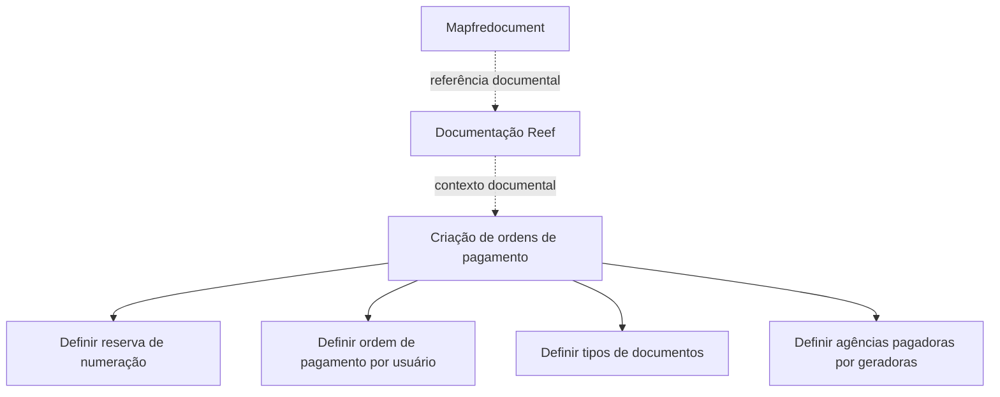

# Construção — Definição de Informações para Criação de Ordens de Pagamento

## 1. Metadados do Documento
- **Arquivo de Origem:** Não identificado
- **Tipo de Documento:** Procedimento
- **Domínio / Sistema:** Reef / Mapfre
- **Público-Alvo:** Negócio, Operação e usuários responsáveis pela definição de ordens de pagamento
- **Data/Versão Identificada:** Não identificada

---

## 2. Resumo Executivo & Contexto de Negócio

O documento apresenta uma definição em construção para o processo de criação de ordens de pagamento. O objetivo declarado é definir as informações necessárias para a criação dessas ordens.

O processo documentado identifica quatro definições necessárias: reserva de numeração da ordem de pagamento, ordem de pagamento por usuário, tipos de documentos e agências pagadoras por agências geradoras.

O conteúdo está associado à documentação Reef e referencia o ambiente documental Mapfredocument. O ciclo de vida indicado para o item documental é `Approved Source`.

O documento não detalha regras de cálculo, responsabilidades operacionais, métodos de integração, campos obrigatórios, contratos de API, critérios de aprovação ou tratamento de exceções para as ordens de pagamento.

---

## 3. Arquitetura, Componentes & Tecnologias Envolvidas

Os elementos explicitamente citados são:

- **Reef:** contexto de documentação identificado como “Documentation / DOCUMENTACIÓN Reef”.
- **Mapfredocument:** plataforma ou repositório documental mencionado no conteúdo bruto.
- **Ordens de pagamento:** objeto funcional central do procedimento.
- **Agências geradoras:** entidades que geram ordens de pagamento.
- **Agências pagadoras:** entidades definidas em relação às agências geradoras.
- **Usuário:** entidade relacionada à definição de ordem de pagamento por usuário.



**Nota de Análise:** o documento não descreve arquitetura de software, microsserviços, bancos de dados, protocolos, URLs, ambientes técnicos ou integrações entre sistemas.

---

## 4. Regras de Negócio, Especificações Funcionais & Processos

O processo para criação de ordens de pagamento requer as seguintes definições:

1. **Definir reserva de numeração da ordem de pagamento**
   - O documento indica que a numeração da ordem de pagamento deve possuir uma definição de reserva.
   - Não são detalhados formato, sequência, faixa numérica, mecanismo de geração, unicidade ou tratamento de colisões.

2. **Definir ordem de pagamento por usuário**
   - O documento indica uma definição de ordem de pagamento relacionada a usuário.
   - Não são detalhados os usuários elegíveis, níveis de autorização, regras de associação ou permissões.

3. **Definir tipos de documentos**
   - O documento estabelece a necessidade de definir os tipos de documentos.
   - Não são informados códigos, classificações, obrigatoriedade, validações ou relação entre tipos de documentos e ordens de pagamento.

4. **Definir agências pagadoras por agências geradoras**
   - O documento exige a definição da associação entre agências pagadoras e agências geradoras.
   - Não são detalhadas regras de mapeamento, cardinalidade, critérios geográficos, exceções ou responsáveis pela manutenção da associação.

---

## 5. Tabelas de Parâmetros, Ambientes e Estruturas de Dados

| Item / Parâmetro | Descrição / Função | Tipo / Valores / Formato | Ambiente / Observações |
| :--- | :--- | :--- | :--- |
| Reserva de numeração da ordem de pagamento | Definição necessária para criação de ordens de pagamento | Não detalhado | Não há regras de numeração ou formato informadas |
| Ordem de pagamento por usuário | Definição de ordem de pagamento relacionada a usuário | Não detalhado | Usuários e permissões não são especificados |
| Tipos de documentos | Definição dos documentos associados ao processo | Não detalhado | Não há catálogo, códigos ou validações |
| Agências pagadoras por geradoras | Associação entre agências pagadoras e geradoras | Não detalhado | Não há critérios de associação informados |
| Documentação Reef | Contexto documental mencionado | `Documentation / DOCUMENTACIÓN Reef` | Referência documental |
| Mapfredocument | Repositório ou plataforma documental citada | `Mapfredocument` | Função técnica não detalhada |
| Owner | Proprietário indicado no conteúdo | `user:agonzalez_mapfre.com` | Identificador apresentado literalmente |
| Lifecycle | Estado do ciclo de vida do documento | `Approved Source` | Sem detalhamento do processo de aprovação |
| Idioma | Idioma indicado na interface documental | `ES` | Conteúdo apresentado predominantemente em espanhol |

---

## 6. Bateria de Perguntas & Respostas para RAG (FAQ Sintético)

### P1: Qual é o objetivo do documento sobre definição de ordem de pagamento?
**R:** O objetivo é definir as informações necessárias para a criação de ordens de pagamento.

### P2: Quais definições são necessárias para o processo de criação de ordens de pagamento?
**R:** O documento identifica quatro definições: reserva de numeração da ordem de pagamento, ordem de pagamento por usuário, tipos de documentos e agências pagadoras por agências geradoras.

### P3: O documento especifica como deve ser gerada a numeração da ordem de pagamento?
**R:** Não. O documento apenas indica que deve existir uma definição de reserva de numeração da ordem de pagamento, sem informar formato, sequência, faixa numérica ou mecanismo de geração.

### P4: Quais regras de usuário são descritas para uma ordem de pagamento?
**R:** O documento informa que deve ser definida uma ordem de pagamento por usuário, mas não detalha usuários elegíveis, perfis, permissões, responsabilidades ou fluxos de aprovação.

### P5: O documento apresenta os tipos de documentos aceitos para uma ordem de pagamento?
**R:** Não. O documento exige a definição de tipos de documentos, mas não apresenta um catálogo de tipos, códigos, campos, critérios de obrigatoriedade ou validações.

### P6: Como as agências pagadoras são associadas às agências geradoras?
**R:** O documento estabelece que agências pagadoras devem ser definidas por agências geradoras. Entretanto, não descreve regras de associação, critérios de seleção, cardinalidade ou exceções.

### P7: Qual sistema ou contexto documental é citado para o processo?
**R:** O conteúdo referencia “Documentation / DOCUMENTACIÓN Reef”, “DOCUMENTACIÓN Reef” e “Mapfredocument”. A função técnica desses elementos não é detalhada.

### P8: Qual é o estado de ciclo de vida identificado no documento?
**R:** O ciclo de vida identificado é `Approved Source`.

### P9: Quem está identificado como proprietário do documento?
**R:** O conteúdo bruto identifica o proprietário como `user:agonzalez_mapfre.com`.

### P10: O documento fornece detalhes de APIs, integrações ou contratos técnicos?
**R:** Não. Não há métodos HTTP, endpoints, contratos JSON, tecnologias de integração, URLs ou especificações técnicas de interfaces descritos no material.

---

## 7. Glossário de Termos, Siglas & Conceitos-Chave

- **Ordem de pagamento:** entidade funcional cuja criação é o objetivo central do documento.
- **Reserva de numeração:** definição requerida para a numeração de uma ordem de pagamento; regras específicas não foram informadas.
- **Agência geradora:** agência relacionada à geração de ordens de pagamento.
- **Agência pagadora:** agência relacionada ao pagamento e definida em relação a uma agência geradora.
- **Reef:** contexto ou área de documentação mencionada no documento.
- **Mapfredocument:** nome citado como referência documental; sua função não é explicitada.
- **Lifecycle:** campo de ciclo de vida documental.
- **Approved Source:** valor apresentado para o campo `Lifecycle`.
- **ES:** indicação de idioma exibida no conteúdo.

---

## 8. Notas Críticas, Riscos & Limitações

- O documento está marcado como **“EN CONSTRUCCIÓN”**, indicando conteúdo ainda em elaboração.
- Não há detalhamento dos dados necessários para criar uma ordem de pagamento.
- Não são informados critérios de validação, obrigatoriedade, perfis de acesso, responsabilidades ou fluxos de aprovação.
- Não há especificação de integração, APIs, contratos de dados, persistência, logs ou tratamento de erros.
- A relação entre agências pagadoras e geradoras é citada, mas não possui critérios operacionais documentados.
- **Nota de Análise:** o documento lista definições funcionais, porém não detalha métodos, regras técnicas ou estruturas de dados para sua implementação.

---

## 9. Conteúdo Bruto Estruturado (Referência Fiel)

```text
--- [PÁGINA 1 DE 1] ---

EN CONSTRUCCIÓN
DEFINICIÓN de orden de pago
Objetivo
Denición de la información necesaria para la creación de órdenes de pago
Proceso a seguir
DEFINIR reserva
numeración orden pago
(1)
DEFINIR orden
pago por usuario
(2)
DEFINIR tipo
de documentos
(3)
DEFINIR agencias
pagadoras por generadoras
(4)
1. DEFINIR reserva numeración orden pago
1. DEFINIR orden pago por usuario
1. DEFINIR tipo de documentos
1. DEFINIR agencias pagadoras por generadoras
Documentation / DOCUMENTACIÓN Reef
DOCUMENTACIÓN Reef
Mapfredocument
DOCUMENTACIÓN Reef
Owner
user:agonzalez_mapfre.com
Lifecycle
Approved Source
 /
VL
Buscar Inicio Soluciones Arquitecturas APIs Componentes Cloud Documentación Zeus Reef Ayuda
ES
```
