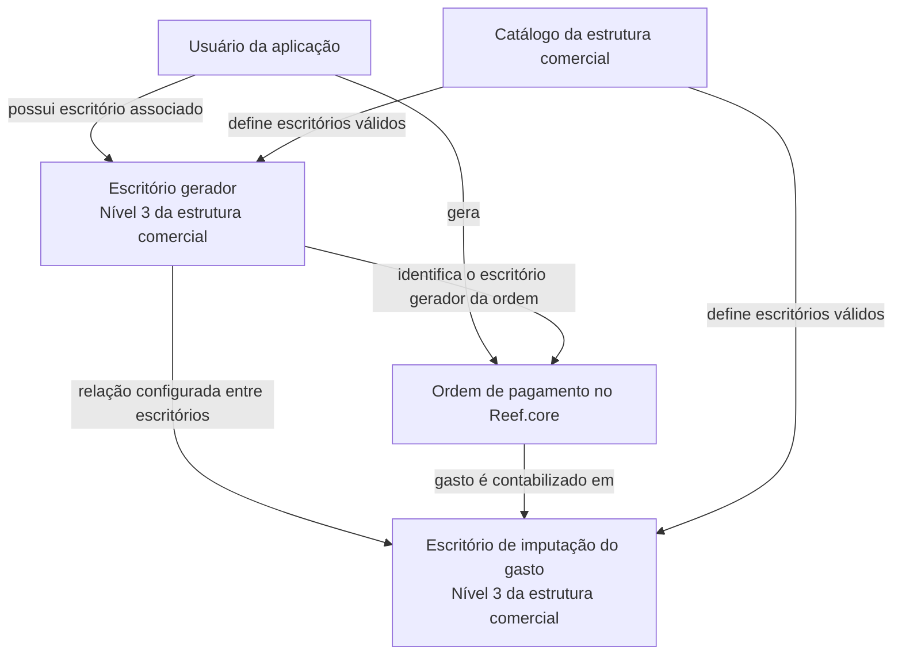

# Definición de la Relación entre Oficinas Generadoras y Pagadoras en Reef.core

## 1. Metadados do Documento
- **Arquivo de Origem:** `Não identificado — conteúdo bruto fornecido na solicitação`
- **Tipo de Documento:** `Especificação Técnica / Funcional`
- **Domínio / Sistema:** `Reef.core / Mapfre`
- **Público-Alvo:** `Desenvolvedores, analistas funcionais, operação e equipes responsáveis pela estrutura comercial`
- **Data/Versão Identificada:** `Não identificada`
- **Status de Lifecycle Identificado:** `Approved Source`

---

## 2. Resumo Executivo & Contexto de Negócio

O documento define a relação entre escritórios que geram ordens de pagamento e os escritórios aos quais o gasto dessas ordens deve ser imputado contabilmente. O objetivo funcional é determinar, para cada escritório autorizado a gerar uma ordem de pagamento, qual escritório pagador ou responsável recebe a contabilização do gasto associado.

No sistema Reef.core, a identificação do escritório gerador não é informada manualmente no fluxo descrito. O escritório é obtido a partir do usuário que está gerando a ordem de pagamento. Cada usuário da aplicação possui um escritório associado.

Tanto o escritório gerador quanto o escritório ao qual o gasto será imputado devem existir no catálogo da estrutura comercial da companhia. Para ambos os atributos, o documento estabelece que o escritório correspondente deve pertencer ao nível 3 da estrutura comercial.

A especificação descreve uma configuração relacional entre escritórios: uma chave identifica o escritório que pode gerar ordens de pagamento e outra chave identifica o escritório que receberá a imputação do gasto. O documento não detalha interfaces, métodos HTTP, contratos JSON, persistência, regras de exceção ou critérios para selecionar um escritório pagador quando não existir relacionamento configurado.

---

## 3. Arquitetura, Componentes & Tecnologias Envolvidas

### Componentes e entidades identificadas

| Componente / Entidade | Papel descrito |
| :--- | :--- |
| `Reef.core` | Aplicação na qual uma ordem de pagamento é gerada e onde o escritório gerador é identificado a partir do usuário. |
| Usuário da aplicação | Entidade que gera a ordem de pagamento e possui um escritório associado. |
| Escritório gerador | Escritório autorizado a gerar ordens de pagamento; deve estar definido no catálogo da estrutura comercial, no nível 3. |
| Ordem de pagamento | Ordem gerada por um usuário no Reef.core; o respectivo gasto será imputado a um escritório. |
| Escritório de imputação do gasto | Escritório ao qual o gasto da ordem de pagamento é contabilizado; deve estar definido no catálogo da estrutura comercial, no nível 3. |
| Catálogo da estrutura comercial | Catálogo corporativo que contém os escritórios válidos envolvidos na relação. |
| Estrutura comercial — nível 3 | Nível organizacional exigido para escritórios geradores e escritórios de imputação de gasto. |



**Nota de Análise:** o documento define a relação funcional entre usuários, escritórios e ordens de pagamento, mas não apresenta detalhes de implementação técnica, como banco de dados, APIs, serviços, tecnologias de integração ou ambientes.

---

## 4. Regras de Negócio, Especificações Funcionais & Processos

### Regra 1 — Objetivo da relação entre escritórios

Para cada escritório que pode gerar ordens de pagamento, deve ser definido o escritório de pagamento correspondente. A finalidade dessa relação é determinar o escritório ao qual será contabilizado o gasto da ordem de pagamento gerada.

### Regra 2 — Escritório gerador da ordem de pagamento

A chave do escritório que gera a ordem de pagamento contém os escritórios autorizados a gerar ordens de pagamento.

O escritório gerador deve atender simultaneamente aos seguintes critérios:

1. Estar definido no catálogo da estrutura comercial da companhia.
2. Corresponder ao nível 3 da estrutura comercial.
3. Estar associado ao usuário da aplicação que está gerando a ordem de pagamento no Reef.core.

### Regra 3 — Identificação do escritório no Reef.core

O escritório que está gerando a ordem de pagamento no Reef.core é determinado a partir do escritório atribuído ao usuário que realiza a geração.

Não há indicação de que o usuário selecione um escritório no momento da geração. A identificação ocorre pelo vínculo já atribuído a cada usuário na aplicação.

### Regra 4 — Escritório de imputação do gasto

A chave do escritório ao qual será imputado o gasto contém os escritórios que receberão a imputação contábil do gasto associado à ordem de pagamento.

O escritório de imputação do gasto deve atender simultaneamente aos seguintes critérios:

1. Estar definido no catálogo da estrutura comercial da companhia.
2. Corresponder ao nível 3 da estrutura comercial.
3. Ser o escritório definido na relação com o escritório que gerou a ordem de pagamento.

### Fluxo funcional identificado

1. Um usuário da aplicação gera uma ordem de pagamento no Reef.core.
2. O Reef.core obtém o escritório associado ao usuário que está gerando a ordem.
3. O escritório associado ao usuário é tratado como escritório gerador da ordem de pagamento.
4. O escritório gerador deve estar configurado no catálogo da estrutura comercial, no nível 3.
5. A relação entre o escritório gerador e o escritório de imputação determina onde o gasto da ordem será contabilizado.
6. O escritório de imputação do gasto também deve estar configurado no catálogo da estrutura comercial, no nível 3.

**Nota de Análise:** o documento não detalha o comportamento em casos de ausência de escritório associado ao usuário, escritório fora do nível 3, relacionamento não configurado ou falha na consulta ao catálogo da estrutura comercial.

---

## 5. Tabelas de Parâmetros, Ambientes e Estruturas de Dados

| Item / Parâmetro | Descrição / Função | Tipo / Valores / Formato | Ambiente / Observações |
| :--- | :--- | :--- | :--- |
| Chave do escritório que gera a ordem de pagamento | Contém os escritórios que podem gerar ordens de pagamento. | Escritório da estrutura comercial; nível 3. | Deve estar definido no catálogo da estrutura comercial da companhia. |
| Chave do escritório ao qual será imputado o gasto | Contém os escritórios aos quais será imputado o gasto da ordem de pagamento. | Escritório da estrutura comercial; nível 3. | Deve estar definido no catálogo da estrutura comercial da companhia. |
| Escritório do usuário | Escritório usado para identificar qual escritório está gerando a ordem no Reef.core. | Escritório associado ao usuário da aplicação; nível 3 da estrutura comercial. | Cada usuário possui um escritório atribuído. |
| Ordem de pagamento | Objeto de negócio cujo gasto será contabilizado em um escritório definido pela relação. | Não detalhado. | Gerada no Reef.core. |
| Catálogo da estrutura comercial | Fonte de definição dos escritórios válidos envolvidos no processo. | Catálogo organizacional. | Os dois escritórios da relação devem existir nesse catálogo. |
| Nível da estrutura comercial | Nível organizacional exigido para os escritórios geradores e para os escritórios de imputação. | Nível `3`. | Requisito explícito do documento. |
| Ambiente | Ambiente técnico, URL ou servidor. | Não informado. | O documento não apresenta URLs, servidores, portas ou variáveis de ambiente. |
| Logs e observabilidade | Rotas, arquivos ou variáveis de log. | Não informado. | O documento não apresenta instruções de logging ou monitoramento. |

---

## 6. Bateria de Perguntas & Respostas para RAG (FAQ Sintético)

### P1: Qual é o objetivo da relação entre escritórios geradores e pagadores?
**R:** A relação determina, para cada escritório que pode gerar uma ordem de pagamento, o escritório correspondente ao qual será contabilizado o gasto dessa ordem de pagamento.

### P2: Como o Reef.core identifica o escritório que está gerando uma ordem de pagamento?
**R:** O Reef.core identifica o escritório gerador a partir do escritório associado ao usuário que está criando a ordem de pagamento. Cada usuário da aplicação possui um escritório atribuído.

### P3: O usuário precisa informar manualmente o escritório gerador ao criar uma ordem de pagamento?
**R:** O documento informa que o escritório gerador é obtido a partir do escritório do usuário que está gerando a ordem no Reef.core. Não há detalhamento de uma seleção manual de escritório pelo usuário.

### P4: Quais escritórios podem ser usados como escritórios geradores de ordens de pagamento?
**R:** Podem ser usados os escritórios registrados na chave de escritório gerador, desde que estejam definidos no catálogo da estrutura comercial da companhia e correspondam ao nível 3 dessa estrutura.

### P5: Quais requisitos devem ser atendidos pelo escritório que receberá a imputação do gasto?
**R:** O escritório que receberá a imputação do gasto deve estar definido no catálogo da estrutura comercial da companhia e corresponder ao nível 3 da estrutura comercial.

### P6: Onde é contabilizado o gasto de uma ordem de pagamento?
**R:** O gasto é contabilizado no escritório definido como escritório de imputação do gasto na relação correspondente ao escritório que gerou a ordem de pagamento.

### P7: Qual é a relação entre o escritório do usuário e a ordem de pagamento?
**R:** O escritório atribuído ao usuário identifica o escritório que gera a ordem de pagamento no Reef.core. Esse escritório é usado para localizar o escritório ao qual o gasto deverá ser imputado.

### P8: Qual nível da estrutura comercial é exigido para os escritórios envolvidos?
**R:** Tanto o escritório que gera a ordem de pagamento quanto o escritório ao qual o gasto será imputado devem corresponder ao nível 3 da estrutura comercial.

### P9: O documento especifica APIs, métodos HTTP ou contratos JSON para a relação entre escritórios?
**R:** Não. O documento descreve a regra funcional da relação entre escritórios, mas não detalha APIs, métodos HTTP, contratos JSON, modelos de dados físicos ou mecanismos técnicos de integração.

### P10: O que ocorre se o usuário não tiver escritório associado ou se não houver relação configurada?
**R:** O documento não descreve o comportamento para ausência de escritório associado ao usuário, ausência de relacionamento entre escritórios, escritórios inválidos ou escritórios fora do nível 3 da estrutura comercial.

---

## 7. Glossário de Termos, Siglas & Conceitos-Chave

- **Reef.core:** Aplicação mencionada como o sistema no qual o usuário gera a ordem de pagamento.
- **Ordem de pagamento:** Ordem gerada por um usuário cuja despesa deve ser imputada a um escritório.
- **Escritório gerador:** Escritório associado ao usuário que gera a ordem de pagamento.
- **Escritório pagador / escritório de imputação do gasto:** Escritório ao qual será contabilizado o gasto da ordem de pagamento.
- **Imputação do gasto:** Atribuição ou contabilização do gasto da ordem de pagamento a um escritório específico.
- **Catálogo da estrutura comercial:** Catálogo corporativo no qual os escritórios envolvidos devem estar definidos.
- **Nível 3:** Nível da estrutura comercial exigido para os escritórios geradores e para os escritórios aos quais o gasto é imputado.
- **Lifecycle — Approved Source:** Identificação exibida no conteúdo bruto, indicando o estado `Approved Source`.

---

## 8. Notas Críticas, Riscos & Limitações

- O documento não apresenta uma definição técnica do mecanismo que armazena a relação entre escritório gerador e escritório de imputação do gasto.
- Não há descrição de validações para impedir o uso de escritórios fora do nível 3 da estrutura comercial.
- Não há comportamento definido para usuários sem escritório atribuído.
- Não há comportamento definido quando não existe relacionamento configurado para um escritório gerador.
- O documento não informa URLs, ambientes, servidores, portas, logs, métricas, alertas, APIs ou contratos de integração.
- Não são apresentados critérios de autorização, perfis de acesso ou matrizes de permissão para manutenção da relação entre escritórios.
- A expressão “escritório pagador” aparece no objetivo, enquanto as propriedades detalham “escritório ao qual será imputado o gasto”; o documento não esclarece se ambos representam exatamente a mesma entidade funcional.
- O conteúdo apresenta caracteres corrompidos em palavras como `ocina` e `denir`; a interpretação semântica adotada nas seções analíticas foi limitada ao contexto explícito, sem introdução de informações externas.

---

## 9. Conteúdo Bruto Estruturado (Referência Fiel)

```text
--- [PÁGINA 1 DE 1] ---

DEFINICIÓN de la relación entre ocinas generadoras y pagadoras
Objetivo
El objetivo es denir para cada ocina que puede generar órdenes de pago, qué ocina de pago le corresponde, es decir a qué ocina se le va
a contabilizar el gasto de esa orden de pago.
Propiedades
Clave de la ocina que genera la orden de pago
Este atributo contiene las ocinas que pueden generar órdenes de Pago. Estas ocinas tienen que estar denidas en el catálogo de la
estructura comercial de la compañía, se corresponde al nivel 3.
Clave de la ocina a la que se le va a imputar el gasto
Este atributo contiene las ocinas a las que se les va a imputar el gasto. Estas ocinas tienen que estar denidas en el catálogo de la
estructura comercial de la compañía, se corresponde al nivel 3.
Preguntas frecuentes
¿Cómo se sabe la ocina que está generando la orden de pago en Reef.core?
R/ Se toma la ocina del usuario que la está generando. Cada usuario de la aplicación tiene asignada la ocina a la que pertenece, nivel 3 de
la estructura comercial.
Documentation / DOCUMENTACIÓN Reef
DOCUMENTACIÓN Reef
Mapfredocument
DOCUMENTACIÓN Reef
Owner
user:agonzalez_mapfre.com
Lifecycle
Approved Source
 / 
 VL
Buscar Inicio Soluciones Arquitecturas APIs Componentes Cloud Documentación Zeus Reef Ayuda
ES
```
