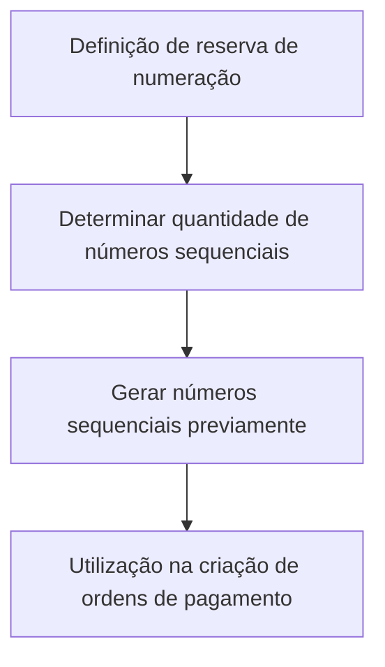

# Definição de Reserva de Numeração de Ordem de Pagamento — Documentação Reef

## 1. Metadados do Documento
- **Arquivo de Origem:** Não identificado
- **Tipo de Documento:** Especificação Técnica
- **Domínio / Sistema:** Reef / Mapfre
- **Público-Alvo:** Não identificado
- **Data/Versão Identificada:** Não identificada

---

## 2. Resumo Executivo & Contexto de Negócio

O documento define o objetivo de uma reserva de numeração para ordens de pagamento. A reserva determina previamente a quantidade de números sequenciais que será gerada.

Os números sequenciais previamente gerados podem ser utilizados na criação de ordens de pagamento. O texto não especifica o mecanismo técnico de geração, persistência, consumo, expiração ou concorrência desses números.

A documentação está associada ao contexto Reef e inclui referências a “DOCUMENTACIÓN Reef”, “Mapfredocument” e ao portal de documentação com seções como Soluções, Arquiteturas, APIs, Componentes, Cloud, Zeus, Reef e Ajuda.

O ciclo de vida registrado para o conteúdo é “Approved”. O proprietário identificado é `user:agonzalez_mapfre.com`.

---

## 3. Arquitetura, Componentes & Tecnologias Envolvidas

Os elementos explicitamente citados são:

| Componente / Termo | Papel identificado no documento |
| :--- | :--- |
| Reef | Contexto associado à documentação e à funcionalidade de reserva de numeração. |
| Ordem de pagamento | Entidade para cuja criação os números sequenciais reservados podem ser utilizados. |
| Mapfredocument | Termo exibido no conteúdo; não há detalhamento de função técnica. |
| Zeus | Seção disponível na navegação da documentação; não há relação funcional detalhada com a reserva de numeração. |
| APIs | Seção disponível na navegação; o documento não descreve APIs, métodos HTTP ou contratos. |
| Cloud | Seção disponível na navegação; o documento não descreve serviços ou infraestrutura de nuvem. |



> **Nota de Análise:** O documento não detalha microsserviços, bancos de dados, protocolos, endpoints, tecnologias de implementação ou contratos de integração.

---

## 4. Regras de Negócio, Especificações Funcionais & Processos

1. Deve ser determinada uma quantidade de números sequenciais.
2. Os números sequenciais devem ser gerados previamente.
3. Os números sequenciais previamente gerados podem ser utilizados na criação de ordens de pagamento.
4. O documento não informa:
   - Critérios para definir a quantidade reservada.
   - Formato ou tamanho dos números sequenciais.
   - Regra de reinício, expiração ou reutilização de numeração.
   - Tratamento para números não utilizados.
   - Tratamento para duplicidade, concorrência ou falha na geração.
   - Usuários, perfis ou permissões autorizados a reservar numeração.
   - Interfaces, APIs ou processos operacionais para executar a reserva.

---

## 5. Tabelas de Parâmetros, Ambientes e Estruturas de Dados

| Item / Parâmetro | Descrição / Função | Tipo / Valores / Formato | Ambiente / Observações |
| :--- | :--- | :--- | :--- |
| Quantidade de números sequenciais | Quantidade que será determinada para geração prévia. | Não especificado. | Utilizada no contexto de reserva de numeração. |
| Números sequenciais | Numeração gerada previamente. | Sequencial; formato não especificado. | Pode ser utilizada na criação de ordens de pagamento. |
| Ordem de pagamento | Entidade criada com possível uso da numeração reservada. | Não especificado. | Domínio funcional do documento. |
| Owner | Proprietário registrado para o conteúdo documental. | `user:agonzalez_mapfre.com` | Propriedade exibida no documento. |
| Lifecycle | Estado de ciclo de vida da documentação. | `Approved` | Indica conteúdo aprovado. |
| Idioma exibido | Idioma indicado na navegação. | `ES` | O conteúdo principal está em espanhol. |
| Ambientes | Referências a ambientes ou servidores. | Não especificado. | Não há URLs, hosts, portas ou credenciais no conteúdo. |
| Logs | Caminhos, níveis ou variáveis de log. | Não especificado. | Não há dados de logging no conteúdo. |

---

## 6. Bateria de Perguntas & Respostas para RAG (FAQ Sintético)

### P1: Qual é o objetivo da reserva de numeração de ordem de pagamento?
**R:** O objetivo é determinar a quantidade de números sequenciais que será gerada previamente para utilização na criação de ordens de pagamento.

### P2: Para que os números sequenciais previamente gerados podem ser usados?
**R:** Os números sequenciais previamente gerados podem ser utilizados na criação de ordens de pagamento.

### P3: O documento define como os números sequenciais são gerados?
**R:** Não. O documento informa que os números sequenciais serão gerados previamente, mas não descreve algoritmo, tecnologia, serviço, banco de dados ou processo técnico de geração.

### P4: O documento informa o formato da numeração de ordem de pagamento?
**R:** Não. Não há definição de tamanho, prefixo, máscara, intervalo, reinício ou formato dos números sequenciais.

### P5: Existe uma regra documentada para números reservados que não forem utilizados?
**R:** Não. O conteúdo não informa se números não utilizados expiram, podem ser reutilizados, são cancelados ou permanecem indisponíveis.

### P6: Quais APIs são expostas para reservar ou consumir numeração?
**R:** Nenhuma API é detalhada. Embora “APIs” apareça como item de navegação da documentação, não há métodos HTTP, URLs, parâmetros ou contratos JSON descritos.

### P7: Quem é o proprietário identificado da documentação?
**R:** O proprietário registrado no conteúdo é `user:agonzalez_mapfre.com`.

### P8: Qual é o ciclo de vida identificado para a documentação?
**R:** O ciclo de vida exibido no conteúdo é `Approved`.

### P9: O documento descreve permissões para reservar números de ordens de pagamento?
**R:** Não. O documento não identifica usuários, perfis, papéis ou matrizes de permissão relacionados à reserva ou ao uso da numeração.

### P10: O documento especifica ambientes, URLs, servidores ou portas?
**R:** Não. Não foram identificados ambientes técnicos, URLs, hosts, servidores, portas ou parâmetros de infraestrutura.

---

## 7. Glossário de Termos, Siglas & Conceitos-Chave

- **Reserva de numeração:** Determinação prévia da quantidade de números sequenciais que será gerada para possível uso na criação de ordens de pagamento.
- **Ordem de pagamento:** Entidade cuja criação pode utilizar os números sequenciais previamente gerados.
- **Números sequenciais:** Números gerados previamente no contexto da reserva de numeração.
- **Reef:** Contexto ou sistema associado à documentação apresentada.
- **Lifecycle:** Propriedade documental que indica o estado de ciclo de vida; o valor exibido é `Approved`.
- **Owner:** Propriedade documental que identifica o responsável pelo conteúdo.

---

## 8. Notas Críticas, Riscos & Limitações

- O documento apresenta apenas o objetivo funcional da reserva de numeração, sem detalhamento técnico de implementação.
- Não há definição de regras de concorrência, unicidade, recuperação após falha, expiração ou reutilização de números sequenciais.
- Não há APIs, contratos de integração, estruturas de dados, ambientes, servidores, URLs ou logs documentados.
- Não há critérios para cálculo ou determinação da quantidade de números a reservar.
- **Nota de Análise:** O conteúdo referencia Reef, Mapfredocument, Zeus, APIs e Cloud na navegação, porém não estabelece responsabilidades técnicas ou relações arquiteturais entre esses elementos.

---

## 9. Conteúdo Bruto Estruturado (Referência Fiel)

```text
--- [PÁGINA 1 DE 1] ---

EN CONSTRUCCIÓN
DEFINICIÓN de reserva de numeración de orden de pago
Objetivo
Determinar la cantidad de números secuenciales que se generarán previamente, para que puedan ser utilizadas en la creación de órdenes de
pago.
Propiedades generales
Propiedades generales
Documentation / DOCUMENTACIÓN Reef
DOCUMENTACIÓN Reef
Mapfredocument
DOCUMENTACIÓN Reef
Owner
user:agonzalez_mapfre.com
Lifecycle
Approved Source
 / 
 VL
Buscar Inicio Soluciones Arquitecturas APIs Componentes Cloud Documentación Zeus Reef Ayuda
ES
```
