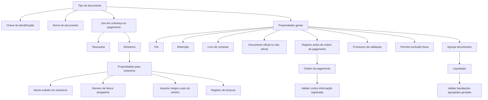

# Definição de Tipo de Documento de Cobro/Pago — Documentação Reef

## 1. Metadados do Documento
- **Arquivo de Origem:** Não identificado no conteúdo extraído
- **Tipo de Documento:** Especificação Técnica / Funcional
- **Domínio / Sistema:** Reef / Tesouraria / Siniestros
- **Público-Alvo:** Desenvolvedores, Arquitetos, Operação e Negócio
- **Data/Versão Identificada:** Não identificada
- **Status identificado no portal:** Approved Source
- **Owner identificado:** `user:agonzalez_mapfre.com`

---

## 2. Resumo Executivo & Contexto de Negócio

O documento define as propriedades usadas para configurar e identificar os diferentes documentos tratados pela companhia como comprovantes de cobrança ou pagamento. A configuração deve estabelecer uma chave de identificação, um nome associado e regras que determinam em quais operações cada tipo de documento pode ser utilizado.

A especificação separa as propriedades em dois grupos: propriedades gerais, aplicáveis aos processos de tesouraria e pagamento, e propriedades específicas para sinistros (`siniestros`). As propriedades gerais abrangem classificação operacional, impostos, retenções, contabilização no livro de compras, retificação de documentos oficiais, registro prévio à geração de ordens de pagamento, validações de negócio, exclusão física e agrupamento para liquidação.

No domínio de sinistros, o tipo documental pode ser marcado como utilizável no processo de sinistros, receber uma denominação específica exibida nesse processo, exigir número de fatura e determinar se o imposto associado compõe o custo do sinistro. O documento também define a possibilidade de registro no processo denominado registro de faturas.

A especificação diferencia documentos oficiais de documentos não oficiais. Documentos oficiais são aqueles que devem levar impostos. Documentos não oficiais são utilizados, entre outros exemplos citados, para pagamentos de indenizações a segurados e antecipações de comissões a agentes. Os documentos de indenização ou reembolso são classificados como não oficiais porque são utilizados para pagar terceiros envolvidos em um sinistro.

O conteúdo não detalha telas, APIs, contratos JSON, métodos HTTP, persistência de dados, integrações técnicas, mecanismos de autenticação, versões de componentes ou fluxos de exceção. As regras documentadas devem, portanto, ser tratadas como a fonte funcional para a parametrização de tipos documentais.

---

## 3. Arquitetura, Componentes & Tecnologias Envolvidas

### Componentes e domínios identificados

| Componente / Domínio | Papel identificado no documento | Detalhamento disponível |
| :--- | :--- | :--- |
| Reef | Repositório ou sistema de documentação em que o conteúdo está publicado. | O texto apresenta referências a “DOCUMENTACIÓN Reef”. Não descreve a arquitetura interna de Reef. |
| Tesouraria | Processo que utiliza documentos para cobrar ou pagar. | O atributo “Tipo de documento” identifica o documento usado em cobrança ou pagamento na tesouraria. |
| Siniestros | Processo que pode utilizar tipos documentais com propriedades específicas. | Possui propriedades próprias, incluindo número de fatura, custo do sinistro e registro de documento. |
| Registro de facturas | Processo de registro de documentos de pagamento no domínio de sinistros. | O atributo “Registra documento siniestros” indica se o documento é registrado nesse processo. |
| Ordem de pagamento | Etapa posterior ao possível registro documental. | Quando o documento já está registrado no momento da geração da ordem, deve ser validado contra a informação registrada. |
| Liquidação | Processo em que documentos podem agrupar outros documentos. | Quando a agrupação é permitida, devem ser validadas as liquidações agrupadas geradas pelo documento. |
| Livro de compras | Registro no qual um documento pode precisar ser registrado. | A propriedade “Libro de compras” indica essa necessidade. |
| Processos de validação | Lógica de negócio que pode executar validações sobre o documento. | O exemplo fornecido é validar a numeração ou codificação específica do documento. |

### Fluxo funcional identificado



> **Nota de Análise:** O diagrama representa relações funcionais explícitas no texto. O documento não descreve componentes de software, serviços, bancos de dados, APIs ou protocolos de integração.

---

## 4. Regras de Negócio, Especificações Funcionais & Processos

### 4.1 Identificação e classificação do tipo documental

1. Cada tipo de documento possui uma chave usada para identificar o documento que será utilizado para cobrar ou pagar.
2. A identificação por chave é aplicável tanto ao domínio de tesouraria quanto ao domínio de sinistros.
3. Cada chave de documento possui um nome associado.
4. O atributo “Documento de cobro o pago” define em quais tipos de operações o documento pode ser utilizado, segundo sua classificação.

### 4.2 Impostos, retenções e livro de compras

1. A propriedade “Incluye IVA” define se o documento pode levar IVA.
2. A propriedade “Incluye retención” define se o documento pode levar retenção.
3. A propriedade “Libro de compras” define se o documento deve ser registrado no livro de compras.
4. A propriedade “Documento real” determina se o tipo documental é oficial ou não oficial.
5. Um documento oficial é caracterizado como um documento que deve levar impostos.
6. Documentos não oficiais podem ser utilizados para pagamentos de indenizações a segurados e antecipações de comissões a agentes.
7. Os documentos de Indemnización ou Reembolso são exemplos de documentos não oficiais, usados para pagar terceiros envolvidos em um sinistro e que devem receber indenização ou reembolso de uma fatura previamente paga.

### 4.3 Retificação de documentos oficiais

1. Quando um documento oficial é emitido incorretamente, existe um prazo legalmente estabelecido para modificá-lo.
2. Após esse prazo, o documento oficial original não pode ser modificado.
3. Depois do prazo legal, deve ser criado um novo documento para ajustar o erro.
4. A propriedade “Rectifica documento” indica se um tipo documental pode modificar ou retificar outro documento oficial já emitido.
5. Notas de crédito ou notas de débito são normalmente usadas para essas correções.
6. A escolha entre nota de crédito e nota de débito depende de a correção representar uma entrada ou uma saída de dinheiro.

### 4.4 Registro, ordem de pagamento e validação

1. A propriedade “Registra documento” indica se o documento é registrado antes da geração da ordem de pagamento.
2. Se, no momento da geração da ordem de pagamento, o documento já estiver registrado, o documento deve ser validado contra as informações registradas.
3. Os “Procesos de validación” correspondem a lógica de negócio capaz de realizar qualquer validação sobre o documento.
4. Um exemplo de validação é verificar se uma numeração ou codificação específica foi informada corretamente.
5. A propriedade “Permite borrado físico” indica se um documento pode ser apagado fisicamente depois de registrado.

### 4.5 Agrupamento e liquidação

1. A propriedade “Agrupa documentos” indica se um documento pode agrupar outros documentos.
2. Durante a liquidação, caso o documento permita agrupamento, deve ser validado que todas as liquidações agrupadas pelo documento foram geradas.

### 4.6 Regras específicas para sinistros

1. A propriedade “Documento para siniestros” define se o tipo documental é utilizado no processo de sinistros.
2. A propriedade “Nombre del documento para siniestros” define o nome exibido no processo de sinistros para esse tipo documental.
3. A propriedade “Número de factura” define se é obrigatório identificar um número para o documento no processo de sinistros.
4. A propriedade “Coste del siniestro” define se o imposto associado ao documento integra o custo do sinistro.
5. A propriedade “Registra documento siniestros” define se o documento é registrado no processo de registro de documentos de pagamento denominado registro de faturas.

---

## 5. Tabelas de Parâmetros, Ambientes e Estruturas de Dados

### 5.1 Exemplos de tipos documentais

| Item / Parâmetro | Descrição / Função | Tipo / Valores / Formato | Ambiente / Observações |
| :--- | :--- | :--- | :--- |
| `FA` | Factura | Chave de tipo de documento | Exemplo fornecido pelo documento |
| `IN` | Indemnización | Chave de tipo de documento | Exemplo fornecido pelo documento |
| `NC` | Nota de Crédito | Chave de tipo de documento | Normalmente usada em correções, conforme o sentido financeiro da correção |
| `ND` | Nota de Débito | Chave de tipo de documento | Normalmente usada em correções, conforme o sentido financeiro da correção |

### 5.2 Propriedades gerais

| Item / Parâmetro | Descrição / Função | Tipo / Valores / Formato | Ambiente / Observações |
| :--- | :--- | :--- | :--- |
| Tipo de documento | Contém a chave usada para identificar o documento utilizado para cobrar ou pagar. | Chave documental; formato não especificado | Aplicável a tesouraria e sinistros |
| Nombre del documento | Contém o nome associado à chave do documento. | Texto; formato não especificado | Associado ao tipo de documento |
| Documento de cobro o pago | Indica em quais operações o documento pode ser usado segundo sua classificação. | Classificação; valores não especificados | Cobrança ou pagamento |
| Incluye IVA | Indica se o documento pode levar IVA. | Indicador lógico; valores literais não especificados | Propriedade geral |
| Incluye retención | Indica se o documento pode levar retenção. | Indicador lógico; valores literais não especificados | Propriedade geral |
| Libro de compras | Indica se o documento deve ser registrado no livro de compras. | Indicador lógico; valores literais não especificados | Propriedade geral |
| Rectifica documento | Indica se o documento pode retificar outro documento oficial emitido. | Indicador lógico; valores literais não especificados | Usado quando o documento original não pode mais ser modificado |
| Documento real | Identifica se o tipo documental é oficial ou não oficial. | Oficial / não oficial | Documento oficial deve levar impostos; não oficial é usado, entre outros casos, para indenizações e reembolsos |
| Registra documento | Indica se o documento é registrado antes da geração da ordem de pagamento. | Indicador lógico; valores literais não especificados | Quando registrado, deve ser validado na geração da ordem de pagamento |
| Procesos de validación | Permite lógica de negócio para validar o documento. | Lógica de negócio; regras específicas não detalhadas | Exemplo: validação de numeração ou codificação específica |
| Permite borrado físico | Indica se o documento pode ser removido fisicamente após o registro. | Indicador lógico; valores literais não especificados | Aplicável após o documento ser registrado |
| Agrupa documentos | Indica se o documento pode agrupar outros documentos. | Indicador lógico; valores literais não especificados | Na liquidação, exige validação das liquidações agrupadas geradas |

### 5.3 Propriedades para sinistros

| Item / Parâmetro | Descrição / Função | Tipo / Valores / Formato | Ambiente / Observações |
| :--- | :--- | :--- | :--- |
| Documento para siniestros | Indica se o documento é utilizado no processo de sinistros. | Indicador lógico; valores literais não especificados | Processo de sinistros |
| Nombre del documento para siniestros | Define o nome exibido no processo de sinistros para o tipo documental. | Texto; formato não especificado | Processo de sinistros |
| Número de factura | Indica se é obrigatório identificar um número para o documento. | Indicador lógico; valores literais não especificados | Obrigatoriedade no processo de sinistros |
| Coste del siniestro | Indica se o imposto do documento faz parte do custo do sinistro. | Indicador lógico; valores literais não especificados | Processo de sinistros |
| Registra documento siniestros | Indica se o documento é registrado no registro de documentos de pagamento. | Indicador lógico; valores literais não especificados | Processo denominado registro de faturas |

### 5.4 Ambientes, URLs e servidores

| Item / Parâmetro | Descrição / Função | Tipo / Valores / Formato | Ambiente / Observações |
| :--- | :--- | :--- | :--- |
| URLs de ambientes | Não identificadas no conteúdo extraído. | Não aplicável | O documento não fornece URLs. |
| Servidores | Não identificados no conteúdo extraído. | Não aplicável | O documento não fornece nomes de servidores. |
| Rotas de log | Não identificadas no conteúdo extraído. | Não aplicável | O documento não especifica logging. |
| Tecnologias / versões | Não identificadas no conteúdo extraído. | Não aplicável | O documento não especifica linguagens, frameworks ou versões. |

---

## 6. Bateria de Perguntas & Respostas para RAG (FAQ Sintético)

### P1: Qual é o objetivo da definição de tipo de documento de cobro/pago?
**R:** O objetivo é identificar os diferentes documentos tratados pela companhia como comprovantes de cobrança ou pagamento e estabelecer as características de cada um desses documentos. A chave do tipo documental deve permitir identificar o documento utilizado para cobrar ou pagar, tanto na tesouraria quanto no processo de sinistros.

### P2: Para que serve o atributo “Tipo de documento”?
**R:** O atributo “Tipo de documento” contém a chave com a qual será identificado o documento utilizado para cobrar ou pagar. Essa identificação é usada nos domínios de tesouraria e sinistros. O documento fornece como exemplos as chaves `FA` para Factura, `IN` para Indemnización, `NC` para Nota de Crédito e `ND` para Nota de Débito.

### P3: O que define se um documento pode levar IVA ou retenção?
**R:** A propriedade “Incluye IVA” indica se o documento pode levar IVA. A propriedade “Incluye retención” indica se o documento pode levar retenção. O documento não define valores técnicos, formatos de armazenamento ou regras de cálculo para IVA e retenção.

### P4: O que significa um documento ser classificado como “Documento real”?
**R:** A propriedade “Documento real” identifica se o tipo documental é oficial ou não oficial. Um documento oficial é um documento que deve levar impostos. Documentos não oficiais são usados, por exemplo, para pagamentos de indenizações a segurados, antecipações de comissões a agentes, indenizações a terceiros envolvidos em sinistros e reembolsos de faturas pagas anteriormente por esses terceiros.

### P5: Quando um documento pode retificar outro documento oficial?
**R:** Um documento pode retificar outro documento oficial quando a propriedade “Rectifica documento” assim o indicar. Essa situação é necessária quando um documento oficial foi emitido incorretamente e o prazo legal para modificá-lo já expirou; nesse caso, deve ser criado um novo documento para ajustar o erro. Notas de crédito ou notas de débito são normalmente utilizadas nessas correções, conforme a correção represente entrada ou saída de dinheiro.

### P6: O que ocorre se um documento estiver registrado ao gerar uma ordem de pagamento?
**R:** Se o documento estiver registrado no momento da geração da ordem de pagamento, o documento deve ser validado contra as informações já registradas. A propriedade “Registra documento” indica se o documento é registrado antes da geração da ordem de pagamento.

### P7: Que tipos de validações podem ser definidos nos processos de validação?
**R:** Os “Procesos de validación” representam lógica de negócio que pode realizar qualquer validação sobre o documento. O exemplo explícito é validar se uma numeração ou codificação específica do documento foi introduzida corretamente. O documento não especifica outras validações nem a tecnologia usada para implementá-las.

### P8: Em que condição um documento pode ser apagado fisicamente?
**R:** A propriedade “Permite borrado físico” indica se o documento pode ser apagado fisicamente depois de registrado. O documento não informa condições adicionais, autorizações, auditoria, retenção legal ou comportamento técnico dessa exclusão.

### P9: Qual é a regra para documentos que agrupam outros documentos?
**R:** Se a propriedade “Agrupa documentos” indicar que o documento permite agrupamento, então, no momento da liquidação, deve ser validado que todas as liquidações agrupadas pelo documento foram geradas.

### P10: Como um tipo de documento é habilitado para o processo de sinistros?
**R:** A propriedade “Documento para siniestros” indica se o documento é utilizado no processo de sinistros. Quando aplicável, o atributo “Nombre del documento para siniestros” define o nome que será mostrado nesse processo para o tipo documental.

### P11: Quando o número de fatura é obrigatório em sinistros?
**R:** No processo de sinistros, a propriedade “Número de factura” indica se é obrigatório identificar um número para o documento. O documento não define o formato, a unicidade, a origem ou as regras de validação desse número de fatura.

### P12: Como o imposto pode afetar o custo de um sinistro?
**R:** A propriedade “Coste del siniestro” indica se o imposto associado ao documento faz parte do custo do sinistro. O texto não especifica fórmulas de cálculo, regras contábeis, percentuais ou impactos financeiros adicionais.

### P13: O que é “Registra documento siniestros”?
**R:** “Registra documento siniestros” indica se o documento é registrado no processo de registro de documentos de pagamento, denominado registro de faturas. A especificação não detalha as etapas, a interface, os responsáveis ou as integrações desse registro.

---

## 7. Glossário de Termos, Siglas & Conceitos-Chave

- **Cobro:** Cobrança; operação em que o documento é utilizado para cobrar.
- **Pago:** Pagamento; operação em que o documento é utilizado para pagar.
- **Tesorería:** Tesouraria; domínio que utiliza tipos de documento para operações de cobrança ou pagamento.
- **Siniestros:** Sinistros; processo que pode utilizar documentos com propriedades específicas.
- **IVA:** Imposto mencionado como possível componente de um documento. O documento não expande a sigla.
- **Retención:** Retenção que um documento pode levar, conforme sua configuração.
- **Libro de compras:** Livro de compras no qual um documento pode precisar ser registrado.
- **Documento oficial:** Documento que deve levar impostos.
- **Documento no oficial:** Documento não oficial, utilizado, por exemplo, para indenizações a segurados, antecipações de comissões a agentes, indenizações ou reembolsos.
- **Factura:** Fatura; exemplo de nome de documento associado à chave `FA`.
- **Indemnización:** Indenização; exemplo de nome de documento associado à chave `IN`.
- **Nota de Crédito:** Documento normalmente usado para correções; exemplo associado à chave `NC`.
- **Nota de Débito:** Documento normalmente usado para correções; exemplo associado à chave `ND`.
- **Orden de pago:** Ordem de pagamento; etapa em que documentos previamente registrados devem ser validados contra a informação registrada.
- **Liquidación:** Liquidação; etapa em que se valida a geração das liquidações agrupadas quando o documento permite agrupamento.
- **Registro de facturas:** Processo de registro de documentos de pagamento no contexto de sinistros.
- **Reef:** Nome apresentado na documentação e no portal de publicação do conteúdo.

---

## 8. Notas Críticas, Riscos & Limitações

- **Ausência de detalhes técnicos:** O documento não descreve APIs, contratos de dados, banco de dados, modelos de persistência, interfaces, serviços, protocolos, filas, logs ou mecanismos de observabilidade.
- **Ausência de valores parametrizados:** As propriedades são descritas funcionalmente, mas não são fornecidos valores permitidos, valores padrão, formatos de campos ou regras de obrigatoriedade além das explicitamente mencionadas.
- **Validações abertas:** A propriedade “Procesos de validación” permite qualquer validação de negócio, mas a especificação apresenta apenas um exemplo de validação de numeração ou codificação.
- **Prazo legal não quantificado:** O documento menciona um prazo legal para modificar documentos oficiais emitidos incorretamente, porém não informa sua duração, jurisdição ou regra de cálculo.
- **Retificação sem regras de seleção completas:** Notas de crédito e débito são citadas como mecanismos usuais de correção, mas não há uma matriz que determine formalmente quando cada uma deve ser escolhida.
- **Exclusão física sem controles detalhados:** A propriedade “Permite borrado físico” é mencionada, mas não há detalhes sobre autorização, trilha de auditoria, retenção, recuperação ou impactos contábeis.
- **Agrupamento sem modelo de relacionamento:** O agrupamento documental exige validação de liquidações agrupadas geradas, mas o documento não define cardinalidade, critérios de agrupamento ou tratamento de falhas.
- **Nota de Análise:** O documento lista propriedades funcionais para tesouraria e sinistros, porém não detalha métodos HTTP, contratos JSON, rotas de serviço, telas ou mecanismos de implementação.

---

## 9. Conteúdo Bruto Estruturado (Referência Fiel)

```text
--- [PÁGINA 1 DE 3] ---

DEFINIR Tipo de documento de cobro pago
Objetivo
Identicar los distintos documentos que se tratan en la compañía como justicantes de cobros o de pagos, estableciendo las características
de cada uno de ellos.
Propiedades generales
Propiedades para siniestros
Propiedades generales
Tipo de documento
Este atributo contendrá la clave con la que se va a identicar al documento que se va a utilizar para cobrar o pagar tanto en tesorería como en
siniestros.
Nombre del documento
Este atributo contiene el nombre que se asocia a la clave del documento.
Ejemplo:
DOCUMENTO NOMBRE
FA Factura
IN Indemnización
NC Nota de Crédito
ND Nota de Débito
Documento de cobro o pago
Indica en que tipo de operaciones se puede utilizar el documento, según su clasicación
Incluye IVA
Esta propiedad indica si el documento puede llevar IVA.
Documentation / DOCUMENTACIÓN Reef
DOCUMENTACIÓN Reef
Mapfredocument
DOCUMENTACIÓN Reef
Owner
user:agonzalez_mapfre.com
Lifecycle
Approved Source
 / 
 VL
Buscar Inicio Soluciones Arquitecturas APIs Componentes Cloud Documentación Zeus Reef Ayuda
ES


--- [PÁGINA 2 DE 3] ---

Incluye retención
Indica si el documento puede llevar retención.
Libro de compras
Indica si el documento se debe registrar en el libro de compras.
Rectica documento
Si un documento ocial se ha emitido mal, existe un tiempo legalmente establecido para poder modicarlo. Pasado este tiempo, es necesario
crear un nuevo documento para ajustar el error.
Esta propiedad indica si se trata de un documento que puede modicar otro documento ocial ya emitido, debido a que este documento
original ya no puede ser modicado.
Normalmente, los documentos utilizados para estas correcciones son notas de crédito o notas de débito, en función de que la corrección
suponga una entrada o una salida de dinero.
Documento real
Esta propiedad identica el tipo de documento como documento ocial o no, es decir, documento que debe llevar impuestos, o no.
Se utilizan documentos no ociales para pagos de indemnizaciones a asegurados, adelantos de comisiones a agentes, etc.
Ejemplo:
Los documentos que se utilizan para Indemnización o Reembolso no son documentos ociales, son documentos que se van a utilizar para
pagar a terceros involucrados en un siniestro, a los cuales hay que indemnizar o hay que reembolsar una factura pagada previamente por
estos.
Registra documento
Indica si el documento se registra antes de generar la orden de pago.
Si en el momento de la generación de la orden de pago, el documento ya está registrado, se debe validar contra la información registrada.
Procesos de validación
Lógica de negocio que puede realizar cualquier validación sobre el documento.
Ejemplo
Si el documento tiene una numeración o codicación especíca, se podría validar si dicha codicación se ha introducido correctamente.
Permite borrado físico
Indica si el documento se puede borrar físicamente, una vez registrado.
Agrupa documentos
Indica si el documento puede agrupar a otros documentos. En el momento de la liquidación, si el documento permite agrupación, se valida
que estén generadas todas las liquidaciones agrupadas por el documento.
Propiedades para siniestros
Documento para siniestros
Indica si el documento es utilizado en el proceso de siniestros.
Nombre del documento para siniestros
Contiene el nombre que se mostrará en el proceso de siniestros cuando se utilice este tipo de documento.
Número de factura
Indica si en el proceso de siniestros es obligatorio identicar un número para el documento.


--- [PÁGINA 3 DE 3] ---

Coste del siniestro
Esta propiedad indica si el impuesto que lleva el documento es parte del coste del siniestro.
Registra documento siniestros
Indica si el documento se registra en el proceso de registro de documentos de pago, llamado registro de facturas.
```
