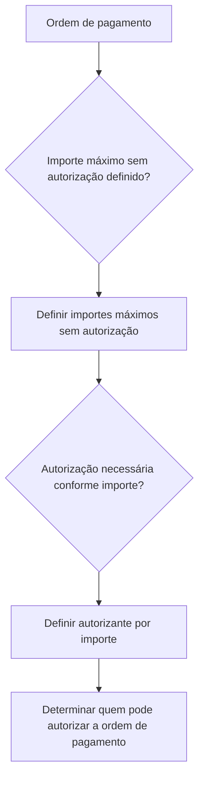

# Definição de Autorização de Ordem de Pagamento — Processo Reef

## 1. Metadados do Documento
- **Arquivo de Origem:** Não identificado no conteúdo fornecido
- **Tipo de Documento:** Procedimento
- **Domínio / Sistema:** Reef / Mapfre
- **Público-Alvo:** Negócio, Operação, Desenvolvedores e Arquitetos
- **Data/Versão Identificada:** Não identificada

---

## 2. Resumo Executivo & Contexto de Negócio

O documento define o objetivo do processo de autorização de uma ordem de pagamento: determinar em quais situações uma ordem de pagamento requer autorização e identificar quem pode conceder essa autorização.

O processo apresentado possui duas definições centrais. A primeira definição estabelece os importes máximos que podem ser processados sem autorização. A segunda definição estabelece o autorizante aplicável conforme o importe da ordem de pagamento.

A documentação está associada ao domínio Reef e contém referências a “DOCUMENTACIÓN Reef”, “Mapfredocument” e navegação para recursos corporativos, incluindo soluções, arquiteturas, APIs, componentes, Cloud, documentação e Zeus.

> **Nota de Análise:** O conteúdo não detalha valores monetários, faixas de importe, cargos autorizantes, critérios de exceção, etapas operacionais posteriores ou contratos de integração.

---

## 3. Arquitetura, Componentes & Tecnologias Envolvidas

Os componentes, sistemas e referências explicitamente citados são:

| Componente / Referência | Papel identificado |
| :--- | :--- |
| Reef | Domínio ou sistema associado à documentação. |
| DOCUMENTACIÓN Reef | Área ou referência documental relacionada ao processo. |
| Mapfredocument | Referência documental apresentada no conteúdo. |
| Zeus | Item disponível na navegação documental. |
| Soluciones | Categoria de navegação documental. |
| Arquitecturas | Categoria de navegação documental. |
| APIs | Categoria de navegação documental. |
| Componentes | Categoria de navegação documental. |
| Cloud | Categoria de navegação documental. |



> **Nota de Análise:** O documento não descreve arquitetura de software, microsserviços, APIs, bancos de dados, protocolos, ambientes ou tecnologias de implementação.

---

## 4. Regras de Negócio, Especificações Funcionais & Processos

### Objetivo funcional

O objetivo declarado é determinar:

1. Quando é necessário autorizar uma ordem de pagamento.
2. Quem pode autorizar uma ordem de pagamento.

### Processo a seguir

O processo contém duas definições obrigatórias:

1. **Definir importes máximos sem autorização**
   - O processo deve estabelecer importes máximos para ordens de pagamento que não exigem autorização.
   - O documento não informa os valores desses importes máximos.
   - O documento não especifica moeda, unidade monetária, periodicidade ou critérios adicionais para aplicação dos limites.

2. **Definir autorizante por importe**
   - O processo deve definir o autorizante aplicável conforme o importe da ordem de pagamento.
   - O documento não identifica pessoas, perfis, cargos, grupos, áreas ou níveis de alçada autorizantes.
   - O documento não apresenta uma matriz de faixas de importe versus autorizante.

### Restrições de informação

- Não há detalhamento de como a necessidade de autorização é registrada.
- Não há indicação de aprovação única, múltiplas aprovações ou aprovação sequencial.
- Não há descrição de tratamento para rejeição, cancelamento, reenvio ou escalonamento.
- Não há definição de evidências, logs, auditoria ou notificações do processo.

---

## 5. Tabelas de Parâmetros, Ambientes e Estruturas de Dados

| Item / Parâmetro | Descrição / Função | Tipo / Valores / Formato | Ambiente / Observações |
| :--- | :--- | :--- | :--- |
| Ordem de pagamento | Entidade submetida à determinação de necessidade de autorização. | Não especificado | O documento não informa estrutura, campos ou identificador. |
| Importe máximo sem autorização | Limite a ser definido para permitir uma ordem de pagamento sem autorização. | Valor não especificado | Não há moeda, faixa, valor ou regra de cálculo. |
| Autorizante por importe | Responsável pela autorização conforme o importe da ordem de pagamento. | Perfil ou responsável não especificado | Não há matriz de alçadas ou perfis autorizantes. |
| Reef | Referência de sistema ou domínio documental. | Nome citado no documento | Sem detalhamento técnico adicional. |
| Mapfredocument | Referência documental citada. | Nome citado no documento | Sem detalhamento adicional. |
| Owner | Campo de propriedade da documentação. | `user:agonzalez_mapfre.com` | Valor apresentado literalmente no conteúdo. |
| Lifecycle | Estado do ciclo de vida documental. | `Approved Source` | Valor apresentado literalmente no conteúdo. |
| Idioma | Idioma indicado na interface documental. | `ES` | O conteúdo principal está em espanhol. |

---

## 6. Bateria de Perguntas & Respostas para RAG (FAQ Sintético)

### P1: Qual é o objetivo da definição de autorização de ordem de pagamento?
**R:** O objetivo é determinar quando uma ordem de pagamento precisa de autorização e identificar quem pode autorizar a ordem de pagamento.

### P2: Quais são as duas definições exigidas pelo processo?
**R:** O processo exige definir os importes máximos sem autorização e definir o autorizante correspondente por importe.

### P3: O documento informa o valor máximo de uma ordem de pagamento sem autorização?
**R:** Não. O documento estabelece que devem ser definidos importes máximos sem autorização, mas não apresenta valores, moedas ou faixas monetárias.

### P4: Quem pode autorizar uma ordem de pagamento?
**R:** O documento determina que o autorizante deve ser definido conforme o importe da ordem de pagamento. Entretanto, não identifica os cargos, usuários, perfis ou áreas autorizantes.

### P5: Existe uma matriz de alçadas por valor de ordem de pagamento?
**R:** Não. O documento menciona a necessidade de definir um autorizante por importe, mas não apresenta a matriz de faixas de importe e autorizantes.

### P6: O processo define o que ocorre quando uma ordem de pagamento ultrapassa o limite sem autorização?
**R:** O conteúdo permite concluir apenas que a necessidade de autorização deve ser determinada pelos importes máximos definidos. Não há fluxo detalhado de encaminhamento, aprovação, rejeição ou escalonamento.

### P7: Qual sistema ou domínio está associado à documentação?
**R:** A documentação faz referência a Reef, por meio das expressões “Documentation / DOCUMENTACIÓN Reef” e “DOCUMENTACIÓN Reef”. Também há referência a Mapfredocument.

### P8: Há especificações de API ou integração para autorização de ordens de pagamento?
**R:** Não. Embora a interface documental apresente uma categoria “APIs”, o conteúdo não descreve endpoints, métodos HTTP, contratos JSON, autenticação ou fluxos de integração.

### P9: Qual é o ciclo de vida identificado para a documentação?
**R:** O campo `Lifecycle` apresenta o valor `Approved Source`.

### P10: Quem é indicado como proprietário da documentação?
**R:** O campo `Owner` apresenta literalmente o valor `user:agonzalez_mapfre.com`.

---

## 7. Glossário de Termos, Siglas & Conceitos-Chave

- **Autorização de ordem de pagamento:** Processo para determinar se uma ordem de pagamento requer autorização e identificar o responsável autorizante.
- **Autorizante:** Responsável que deve ser definido conforme o importe da ordem de pagamento.
- **Importe:** Valor associado à ordem de pagamento; usado como critério para definir a necessidade de autorização e o autorizante.
- **Reef:** Nome de domínio, sistema ou área documental citado no conteúdo; o documento não fornece expansão ou definição adicional.
- **Mapfredocument:** Referência documental citada; o documento não fornece definição adicional.
- **Zeus:** Item citado na navegação da documentação; o documento não fornece definição adicional.
- **Lifecycle:** Campo de ciclo de vida da documentação, apresentado com o valor `Approved Source`.

---

## 8. Notas Críticas, Riscos & Limitações

- Os importes máximos sem autorização não foram fornecidos.
- Não existe matriz de autorizantes por faixa de importe.
- Não há definição de perfis, cargos, usuários ou áreas responsáveis por autorização.
- Não há descrição de exceções, rejeições, cancelamentos, escalonamentos ou reprocessamentos.
- Não há contratos técnicos, integrações, APIs, endpoints, ambientes, URLs ou mecanismos de persistência.
- Não há informações sobre auditoria, logs, evidências de aprovação ou retenção de dados.
- A documentação apresenta um processo em nível conceitual e requer detalhamento operacional e técnico para implementação.

---

## 9. Conteúdo Bruto Estruturado (Referência Fiel)

```text
--- [PÁGINA 1 DE 1] ---

EN CONSTRUCCIÓN
DEFINICIÓN de autorización de orden de pago
Objetivo
Determinar cuándo es necesario autorizar una orden de pago y quien puede autorizarla
Proceso a seguir
DEFINIR importes máximo
sin autorización
(1)
DEFINIR autorizante
por importe
(2)
1. DEFINIR importes máximo sin autorización
2. DEFINIR autorizante por importe
Documentation / DOCUMENTACIÓN Reef
DOCUMENTACIÓN Reef
Mapfredocument
DOCUMENTACIÓN Reef
Owner
user:agonzalez_mapfre.com
Lifecycle
Approved Source
 / 
 VL
Buscar Inicio Soluciones Arquitecturas APIs Componentes Cloud Documentación Zeus Reef Ayuda
ES
```
