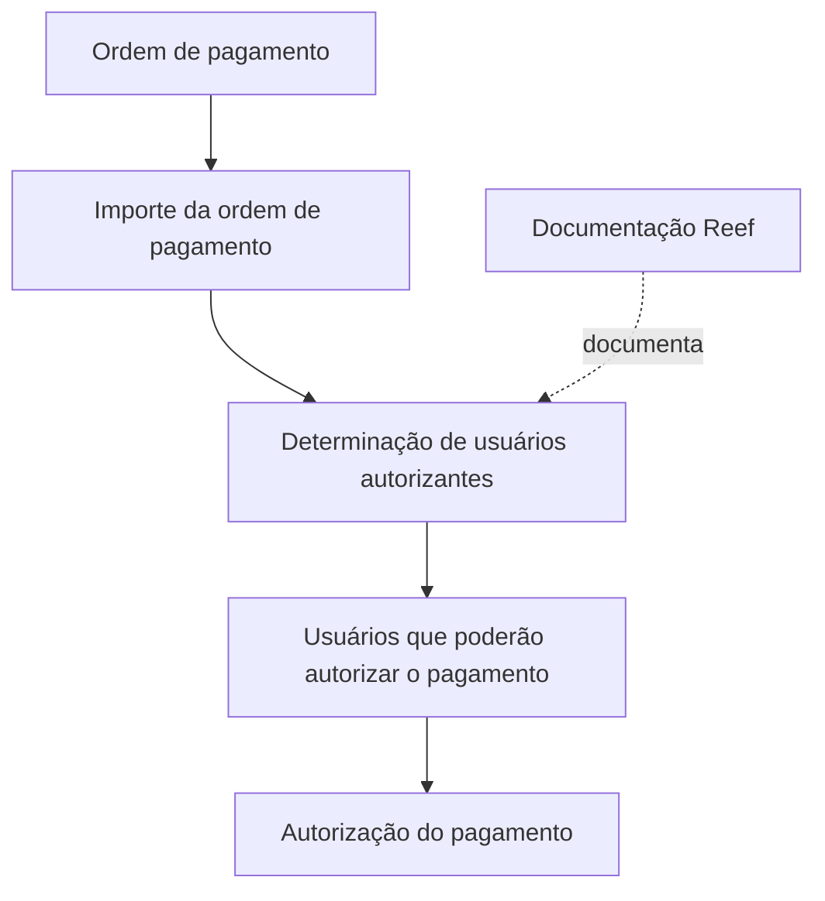

# Definição de Autorizante por Valor de Ordem de Pagamento — Documentação Reef

## 1. Metadados do Documento
- **Arquivo de Origem:** `Não identificado no conteúdo fornecido`
- **Tipo de Documento:** `Especificação Técnica`
- **Domínio / Sistema:** `Reef / Mapfre`
- **Público-Alvo:** `Não explicitamente identificado; o conteúdo refere-se a usuários autorizantes de ordens de pagamento`
- **Data/Versão Identificada:** `Não identificada`

---

## 2. Resumo Executivo & Contexto de Negócio

O documento apresenta a definição de autorizante por valor de uma ordem de pagamento. O objetivo declarado é determinar quais usuários poderão autorizar o pagamento de uma ordem de pagamento conforme o respectivo importe.

O conteúdo está associado à documentação Reef e contém referências a Mapfre, incluindo o identificador `Mapfredocument`. A página aparece dentro de uma navegação de documentação que inclui itens como Soluções, Arquiteturas, APIs, Componentes, Cloud, Documentação, Zeus e Reef.

A regra funcional explicitamente descrita relaciona o valor de uma ordem de pagamento à determinação dos usuários aptos a autorizá-la. O documento não apresenta faixas de valor, nomes de perfis, critérios de desempate, fluxo de aprovação, métodos técnicos ou persistência de dados.

A documentação apresenta estado de ciclo de vida `Approved Source` e identifica `user:agonzalez_mapfre.com` como proprietário. Não há detalhamento adicional sobre responsabilidades desse proprietário ou sobre a governança documental.

---

## 3. Arquitetura, Componentes & Tecnologias Envolvidas

Os elementos identificados no conteúdo são:

- **Reef:** contexto principal da documentação.
- **Mapfre / Mapfredocument:** referências corporativas apresentadas na página.
- **Ordem de pagamento:** entidade funcional cujo pagamento requer autorização.
- **Usuários autorizantes:** usuários determinados segundo o importe da ordem de pagamento.
- **Owner:** `user:agonzalez_mapfre.com`.
- **Lifecycle:** `Approved Source`.
- **VL:** referência apresentada junto ao ciclo de vida, sem explicação adicional.

O documento não descreve microsserviços, APIs, bancos de dados, protocolos, tecnologias de implementação, URLs, servidores ou ambientes técnicos.



**Nota de Análise:** o diagrama representa exclusivamente a relação funcional explicitamente descrita entre importe, determinação de usuários autorizantes e autorização do pagamento. O documento não detalha regras de cálculo, componentes de software ou contratos de integração.

---

## 4. Regras de Negócio, Especificações Funcionais & Processos

### Regra funcional identificada

1. Existe uma **ordem de pagamento**.
2. A ordem de pagamento possui um **importe**.
3. O importe da ordem de pagamento é utilizado para determinar os **usuários que poderão autorizar o pagamento**.
4. A autorização do pagamento depende da determinação desses usuários autorizantes.

### Restrições de interpretação

- O documento não informa valores mínimos, máximos ou faixas de importe.
- O documento não define quantos usuários devem autorizar uma ordem de pagamento.
- O documento não especifica se a autorização é individual, sequencial, paralela ou baseada em múltiplos níveis.
- O documento não informa o comportamento para importes sem autorizante configurado.
- O documento não detalha perfis, grupos, permissões, exceções, delegações, substituições ou regras de segregação de funções.
- O documento não descreve operações técnicas, métodos HTTP, contratos JSON, eventos, filas, tabelas de banco de dados ou telas de usuário.

**Nota de Análise:** o documento lista a determinação de usuários autorizantes conforme o importe da ordem de pagamento, porém não detalha os critérios de configuração ou execução dessa determinação.

---

## 5. Tabelas de Parâmetros, Ambientes e Estruturas de Dados

| Item / Parâmetro | Descrição / Função | Tipo / Valores / Formato | Ambiente / Observações |
| :--- | :--- | :--- | :--- |
| Ordem de pagamento | Entidade cujo pagamento poderá ser autorizado por usuários determinados | Não especificado | Contexto da funcionalidade |
| Importe da ordem de pagamento | Critério utilizado para determinar usuários autorizantes | Não especificado | Não há faixas, moeda ou formato informados |
| Usuários autorizantes | Usuários que poderão autorizar o pagamento | Não especificado | Determinados segundo o importe da ordem de pagamento |
| Owner | Proprietário identificado na documentação | `user:agonzalez_mapfre.com` | Não há descrição de responsabilidades |
| Lifecycle | Estado de ciclo de vida apresentado na página | `Approved Source` | Significado operacional não detalhado |
| Referência adicional | Texto apresentado junto ao ciclo de vida | `VL` | Sem definição no documento |
| Sistema/documentação | Contexto documental citado | `Reef`; `DOCUMENTACIÓN Reef` | Também há referência a `Mapfredocument` |
| Navegação documental | Seções exibidas na página | `Buscar`, `Inicio`, `Soluciones`, `Arquitecturas`, `APIs`, `Componentes`, `Cloud`, `Documentación`, `Zeus`, `Reef`, `Ayuda` | Não constituem arquitetura confirmada da funcionalidade |
| Idioma exibido | Idioma da interface da página | `ES` | Conteúdo principal em espanhol |

---

## 6. Bateria de Perguntas & Respostas para RAG (FAQ Sintético)

### P1: Qual é o objetivo da definição de autorizante por importe de ordem de pagamento?
**R:** O objetivo é determinar os usuários que poderão autorizar o pagamento de uma ordem de pagamento conforme o importe dessa ordem.

### P2: Qual critério é usado para determinar os usuários autorizantes?
**R:** O critério explicitamente informado é o importe da ordem de pagamento.

### P3: O documento informa faixas de valores para definir autorizantes?
**R:** Não. O documento informa somente que a determinação ocorre segundo o importe da ordem de pagamento; não apresenta faixas, limites, moeda ou valores numéricos.

### P4: O documento especifica quantos usuários devem autorizar uma ordem de pagamento?
**R:** Não. Não há definição de quantidade de autorizantes, aprovação individual, aprovação múltipla, sequência de aprovação ou paralelismo.

### P5: Quais usuários podem autorizar uma ordem de pagamento?
**R:** Os usuários que forem determinados conforme o importe da ordem de pagamento. O documento não lista usuários, perfis, grupos ou papéis específicos.

### P6: A documentação identifica alguma API ou microsserviço responsável pela autorização?
**R:** Não. O conteúdo não detalha APIs, microsserviços, endpoints, métodos HTTP, contratos JSON ou integrações técnicas.

### P7: A qual contexto documental a funcionalidade pertence?
**R:** A funcionalidade é apresentada como parte da documentação Reef e contém referências a Mapfre e `Mapfredocument`.

### P8: Quem está identificado como proprietário do documento?
**R:** O proprietário indicado no conteúdo é `user:agonzalez_mapfre.com`.

### P9: Qual é o ciclo de vida indicado para a documentação?
**R:** O ciclo de vida exibido é `Approved Source`. O documento não explica o significado desse estado.

### P10: O documento define o que acontece quando não existe autorizante para determinado importe?
**R:** Não. O comportamento para importes sem usuários autorizantes configurados não é detalhado.

### P11: O documento apresenta regras de delegação ou substituição de autorizantes?
**R:** Não. Não há informações sobre delegação, substituição, ausência de usuários, escalonamento ou exceções.

### P12: O documento descreve onde são persistidas as configurações de autorizantes?
**R:** Não. Não são apresentadas estruturas de dados, tabelas de banco de dados, parâmetros técnicos ou mecanismos de persistência.

---

## 7. Glossário de Termos, Siglas & Conceitos-Chave

- **Autorizante:** usuário que poderá autorizar o pagamento de uma ordem de pagamento, conforme a regra descrita.
- **Importe:** valor da ordem de pagamento utilizado para determinar os usuários autorizantes.
- **Ordem de pagamento:** entidade cujo pagamento depende de autorização por usuários determinados segundo o importe.
- **Reef:** contexto de documentação mencionado no conteúdo.
- **Mapfre:** referência corporativa exibida no conteúdo.
- **Mapfredocument:** identificador textual exibido na página, sem definição adicional.
- **Owner:** campo de proprietário da documentação; o valor apresentado é `user:agonzalez_mapfre.com`.
- **Lifecycle:** campo de ciclo de vida documental; o valor apresentado é `Approved Source`.
- **VL:** referência exibida junto ao ciclo de vida, sem significado definido no documento.
- **ES:** indicação de idioma exibida na página.

---

## 8. Notas Críticas, Riscos & Limitações

- A documentação contém apenas uma regra funcional de alto nível: determinar usuários autorizantes conforme o importe da ordem de pagamento.
- Não há faixas de importe, critérios de seleção, matrizes de autorização, perfis de acesso ou definições de contingência.
- Não há detalhes sobre arquitetura técnica, componentes, APIs, integrações, persistência, logs, monitoramento ou ambientes.
- O significado de `Approved Source` e `VL` não é explicado.
- O conteúdo não permite validar políticas de segregação de funções, dupla aprovação, auditoria, delegação ou tratamento de exceções.
- Qualquer implementação baseada somente neste conteúdo exigiria especificações adicionais para evitar interpretações não sustentadas pelo documento.

---

## 9. Conteúdo Bruto Estruturado (Referência Fiel)

```text
--- [PÁGINA 1 DE 1] ---

EN CONSTRUCCIÓN
DEFINICIÓN de autorizante por importe de orden de pago
Objetivo
Determina los usuarios que podrán autorizar el pago de la orden de pago, según su importe.
Propiedades generales
Propiedades generales
Documentation / DOCUMENTACIÓN Reef
DOCUMENTACIÓN Reef
Mapfredocument
DOCUMENTACIÓN Reef
Owner
user:agonzalez_mapfre.com
Lifecycle
Approved Source
 / 
 VL
Buscar Inicio Soluciones Arquitecturas APIs Componentes Cloud Documentación Zeus Reef Ayuda
ES
```
