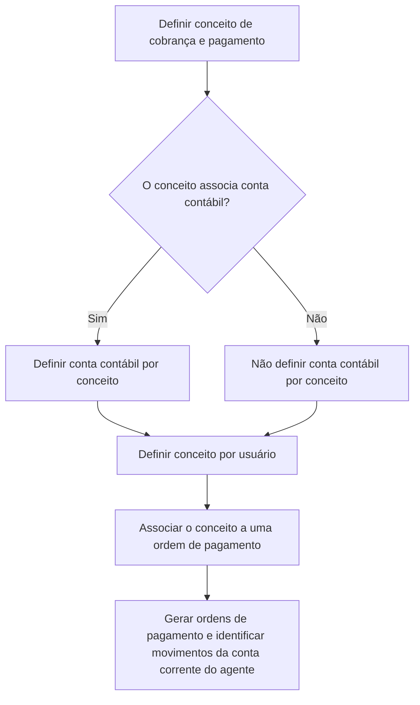

# Definição de Conceitos de Cobrança e Pagamento — Documentação Reef

## 1. Metadados do Documento
- **Arquivo de Origem:** Não identificado no conteúdo fornecido
- **Tipo de Documento:** Procedimento
- **Domínio / Sistema:** Reef / Mapfre
- **Público-Alvo:** Usuários responsáveis pela definição e associação de conceitos a ordens de pagamento
- **Data/Versão Identificada:** Não identificada
- **Owner identificado:** `user:agonzalez_mapfre.com`
- **Lifecycle identificado:** Approved

---

## 2. Resumo Executivo & Contexto de Negócio

O documento descreve a definição de conceitos de cobrança e pagamento no contexto da documentação Reef. O conceito de cobrança e pagamento é um conceito contábil associado a uma ordem de pagamento.

O conceito contábil determina o tipo de despesa incluído na ordem de pagamento, os impostos aplicáveis à ordem de pagamento — quando existentes — e a conta à qual a despesa é imputada. Portanto, a definição do conceito influencia a classificação contábil e fiscal de ordens de pagamento.

Os conceitos de cobrança e pagamento são utilizados tanto na geração de ordens de pagamento de qualquer tipo quanto na identificação dos movimentos da conta corrente do agente.

O objetivo declarado é permitir que o usuário defina os conceitos de cobrança e pagamento para posteriormente associá-los a uma ordem de pagamento. O procedimento apresentado possui três atividades: definir o conceito, definir a conta contábil por conceito quando houver associação de conta contábil e definir o conceito por usuário.

---

## 3. Arquitetura, Componentes & Tecnologias Envolvidas

Os componentes funcionais explicitamente citados são:

- **Conceito de cobrança e pagamento:** conceito contábil associado a uma ordem de pagamento.
- **Ordem de pagamento:** entidade que contém despesas, possíveis impostos e imputação contábil.
- **Conta contábil por conceito:** definição aplicável quando o conceito está associado a uma conta contábil.
- **Conceito por usuário:** associação posterior do conceito a um usuário.
- **Conta corrente do agente:** origem de movimentos identificados por meio dos conceitos de cobrança e pagamento.
- **Reef:** contexto de documentação em que o procedimento é apresentado.
- **Mapfre:** organização identificada no rodapé do conteúdo.



**Nota de Análise:** O documento não descreve telas, APIs, métodos HTTP, contratos de dados, tecnologias de implementação, ambientes ou integrações técnicas do Reef.

---

## 4. Regras de Negócio, Especificações Funcionais & Processos

### 4.1 Papel do conceito de cobrança e pagamento

1. O conceito de cobrança e pagamento é um **conceito contábil**.
2. O conceito de cobrança e pagamento deve ser associado a uma **ordem de pagamento**.
3. O conceito de cobrança e pagamento determina:
   - o tipo de despesa incluído na ordem de pagamento;
   - os impostos aplicáveis à ordem de pagamento, caso existam;
   - a conta à qual a despesa é imputada.
4. Os conceitos podem ser usados para a geração de ordens de pagamento de qualquer tipo.
5. Os conceitos também permitem identificar movimentos da conta corrente do agente.

### 4.2 Processo para definição de conceitos de cobrança e pagamento

O fluxo apresentado contém três etapas numeradas:

1. **Definir conceito de cobrança e pagamento.**
2. **Definir conta contábil por conceito.**
3. **Definir conceito por usuário.**

### 4.3 Regra condicional para conta contábil

A segunda etapa depende da seguinte decisão:

- Se o conceito de cobrança e pagamento **associa uma conta contábil**, deve-se definir a **conta contábil por conceito**.
- Se o conceito de cobrança e pagamento **não associa uma conta contábil**, a definição da conta contábil por conceito não é indicada pelo fluxo apresentado.
- Após a decisão sobre associação de conta contábil, o fluxo segue para a definição de **conceito por usuário**.

### 4.4 Resultado pretendido

Após definir o conceito de cobrança e pagamento e, quando aplicável, a conta contábil por conceito e o conceito por usuário, o conceito pode ser posteriormente associado a uma ordem de pagamento.

---

## 5. Tabelas de Parâmetros, Ambientes e Estruturas de Dados

| Item / Parâmetro | Descrição / Função | Tipo / Valores / Formato | Ambiente / Observações |
| :--- | :--- | :--- | :--- |
| Conceito de cobrança e pagamento | Conceito contábil associado a uma ordem de pagamento. | Conceito contábil. | Determina despesa, impostos quando existentes e conta de imputação. |
| Ordem de pagamento | Entidade à qual o conceito de cobrança e pagamento é associado. | Não detalhado. | Pode ser gerada para qualquer tipo de pagamento. |
| Tipo de despesa | Tipo de gasto incluído na ordem de pagamento. | Não detalhado. | Determinado pelo conceito de cobrança e pagamento. |
| Impostos | Tributos aplicáveis à ordem de pagamento. | Aplicável somente quando a ordem possuir impostos. | Determinados pelo conceito de cobrança e pagamento. |
| Conta de imputação da despesa | Conta à qual a despesa é imputada. | Conta contábil; formato não detalhado. | Determinada pelo conceito de cobrança e pagamento. |
| Associação de conta contábil | Decisão que define se é necessário configurar uma conta contábil por conceito. | Sim / Não. | Se “Sim”, executar a definição de conta contábil por conceito. |
| Conta contábil por conceito | Definição de conta contábil vinculada ao conceito. | Não detalhado. | Executada quando o conceito associa conta contábil. |
| Conceito por usuário | Definição ou associação do conceito em nível de usuário. | Não detalhado. | Etapa 3 do processo documentado. |
| Movimentos da conta corrente do agente | Movimentos que podem ser identificados utilizando conceitos de cobrança e pagamento. | Não detalhado. | Relacionados à conta corrente do agente. |
| Owner | Responsável identificado no conteúdo. | `user:agonzalez_mapfre.com` | Metadado da documentação Reef. |
| Lifecycle | Estado do ciclo de vida do documento. | `Approved` | Metadado da documentação Reef. |

---

## 6. Bateria de Perguntas & Respostas para RAG (FAQ Sintético)

### P1: Qual é a finalidade de um conceito de cobrança e pagamento no Reef?
**R:** O conceito de cobrança e pagamento é um conceito contábil associado a uma ordem de pagamento. Ele determina o tipo de despesa da ordem de pagamento, os impostos aplicáveis quando existirem e a conta à qual a despesa será imputada.

### P2: O que o conceito de cobrança e pagamento determina em uma ordem de pagamento?
**R:** O conceito de cobrança e pagamento determina o tipo de gasto incluído na ordem de pagamento, os impostos da ordem de pagamento quando houver impostos e a conta contábil utilizada para imputar a despesa.

### P3: Os conceitos de cobrança e pagamento são utilizados somente para ordens de pagamento?
**R:** Não. Além de serem utilizados na geração de ordens de pagamento de qualquer tipo, os conceitos de cobrança e pagamento também são utilizados para identificar os movimentos da conta corrente do agente.

### P4: Quais são as etapas para definir conceitos de cobrança e pagamento?
**R:** O procedimento possui três etapas: definir o conceito de cobrança e pagamento, definir a conta contábil por conceito e definir o conceito por usuário.

### P5: Quando devo definir uma conta contábil por conceito?
**R:** A conta contábil por conceito deve ser definida quando o conceito de cobrança e pagamento associa uma conta contábil. O fluxo apresentado usa a decisão “¿Asocia cuenta contable?” para determinar essa necessidade.

### P6: O que ocorre quando um conceito não associa uma conta contábil?
**R:** Quando o conceito não associa uma conta contábil, o fluxograma não indica a execução da etapa de definição de conta contábil por conceito. O processo segue para a definição de conceito por usuário.

### P7: Qual é o objetivo do documento sobre definição de conceitos de cobrança e pagamento?
**R:** O objetivo é explicar como definir conceitos de cobrança e pagamento para que esses conceitos possam ser posteriormente associados a uma ordem de pagamento.

### P8: Um conceito de cobrança e pagamento pode ser usado para qualquer tipo de ordem de pagamento?
**R:** Sim. O documento informa que esses conceitos são utilizados para a geração de ordens de pagamento de qualquer tipo.

### P9: O documento especifica o formato da conta contábil ou os campos de cadastro do conceito?
**R:** Não. O documento menciona a necessidade de definir uma conta contábil por conceito quando aplicável, mas não fornece formato de conta, campos de tela, validações de entrada ou estrutura de dados.

### P10: O documento apresenta APIs ou integrações técnicas para configuração de conceitos de cobrança e pagamento?
**R:** Não. O conteúdo apresenta um fluxo funcional de definição de conceitos, mas não detalha APIs, métodos HTTP, contratos JSON, tecnologias de implementação ou integrações técnicas.

---

## 7. Glossário de Termos, Siglas & Conceitos-Chave

- **Reef:** Contexto ou sistema de documentação identificado no documento como “DOCUMENTACIÓN Reef”.
- **Mapfre:** Organização identificada no conteúdo como “Mapfredocument”.
- **Conceito de cobrança e pagamento:** Conceito contábil associado a uma ordem de pagamento.
- **Ordem de pagamento:** Entidade utilizada para registrar pagamentos, contendo despesas, possíveis impostos e imputação de despesa.
- **Conta contábil:** Conta associada ao conceito quando o conceito exige associação contábil.
- **Conta de imputação:** Conta à qual a despesa da ordem de pagamento é atribuída.
- **Conta corrente do agente:** Conta cujos movimentos podem ser identificados por conceitos de cobrança e pagamento.
- **Lifecycle Approved:** Estado de ciclo de vida do documento identificado como aprovado.

---

## 8. Notas Críticas, Riscos & Limitações

- O documento não identifica o nome do arquivo de origem, data, versão formal ou número de revisão.
- O conteúdo não especifica quais tipos de despesa estão disponíveis.
- O conteúdo não define regras fiscais, alíquotas, condições de cálculo ou critérios para determinação de impostos.
- O conteúdo não detalha a estrutura, o formato ou a validação da conta contábil.
- O conteúdo não descreve como ocorre a associação entre conceito e usuário.
- O fluxograma indica a decisão sobre associação de conta contábil, mas não detalha as consequências funcionais ou contábeis da opção “Não”.
- Não há detalhes sobre telas, permissões, APIs, contratos de integração, ambientes, logs, URLs ou mecanismos de auditoria.
- **Nota de Análise:** O documento menciona Reef e Mapfre, porém não detalha a arquitetura técnica, os módulos internos ou as integrações desses sistemas.

---

## 9. Conteúdo Bruto Estruturado (Referência Fiel)

```text
--- [PÁGINA 1 DE 1] ---

DEFINICIÓN de Conceptos de cobro y pago
Objetivo
Uno de los elementos que componen la orden de pago es el concepto de cobro y pago. Se trata de un concepto contable que se asocia a la
orden de pago y que determina el tipo de gasto que incluye la orden de pago, los impuestos que lleva la orden de pago, en caso de llevarlos,
así como la cuenta a la que se imputa el gasto.
Estos conceptos se utilizan tanto para la generación de órdenes de pago, de cualquier tipo, como para identicar los movimientos de la
cuenta corriente del agente.
El objetivo de este documento es conocer como denir los conceptos de cobro y pago para posteriormente poder asociarlo a una orden de
pago.
Pasos para denir conceptos de cobro y pago
SI
NO
DEFINIR
Concepto de
cobro y pago
(1)
¿Asocia cuenta
contable? DEFINIR
Cuenta contable
por concepto
(2)
DEFINIR
Concepto por
usuario
(3)
1. DEFINIR Concepto de cobro y pago
2. DEFINIR Cuenta contable por concepto
3. DEFINIR Concepto por usuario
Documentation / DOCUMENTACIÓN Reef
DOCUMENTACIÓN Reef
Mapfredocument
DOCUMENTACIÓN Reef
Owner
user:agonzalez_mapfre.com
Lifecycle
Approved Source
 / 
 VL
Buscar Inicio Soluciones Arquitecturas APIs Componentes Cloud Documentación Zeus Reef Ayuda
ES
```
