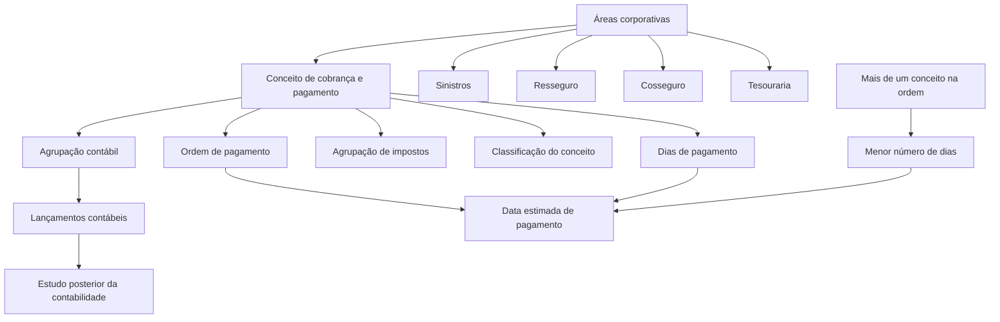
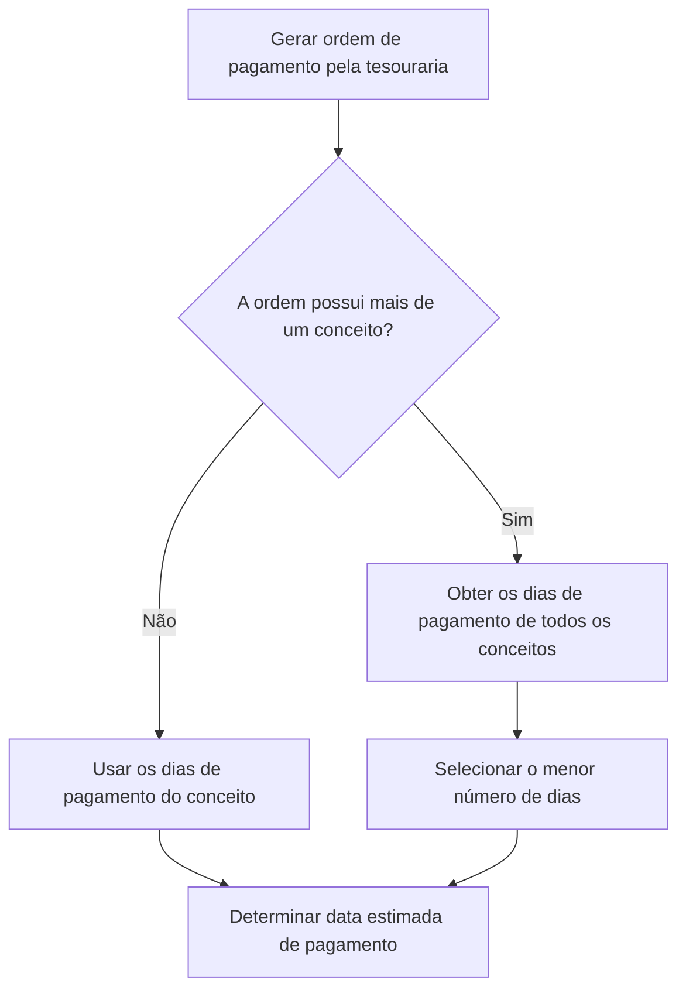

# Definição de Conceitos de Cobrança e Pagamento — Documentação Reef

## 1. Metadados do Documento
- **Arquivo de Origem:** Não identificado no conteúdo fornecido
- **Tipo de Documento:** Procedimento / Manual Funcional
- **Domínio / Sistema:** Reef / Mapfre — conceitos contábeis de cobrança e pagamento
- **Público-Alvo:** Áreas de sinistros, tesouraria, resseguro, cosseguro, comissões e contabilidade
- **Data/Versão Identificada:** Não identificada

---

## 2. Resumo Executivo & Contexto de Negócio

O documento descreve como definir um **conceito de cobrança e pagamento** e as propriedades que caracterizam esse conceito no contexto corporativo Reef/Mapfre. O conceito identifica um conceito contábil utilizado na geração de ordens de pagamento.

Os conceitos de cobrança e pagamento são usados para gerar diferentes tipos de ordens de pagamento dentro da companhia. O conteúdo cita explicitamente ordens relacionadas a sinistros, remessas de resseguro, cosseguro, tesouraria e outros tipos de pagamento.

Cada conceito possui uma chave identificadora, um nome, um nome curto, uma associação obrigatória com uma agrupação contábil, uma possível agrupação de impostos, uma classificação de conceito e uma quantidade de dias de pagamento.

A associação à agrupação contábil permite que a informação seja refletida nos lançamentos contábeis para posterior análise. A classificação identifica a natureza do gasto ou o âmbito de utilização do conceito. Os dias de pagamento podem determinar a data estimada de pagamento de uma ordem gerada pela tesouraria.

Quando uma ordem de pagamento contém mais de um conceito de cobrança e pagamento, a data estimada de pagamento deve ser determinada pelo **menor número de dias de pagamento** entre todos os conceitos que compõem a ordem.

---

## 3. Arquitetura, Componentes & Tecnologias Envolvidas

O conteúdo não descreve uma arquitetura técnica de software, APIs, protocolos, URLs de ambiente, servidores ou contratos de integração. A relação apresentada é funcional e contábil: áreas corporativas utilizam conceitos de cobrança e pagamento para gerar ordens de pagamento, que registram agrupações contábeis e podem considerar impostos e dias de pagamento.



**Nota de Análise:** O documento menciona Reef, Mapfre e “Mapfredocument”, mas não detalha funcionalidades técnicas, integrações, componentes de infraestrutura ou métodos expostos por essas plataformas.

---

## 4. Regras de Negócio, Especificações Funcionais & Processos

### 4.1 Finalidade do conceito de cobrança e pagamento

1. Um conceito de cobrança e pagamento é utilizado para gerar ordens de pagamento dentro da companhia.
2. Os conceitos devem ser usados de acordo com o tipo de ordem de pagamento.
3. Para gerar uma ordem de pagamento de sinistros, a área de sinistros utiliza os conceitos destinados a sinistros, e não outros conceitos.
4. A mesma lógica se aplica às remessas de resseguro, cosseguro, tesouraria e demais ordens de pagamento.

### 4.2 Propriedades do conceito

Um conceito de cobrança e pagamento possui as seguintes propriedades funcionais:

1. **Conceito de cobrança e pagamento:** contém a chave que identifica o conceito contábil estabelecido como conceito de cobrança e pagamento.
2. **Nome do conceito de cobrança e pagamento:** contém o nome associado à chave identificadora do conceito.
3. **Nome curto do conceito de cobrança e pagamento:** contém o nome abreviado associado à chave do conceito.
4. **Agrupação contábil:** o conceito deve estar associado a uma agrupação contábil.
5. **Agrupação de impostos:** caso o conceito de cobrança e pagamento deva possuir impostos, essa propriedade contém a chave da agrupação de impostos aplicável.
6. **Classificação do conceito:** identifica a natureza do gasto ou o âmbito de utilização do conceito, conforme o tipo associado.
7. **Dias de pagamento:** contém um número de dias que pode determinar a data estimada de pagamento quando uma ordem de pagamento é gerada pela tesouraria.

### 4.3 Regra de associação à agrupação contábil

1. Todo conceito de cobrança e pagamento deve estar associado a uma agrupação contábil.
2. A agrupação contábil é um dado refletido em cada lançamento contábil.
3. O objetivo do registro da agrupação contábil é permitir posterior estudo da contabilidade.
4. A propriedade armazena a chave que identifica a agrupação contábil à qual o conceito pertence.

### 4.4 Regra de agrupação de impostos

1. A agrupação de impostos é aplicável quando o conceito de cobrança e pagamento deve levar impostos.
2. A propriedade contém a chave da agrupação de impostos.
3. A agrupação de impostos identifica os impostos aplicáveis ao conceito de cobrança e pagamento.

### 4.5 Regra de classificação do conceito

1. A classificação identifica a natureza do gasto ou o âmbito de uso do conceito de cobrança e pagamento.
2. A classificação depende do tipo de conceito associado.
3. Os exemplos apresentados classificam conceitos de sinistros como `SI` e conceitos de comissões de agentes como `AC`.

### 4.6 Regra para cálculo da data estimada de pagamento

1. A propriedade **Dias de pagamento** contém um número de dias.
2. Esse número pode determinar a data estimada de pagamento da ordem de pagamento quando a ordem é gerada pela tesouraria.
3. Uma ordem de pagamento pode possuir mais de um conceito de cobrança e pagamento.
4. Quando houver mais de um conceito na ordem, deve ser utilizado o **menor número de dias de pagamento** entre todos os conceitos que formam a ordem.



---

## 5. Tabelas de Parâmetros, Ambientes e Estruturas de Dados

### 5.1 Propriedades do conceito de cobrança e pagamento

| Item / Parâmetro | Descrição / Função | Tipo / Valores / Formato | Ambiente / Observações |
| :--- | :--- | :--- | :--- |
| Conceito de cobrança e pagamento | Chave que identifica o conceito contábil estabelecido como conceito de cobrança e pagamento. | Chave de conceito contábil. | Utilizado na geração de ordens de pagamento. |
| Nome do conceito de cobrança e pagamento | Nome associado à chave identificadora do conceito. | Texto. | Exemplo: `Honorarios perito`. |
| Nome curto do conceito de cobrança e pagamento | Nome abreviado associado à chave do conceito. | Texto abreviado. | Exemplo: `Honorarios`. |
| Agrupação contábil | Chave da agrupação contábil à qual pertence o conceito. | Chave de agrupação contábil. | Associação obrigatória segundo o documento. Refletida nos lançamentos contábeis. |
| Agrupação de impostos | Chave da agrupação que identifica impostos aplicáveis ao conceito. | Chave de agrupação de impostos. | Aplicável quando o conceito deve levar impostos. |
| Classificação do conceito | Identifica a natureza do gasto ou o âmbito de uso do conceito. | Tipo de conceito, como `SI` ou `AC`. | Associada ao tipo de conceito. |
| Dias de pagamento | Número de dias que pode determinar a data estimada de pagamento. | Número de dias. | Para múltiplos conceitos em uma ordem, utiliza-se o menor valor. |

### 5.2 Exemplos de conceitos, nomes e nomes curtos

| Conceito | Nome | Nome curto | Observações |
| :--- | :--- | :--- | :--- |
| `S07` | Honorarios perito | Honorarios | Honorários de perito. |
| `DCT` | Descuento comisiones | Dcto.Comi. | Desconto de comissões. |
| `S06` | Indemnización lesionado | Indemniza. | Indenização de lesionado. |
| `DC` | Descuento de comisiones cobro | Dcto.Cobro | Desconto de comissões de cobrança. |
| `PC1` | Comisiones anticipadas | Anticipo | Comissões antecipadas. |

### 5.3 Mapeamento entre agrupação contábil e conceito

| Agrupação contábil | Descrição da agrupação | Conceito | Descrição do conceito |
| :--- | :--- | :--- | :--- |
| `PS` | Pago de siniestros | `S07` | Honorarios Perito |
| `PS` | Pago de siniestros | `S06` | Indemnización lesionado |
| `DC` | Comisión automática | `DC` | Descuento de comisiones cobro |
| `PC` | Comisión anticipada | `DCT` | Descuento comisión |
| `PC` | Comisión anticipada | `PC1` | Comisión anticipada |

### 5.4 Classificação dos conceitos

| Conceito | Descrição do conceito | Tipo de conceito | Significado indicado |
| :--- | :--- | :--- | :--- |
| `S07` | Honorarios Perito | `SI` | Siniestros |
| `S06` | Indemnización lesionado | `SI` | Siniestros |
| `DC` | Descuento de comisiones cobro | `AC` | Agentes comisiones |
| `DCT` | Descuento comisión | `AC` | Agentes comisiones |
| `PC1` | Comisión anticipada | `AC` | Agentes comisiones |

### 5.5 Áreas e tipos de ordens de pagamento citados

| Área / Contexto | Uso dos conceitos de cobrança e pagamento | Observações |
| :--- | :--- | :--- |
| Sinistros | Geração de ordens de pagamento de sinistros e liquidação do sinistro. | A área de sinistros utiliza os conceitos destinados a sinistros. |
| Resseguro | Geração de remessas de resseguro. | Não há detalhamento adicional. |
| Cosseguro | Geração de remessas de cosseguro. | Não há detalhamento adicional. |
| Tesouraria | Geração de ordens de pagamento e determinação de data estimada de pagamento. | Usa os dias de pagamento dos conceitos. |
| Contabilidade | Registro de agrupação contábil nos lançamentos. | Permite estudo posterior da contabilidade. |

---

## 6. Bateria de Perguntas & Respostas para RAG (FAQ Sintético)

### P1: Qual é a finalidade de um conceito de cobrança e pagamento?
**R:** Um conceito de cobrança e pagamento identifica um conceito contábil utilizado para gerar ordens de pagamento dentro da companhia. Esses conceitos são utilizados em ordens relacionadas a sinistros, resseguro, cosseguro, tesouraria e outros tipos de pagamento.

### P2: Qual propriedade identifica o conceito contábil de cobrança e pagamento?
**R:** A propriedade denominada **Conceito de cobrança e pagamento** contém a chave que identifica o conceito contábil definido como conceito de cobrança e pagamento.

### P3: Qual é a diferença entre nome e nome curto de um conceito de cobrança e pagamento?
**R:** O nome do conceito contém a denominação associada à chave identificadora. O nome curto contém a forma abreviada associada à mesma chave. Por exemplo, o conceito `S06` possui o nome `Indemnización lesionado` e o nome curto `Indemniza.`.

### P4: Um conceito de cobrança e pagamento precisa estar associado a uma agrupação contábil?
**R:** Sim. O documento determina que o conceito de cobrança e pagamento deve estar associado a uma agrupação contábil. Essa associação é refletida em cada lançamento da contabilidade para permitir estudo posterior.

### P5: Para que serve a agrupação de impostos?
**R:** A agrupação de impostos é utilizada quando o conceito de cobrança e pagamento deve levar impostos. A propriedade contém a chave da agrupação de impostos que identifica os impostos aplicáveis ao conceito.

### P6: O que identifica a classificação de um conceito?
**R:** A classificação do conceito identifica a natureza do gasto ou o âmbito de uso do conceito de cobrança e pagamento, conforme o tipo de conceito associado. Nos exemplos, `SI` representa `Siniestros` e `AC` representa `Agentes comisiones`.

### P7: Quais conceitos estão classificados como sinistros?
**R:** Os conceitos `S07` — `Honorarios Perito` — e `S06` — `Indemnización lesionado` — estão classificados com o tipo `SI`, identificado no documento como `Siniestros`.

### P8: Como é determinada a data estimada de pagamento de uma ordem gerada pela tesouraria?
**R:** A propriedade Dias de pagamento contém um número de dias que pode determinar a data estimada de pagamento da ordem gerada pela tesouraria. Quando a ordem possui apenas um conceito, utiliza-se o valor desse conceito.

### P9: Qual regra deve ser aplicada se uma ordem de pagamento possuir vários conceitos?
**R:** Quando uma ordem de pagamento contém mais de um conceito de cobrança e pagamento, a data estimada de pagamento deve considerar o menor número de dias de pagamento entre todos os conceitos que compõem a ordem.

### P10: Qual agrupação contábil está associada ao conceito S07?
**R:** O conceito `S07`, correspondente a `Honorarios Perito`, está associado à agrupação contábil `PS`, descrita como `Pago de siniestros`.

### P11: Qual agrupação contábil está associada ao conceito PC1?
**R:** O conceito `PC1`, correspondente a `Comisión anticipada`, está associado à agrupação contábil `PC`, descrita como `Comisión anticipada`.

### P12: O documento define os métodos HTTP ou contratos de integração dos conceitos de cobrança e pagamento?
**R:** Não. O documento apresenta propriedades funcionais, exemplos de conceitos, agrupações contábeis, classificação e regra de dias de pagamento, mas não detalha métodos HTTP, contratos JSON, APIs, URLs ou interfaces de integração.

---

## 7. Glossário de Termos, Siglas & Conceitos-Chave

- **AC:** `Agentes comisiones`; tipo de conceito utilizado nos exemplos para descontos de comissão e comissão antecipada.
- **Agrupação contábil:** Chave ou agrupamento associado a um conceito de cobrança e pagamento e refletido em lançamentos contábeis para posterior estudo.
- **Agrupação de impostos:** Chave que identifica os impostos aplicáveis a um conceito de cobrança e pagamento, quando o conceito deve levar impostos.
- **Conceito de cobrança e pagamento:** Conceito contábil identificado por uma chave e utilizado na geração de ordens de pagamento.
- **Cosseguro:** Contexto citado para geração de remessas e ordens de pagamento; não possui detalhamento adicional no documento.
- **Dias de pagamento:** Número de dias que pode determinar a data estimada de pagamento de uma ordem de pagamento gerada pela tesouraria.
- **PC:** Agrupação contábil identificada como `Comisión anticipada`.
- **PS:** Agrupação contábil identificada como `Pago de siniestros`.
- **Reef:** Nome presente na documentação fornecida. O conteúdo não explica a expansão da sigla nem detalha a plataforma.
- **Resseguro:** Contexto citado para geração de remessas e ordens de pagamento; não possui detalhamento adicional no documento.
- **SI:** `Siniestros`; tipo de conceito utilizado nos exemplos de honorários de perito e indenização de lesionado.
- **Tesouraria:** Área citada como responsável pela geração de ordens de pagamento para as quais os dias de pagamento podem determinar a data estimada.

---

## 8. Notas Críticas, Riscos & Limitações

- **Nota de Análise:** O documento não identifica o arquivo de origem, versão, data de publicação ou data de atualização.
- **Nota de Análise:** O conteúdo não detalha telas, etapas de cadastro, permissões, responsáveis pela manutenção dos conceitos ou validações de entrada.
- **Nota de Análise:** Não são apresentados formatos, limites, obrigatoriedade operacional ou valores permitidos para a propriedade Dias de pagamento.
- **Nota de Análise:** A regra de seleção do menor número de dias é explicitamente descrita, mas o documento não informa como a data-base para o cálculo da data estimada de pagamento é definida.
- **Nota de Análise:** A agrupação de impostos é mencionada, mas o documento não apresenta exemplos de chaves, impostos ou critérios para atribuição.
- **Nota de Análise:** Não há descrição de APIs, métodos HTTP, contratos JSON, bancos de dados, logs, URLs de ambiente, servidores ou mecanismos de integração.
- **Risco operacional:** A seleção incorreta de conceitos pode levar à utilização de um conceito destinado a outra área ou outro tipo de ordem de pagamento.
- **Risco operacional:** A configuração incorreta dos dias de pagamento pode afetar a data estimada de pagamento, especialmente em ordens com múltiplos conceitos, nas quais prevalece o menor valor.

---

## 9. Conteúdo Bruto Estruturado (Referência Fiel)

```text
--- [PÁGINA 1 DE 2] ---

DEFINIR Conceptos de cobro y pago
Objetivo
La nalidad de este documento es conocer como denir un concepto de cobro y pago, así como sus características principales.
Estos conceptos son los que se utilizan para generar las distintas órdenes de pago dentro de la compañía, sean del tipo que sean, es decir,
para generar una orden de pago de siniestros, el área de siniestros utilizara estos conceptos y no otros, para poder hacer la liquidación del
siniestro, lo mismo con las remesas de reaseguro, coaseguro y el resto de las órdenes de pago, tesorería, etc.
Propiedades
Propiedades
Concepto de cobro y pago
Contiene la clave que identica el concepto contable que se establece como concepto de cobro y pago.
Nombre concepto cobro y pago
Este atributo contiene el nombre asociado a la clave que identica el concepto.
Nombre corto concepto cobro y pago
Contiene el nombre abreviado asociado a la clave del concepto.
Ejemplo
CONCEPTO NOMBRE NOMBRE CORTO
S07 Honorarios perito Honorarios
DCT Descuento comisiones Dcto.Comi.
S06 Indemnización lesionado Indemniza.
DC Descuento de comisiones cobro Dcto.Cobro
PC1 Comisiones anticipadas Anticipo
Agrupación contable
Documentation / DOCUMENTACIÓN Reef
DOCUMENTACIÓN Reef
Mapfredocument
DOCUMENTACIÓN Reef
Owner
user:agonzalez_mapfre.com
Lifecycle
Approved Source
 / 
 VL
Buscar Inicio Soluciones Arquitecturas APIs Componentes Cloud Documentación Zeus Reef Ayuda
ES


--- [PÁGINA 2 DE 2] ---

El concepto de cobro y pago debe estar asociado a una agrupación contable, que es un dato que queda reejado en cada uno de los apuntes
de la contabilidad para su posterior estudio.
Esta propiedad contiene la clave que identica la agrupación contable a la que pertenece el concepto de cobro y pago.
Ejemplo
AGRUPACIÓN CONTABLE CONCEPTO
PS (Pago de siniestros) S07 (Honorarios Perito)
PS (Pago de siniestros) S06 (Indemnización lesionado)
DC (Comisión automática) DC (Descuento de comisiones cobro)
PC (Comisión anticipada) DCT (Descuento comisión)
PC (Comisión anticipada) PC1 (Comisión anticipada)
Agrupación de impuestos
Si el concepto de cobro y pago debe llevar impuestos, esta propiedad contiene la clave de la agrupación de impuestos, que identica los
impuestos que aplican al concepto de cobro y pago.
Clasicación del concepto
Identica la naturaleza del gasto, o el ámbito de uso del concepto de cobro y pago, según el tipo de concepto que se asocie.
Ejemplo
CONCEPTO TIPO DE CONCEPTO
S07 (Honorarios Perito) SI (Siniestros)
S06 (Indemnización lesionado) SI (Siniestros)
DC (Descuento de comisiones cobro) AC (Agentes comisiones)
DCT (Descuento comisión) AC (Agentes comisiones)
PC1 (Comisión anticipada) AC (Agentes comisiones)
Días de pago
Esta propiedad contiene un número de días, que puede determinar la fecha estimada de pago de la orden de pago, cuando se genera desde
tesorería.
Una orden de pago puede tener más de un concepto de cobro pago, en este caso, para determinar la fecha estimada de pago, se tomará el
menor número de días de pago de todos los conceptos de cobro y pago que forman la orden de pago.
```
