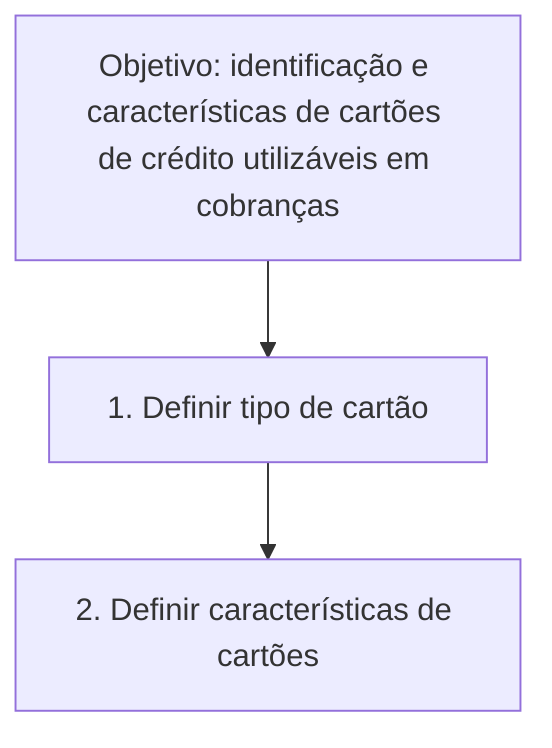

# Definição de Cartões de Crédito — Documentação Reef

## 1. Metadados do Documento
- **Arquivo de Origem:** Não identificado
- **Tipo de Documento:** Procedimento
- **Domínio / Sistema:** Reef / Mapfre
- **Público-Alvo:** Negócio, Operação e equipes responsáveis por configuração de cartões
- **Data/Versão Identificada:** Não identificada

---

## 2. Resumo Executivo & Contexto de Negócio

O documento apresenta a definição de cartões de crédito que podem ser utilizados em processos de cobrança. O objetivo declarado é identificar os cartões elegíveis e registrar suas características.

O procedimento documentado possui duas etapas sequenciais: definir o tipo de cartão e definir as características dos cartões. O texto não detalha atributos específicos, critérios de elegibilidade, regras de validação, métodos de cobrança ou contratos técnicos.

A documentação está identificada como parte de **Documentation / DOCUMENTACIÓN Reef** e contém referências a **Mapfredocument**, ao proprietário `user:agonzalez_mapfre.com`, ao estado de ciclo de vida `Approved` e à fonte `VL`.

A ausência de detalhamento adicional impede afirmar quais tipos de cartão existem, quais características são obrigatórias ou como a configuração é persistida e consumida por outros componentes.

---

## 3. Arquitetura, Componentes & Tecnologias Envolvidas

Componentes e referências explicitamente citados:

- **Reef:** contexto documental no qual o procedimento está publicado.
- **Mapfredocument:** referência presente no conteúdo bruto.
- **DOCUMENTACIÓN Reef:** identificação da área documental.
- **Owner:** `user:agonzalez_mapfre.com`.
- **Lifecycle:** `Approved`.
- **Source:** `VL`.
- **Navegação documental:** Buscar, Inicio, Soluciones, Arquitecturas, APIs, Componentes, Cloud, Documentación, Zeus, Reef e Ayuda.
- **Idioma identificado:** `ES`.

O conteúdo descreve um fluxo funcional de configuração, sem apresentar arquitetura de software, APIs, bancos de dados, ambientes, protocolos ou integrações.



> **Nota de Análise:** O documento não detalha sistemas transacionais, microsserviços, métodos HTTP, contratos JSON, persistência de dados ou tecnologias de implementação.

---

## 4. Regras de Negócio, Especificações Funcionais & Processos

### Objetivo funcional

O documento define como objetivo a:

> Identificação e características de cartões de crédito que podem ser utilizados em cobranças.

### Processo documentado

1. **Definir tipo de cartão**
   - Primeira etapa explicitamente indicada no procedimento.
   - O documento não informa os tipos de cartão disponíveis, códigos, classificações ou critérios de escolha.

2. **Definir características de cartões**
   - Segunda etapa explicitamente indicada no procedimento.
   - O documento não especifica quais características devem ser cadastradas, validadas ou utilizadas durante a cobrança.

### Restrições de interpretação

- Não há regras de aprovação, rejeição ou validação de cartões.
- Não há informação sobre bandeiras, emissores, limites, vencimentos, parcelas, moedas ou dados sensíveis.
- Não há detalhamento sobre os responsáveis por executar as etapas.
- Não há definição de entradas, saídas, exceções ou tratamento de erro.

---

## 5. Tabelas de Parâmetros, Ambientes e Estruturas de Dados

| Item / Parâmetro | Descrição / Função | Tipo / Valores / Formato | Ambiente / Observações |
| :--- | :--- | :--- | :--- |
| Objetivo | Identificar cartões de crédito e suas características para uso em cobranças | Texto funcional | Não há critérios detalhados |
| Etapa 1 | Definir tipo de cartão | Processo | Tipos de cartão não especificados |
| Etapa 2 | Definir características de cartões | Processo | Características não especificadas |
| Documentação | Documentation / DOCUMENTACIÓN Reef | Referência documental | Contexto Reef |
| Referência | Mapfredocument | Nome exibido no conteúdo | Função não detalhada |
| Owner | `user:agonzalez_mapfre.com` | Identificador de proprietário | Conforme conteúdo original |
| Lifecycle | `Approved` | Estado de ciclo de vida | Conforme conteúdo original |
| Source | `VL` | Identificador de fonte | Significado não detalhado |
| Idioma | `ES` | Código de idioma | Espanhol |
| Navegação | Buscar, Inicio, Soluciones, Arquitecturas, APIs, Componentes, Cloud, Documentación, Zeus, Reef, Ayuda | Itens de navegação | Não constituem requisitos funcionais |

---

## 6. Bateria de Perguntas & Respostas para RAG (FAQ Sintético)

### P1: Qual é o objetivo da definição de cartões de crédito no documento Reef?
**R:** O objetivo é identificar cartões de crédito e suas características para determinar quais cartões podem ser utilizados em processos de cobrança.

### P2: Quais são as etapas do processo de definição de cartões de crédito?
**R:** O processo possui duas etapas: primeiro, definir o tipo de cartão; segundo, definir as características dos cartões.

### P3: O documento especifica quais tipos de cartão de crédito podem ser cadastrados?
**R:** Não. O documento informa que o tipo de cartão deve ser definido, mas não lista os tipos disponíveis nem apresenta códigos, classificações ou critérios de seleção.

### P4: Quais características de cartão devem ser configuradas?
**R:** O documento determina que as características dos cartões devem ser definidas, porém não especifica quais campos, atributos ou regras devem compor essas características.

### P5: O documento apresenta regras para validar cartões de crédito utilizados em cobranças?
**R:** Não. Não há regras de validação, aprovação, rejeição, elegibilidade ou tratamento de exceções para cartões de crédito.

### P6: Qual é o estado de ciclo de vida identificado na documentação?
**R:** O estado de ciclo de vida informado no conteúdo é `Approved`.

### P7: Quem é o proprietário identificado no documento?
**R:** O proprietário identificado é `user:agonzalez_mapfre.com`.

### P8: Qual é a fonte identificada para o documento?
**R:** A fonte indicada no conteúdo é `VL`. O documento não explica o significado dessa sigla ou identificador.

### P9: O documento descreve APIs ou contratos técnicos para cartões de crédito?
**R:** Não. Embora a navegação contenha o item “APIs”, o conteúdo não apresenta endpoints, métodos HTTP, contratos JSON, autenticação ou integrações técnicas.

### P10: O documento informa em qual idioma está publicado?
**R:** Sim. O código `ES` aparece no conteúdo, indicando espanhol.

---

## 7. Glossário de Termos, Siglas & Conceitos-Chave

- **Reef:** Contexto ou área documental identificada como `Documentation / DOCUMENTACIÓN Reef`. O documento não define tecnicamente o sistema Reef.
- **Mapfredocument:** Referência textual presente no conteúdo; sua finalidade não é detalhada.
- **Owner:** Campo que identifica o proprietário do documento como `user:agonzalez_mapfre.com`.
- **Lifecycle:** Campo de ciclo de vida documental; o valor identificado é `Approved`.
- **Approved:** Estado de aprovação identificado para o documento.
- **VL:** Valor do campo `Source`; o documento não explicita o significado.
- **ES:** Código de idioma exibido no conteúdo, associado ao espanhol.
- **Tipo de tarjeta:** Etapa de definição do tipo de cartão.
- **Características de tarjetas:** Etapa de definição das características dos cartões.
- **Cobros:** Processos de cobrança nos quais cartões de crédito podem ser utilizados.

---

## 8. Notas Críticas, Riscos & Limitações

- O conteúdo é resumido e não define tipos de cartão, características configuráveis, critérios de uso ou regras de negócio detalhadas.
- Não há informações sobre integrações, APIs, infraestrutura, armazenamento, segurança, autenticação ou ambientes.
- Não há evidência de regras para manipulação de dados de pagamento ou informações sensíveis de cartão.
- A referência `VL` não possui definição no documento.
- A referência `Mapfredocument` não possui descrição funcional ou técnica.
- O texto permite registrar o processo em alto nível, mas não suporta implementação técnica ou operação detalhada sem documentação complementar.

---

## 9. Conteúdo Bruto Estruturado (Referência Fiel)

```text
--- [PÁGINA 1 DE 1] ---

DEFINICIÓN de tarjetas de crédito
Objetivo
Identicación y características de las tarjetas de crédito que pueden ser utilizadas en cobros.
Pasos a seguir
DEFINIR
Tipo de tarjeta
(1)
DEFINIR
Características de
tarjetas
(2)
1. DEFINIR Tipo de tarjeta
2. DEFINIR Características de tarjetas
Documentation / DOCUMENTACIÓN Reef
DOCUMENTACIÓN Reef
Mapfredocument
DOCUMENTACIÓN Reef
Owner
user:agonzalez_mapfre.com
Lifecycle
Approved Source
 / 
 VL
Buscar Inicio Soluciones Arquitecturas APIs Componentes Cloud Documentación Zeus Reef Ayuda
ES
```
