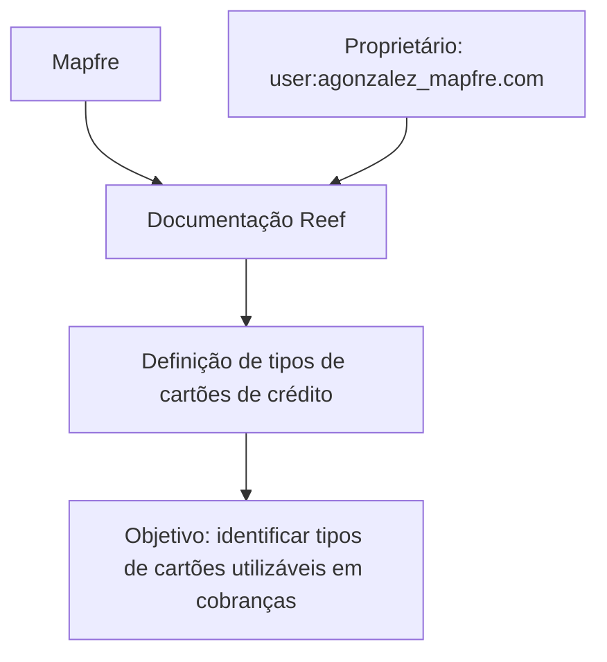

# Definição de Tipos de Cartões de Crédito — Reef

## 1. Metadados do Documento
- **Arquivo de Origem:** `Não identificado`
- **Tipo de Documento:** `Documentação`
- **Domínio / Sistema:** `Reef / Mapfre`
- **Público-Alvo:** `Não identificado`
- **Data/Versão Identificada:** `Não identificada`

---

## 2. Resumo Executivo & Contexto de Negócio

O conteúdo apresenta um artefato de documentação Reef em construção, intitulado **“Definición de tipos de tarjetas de crédito”**. O objetivo declarado é identificar os diferentes tipos de cartões de crédito que podem ser utilizados pela companhia para cobranças.

O documento menciona “Propiedades generales”, mas não fornece os atributos, classificações, regras de elegibilidade ou estruturas de dados relacionadas aos cartões de crédito. Portanto, não é possível derivar tipos específicos de cartão, métodos de cobrança, contratos de integração ou regras de validação.

A navegação exibida associa o conteúdo ao ambiente documental Reef e cita elementos como Soluciones, Arquitecturas, APIs, Componentes, Cloud, Documentación, Zeus e Reef. Essas referências indicam apenas categorias ou áreas de navegação; o extrato não descreve relações técnicas entre elas.

O estado **“EN CONSTRUCCIÓN”** e a classificação **“Lifecycle: Approved Source”** coexistem no conteúdo extraído. O documento não esclarece como esses estados são conciliados, nem apresenta versão, data de aprovação ou escopo de implementação.

---

## 3. Arquitetura, Componentes & Tecnologias Envolvidas

| Componente / Termo | Evidência no conteúdo | Detalhamento disponível |
| :--- | :--- | :--- |
| Reef | “Documentation / DOCUMENTACIÓN Reef” | Repositório ou área de documentação mencionada. |
| Mapfre | “Mapfredocument” e domínio do proprietário | Contexto corporativo citado no conteúdo. |
| Zeus | Item da navegação | Não há descrição funcional ou técnica. |
| Soluciones | Item da navegação | Não há descrição funcional ou técnica. |
| Arquitecturas | Item da navegação | Não há arquitetura descrita. |
| APIs | Item da navegação | Não há APIs, métodos, endpoints ou contratos informados. |
| Componentes | Item da navegação | Não há componentes especificados. |
| Cloud | Item da navegação | Não há provedor, serviço ou ambiente cloud informado. |



> **Nota de Análise:** O conteúdo não descreve microsserviços, integrações, bancos de dados, endpoints, tecnologias, protocolos ou fluxos operacionais. O diagrama representa exclusivamente as relações textualmente explícitas.

---

## 4. Regras de Negócio, Especificações Funcionais & Processos

1. O objetivo registrado é identificar os distintos tipos de cartões de crédito que podem ser utilizados pela companhia para cobranças.
2. O texto menciona propriedades gerais, porém não detalha quais propriedades compõem essa definição.
3. Não foram fornecidos critérios para classificação de cartões de crédito.
4. Não foram fornecidas regras de aceitação, rejeição, validação ou processamento de cobranças.
5. Não foram informados fluxos operacionais para seleção, cadastro, manutenção ou uso de tipos de cartões.
6. Não foram identificados métodos HTTP, contratos JSON, serviços, APIs ou integrações associados ao tema.

> **Nota de Análise:** O documento lista o objetivo de identificação de tipos de cartões de crédito, mas não detalha os tipos existentes, suas propriedades gerais ou as regras de utilização nos processos de cobrança.

---

## 5. Tabelas de Parâmetros, Ambientes e Estruturas de Dados

| Item / Parâmetro | Descrição / Função | Tipo / Valores / Formato | Ambiente / Observações |
| :--- | :--- | :--- | :--- |
| Título | Tema principal do conteúdo | `DEFINICIÓN de tipos de tarjetas de crédito` | Documento em construção. |
| Objetivo | Identificar tipos de cartões de crédito utilizáveis pela companhia para cobranças | Texto | Não há detalhamento dos tipos identificados. |
| Propriedades gerais | Seção mencionada no conteúdo | `Propiedades generales` | Propriedades não especificadas. |
| Estado do documento | Situação exibida no conteúdo | `EN CONSTRUCCIÓN` | Não há explicação adicional. |
| Lifecycle | Classificação de ciclo de vida | `Approved Source` | Relação com “EN CONSTRUCCIÓN” não esclarecida. |
| Owner | Proprietário indicado | `user:agonzalez_mapfre.com` | Formato preservado conforme extração. |
| Idioma da navegação | Idioma indicado na interface | `ES` | O conteúdo principal está em espanhol. |
| Reef | Área documental mencionada | `DOCUMENTACIÓN Reef` | Não há URL ou localização técnica informada. |
| Zeus | Categoria de navegação | `Zeus` | Sem detalhamento adicional. |
| APIs | Categoria de navegação | `APIs` | Nenhuma API documentada no extrato. |
| Cloud | Categoria de navegação | `Cloud` | Nenhum ambiente cloud descrito. |

---

## 6. Bateria de Perguntas & Respostas para RAG (FAQ Sintético)

### P1: Qual é o objetivo da documentação sobre definição de tipos de cartões de crédito?
**R:** O objetivo é identificar os distintos tipos de cartões de crédito que podem ser utilizados pela companhia para cobranças.

### P2: Quais tipos de cartões de crédito são aceitos pela companhia?
**R:** O conteúdo não enumera tipos específicos de cartões de crédito aceitos. Ele apenas declara que a documentação tem como objetivo identificá-los.

### P3: Quais são as propriedades gerais dos tipos de cartões de crédito?
**R:** O documento menciona a seção “Propiedades generales”, mas não apresenta as propriedades, campos, valores ou critérios correspondentes.

### P4: O documento define regras de validação para cobranças com cartão?
**R:** Não. O conteúdo não apresenta regras de validação, autorização, rejeição, processamento ou conciliação de cobranças com cartão de crédito.

### P5: Existem APIs ou endpoints para consulta dos tipos de cartões?
**R:** Não há APIs, endpoints, métodos HTTP, contratos JSON ou detalhes de integração descritos no conteúdo extraído.

### P6: Qual é o estado identificado para a documentação?
**R:** O conteúdo exibe o estado “EN CONSTRUCCIÓN”, indicando que o material está em construção.

### P7: Qual lifecycle é indicado no documento?
**R:** O lifecycle indicado é “Approved Source”. O conteúdo não explica o significado operacional dessa classificação nem sua relação com o estado “EN CONSTRUCCIÓN”.

### P8: Quem é o proprietário indicado para a documentação?
**R:** O proprietário exibido é `user:agonzalez_mapfre.com`.

### P9: A que sistema ou área documental o conteúdo está associado?
**R:** O conteúdo está associado à documentação Reef e faz referências a Mapfre, incluindo “Mapfredocument” e o domínio presente no identificador do proprietário.

### P10: O documento fornece informações sobre ambientes, servidores ou URLs?
**R:** Não. Não foram identificadas URLs, nomes de servidores, portas, ambientes de execução ou rotas de logs.

### P11: Zeus possui alguma função definida no documento?
**R:** Não. Zeus aparece apenas como item de navegação, sem descrição funcional, técnica ou arquitetural.

### P12: Há um fluxo de negócio documentado para utilização dos cartões de crédito?
**R:** Não. O conteúdo não descreve etapas, atores, decisões, eventos ou exceções para o uso de cartões de crédito em cobranças.

---

## 7. Glossário de Termos, Siglas & Conceitos-Chave

- **Reef:** Área ou contexto de documentação mencionado como “DOCUMENTACIÓN Reef”.
- **Mapfre:** Referência corporativa presente em “Mapfredocument” e no identificador do proprietário.
- **Lifecycle:** Campo de ciclo de vida documental exibido com o valor `Approved Source`.
- **Approved Source:** Valor apresentado no campo Lifecycle; o significado não é detalhado no conteúdo.
- **Owner:** Campo que identifica o proprietário do documento.
- **Zeus:** Item de navegação citado sem definição adicional.
- **APIs:** Item de navegação; não há interfaces de programação documentadas no extrato.
- **Cloud:** Item de navegação; não há tecnologia, provedor ou ambiente cloud especificado.
- **ES:** Indicador de idioma exibido na navegação, correspondente a espanhol.

---

## 8. Notas Críticas, Riscos & Limitações

- O conteúdo está marcado como **“EN CONSTRUCCIÓN”**, o que sugere possibilidade de incompletude.
- Embora o campo Lifecycle apresente **“Approved Source”**, o documento não explica a relação entre essa classificação e o estado de construção.
- Não há lista dos tipos de cartões de crédito, propriedades gerais, regras de negócio ou critérios de uso.
- Não há contratos técnicos, endpoints, integrações, tecnologias, URLs, ambientes ou dados operacionais.
- Não é possível inferir escopo funcional, responsabilidades sistêmicas ou comportamento de cobrança além do objetivo declarado.
- O arquivo de origem, data, versão e público-alvo não foram identificados no texto extraído.

---

## 9. Conteúdo Bruto Estruturado (Referência Fiel)

```text
--- [PÁGINA 1 DE 1] ---

EN CONSTRUCCIÓN
DEFINICIÓN de tipos de tarjetas de crédito
Objetivo
Identicar los distintos tipos de tarjetas de crédito que pueden ser utilizadas por la compañía para los cobros.
Propiedades generales
Propiedades generales
Documentation / DOCUMENTACIÓN Reef
DOCUMENTACIÓN Reef
Mapfredocument
DOCUMENTACIÓN Reef
Owner
user:agonzalez_mapfre.com
Lifecycle
Approved Source
 / 
 VL
Buscar Inicio Soluciones Arquitecturas APIs Componentes Cloud Documentación Zeus Reef Ayuda
ES
```
