# Definição e Parâmetros do Módulo de Tesouraria no Reef.core

## 1. Metadados do Documento
- **Arquivo de Origem:** Não identificado no conteúdo fornecido
- **Tipo de Documento:** Arquitetura de Software / Manual Funcional
- **Domínio / Sistema:** Reef.core — módulo de Tesouraria; contexto corporativo MAPFRE
- **Público-Alvo:** Desenvolvedores, Arquitetos, Operação e Negócio
- **Data/Versão Identificada:** Não identificada
- **Proprietário identificado:** `user:agonzalez_mapfre.com`
- **Lifecycle identificado:** `Approved`
- **Fonte identificada:** `Mapfredocument`

---

## 2. Resumo Executivo & Contexto de Negócio

O documento descreve a sequência de definições necessárias para configurar o módulo de Tesouraria no sistema Reef.core. A configuração é dividida entre um nível **Comum**, que concentra definições transversais e pré-requisitos corporativos, e um nível específico de **Tesouraria**, contendo cadastros, parâmetros e estruturas necessárias para operações de cobrança e pagamento.

No nível Comum, o documento estabelece elementos fundamentais para a operação corporativa: usuários e seus papéis, programas e operações disponíveis, companhias, moedas, estrutura comercial, terceiros, agentes, seguradoras, conceitos econômicos, planos de pagamento, bancos, exercício contábil, plano de contas e conceito contábil. Esses elementos suportam a criação de apólices, operações em moeda, organização territorial, relacionamento com terceiros e registro contábil.

No nível de Tesouraria, o documento apresenta definições específicas para usuários habilitados a trabalhar no módulo, obrigações tributárias, contas contábeis por tipo de atualização, chaves simplificadas de conta, gestores de cobrança, cobranças antecipadas, ordens de pagamento, autorizações, conceitos de cobrança e pagamento, cartões de crédito e subvenções de comissões de agentes.

A configuração de Tesouraria também depende de parâmetros e definições que condicionam o funcionamento do módulo, além de definições para processos massivos de cobranças e pagamentos. O conteúdo não apresenta métodos HTTP, contratos de integração, URLs, ambientes, versões de software, regras numéricas de cálculo ou detalhes de implementação técnica.

---

## 3. Arquitetura, Componentes & Tecnologias Envolvidas

O documento apresenta uma arquitetura funcional e de configuração, não uma arquitetura técnica de infraestrutura. O sistema citado é o **Reef.core**, organizado em dois grupos principais:

- **Comum:** definições não exclusivas da Tesouraria, porém necessárias para configurar o módulo.
- **Tesouraria:** definições, parâmetros e elementos operacionais exclusivos do módulo de Tesouraria.

Os componentes funcionais identificados são:

- Usuários e papéis.
- Programas e operações do sistema.
- Companhia e entidades relacionadas.
- Moedas.
- Estrutura comercial.
- Terceiros, agentes, seguradoras e bancos.
- Conceitos econômicos, plano de pagamento, exercício contábil, plano de contas e conceito contábil.
- Caixa/caixeiro (`Cajero`) habilitado para Tesouraria.
- Impostos.
- Contas contábeis por tipo de atualização.
- Contas simplificadas.
- Gestores de cobrança.
- Cobranças antecipadas.
- Ordens de pagamento e respectivas autorizações.
- Conceitos de cobrança e pagamento.
- Cartões de crédito.
- Subvenções de comissões de agentes.
- Parâmetros de Tesouraria.
- Processos massivos de cobranças e pagamentos.

```mermaid
graph TD
    ReefCore[Reef.core] --> Comum[Definições Comuns]
    ReefCore --> Tesouraria[Módulo de Tesouraria]

    Comum --> Usuarios[Usuários e papéis]
    Comum --> Programas[Programas e operações]
    Comum --> Companhia[Companhia]
    Comum --> Moeda[Moeda]
    Comum --> EstruturaComercial[Estrutura comercial]
    Comum --> Terceiros[Terceiros]
    Terceiros --> Agente[Agente]
    Terceiros --> Seguradora[Seguradora]
    Terceiros --> Bancos[Bancos]
    Comum --> ConceitosEconomicos[Conceitos econômicos]
    Comum --> PlanoPagamento[Plano de pagamento]
    Comum --> ExercicioContabil[Exercício contábil]
    ExercicioContabil --> PlanoContas[Plano de contas]
    ExercicioContabil --> ConceitoContabil[Conceito contábil]

    Tesouraria --> Cajero[Cajero]
    Tesouraria --> Imposto[Imposto]
    Tesouraria --> ContaAtualizacao[Conta por tipo de atualização]
    Tesouraria --> ContaSimplificada[Conta simplificada]
    Tesouraria --> GestorCobranca[Gestor de cobrança]
    Tesouraria --> CobrancasAntecipadas[Cobranças antecipadas]
    Tesouraria --> OrdemPagamento[Ordem de pagamento]
    OrdemPagamento --> Autorizacao[Autorização de ordem de pagamento]
    OrdemPagamento --> ConceitoCobrancaPagamento[Conceito cobrança/pagamento]
    Tesouraria --> Cartoes[Cartões de crédito]
    Tesouraria --> SubvencaoAgente[Subvenção agente]
    Tesouraria --> Parametros[Parâmetros e definições]
    Tesouraria --> ProcessoMassivo[Processo massivo]
    ProcessoMassivo --> CobrancasPagamentos[Cobranças e pagamentos]
```



> **Nota de Análise:** O documento não detalha componentes técnicos de software, bancos de dados, APIs, mensageria, protocolos, serviços, servidores ou ambientes de execução. O diagrama representa exclusivamente as relações funcionais e organizacionais explicitamente apresentadas.

---

## 4. Regras de Negócio, Especificações Funcionais & Processos

### 4.1 Ordem de definição para Tesouraria

O documento afirma que existem elementos que intervêm na definição da Tesouraria e indica que existe uma ordem para realização dessas definições. Entretanto, o conteúdo não apresenta uma numeração explícita, critérios de precedência detalhados ou fluxo operacional passo a passo.

A estrutura apresentada sugere duas camadas de definição:

1. Definições de nível Comum, necessárias antes ou como suporte à configuração da Tesouraria.
2. Definições específicas do módulo de Tesouraria.

### 4.2 Definições de nível Comum

- **Usuários:** definição das pessoas que podem acessar o sistema e dos papéis atribuídos a cada pessoa.
- **Programas:** definição das distintas operações contempladas pelo sistema e de suas características.
- **Companhia:** definição da entidade ou entidades para as quais serão criadas apólices e, consequentemente, os demais elementos relacionados.
- **Moeda:** definição das divisas utilizadas pelo Reef.core para realizar as operações da companhia.
- **Estrutura comercial:** definição da organização territorial da companhia.
- **Terceiros:** definição de pessoas físicas ou jurídicas que podem ter algum relacionamento com a entidade MAPFRE.
- **Agente:** definição dos terceiros que atuam como intermediários entre cliente e companhia.
- **Seguradora:** definição das propriedades específicas de terceiros que atuam como entidades seguradoras e podem possuir relação com MAPFRE.
- **Conceitos econômicos:** definição dos conceitos que compõem a informação econômica do recibo.
- **Plano de pagamento:** definição da forma de fracionamento do pagamento do seguro.
- **Bancos:** definição das propriedades específicas de terceiros que atuam como entidades bancárias.
- **Exercício contábil:** definição do período no qual serão realizadas operações contábeis. Após cada fechamento de exercício, deve ser definido um novo exercício.
- **Plano de contas:** definição das contas utilizadas pela companhia dentro do exercício contábil e dos parâmetros correspondentes a cada conta.
- **Conceito contábil:** definição do identificador que agrupa lançamentos contábeis para consulta posterior.

### 4.3 Definições específicas de Tesouraria

- **Cajero:** define os usuários do sistema que podem trabalhar com o módulo de Tesouraria.
- **Imposto:** define os tipos de obrigações tributárias a considerar, suas características e formas de cálculo.
- **Conta por tipo de atualização:** define as contas contábeis utilizadas conforme a operação do registro diário.
- **Conta simplificada:** define as chaves que identificam contas contábeis.
- **Gestor de cobrança:** identifica os tipos de gestor de cobrança que podem gerir a cobrança dos recibos.
- **Cobranças antecipadas:** define os tipos de cobranças antecipadas permitidos e suas características.
- **Ordem de pagamento:** define as informações necessárias para criação de ordens de pagamento.
- **Autorização de ordem de pagamento:** define os dados que determinam quando uma ordem de pagamento requer autorização e quem pode autorizá-la.
- **Conceito cobrança/pagamento:** define o detalhamento econômico que será transportado pelas ordens de pagamento para detalhar a despesa.
- **Cartões de crédito:** identifica cartões de crédito que podem ser utilizados em cobranças e define suas características.
- **Subvenção agente:** define características de subvenções de comissões de agentes.
- **Parâmetros e definições de Tesouraria:** reúne definições e parâmetros que condicionam o funcionamento do módulo.
- **Processo massivo:** reúne definições necessárias para o funcionamento de processos massivos de cobranças e pagamentos.

> **Nota de Análise:** O documento menciona características, parâmetros, tipos e formas de cálculo, mas não especifica os campos, valores permitidos, fórmulas, limites, periodicidades ou regras de validação correspondentes.

---

## 5. Tabelas de Parâmetros, Ambientes e Estruturas de Dados

| Item / Parâmetro | Descrição / Função | Tipo / Valores / Formato | Ambiente / Observações |
| :--- | :--- | :--- | :--- |
| Reef.core | Sistema que realiza operações da companhia utilizando moedas definidas | Sistema | Citado no contexto de moedas e operações corporativas |
| Comum | Nível de definições não exclusivas de Tesouraria, necessário para configuração do módulo | Agrupador funcional | Pré-requisito funcional para Tesouraria |
| Usuários | Pessoas que podem acessar o sistema | Cadastro de pessoas e papéis | O documento não informa atributos de usuário |
| Papéis | Funções atribuídas aos usuários do sistema | Cadastro de autorização | Não há matriz de permissões detalhada |
| Programas | Operações contempladas pelo sistema e suas características | Cadastro de operações | Sem lista de programas ou características |
| Companhia | Entidade ou entidades para criação de apólices e demais elementos | Cadastro de entidade | Associada à criação de apólices |
| Moeda | Divisas utilizadas pelo Reef.core nas operações da companhia | Cadastro de divisas | Sem códigos de moeda identificados |
| Estrutura comercial | Organização territorial da companhia | Estrutura organizacional | Sem níveis territoriais identificados |
| Terceiros | Pessoas físicas ou jurídicas com relação com MAPFRE | Cadastro de partes relacionadas | Inclui agentes, seguradoras e bancos |
| Agente | Terceiro intermediário entre cliente e companhia | Tipo de terceiro | Atua como intermediário |
| Seguradora | Terceiro que atua como entidade seguradora com possível relação com MAPFRE | Tipo de terceiro | Propriedades específicas não detalhadas |
| Bancos | Terceiros que atuam como entidades bancárias | Tipo de terceiro | Propriedades específicas não detalhadas |
| Conceitos econômicos | Conceitos da informação econômica do recibo | Estrutura econômica | Sem catálogo de conceitos |
| Plano de pagamento | Forma de fracionamento do pagamento do seguro | Regra de pagamento | Sem frequências ou parcelas detalhadas |
| Exercício contábil | Período para realização de operações contábeis | Período contábil | Novo exercício deve ser definido após cada fechamento |
| Plano de contas | Contas utilizadas pela companhia no exercício contábil e parâmetros de cada conta | Estrutura contábil | Sem códigos de conta ou parâmetros específicos |
| Conceito contábil | Identificador que agrupa lançamentos contábeis para consulta posterior | Identificador contábil | Sem formato informado |
| Cajero | Usuário habilitado a trabalhar com o módulo de Tesouraria | Perfil funcional | Sem critérios de habilitação detalhados |
| Imposto | Tipos de obrigações tributárias, características e formas de cálculo | Configuração tributária | Fórmulas e impostos não especificados |
| Conta por tipo de atualização | Contas contábeis usadas conforme operação do registro diário | Mapeamento contábil | Operações e contas não detalhadas |
| Conta simplificada | Chaves que identificam contas contábeis | Chave contábil | Formato das chaves não informado |
| Gestor de cobrança | Tipos de gestor que podem gerir cobrança de recibos | Cadastro / classificação | Sem tipos de gestor identificados |
| Cobranças antecipadas | Tipos permitidos de cobranças antecipadas e características | Configuração de cobrança | Sem tipos ou critérios detalhados |
| Ordem de pagamento | Informações necessárias para criação de ordens de pagamento | Processo / estrutura funcional | Campos obrigatórios não informados |
| Autorização de ordem de pagamento | Dados para determinar necessidade de autorização e autorizador | Regra de aprovação | Sem regras, limites ou papéis detalhados |
| Conceito cobrança/pagamento | Detalhamento econômico das ordens de pagamento para detalhar a despesa | Estrutura econômica | Sem catálogo de conceitos |
| Cartões de crédito | Cartões aplicáveis a cobranças e suas características | Meio de cobrança | Sem bandeiras, números ou formatos |
| Subvenção agente | Características de subvenções de comissões de agentes | Regra comercial/econômica | Sem critérios de cálculo |
| Parâmetros e definições de Tesouraria | Parâmetros que condicionam funcionamento do módulo | Configuração funcional | Parâmetros não enumerados |
| Processo massivo | Definições para processos massivos de cobranças e pagamentos | Processo operacional | Sem agendamento, volume ou tratamento de erro |
| `Mapfredocument` | Fonte documental identificada no conteúdo | Repositório / fonte documental | Não há URL ou localização técnica |
| `user:agonzalez_mapfre.com` | Owner identificado no conteúdo | Proprietário documental | Valor apresentado literalmente |
| `Approved` | Estado de lifecycle identificado | Estado documental | Sem definição adicional no documento |

---

## 6. Bateria de Perguntas & Respostas para RAG (FAQ Sintético)

### P1: Qual é o objetivo das definições comuns antes da configuração do módulo de Tesouraria?
**R:** As definições comuns reúnem elementos que não pertencem exclusivamente ao módulo de Tesouraria, mas são necessários para configurar esse módulo. Entre esses elementos estão usuários, programas, companhia, moeda, estrutura comercial, terceiros, conceitos econômicos, plano de pagamento, bancos, exercício contábil, plano de contas e conceito contábil.

### P2: O que deve ser configurado para permitir que uma pessoa trabalhe no módulo de Tesouraria?
**R:** O documento indica duas definições relacionadas. No nível Comum, devem ser definidos os usuários que podem acessar o sistema e os papéis atribuídos a esses usuários. No nível específico de Tesouraria, o cadastro de `Cajero` define quais usuários do sistema podem trabalhar com o módulo de Tesouraria.

### P3: Como o documento define o exercício contábil no Reef.core?
**R:** O exercício contábil é o período de tempo no qual serão realizadas as operações contábeis. O documento estabelece que, após cada fechamento de exercício, deve ser definido um novo exercício contábil.

### P4: Qual é a finalidade do plano de contas?
**R:** O plano de contas define as contas utilizadas pela companhia dentro do exercício contábil e os parâmetros correspondentes a cada conta. O documento não informa códigos de contas, tipos de parâmetros ou regras de utilização dessas contas.

### P5: Qual é a diferença entre plano de contas e conceito contábil?
**R:** O plano de contas define as contas usadas pela companhia no exercício contábil e seus parâmetros. O conceito contábil define o identificador que agrupa os lançamentos contábeis para permitir consultas posteriores.

### P6: Como são tratados os impostos no módulo de Tesouraria?
**R:** O item `Impuesto` define os tipos de obrigações tributárias que devem ser considerados, incluindo suas características e formas de cálculo. O documento não especifica impostos concretos, fórmulas, alíquotas, bases de cálculo ou critérios de apuração.

### P7: Para que serve a conta por tipo de atualização?
**R:** A conta por tipo de atualização define as contas contábeis que serão utilizadas conforme a operação do registro diário. O documento não detalha quais operações de registro diário existem nem o mapeamento entre cada operação e sua conta contábil.

### P8: Como uma ordem de pagamento é criada e autorizada segundo o documento?
**R:** A definição de ordem de pagamento determina as informações necessárias para criar ordens de pagamento. A definição de autorização de ordem de pagamento estabelece os dados usados para determinar quando uma ordem precisa de autorização e quem pode autorizá-la. Os campos necessários, condições de autorização, limites e perfis autorizadores não são detalhados.

### P9: Qual é a função do gestor de cobrança?
**R:** O gestor de cobrança identifica os diferentes tipos de gestor que podem administrar a cobrança dos recibos. O documento não lista os tipos de gestores nem descreve responsabilidades específicas de cada tipo.

### P10: O que são cobranças antecipadas no contexto de Tesouraria?
**R:** Cobranças antecipadas são tipos de cobrança permitidos pelo módulo de Tesouraria e possuem características próprias a serem definidas. O documento não informa quais tipos são permitidos, quais são suas condições ou como devem ser processados.

### P11: Como os cartões de crédito são tratados?
**R:** Os cartões de crédito são identificados e configurados com suas características para que possam ser utilizados em cobranças. O documento não especifica bandeiras, emissores, formatos de dados, integrações ou regras de autorização.

### P12: Qual é o propósito dos processos massivos de Tesouraria?
**R:** Os processos massivos possuem definições necessárias para viabilizar o funcionamento de operações massivas de cobranças e pagamentos. O documento não detalha mecanismos de execução, agendamento, tratamento de falhas, volumes processados ou interfaces operacionais.

---

## 7. Glossário de Termos, Siglas & Conceitos-Chave

- **Reef.core:** Sistema citado como responsável por realizar operações da companhia utilizando as divisas definidas.
- **Tesouraria:** Módulo do Reef.core que concentra definições e parâmetros para cobranças, pagamentos, impostos, ordens de pagamento e processos relacionados.
- **Comum:** Nível de definições compartilhadas que não pertencem exclusivamente à Tesouraria, mas são necessárias para configurá-la.
- **MAPFRE:** Entidade corporativa mencionada no contexto de terceiros que podem manter relacionamento com a entidade MAPFRE.
- **Terceiros:** Pessoas físicas ou jurídicas que podem ter relação com a entidade MAPFRE.
- **Agente:** Terceiro que atua como intermediário entre o cliente e a companhia.
- **Seguradora:** Terceiro que atua como entidade seguradora e pode ter relação com MAPFRE.
- **Cajero:** Usuário do sistema autorizado a trabalhar com o módulo de Tesouraria.
- **Recibo:** Elemento que contém informação econômica e cuja cobrança pode ser gerida por gestores de cobrança.
- **Conceito econômico:** Elemento que forma parte da informação econômica do recibo.
- **Exercício contábil:** Período de tempo no qual são realizadas operações contábeis.
- **Plano de contas:** Conjunto de contas utilizadas pela companhia no exercício contábil, com parâmetros correspondentes.
- **Conceito contábil:** Identificador que agrupa lançamentos contábeis para consulta posterior.
- **Registro diário:** Operação mencionada como critério para utilização de contas contábeis por tipo de atualização.
- **Gestor de cobrança:** Tipo de entidade ou função que pode administrar a cobrança de recibos.
- **Cobrança antecipada:** Tipo de cobrança permitido pelo módulo, sujeito a características específicas.
- **Ordem de pagamento:** Estrutura ou processo cuja criação exige informações definidas.
- **Autorização de ordem de pagamento:** Definição de dados que determinam quando uma ordem de pagamento precisa de autorização e quem pode autorizá-la.
- **Subvenção agente:** Subvenção relacionada a comissões de agentes.
- **Processo massivo:** Processo associado a cobranças e pagamentos em massa.
- **Lifecycle `Approved`:** Estado documental apresentado literalmente no conteúdo, sem detalhamento adicional.
- **`Mapfredocument`:** Fonte documental identificada no conteúdo.

---

## 8. Notas Críticas, Riscos & Limitações

- O conteúdo fornecido é predominantemente descritivo e apresenta tópicos funcionais de alto nível.
- Não foram identificados métodos HTTP, APIs, contratos JSON, modelos de dados, bancos de dados, protocolos, portas, URLs, hosts, servidores, ambientes ou pipelines de implantação.
- O documento menciona formas de cálculo de impostos, mas não fornece fórmulas, alíquotas, bases de cálculo, regras de arredondamento ou exceções.
- O documento menciona autorização de ordens de pagamento, mas não descreve limites monetários, níveis de aprovação, perfis autorizadores ou trilhas de auditoria.
- O documento menciona processos massivos de cobrança e pagamento, porém não detalha agendamento, processamento assíncrono, capacidade, reprocessamento, monitoramento ou tratamento de erros.
- O documento apresenta uma ordem conceitual de definições, mas não fornece uma sequência numerada ou dependências técnicas formais entre cada cadastro.
- O texto extraído contém caracteres corrompidos em palavras como `denición`, `especícas` e `identicación`. A interpretação semântica foi realizada preservando o sentido aparente e o conteúdo bruto foi mantido como referência fiel.
- **Nota de Análise:** O documento lista entidades funcionais de Tesouraria, mas não detalha telas, atributos, campos obrigatórios, formatos, valores permitidos ou comportamentos de erro.
- **Nota de Análise:** Não há detalhamento adicional das Notas do Apresentador no conteúdo fornecido.

---

## 9. Conteúdo Bruto Estruturado (Referência Fiel)

```text
--- [PÁGINA 1 DE 2] ---

DEFINICIÓN DE TESORERÍA
 Elementos que intervienen en la denición y orden en el que se debe realizar.
COMÚN
En este nivel se encuentran deniciones que no pertenecen exclusivamente al módulo de tesorería, pero son
necesarias para poder realizar la denición de dicho módulo.
USUARIOS 
Denición de las personas que pueden
acceder al sistema así como los roles que
tienen asignados
PROGRAMAS 
Denición de las distintas operaciones
que contempla el sistema y sus
características
COMPAÑÍA 
Denición de la entidad o entidades con
las que se van a crear las pólizas y por
consiguiente el resto de elementos
MONEDA 
Denición de las divisas con las que
Reef.core va a realizar las distintas
operaciones de la compañía
ESTRUCTURA COMERCIAL 
Denición de como se va a establecer la
organización territorial de la compañía
TERCEROS
Denición de las personas físicas o
jurídicas que pueden tener alguna relación
con la entidad MAPFRE.
AGENTE 
Denición de los terceros que ejercerán de
intermediarios entre el cliente y la
compañía
ASEGURADORA
Denición de las propiedades especícas
de los terceros que actúan como
entidades aseguradoras y que pueden
tener relación con MAPFRE
CONCEPTOS ECONÓMICOS 
Denición de los conceptos que formarán
parte de la información económica del
recibo
PLAN DE PAGO 
Denir como se va a fraccionar el pago del
seguro
BANCOS
Denición de las propiedades especícas
de los terceros que actúan como
entidades bancarias
EJERCICIO CONTABLE 
Se dene el periodo de tiempo en el que
se realizarán las operaciones contables.
Después de cada cierre de ejercicio se
debe denir el nuevo ejercicio
Documentation / DOCUMENTACIÓN Reef
DOCUMENTACIÓN Reef
Mapfredocument
DOCUMENTACIÓN Reef
Owner
user:agonzalez_mapfre.com
Lifecycle
Approved Source
 / 
 VL
Buscar Inicio Soluciones Arquitecturas APIs Componentes Cloud Documentación Zeus Reef Ayuda
ES


--- [PÁGINA 2 DE 2] ---

PLAN DE CUENTAS 
Denición de las cuentas utilizadas por la
compañía dentro del ejercicio contable y
los parámetros correspondientes a cada
cuenta
CONCEPTO CONTABLE
Se dene el identicador que agrupa los
apuntes contables para su posterior
consulta
TESORERÍA
Deniciones especícas del módulo de Tesorería
CAJERO 
Denición de los usuarios del sistema que
pueden trabajar con el módulo de
Tesorería
IMPUESTO
Denir los tipos de obligaciones tributarias
que se deben tener en cuenta, así como
sus características y formas de cálculo
CUENTA POR TIPO ACTUALIZACIÓN
Denición de las cuentas contables que se
utilizarán según la operación del registro
diario
CUENTA SIMPLIFICADA
Se denen las claves que identican las
cuentas contables
GESTOR COBRO
Identicación de los distintos tipos de
gestor de cobro que pueden gestionar el
cobro de los recibos
COBROS ANTICIPADOS
Denición de los tipos de cobros
anticipados que se permiten y sus
características
ORDEN PAGO
Denición de la información necesaria
para la creación de órdenes de pago
AUTORIZACIÓN ORDEN PAGO
Datos para determinar cuándo es
necesario autorizar una orden de pago y
quien puede autorizarla
CONCEPTO COBRO PAGO
Denición del desglose económico que
llevarán las órdenes de pago para detallar
el gasto
TARJETAS CRÉDITO
Identicación y características de las
tarjetas de crédito que pueden ser
utilizadas en cobros
SUBVENCIÓN AGENTE
Denición de las características de
subvenciones de comisiones de agentes
PARÁMETROS Y DEFINICIONES
TESORERÍA 
Deniciones y parámetros que
condicionarán el funcionamiento del
módulo de tesorería
PROCESO MASIVO
Deniciones necesarias para el
funcionamiento de los procesos masivos
de cobros y pagos
```
