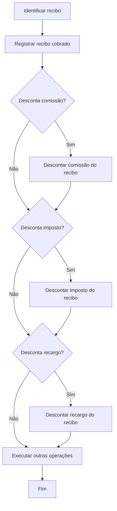

# Processo de Cobrança de Recibo de Prêmio

## 1. Metadados do Documento
- **Arquivo de Origem:** Não identificado
- **Tipo de Documento:** Procedimento
- **Domínio / Sistema:** Reef / Mapfre
- **Público-Alvo:** Agentes, Operação e Contabilidade
- **Data/Versão Identificada:** Não identificada

---

## 2. Resumo Executivo & Contexto de Negócio

O documento descreve o processo de **cobrar recibo de prima**, isto é, registrar o dinheiro entregue pelo cliente para liquidar o prêmio pendente de uma apólice durante determinado período.

O objetivo operacional é registrar o recebimento financeiro de um recibo na contabilidade e atualizar a situação do recibo para **cobrado**. O processo também permite que agentes descontem valores do montante cobrado.

Os descontos previstos abrangem três conceitos: **comissão**, **imposto** e **recargo**. Quando aplicável, cada desconto deve ser registrado individualmente conforme a decisão tomada durante o fluxo.

O conteúdo apresenta um fluxo sequencial condicional, mas não detalha interfaces, métodos HTTP, contratos de integração, regras de cálculo, validações monetárias, persistência de dados ou mecanismos de tratamento de erro.

---

## 3. Arquitetura, Componentes & Tecnologias Envolvidas

O documento não apresenta uma arquitetura de software, tecnologias, servidores, APIs ou integrações técnicas. O artefato descreve um fluxo funcional de cobrança relacionado à documentação Reef e ao contexto Mapfre.

Componentes e conceitos identificados:

- **Cliente:** entrega o dinheiro para saldar a prima pendente.
- **Agentes:** podem descontar comissão, imposto e recargo do valor cobrado.
- **Recibo:** item identificado e atualizado como cobrado.
- **Contabilidade:** recebe o registro da recepção do dinheiro correspondente ao recibo.
- **Reef / DOCUMENTACIÓN Reef:** ambiente ou repositório documental mencionado no rodapé.
- **Mapfredocument:** termo exibido na navegação documental.
- **Owner:** `user:agonzalez_mapfre.com`.
- **Lifecycle:** `Approved`.



> **Nota de Análise:** o documento apresenta atividades funcionais, mas não identifica aplicações responsáveis, serviços, bancos de dados, URLs de execução, mecanismos de autenticação ou contratos técnicos.

---

## 4. Regras de Negócio, Especificações Funcionais & Processos

### Finalidade da cobrança

1. O processo registra o dinheiro entregue pelo cliente.
2. O dinheiro recebido destina-se a saldar a prima devida em uma apólice.
3. A cobrança refere-se a um período de tempo determinado.
4. Após o registro do recebimento, a situação do recibo deve ser atualizada para **cobrado**.
5. O recebimento correspondente ao recibo deve ser registrado na contabilidade.

### Regras para descontos

1. Os agentes podem descontar valores associados a comissão, recargos e impostos.
2. Quando houver desconto, o valor descontado deve ser registrado por conceito.
3. O processo avalia separadamente:
   - desconto de comissão;
   - desconto de imposto;
   - desconto de recargo.
4. O documento não informa se os três descontos podem coexistir, embora o fluxo sequencial indique que cada decisão é avaliada independentemente.
5. O documento não informa fórmulas, percentuais, limites, moedas, arredondamentos, autorizações ou critérios de elegibilidade para os descontos.

### Sequência funcional

1. Identificar o recibo.
2. Registrar o recibo como cobrado.
3. Verificar se há desconto de comissão.
4. Se houver desconto de comissão, descontar a comissão do recibo.
5. Verificar se há desconto de imposto.
6. Se houver desconto de imposto, descontar o imposto do recibo.
7. Verificar se há desconto de recargo.
8. Se houver desconto de recargo, descontar o recargo do recibo.
9. Executar outras operações.
10. Finalizar o processo.

> **Nota de Análise:** o documento cita a etapa “EJECUTAR otras operaciones”, porém não descreve quais são essas operações.

---

## 5. Tabelas de Parâmetros, Ambientes e Estruturas de Dados

| Item / Parâmetro | Descrição / Função | Tipo / Valores / Formato | Ambiente / Observações |
| :--- | :--- | :--- | :--- |
| Recibo | Documento ou item cujo prêmio pendente será liquidado | Não detalhado | Deve ser identificado antes do início do processo |
| Prima | Valor devido na apólice que o cliente busca saldar | Não detalhado | Relacionada a determinado período de tempo |
| Apólice | Contexto contratual no qual existe a prima devida | Não detalhado | Não há estrutura ou identificador informado |
| Dinheiro entregue pelo cliente | Valor recebido para saldar a prima do recibo | Não detalhado | Deve ser registrado na contabilidade |
| Situação do recibo | Estado do recibo após o recebimento financeiro | `cobrado` | Atualizado pela etapa “REGISTRAR recibo cobrado” |
| Comissão | Possível valor descontado pelos agentes do montante cobrado | Sim / Não | Deve ser registrada quando houver desconto |
| Imposto | Possível valor descontado pelos agentes do montante cobrado | Sim / Não | Deve ser registrado quando houver desconto |
| Recargo | Possível valor descontado pelos agentes do montante cobrado | Sim / Não | Deve ser registrado quando houver desconto |
| Outras operações | Atividades posteriores aos descontos | Não detalhado | O documento não especifica as operações |
| Owner | Proprietário indicado no repositório documental | `user:agonzalez_mapfre.com` | Exibido no rodapé do conteúdo |
| Lifecycle | Estado do ciclo de vida documental | `Approved` | Exibido no rodapé do conteúdo |
| Área documental | Referência de navegação e documentação | `DOCUMENTACIÓN Reef`, `Mapfredocument` | Sem detalhes técnicos adicionais |

---

## 6. Bateria de Perguntas & Respostas para RAG (FAQ Sintético)

### P1: Qual é o objetivo do processo de cobrar recibo de prima?
**R:** O processo registra o dinheiro entregue pelo cliente para saldar a prima devida em uma apólice, registra esse recebimento na contabilidade e atualiza a situação do recibo para cobrado.

### P2: O que deve ocorrer antes de iniciar o registro de cobrança?
**R:** O recibo deve ser identificado. Após a identificação do recibo, o processo inicia o registro do recibo como cobrado.

### P3: Qual é a primeira atividade operacional após identificar o recibo?
**R:** A primeira atividade é “REGISTRAR recibo cobrado”, responsável por registrar a recepção do dinheiro correspondente ao recibo e atualizar sua situação para cobrado.

### P4: Quais descontos podem ser aplicados pelos agentes durante a cobrança?
**R:** Os agentes podem descontar comissão, imposto e recargo do importe cobrado. O documento determina que o valor descontado deve ser registrado por cada conceito aplicável.

### P5: Como o processo trata o desconto de comissão?
**R:** Após registrar o recibo como cobrado, o processo verifica se há desconto de comissão. Se houver, executa a atividade “DESCONTAR comisión recibo”; se não houver, segue para a verificação de desconto de imposto.

### P6: O desconto de imposto impede a aplicação de desconto de recargo?
**R:** Não. O fluxo avalia comissão, imposto e recargo em sequência. Depois da decisão sobre imposto, o processo verifica separadamente se há desconto de recargo.

### P7: O documento informa como calcular comissão, imposto ou recargo?
**R:** Não. O documento apenas informa que comissão, imposto e recargo podem ser descontados e registrados. Não apresenta percentuais, fórmulas, limites, regras de arredondamento ou critérios de cálculo.

### P8: Qual status o recibo recebe ao final da etapa de registro do recebimento?
**R:** O recibo deve ser atualizado para a situação de cobrado.

### P9: Onde o dinheiro recebido do cliente deve ser registrado?
**R:** O dinheiro correspondente ao recibo deve ser registrado na contabilidade.

### P10: Quais são as “outras operações” executadas após os descontos?
**R:** O documento inclui a atividade “EJECUTAR otras operaciones”, mas não especifica quais operações são executadas, suas condições, responsáveis ou resultados.

### P11: O documento especifica APIs, URLs ou contratos JSON para a cobrança?
**R:** Não. O conteúdo não detalha métodos HTTP, APIs, URLs operacionais, contratos JSON, esquemas de dados ou integrações técnicas.

### P12: Quem é o proprietário indicado para a documentação?
**R:** O rodapé do conteúdo identifica o owner como `user:agonzalez_mapfre.com`.

---

## 7. Glossário de Termos, Siglas & Conceitos-Chave

- **Recibo:** item identificado no processo e atualizado para a situação de cobrado após o registro do recebimento.
- **Prima:** valor devido pelo cliente em uma apólice para um período de tempo determinado.
- **Apólice:** contexto contratual associado à prima devida.
- **Cobro de recibo:** processo de registrar o dinheiro entregue pelo cliente para saldar a prima pendente.
- **Comissão:** conceito de desconto que pode ser aplicado pelos agentes ao importe cobrado.
- **Imposto:** conceito de desconto que pode ser aplicado pelos agentes ao importe cobrado.
- **Recargo:** conceito de desconto que pode ser aplicado pelos agentes ao importe cobrado.
- **Contabilidade:** destino do registro da recepção do dinheiro correspondente ao recibo.
- **Reef:** termo citado em “DOCUMENTACIÓN Reef”; o documento não apresenta definição adicional.
- **Mapfredocument:** termo exibido na navegação documental; o documento não apresenta definição adicional.
- **Lifecycle:** campo de ciclo de vida documental exibido com o valor `Approved`.

---

## 8. Notas Críticas, Riscos & Limitações

- O documento não identifica o arquivo de origem, data, versão ou autor funcional.
- Não há detalhamento de sistemas, microsserviços, APIs, bancos de dados, filas, logs ou integrações.
- Não são informados os critérios para determinar quando comissão, imposto ou recargo devem ser descontados.
- Não há fórmulas, percentuais, moedas, valores máximos, limites de desconto ou regras de arredondamento.
- Não há definição de validações, tratamento de erros, reversão de cobrança, cancelamento, idempotência ou conciliação contábil.
- A atividade “EJECUTAR otras operaciones” não possui detalhamento funcional.
- O conteúdo contém referências de navegação documental, mas não fornece URLs completas ou acessíveis para documentação técnica adicional.

---

## 9. Conteúdo Bruto Estruturado (Referência Fiel)

```text
--- [PÁGINA 1 DE 1] ---

EN CONSTRUCCIÓN
COBRAR recibo prima ([enlace con visión técnica][Tecnica])
¿En qué consiste?
Se trata de registrar el dinero entregado, por parte del cliente, para saldar la prima adeudada en la póliza, para un determinado período de
tiempo.
En el proceso de cobro de recibo los agentes podrán descontarse las comisiones, recargos e impuestos, en cuyo caso habrá que registrar el
importe descontado por cada concepto.
Objetivo
Realizar los pasos necesarios para registrar la recepción del dinero correspondiente a un recibo en la contabilidad y actualizar la situación del
recibo como cobrado, así como permitir descontar del importe cobrado las comisiones, recargos e impuestos.
Proceso a seguir
Una vez identicado el recibo el proceso realiza los siguientes pasos:
SI
NO
SI
NO
SI
NO
REGISTRAR
recibo
cobrado (1)
¿Descuenta
comision?
DESCONTAR
comision
recibo (2)
¿Descuenta
impuesto?
DESCONTAR
impuesto
recibo (3)
¿Descuenta
recargo?
DESCONTAR
recargo
recibo (4)
EJECUTAR
otras
operaciones (5)
FIN
1. REGISTRAR recibo cobrado
2. DESCONTAR comisión recibo
3. DESCONTAR impuestos recibo
4. DESCONTAR recargo recibo
5. EJECUTAR otras operaciones
Checking links...
Documentation / DOCUMENTACIÓN Reef
DOCUMENTACIÓN Reef
Mapfredocument
DOCUMENTACIÓN Reef
Owner
user:agonzalez_mapfre.com
Lifecycle
Approved Source
 / 
 VL
Buscar Inicio Soluciones Arquitecturas APIs Componentes Cloud Documentación Zeus Reef Ayuda
ES
```
