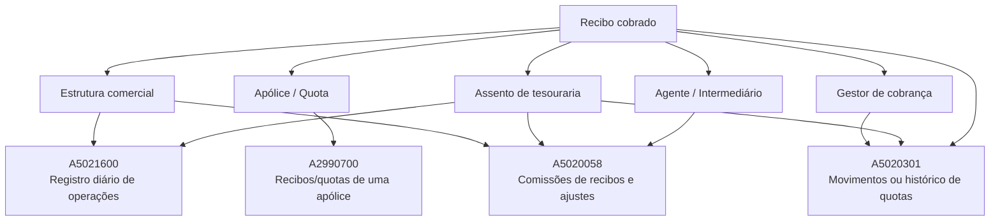
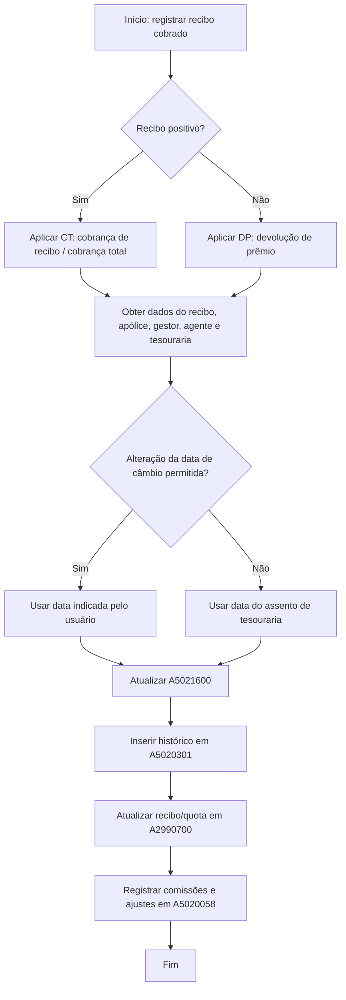

# Registro de Recibo Cobrado — Visão Técnica e Modelo de Dados Envolvido

## 1. Metadados do Documento
- **Arquivo de Origem:** Não identificado no texto extraído
- **Tipo de Documento:** Especificação Técnica
- **Domínio / Sistema:** Reef / Mapfre — registro de recibo cobrado
- **Público-Alvo:** Desenvolvedores, Arquitetos, Analistas Funcionais e Operação
- **Data/Versão Identificada:** Não identificada

---

## 2. Resumo Executivo & Contexto de Negócio

O documento descreve a visão técnica da operação de **registrar um recibo cobrado** no contexto Reef/Mapfre. O conteúdo concentra-se no modelo de dados afetado pela operação, especificando tabelas, colunas, obrigatoriedade, condições de alteração e regras de preenchimento.

A operação abrange o lançamento contábil e financeiro associado ao recibo, incluindo o registro diário de operações, o histórico de quotas, o registro principal de recibos/quotas de uma apólice e o lançamento de comissões e ajustes. O documento diferencia explicitamente o comportamento para recibos positivos, tratados como cobrança, e recibos negativos, tratados como devolução de prêmio.

As regras de preenchimento vinculam dados do recibo, do assento de tesouraria, da estrutura comercial, do agente, do gestor de cobrança, da moeda e do tipo de câmbio. Alguns campos recebem valores fixos, como `CT`, `DP`, `3` e `1`, enquanto outros são obtidos de informações do assento de tesouraria, do recibo, da apólice ou da configuração que permite alterar data de câmbio ou gestor de cobrança.

O material não descreve serviços, APIs, métodos HTTP, contratos JSON, filas, tecnologia de banco de dados, URLs, ambientes ou mecanismos de integração. A especificação disponível limita-se ao comportamento de persistência e atualização das tabelas relacionadas ao processo de cobrança de recibos.

---

## 3. Arquitetura, Componentes & Tecnologias Envolvidas

### Componentes e estruturas identificadas

| Componente / Estrutura | Descrição identificada |
| :--- | :--- |
| Reef | Contexto de documentação em que a operação técnica é apresentada. |
| Mapfre | Organização/sistema referenciado nos elementos de documentação extraídos. |
| Registro de recibo cobrado | Operação técnica descrita pelo documento. |
| Assento de tesouraria | Origem de datas, número de bloco de tesouraria, tipo de câmbio e outros dados usados em lançamentos. |
| Recibo | Entidade de origem para valores, moeda, situação e comportamento de cobrança/devolução. |
| Apólice | Entidade associada a número de apólice, tomador, agente e recibo. |
| Estrutura comercial | Fonte de níveis comerciais capturados ou associados ao registro. |
| A5021600 | Tabela `REGISTRO DIARIO DE OPERACIONES`. |
| A5020301 | Tabela `MOVIMIENTOS O HISTORICO DE CUOTAS`. |
| A2990700 | Tabela `RECIBOS/CUOTAS DE UNA POLIZA`. |
| A5020058 | Tabela `COMISIONES DE RECIBOS Y AJUSTES`. |



> **Nota de Análise:** O documento apresenta relações funcionais entre recibo, apólice, tesouraria, gestor, agente e tabelas de persistência. Não são detalhados banco de dados, chaves físicas, relacionamentos formais, transações, interfaces de integração ou tecnologias implementacionais.

---

## 4. Regras de Negócio, Especificações Funcionais & Processos

### 4.1 Regras gerais da operação

1. A operação registra a cobrança de recibos em estruturas de operação diária, histórico de quotas, recibos/quotas de apólice e comissões.
2. Um recibo positivo recebe o tratamento de cobrança de recibo:
   - `TIP_ACTU = CT - Cobro del recibo` em `A5021600`.
   - `TIP_SITUACION = CT - Cobro total` em `A5020301` e `A2990700`.
3. Um recibo negativo recebe o tratamento de devolução de prêmio:
   - `TIP_ACTU = DP - Devolucion de prima` em `A5021600`.
   - `TIP_SITUACION = DP - Devolucion de prima` em `A5020058`.
4. A causa de anulação (`COD_CAUSA_ANU`) recebe valor quando existir devolução de prêmio, nas tabelas em que esse campo foi indicado.
5. O tipo de cobrança (`TIP_COBRO`) recebe valor `3 - Por parte de tesoreria` onde especificado.
6. O tipo de ambiente (`TIP_ENTORNO`) recebe o valor `1 - Entorno de recibos` em `A5021600`.
7. O número de bloco de tesouraria (`NUM_BLOQUE_TES`) é obtido do número de bloco de tesouraria do assento.
8. A moeda (`COD_MON`) é obrigatória nas tabelas indicadas, mas o documento não detalha a regra de origem do valor.
9. O tipo de câmbio (`VAL_CAMBIO`) é obtido do tipo de câmbio na data do assento de cobrança, nas tabelas em que essa regra é indicada.
10. Quando for permitido alterar a data do tipo de câmbio:
    - `FEC_VALOR` ou `FEC_AUX1` recebe a data indicada pelo usuário.
    - Quando não for permitido alterar a data, recebe a data do assento de tesouraria.
11. Quando for permitido alterar o gestor de cobrança:
    - `TIP_GESTOR` recebe o novo tipo de gestor.
    - `COD_GESTOR` recebe o novo código de gestor.
12. Campos com indicação `Cuando cambia respecto a la situacion anterior` são atualizados quando o respectivo valor mudar em relação ao estado anterior.
13. `NUM_OPER_ASTO` em `A5021600` recebe valor sequencial.
14. `NUM_MVTO` em `A5020301` é incrementado em uma unidade a partir do maior número de movimento existente para o recibo.
15. `NUM_MVTO_301` em `A5020058` recebe o número correspondente ao movimento na tabela histórica de movimentos de recibos.
16. A comissão padrão e a comissão não padrão possuem tratamento distinto:
    - Para comissões padrão, `IMP_MVTO_RECA` recebe o importe da comissão sobre recargo.
    - Para comissões não padrão, `COD_TIP_COMISION` recebe valor quando a informação inserida é de comissões não estándar.
17. Para comissões por outros conceitos, `IMP_RECIBO` recebe valor `0`.
18. Para as demais comissões, `IMP_RECIBO` recebe o importe total do recibo.
19. A forma de atuação do intermediário (`FOR_ACTUACION`) depende do intermediário:
    - `P`: agente principal.
    - `1`, `2` ou `3`: agentes secundários.
    - `O`: organizador.
    - `A`: assessor.
20. Os campos auxiliares `TXT_AUX1`, `TXT_AUX2` e `TXT_AUX3` são explicitamente descritos como campos para dados específicos de uma instalação e não devem ser utilizados em instalações novas.

### 4.2 Fluxo lógico de persistência



### 4.3 Atualização da tabela A5021600

A tabela `A5021600` registra operações diárias. Entre os dados obrigatórios constam companhia, data e número de assento, número sequencial da operação do assento, tipo de atualização, conta contábil, data-valor, descrição do movimento, moeda, importe em moeda do país, tipo de importe contábil, número de bloco de tesouraria, caixa, data de atualização e outros dados identificados como obrigatórios.

O campo `TIP_ACTU` define a natureza do lançamento:
- Recibo positivo: `CT - Cobro del recibo`.
- Recibo negativo: `DP - Devolucion de prima`.

O campo `TIP_IMP` define o lado contábil:
- Cobrança de recibo positivo: `H - Haber`.
- Devolução de prêmio: `D - Debe`.

### 4.4 Atualização da tabela A5020301

A tabela `A5020301` registra movimentos ou histórico de quotas. A chave funcional indicada inclui companhia, apólice, suplemento, aplicação, suplemento da aplicação, quota e recibo. O número de movimento é gerado como o maior movimento existente do recibo acrescido de uma unidade.

A situação é preenchida como `CT - Cobro total`, e a data da situação recebe a data do assento de tesouraria. O número de bloco de tesouraria também é obtido do assento. A data auxiliar `FEC_AUX1` utiliza a data informada pelo usuário quando houver permissão para alteração da data de câmbio; caso contrário, utiliza a data do assento de tesouraria.

### 4.5 Atualização da tabela A2990700

A tabela `A2990700` representa recibos/quotas de uma apólice. A situação do recibo recebe `CT - Cobro total`. A data-valor (`FEC_VALOR`) é alterada quando a data-valor for modificada durante a cobrança do recibo.

O documento lista diversos campos sem regra de alteração ou preenchimento para a operação, incluindo tipo de recibo, remessa, data de remessa, valor de câmbio, impressão, controle de morosos, campos auxiliares, juros e dados documentais do pagador.

### 4.6 Atualização da tabela A5020058

A tabela `A5020058` registra comissões de recibos e ajustes. A situação depende do sinal do recibo:
- Recibo positivo: `CT - Cobro del recibo`.
- Recibo negativo: `DP - Devolucion de prima`.

Dados do tomador da apólice alimentam `TIP_DOCUM` e `COD_DOCUM`. Dados do agente pai alimentam `COD_AGT`, `TIP_DOCUM_AGT` e `COD_DOCUM_AGT`. O movimento de comissão recebe `COD_MVTO = DC - Devengo de comisiones`.

---

## 5. Tabelas de Parâmetros, Ambientes e Estruturas de Dados

> **Nota de interpretação:** Os códigos apresentados na coluna **Cambia** (`S`, `D`, `N`) foram preservados conforme o conteúdo original. O documento não fornece uma legenda para esses códigos.

### 5.1 A5021600 — Registro diário de operações

| Item / Parâmetro | Descrição / Função | Tipo / Valores / Formato | Ambiente / Observações |
| :--- | :--- | :--- | :--- |
| COD_CIA | Companhia | S; obrigatório | Valor: N.A. |
| FEC_ASTO | Data do assento | D; obrigatório | Altera quando muda em relação à situação anterior. |
| NUM_ASTO | Número do assento | D; obrigatório | Altera quando muda em relação à situação anterior. |
| NUM_OPER_ASTO | Número de operação do assento | S; obrigatório | Recebe valor sequencial. |
| COD_NIVEL2_CAPTURA | Segundo nível comercial do usuário que capturou o movimento | D; não obrigatório | Altera quando muda em relação à situação anterior. |
| COD_NIVEL3_CAPTURA | Nível 3 comercial do usuário que capturou o movimento | D; não obrigatório | Altera quando muda em relação à situação anterior. |
| COD_NIVEL1 | Nível 1 da estrutura comercial | D; não obrigatório | Altera quando muda em relação à situação anterior. |
| COD_NIVEL2 | Nível 2 da estrutura comercial | D; não obrigatório | Altera quando muda em relação à situação anterior. |
| COD_NIVEL3 | Nível 3 da estrutura comercial | D; obrigatório | Altera quando muda em relação à situação anterior. |
| TIP_ACTU | Tipo de atualização | S; obrigatório | Positivo: `CT - Cobro del recibo`; negativo: `DP - Devolucion de prima`. |
| COD_CTA | Conta contábil | D; obrigatório | Altera quando muda em relação à situação anterior. |
| FEC_VALOR | Data-valor | S; obrigatório | Data do usuário se a alteração de data de câmbio for permitida; caso contrário, data do assento de tesouraria. |
| FEC_VCTO | Data de vencimento | S; não obrigatório | N.A. |
| NUM_CRUCE | Número de cruzamento | D; não obrigatório | Se existir cobrança antecipada, recebe o número de cruzamento que a identifica. |
| NOM_MOVIM | Descrição do movimento | S; obrigatório | Descrição da agrupação contábil correspondente ao tipo de atualização. |
| NUM_POLIZA | Apólice | S; não obrigatório | N.A. |
| NUM_SPTO | Número de suplemento | S; não obrigatório | N.A. |
| NUM_RECIBO | Recibo | S; não obrigatório | N.A. |
| COD_CAUSA_ANU | Causa de anulação | D; não obrigatório | Recebe valor em devolução de prêmio. |
| TIP_GESTOR | Tipo de gestor | D; não obrigatório | Novo tipo de gestor se a alteração do gestor de cobrança for permitida. |
| COD_GESTOR | Gestor de cobrança | D; não obrigatório | Novo código de gestor se a alteração do gestor de cobrança for permitida. |
| NUM_SINI | Sinistro | N; não obrigatório | N.A. |
| NUM_EXP | Número de expediente | N; não obrigatório | N.A. |
| NUM_LIQ | Número de liquidação | N; não obrigatório | N.A. |
| MCA_CICOS | Marca de CICOS | N; não obrigatório | N.A. |
| COD_RAMO | Ramo | S; não obrigatório | N.A. |
| COD_SECTOR | Setor | S; não obrigatório | N.A. |
| COD_AGT | Agente | S; não obrigatório | N.A. |
| IMP_MON_PAIS | Importe do movimento em moeda do país | D; obrigatório | Para moeda diferente da moeda do país, recebe o importe do recibo convertido pelo tipo de câmbio. |
| IMP_MON_EXT | Importe do movimento em moeda estrangeira | S; não obrigatório | Recebe o valor do recibo na moeda original. |
| COD_MON | Moeda | S; obrigatório | N.A. |
| VAL_CAMBIO | Valor de câmbio de reservas | S; não obrigatório | Tipo de câmbio na data do assento de cobrança. |
| TIP_IMP | Tipo de importe contábil | S; obrigatório | Positivo: `H - Haber`; devolução: `D - Debe`. |
| TIP_ENTORNO | Tipo de ambiente | S; não obrigatório | Valor fixo `1 - Entorno de recibos`. |
| NUM_BLOQUE_TES | Número de transação de tesouraria | S; obrigatório | Número de bloco de tesouraria do assento. |
| COD_CAJERO | Caixa | D; obrigatório | Altera quando muda em relação à situação anterior. |
| FEC_ACTU | Data de atualização da fila | D; obrigatório | Altera quando muda em relação à situação anterior. |
| TIP_COBRO | Tipo de cobrança | S; não obrigatório | Valor fixo `3 - Por parte de tesoreria`. |
| TXT_AUX1 / TXT_AUX2 / TXT_AUX3 | Campos auxiliares | N; não obrigatório | Não devem ser usados em instalações novas. |
| IMP_AUX1 | Importe auxiliar | N; não obrigatório | N.A. |
| NUM_ASTO_220 | Número de assento definitivo na contabilidade | N; não obrigatório | N.A. |
| NUM_APUNTE_220 | Número de apontamento contábil | N; não obrigatório | N.A. |
| COD_CIA_IMPUT | Companhia de imputação | S; não obrigatório | N.A. |
| TXT_AUX1_CO / TXT_AUX2_CO / TXT_AUX3_CO | Parâmetros auxiliares de contabilidade | N; não obrigatório | N.A. |
| COD_CTO_PAGO | Código de conceito de pagamento | N; não obrigatório | N.A. |

### 5.2 A5020301 — Movimentos ou histórico de quotas

| Item / Parâmetro | Descrição / Função | Tipo / Valores / Formato | Ambiente / Observações |
| :--- | :--- | :--- | :--- |
| COD_CIA | Companhia | S; obrigatório | N.A. |
| NUM_POLIZA | Apólice | S; obrigatório | N.A. |
| NUM_SPTO | Número de suplemento | S; obrigatório | N.A. |
| NUM_APLI | Número de aplicação | S; obrigatório | N.A. |
| NUM_SPTO_APLI | Suplemento da aplicação | S; obrigatório | N.A. |
| NUM_CUOTA | Quota | S; obrigatório | N.A. |
| NUM_RECIBO | Recibo | S; obrigatório | N.A. |
| NUM_MVTO | Número de movimento | S; obrigatório | Máximo movimento do recibo acrescido de 1. |
| MCA_CA | Marca de alteração de agente | N; obrigatório | A fila corresponde a alteração de agente e anula a fila original. |
| MCA_CV | Marca de alteração de plano de pagamento | N; obrigatório | A fila corresponde a alteração de plano de pagamento e anula a fila original. |
| TIP_GESTOR | Tipo de gestor | S; obrigatório | N.A. |
| COD_GESTOR | Gestor de cobrança | S; obrigatório | N.A. |
| TIP_SITUACION | Situação | S; obrigatório | Valor `CT - Cobro total`. |
| FEC_SITUACION | Data de origem da situação | S; não obrigatório | Data do assento de tesouraria. |
| COD_MON | Moeda | S; obrigatório | N.A. |
| VAL_CAMBIO | Valor de câmbio de reservas | S; não obrigatório | Tipo de câmbio na data do assento de cobrança. |
| IMP_RECIBO | Total do recibo | S; obrigatório | N.A. |
| IMP_COMIS | Importe da comissão | S; obrigatório | N.A. |
| COD_NIVEL3 | Nível 3 da estrutura comercial | S; obrigatório | N.A. |
| COD_AGT | Agente | S; obrigatório | N.A. |
| COD_CAUSA_ANU | Causa de anulação | D; não obrigatório | Recebe valor quando houver devolução de prêmio. |
| NUM_BLOQUE_TES | Número de transação de tesouraria | S; não obrigatório | Número de bloco de tesouraria do assento. |
| TIP_COBRO | Tipo de cobrança | S; não obrigatório | Valor `3 - Por parte de tesoreria`. |
| FEC_AUX1 | Data real da cobrança | S; não obrigatório | Data do usuário se houver alteração de data de câmbio; senão, data do assento de tesouraria. |
| COD_USR | Usuário que atualizou a fila | D; obrigatório | Altera quando muda em relação à situação anterior. |
| FEC_ACTU | Data de atualização da fila | D; obrigatório | Altera quando muda em relação à situação anterior. |
| MCA_DCTO_COMIS | Desconto de comissões na cobrança | D; não obrigatório | Preenchido quando comissões são descontadas na cobrança. |
| COD_CIA_COBRO | Companhia da cobrança | D; não obrigatório | Altera quando muda em relação à situação anterior. |
| MCA_DTO_IMPTO | Desconto de imposto | D; não obrigatório | Preenchido quando impostos são descontados. |
| MCA_DTO_RECARGO | Desconto de recargo | D; não obrigatório | Preenchido quando recargos são descontados. |
| FEC_CTABLE | Data contábil | D; não obrigatório | Altera quando muda em relação à situação anterior. |
| Demais campos listados | Dados de efeito, vencimento, importes, remessa, pagamento e documento | S/N; não obrigatório, salvo indicação original | O documento os classifica como N.A. para a operação. |

### 5.3 A2990700 — Recibos/quotas de uma apólice

| Item / Parâmetro | Descrição / Função | Tipo / Valores / Formato | Ambiente / Observações |
| :--- | :--- | :--- | :--- |
| COD_CIA | Companhia | N; obrigatório | N.A. |
| NUM_POLIZA | Apólice | N; obrigatório | N.A. |
| NUM_SPTO | Número de suplemento | N; obrigatório | N.A. |
| NUM_APLI | Número de aplicação | N; obrigatório | N.A. |
| NUM_SPTO_APLI | Suplemento da aplicação | N; obrigatório | N.A. |
| NUM_CUOTA | Quota | N; obrigatório | N.A. |
| NUM_RECIBO | Recibo | N; obrigatório | N.A. |
| FEC_EFEC_RECIBO | Efeito do recibo | N; obrigatório | N.A. |
| FEC_VCTO_RECIBO | Vencimento do recibo | N; obrigatório | N.A. |
| TIP_GESTOR | Tipo de gestor | N; obrigatório | N.A. |
| COD_GESTOR | Gestor de cobrança | N; obrigatório | N.A. |
| FEC_EMISION_SPTO | Data de contabilização do suplemento | N; obrigatório | N.A. |
| TIP_SITUACION | Situação | S; obrigatório | Valor `CT - Cobro total`. |
| FEC_VALOR | Data-valor | D; não obrigatório | Preenchido se a data-valor for modificada na cobrança. |
| COD_MON | Moeda | N; obrigatório | N.A. |
| IMP_RECIBO | Total do recibo | N; obrigatório | N.A. |
| IMP_NETA | Prêmio líquido | N; obrigatório | N.A. |
| IMP_RECARGO | Recargos | N; obrigatório | N.A. |
| IMP_IMPTOS | Impostos | N; obrigatório | N.A. |
| IMP_BONI | Bonificações | N; obrigatório | N.A. |
| TIP_COASEGURO | Tipo de cosseguro | N; obrigatório | N.A. |
| COD_AGT | Agente | N; obrigatório | N.A. |
| MCA_CA | Alteração de agente | N; obrigatório | Anula a fila original. |
| MCA_CV | Alteração de plano de pagamento | N; obrigatório | Anula a fila original. |
| Demais campos listados | Dados de remessa, documento, juros, desconto, impressão e controle | N/D; não obrigatório | N.A. conforme o documento. |

### 5.4 A5020058 — Comissões de recibos e ajustes

| Item / Parâmetro | Descrição / Função | Tipo / Valores / Formato | Ambiente / Observações |
| :--- | :--- | :--- | :--- |
| COD_CIA | Companhia | S; obrigatório | N.A. |
| TIP_SITUACION | Situação | S; não obrigatório | Positivo: `CT - Cobro del recibo`; negativo: `DP - Devolucion de prima`. |
| COD_NIVEL2 | Nível 2 comercial | S; obrigatório | N.A. |
| COD_NIVEL3 | Nível 3 comercial | S; obrigatório | N.A. |
| TIP_DOCUM | Tipo de documento do terceiro | S; não obrigatório | Tipo de documento do tomador da apólice. |
| COD_DOCUM | Documento do terceiro | S; não obrigatório | Código de documento do tomador da apólice. |
| COD_AGT | Agente | D; não obrigatório | Chave do agente pai. |
| TIP_DOCUM_AGT | Tipo de documento do agente | D; não obrigatório | Tipo de documento do agente pai. |
| COD_DOCUM_AGT | Documento do agente | D; não obrigatório | Código de documento do agente pai. |
| TIP_AGT | Tipo de agente | D; não obrigatório | Altera quando muda em relação à situação anterior. |
| COD_MVTO | Código de movimento | S; não obrigatório | Valor `DC - Devengo de comisiones`. |
| COD_CTA | Conta contábil | S; não obrigatório | Número de conta contábil do agente. |
| COD_MON | Moeda | S; obrigatório | N.A. |
| VAL_CAMBIO | Valor de câmbio de reservas | S; não obrigatório | Tipo de câmbio na data do assento de cobrança. |
| IMP_RECIBO | Total do recibo | S; não obrigatório | `0` para comissões por outros conceitos; total do recibo para as demais. |
| IMP_MVTO | Importe do movimento | S; não obrigatório | Valor da comissão. |
| FEC_MVTO | Data do movimento | S; não obrigatório | Data do assento de tesouraria. |
| ANIO_MES | Ano/mês | S; não obrigatório | Mês e ano da data do assento de tesouraria. |
| FOR_ACTUACION | Forma de atuação do intermediário | S; não obrigatório | `P`, `1`, `2`, `3`, `O` ou `A`, conforme intermediário. |
| NUM_MVTO_301 | Número de movimento histórico | S; não obrigatório | Número do movimento na tabela histórica de recibos. |
| COD_TIP_COMISION | Tipo de comissão | D; não obrigatório | Preenchido para comissões não estándar. |
| IMP_MVTO_RECA | Comissão sobre recargo | D; não obrigatório | Para comissão estándar, recebe a comissão sobre recargo. |
| COD_HIJO_AGT | Código do agente filho | S; não obrigatório | Código do agente principal. |
| NUM_BLOQUE_TES | Número de transação de tesouraria | S; não obrigatório | Número de bloco de tesouraria do assento. |

---

## 6. Bateria de Perguntas & Respostas para RAG (FAQ Sintético)

### P1: Quais tabelas são afetadas pelo registro de um recibo cobrado?
**R:** O documento identifica quatro tabelas envolvidas na operação: `A5021600` para registro diário de operações, `A5020301` para movimentos ou histórico de quotas, `A2990700` para recibos/quotas de uma apólice e `A5020058` para comissões de recibos e ajustes.

### P2: Como o sistema diferencia cobrança de recibo e devolução de prêmio?
**R:** Em `A5021600`, um recibo positivo recebe `TIP_ACTU = CT - Cobro del recibo`, enquanto um recibo negativo recebe `TIP_ACTU = DP - Devolucion de prima`. Em `A5020058`, a situação também segue essa diferença: `CT` para recibo positivo e `DP` para recibo negativo.

### P3: Qual valor deve ser gravado em TIP_SITUACION para o histórico de quotas?
**R:** Na tabela `A5020301`, o campo `TIP_SITUACION` recebe o valor `CT - Cobro total`. Na tabela `A2990700`, o mesmo campo também recebe `CT - Cobro total`.

### P4: Como é gerado o número de movimento em A5020301?
**R:** O campo `NUM_MVTO` em `A5020301` é gerado incrementando em uma unidade o maior número de movimento já existente para o recibo.

### P5: Como é determinada a data-valor durante a cobrança do recibo?
**R:** Quando for permitido alterar a data do tipo de câmbio, a data-valor recebe a data indicada pelo usuário. Quando não for permitido, a data-valor recebe a data do assento de tesouraria. Essa regra é indicada para `FEC_VALOR` em `A5021600` e para `FEC_AUX1` em `A5020301`.

### P6: Qual é o valor de TIP_COBRO nas estruturas que o utilizam?
**R:** O campo `TIP_COBRO` recebe o valor `3 - Por parte de tesoreria` em `A5021600` e `A5020301`.

### P7: Como é calculado IMP_MON_PAIS no registro diário de operações?
**R:** Em `A5021600`, quando o recibo está em moeda diferente da moeda do país, `IMP_MON_PAIS` recebe o valor do importe do recibo convertido mediante aplicação do tipo de câmbio.

### P8: Qual é o comportamento de TIP_IMP para recibos positivos e devoluções de prêmio?
**R:** Em `A5021600`, se for cobrança de recibo positivo, `TIP_IMP` recebe `H - Haber`. Se for devolução de prêmio, `TIP_IMP` recebe `D - Debe`.

### P9: Como são obtidos os dados documentais do terceiro em A5020058?
**R:** Em `A5020058`, `TIP_DOCUM` recebe o tipo de documento do tomador da apólice, e `COD_DOCUM` recebe o código de documento do tomador da apólice.

### P10: Como funciona o tratamento do agente em A5020058?
**R:** O campo `COD_AGT` recebe a chave do agente pai. `TIP_DOCUM_AGT` recebe o tipo de documento do agente pai e `COD_DOCUM_AGT` recebe o código de documento do agente pai. `COD_HIJO_AGT` recebe o código do agente principal.

### P11: Como é preenchido IMP_RECIBO para comissões?
**R:** Em `A5020058`, `IMP_RECIBO` recebe `0` quando se tratar de comissões por outros conceitos. Para o restante das comissões, recebe o importe total do recibo.

### P12: Qual dado deve preencher NUM_BLOQUE_TES?
**R:** Nas tabelas em que aparece, `NUM_BLOQUE_TES` recebe o número de bloco de tesouraria do assento.

---

## 7. Glossário de Termos, Siglas & Conceitos-Chave

- **A2990700:** Tabela de recibos/quotas de uma apólice.
- **A5020058:** Tabela de comissões de recibos e ajustes.
- **A5020301:** Tabela de movimentos ou histórico de quotas.
- **A5021600:** Tabela de registro diário de operações.
- **Assento de tesouraria:** Assento utilizado como origem de datas, bloco de tesouraria e tipo de câmbio no processo.
- **CT:** `Cobro` ou `Cobro total`, utilizado para representar cobrança de recibo.
- **DC:** `Devengo de comisiones`, código de movimento de comissão.
- **DP:** `Devolucion de prima`, utilizado para representar devolução de prêmio.
- **FEC_ASTO:** Data do assento.
- **FEC_VALOR:** Data-valor.
- **Gestor de cobrança:** Entidade identificada por tipo e código, associada ao processo de cobrança.
- **Haber:** Valor de `TIP_IMP` para cobrança de recibo positivo.
- **Debe:** Valor de `TIP_IMP` para devolução de prêmio.
- **MCA_CA:** Marca que identifica fila correspondente a alteração de agente.
- **MCA_CV:** Marca que identifica fila correspondente a alteração de plano de pagamento.
- **N.A.:** Campo sem regra de valor ou alteração detalhada para a operação no documento.
- **Recargo:** Componente de valor indicado nos dados de recibo e comissões.
- **Tesouraria:** Contexto responsável pelo assento e bloco de tesouraria associados à cobrança.

---

## 8. Notas Críticas, Riscos & Limitações

- O documento não informa nome do arquivo, data, versão, autor técnico, banco de dados, tecnologia, ambiente, URL, API, serviço ou contrato de integração.
- Os códigos `S`, `D` e `N` apresentados na coluna `CAMBIA` não possuem legenda explícita no material extraído.
- Há campos marcados como obrigatórios com valor `N.A.`; o documento registra a obrigatoriedade, mas não detalha a origem ou regra de preenchimento em todos os casos.
- O processo depende de informações de assento de tesouraria, recibo, apólice, estrutura comercial, gestor de cobrança e agente. O documento não detalha a disponibilidade, ordem transacional, validação ou tratamento de indisponibilidade dessas dependências.
- Os campos auxiliares `TXT_AUX1`, `TXT_AUX2` e `TXT_AUX3` são apontados como campos que não devem ser usados em instalações novas.
- Não há detalhamento dos critérios que definem se a alteração de data do tipo de câmbio ou de gestor de cobrança é permitida.
- Não são especificadas regras de rollback, idempotência, concorrência, auditoria, controle de erros ou reconciliação contábil.

---

## 9. Conteúdo Bruto Estruturado (Referência Fiel)

```text
--- [PÁGINA 1 DE 15] ---

EN CONSTRUCCIÓN
REGISTRAR recibo cobrado (visión técnica)
Modelo de datos involucrado
Las tablas que intervienen en esta operación son:
A5021600
TABLA DESCRIPCIÓN
A5021600 REGISTRO DIARIO DE OPERACIONES

COLUMNA | CAMBIA | VALOR MOTIVO/VALOR | OBLIGATORIA | COMENTARIO
COD_CIA | S | N.A. | SI | COMPANIA
FEC_ASTO | D | Cuando cambia respecto a la situacion anterior | SI | FECHA DE ASIENTO
NUM_ASTO | D | Cuando cambia respecto a la situacion anterior | SI | NUMERO DE ASIENTO
NUM_OPER_ASTO | S | Toma valor secuencial | SI | NUMERO DE OPERACION DEL ASIENTO
COD_NIVEL2_CAPTURA | D | Cuando cambia respecto a la situacion anterior | NO | SEGUNDO NIVEL DE LA ESTRUCTUA COMERCIAL DEL USUARIO QUE CAPTURO EL MOVIMIENTO
COD_NIVEL3_CAPTURA | D | Cuando cambia respecto a la situacion anterior | NO | NIVEL3 DE LA ESTRUCTURA COMERCIAL DEL USUARIO QUE CAPTURO EL MOVIMIENTO

--- [PÁGINA 2 DE 15] ---

COD_NIVEL1 | D | Cuando cambia respecto a la situacion anterior | NO | NIVEL1 DE LA ESTRUCTURA COMERCIAL
COD_NIVEL2 | D | Cuando cambia respecto a la situacion anterior | NO | NIVEL2 DE LA ESTRUCTURA COMERCIAL
COD_NIVEL3 | D | Cuando cambia respecto a la situacion anterior | SI | NIVEL3 DE LA ESTRUCTURA COMERCIAL
TIP_ACTU | S | Si el recibo es positivo toma el valor CT- Cobro del recibo. Si el recibo es negativo toma el valor DP - Devolucion de prima | SI | TIPO DE ACTUALIZACION
COD_CTA | D | Cuando cambia respecto a la situacion anterior | SI | CUENTA CONTABLE
FEC_VALOR | S | Si se permite cambiar la fecha del tipo de cambio toma la fecha indicada por el usuario. Si no se permite cambiar toma la fecha del asiento de tesoreria | SI | FECHA VALOR
FEC_VCTO | S | N.A. | NO | FECHA DE VENCIMIENTO
NUM_CRUCE | D | Si existe cobro anticipado para el recibo toma el valor del numero de cruce que identifica el cobro anticipado | NO | NUMERO DE CRUCE
NOM_MOVIM | S | Toma la descripcion de la agrupacion contable correspondiente al tipo de actualizacion | SI | DESCRIPCION DEL MOVIMIENTO
NUM_POLIZA | S | N.A. | NO | POLIZA
NUM_SPTO | S | N.A. | NO | NUMERO DE SUPLEMENTO
NUM_RECIBO | S | N.A. | NO | RECIBO
COD_CAUSA_ANU | D | Toma valor cuando es devolucion de prima | NO | CAUSA DE ANULACION
TIP_GESTOR | D | Si se permite cambiar el gestor de cobro en el cobro del recibo toma el nuevo tipo de gestor | NO | TIPO DE GESTOR
COD_GESTOR | D | Si se permite cambiar el gestor de cobro en el cobro del recibo toma el nuevo codigo de gestor | NO | GESTOR DE COBRO

--- [PÁGINA 3 DE 15] ---

NUM_SINI | N | N.A. | NO | SINIESTRO
NUM_EXP | N | N.A. | NO | NÚMERO DE EXPEDIENTE
NUM_LIQ | N | N.A. | NO | LIQUIDATION NUMBER
MCA_CICOS | N | N.A. | NO | MARCA DE CICOS
COD_RAMO | S | N.A. | NO | RAMO
COD_SECTOR | S | N.A. | NO | SECTOR
COD_AGT | S | N.A. | NO | AGENTE
IMP_MON_PAIS | D | Si el recibo es en una moneda distinta a la del pais toma el valor del importe del recibo aplicando el tipo de cambio | SI | IMPORTE DEL MOVIMIENTO EN MONEDA DEL PAIS
IMP_MON_EXT | S | Toma el valor del recibo en la moneda original | NO | IMPORTE DEL MOVIMIENTO EN MONEDA EXTRANJERA
COD_MON | S | N.A. | SI | MONEDA
VAL_CAMBIO | S | Toma el valor del tipo de cambio a la fecha del asiento del cobro | NO | VALOR DE CAMBIO DE LAS RESERVAS
TIP_IMP | S | Si es un cobro de un recibo positivo toma el valor H - Haber. Si es una devolucion de prima toma el valor D - Debe | SI | TIPO DE IMPORTE CONTABLE (DEBE / HABER)

--- [PÁGINA 5 DE 15] ---

TIP_ENTORNO | S | Toma el valor 1 - Entorno de recibos | NO | TIPO DE ENTORNO
NUM_BLOQUE_TES | S | Toma el valor del numero de bloque de tesoreria del asiento | SI | NUMERO DE TRANSACCION DE TESORERIA
COD_CAJERO | D | Cuando cambia respecto a la situacion anterior | SI | CAJERO
FEC_ACTU | D | Cuando cambia respecto a la situacion anterior | SI | FECHA DE ACTUALIZACION DE LA FILA
TIP_COBRO | S | Toma el valor 3 - Por parte de tesoreria | NO | TIPO DE COBRO
TXT_AUX1 / TXT_AUX2 / TXT_AUX3 | N | N.A. | NO | CAMPOS AUXILIARES; NO SE DEBEN USAR EN INSTALACIONES NUEVAS

--- [PÁGINA 6 DE 15] ---

A5020301
TABLA DESCRIPCIÓN
A5020301 MOVIMIENTOS O HISTORICO DE CUOTAS

COD_CIA | S | N.A. | SI | COMPANIA
NUM_POLIZA | S | N.A. | SI | POLIZA
NUM_SPTO | S | N.A. | SI | NUMERO DE SUPLEMENTO

--- [PÁGINA 7 DE 15] ---

NUM_APLI | S | N.A. | SI | NUMERO DE APLICACION
NUM_SPTO_APLI | S | N.A. | SI | SUPLEMENTO DE LA APLICACION
NUM_CUOTA | S | N.A. | SI | CUOTA
NUM_RECIBO | S | N.A. | SI | RECIBO
NUM_MVTO | S | Incrementa en 1 el numero del maximo movimiento del recibo | SI | NUMERO DE MOVIMIENTO
MCA_CA | N | N.A. | SI | CAMBIO DE AGENTE; ANULA LA FILA ORIGINAL
MCA_CV | N | N.A. | SI | CAMBIO DE PLAN DE PAGO; ANULA LA FILA ORIGINAL
TIP_GESTOR | S | N.A. | SI | TIPO DE GESTOR
COD_GESTOR | S | N.A. | SI | GESTOR DE COBRO
TIP_SITUACION | S | Toma el valor CT - Cobro total | SI | SITUACION
FEC_SITUACION | S | Toma el valor de la fecha del asiento de tesoreria | NO | FECHA DE ORIGEN DE LA SITUACION
COD_MON | S | N.A. | SI | MONEDA
VAL_CAMBIO | S | Toma el valor del tipo de cambio a la fecha del asiento del cobro | NO | VALOR DE CAMBIO DE LAS RESERVAS
IMP_RECIBO | S | N.A. | SI | TOTAL DEL RECIBO
IMP_COMIS | S | N.A. | SI | IMPORTE DE LA COMISION

--- [PÁGINA 8 DE 15] ---

COD_NIVEL3 | S | N.A. | SI | NIVEL3 DE LA ESTRUCTURA COMERCIAL
COD_AGT | S | N.A. | SI | AGENTE
COD_CAUSA_ANU | D | Toma valor cuando es devolución de prima | NO | CAUSA DE ANULACION
NUM_BLOQUE_TES | S | Toma el valor del numero de bloque de tesoreria del asiento | NO | NUMERO DE TRANSACCION DE TESORERIA
TIP_COBRO | S | Toma el valor 3 - Por parte de tesoreria | NO | TIPO DE COBRO
FEC_AUX1 | S | Si se permite cambiar la fecha del tipo de cambio toma la fecha indicada por el usuario. Si no se permite cambiar toma la fecha del asiento de tesorería | NO | FECHA REAL DEL COBRO
COD_USR | D | Cuando cambia respecto a la situacion anterior | SI | USUARIO QUE ACTUALIZO LA FILA
FEC_ACTU | D | Cuando cambia respecto a la situacion anterior | SI | FECHA DE ACTUALIZACION DE LA FILA

--- [PÁGINA 9 DE 15] ---

A2990700
TABLA DESCRIPCIÓN
A2990700 RECIBOS/CUOTAS DE UNA POLIZA

COD_CIA | N | N.A | SI | COMPANIA
NUM_POLIZA | N | N.A | SI | POLIZA

--- [PÁGINA 10 DE 15] ---

NUM_SPTO | N | N.A | SI | NUMERO DE SUPLEMENTO
NUM_APLI | N | N.A | SI | NUMERO DE APLICACION
NUM_SPTO_APLI | N | N.A | SI | SUPLEMENTO DE LA APLICACION
NUM_CUOTA | N | N.A | SI | CUOTA
NUM_RECIBO | N | N.A | SI | RECIBO
FEC_EFEC_RECIBO | N | N.A | SI | EFECTO DEL RECIBO
FEC_VCTO_RECIBO | N | N.A | SI | VENCIMIENTO DEL RECIBO
TIP_GESTOR | N | N.A | SI | TIPO DE GESTOR
COD_GESTOR | N | N.A | SI | GESTOR DE COBRO
FEC_EMISION_SPTO | N | N.A | SI | FECHA DE CONTABILIZACION DEL SUPLEMENTO
TIP_SITUACION | S | Toma el valor CT - Cobro total | SI | SITUACION
FEC_VALOR | D | Si se cambia la fecha de valor en el cobro de recibo | NO | FECHA VALOR
COD_MON | N | N.A | SI | MONEDA
IMP_RECIBO | N | N.A | SI | TOTAL DEL RECIBO
IMP_NETA | N | N.A | SI | PRIMA NETA
IMP_RECARGO | N | N.A | SI | RECARGOS

--- [PÁGINA 12 DE 15] ---

A5020058
TABLA DESCRIPCIÓN
A5020058 COMISIONES DE RECIBOS Y AJUSTES

COD_CIA | S | N.A. | SI | COMPANIA
NUM_RECIBO | S | N.A. | NO | RECIBO
NUM_POLIZA | S | N.A. | NO | POLIZA
NUM_SPTO | S | N.A. | NO | NUMERO DE SUPLEMENTO
NUM_APLI | S | N.A. | NO | NUMERO DE APLICACION
NUM_SPTO_APLI | S | N.A. | NO | SUPLEMENTO DE LA APLICACION
NUM_CUOTA | S | N.A. | NO | CUOTA
TIP_SITUACION | S | Si el recibo es positivo toma el valor CT - Cobro del recibo. Si el recibo es negativo toma el valor DP - Devolucion de prima | NO | SITUACION

--- [PÁGINA 13 DE 15] ---

COD_NIVEL2 | S | N.A. | SI | NIVEL2 DE LA ESTRUCTURA COMERCIAL
COD_NIVEL3 | S | N.A. | SI | NIVEL3 DE LA ESTRUCTURA COMERCIAL
TIP_DOCUM | S | Toma el valor del tipo de documento del tomador de la poliza | NO | TIPO DEL DOCUMENTO DEL TERCERO
COD_DOCUM | S | Toma el valor del codigo de documento del tomador de la poliza | NO | DOCUMENTO DEL TERCERO
COD_AGT | D | Toma el valor de la clave del agente padre | NO | AGENTE
TIP_DOCUM_AGT | D | Toma el valor del tipo de documento del agente padre | NO | TIPO DE DOCUMENTO DEL AGENTE
COD_DOCUM_AGT | D | Toma el valor del código de documento del agente padre | NO | DOCUMENTO DEL AGENTE
TIP_AGT | D | Cuando cambia respecto a la situacion anterior | NO | TIPO DE AGENTE
COD_MVTO | S | Toma el valor DC - Devengo de comisiones | NO | CODIGO DE MOVIMIENTO
COD_CTA | S | Toma el valor del número de cuenta contable del agente | NO | CUENTA CONTABLE
COD_MON | S | N.A. | SI | MONEDA
VAL_CAMBIO | S | Toma el valor del tipo de cambio a la fecha del asiento del cobro | NO | VALOR DE CAMBIO DE LAS RESERVAS
IMP_RECIBO | S | Toma valor 0 cuando son comisiones por otros conceptos. Toma el valor del importe total del recibo para el resto de comisiones | NO | TOTAL DEL RECIBO
IMP_MVTO | S | Toma el valor de la comisión | NO | IMPORTE DEL MOVIMIENTO

--- [PÁGINA 14 DE 15] ---

FEC_MVTO | S | Toma el valor de la fecha del asiento de tesoreria | NO | FECHA DEL MOVIMIENTO
ANIO_MES | S | Toma el valor del mes y año de la fecha del asiento de tesoreria | NO | ANIO/MES
FOR_ACTUACION | S | Toma el valor dependiendo del intermediario: P-Agente principal; 1,2 o 3-Agentes secundarios; O-Organizador; A-asesor | NO | FORMA DE ACTUACION DEL INTERMEDIARIO
NUM_MVTO_301 | S | Toma el número correspondiente al movimiento en la tabla historica de movimientos de recibos | NO | NUMERO DE MOVIMIENTO EN HISTORICO DE RECIBOS
COD_TIP_COMISION | D | Cuando la información que se inserta es de comisiones no estandar | NO | TIPO DE COMISION
IMP_MVTO_RECA | D | Cuando la información que se inserta es de comisiones estandar toma el importe de la comision sobre recargo | NO | IMPORTE DE LAS COMISIONES SOBRE EL RECARGO
COD_HIJO_AGT | S | Toma el valor del código del agente principal | NO | CODIGO DEL AGENTE HIJO
NUM_BLOQUE_TES | S | Toma el valor del numero de bloque de tesoreria del asiento | NO | NUMERO DE TRANSACCION DE TESORERIA

--- [PÁGINA 15 DE 15] ---

[Página em branco ou apenas elementos visuais/imagem]
```
