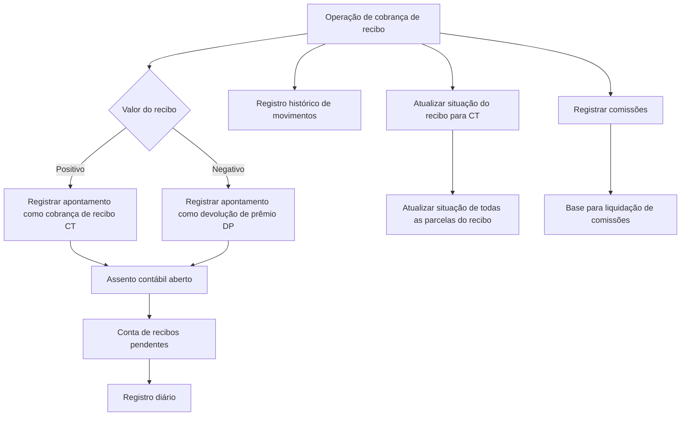

# Documentação REEF — Registro de Recibo Cobrado

## 1. Metadados do Documento
- **Arquivo de Origem:** `Não identificado no conteúdo fornecido`
- **Tipo de Documento:** `Procedimento`
- **Domínio / Sistema:** `REEF / Mapfre`
- **Público-Alvo:** `Negócio, Operação, Desenvolvedores e Arquitetos`
- **Data/Versão Identificada:** `Não identificada`

---

## 2. Resumo Executivo & Contexto de Negócio

O documento descreve o processo automático de **registro de recibo cobrado** no domínio REEF. O processo registra contabilmente o valor recebido pelo cobrança de um recibo, atualiza a situação do recibo e registra as comissões aplicáveis ao agente e às demais intervenções da apólice.

O objetivo operacional é deixar evidência da nova situação do recibo como cobrado, registrar o respectivo valor na contabilidade e gerar a base para a liquidação das comissões decorrentes do cobrança. O processo atua sobre o registro diário, o assento contábil aberto, o registro histórico de movimentos e a situação das parcelas que compõem o recibo.

A classificação do movimento contábil depende do sinal do valor do recibo. Um recibo com valor positivo é identificado como **cobro de recibo (CT)**. Um recibo com valor negativo é tratado como **devolução de prêmio (DP)**. Em ambos os casos, os valores são registrados na moeda do próprio recibo.

O documento informa que o processo está “em construção” e referencia um enlace com visão técnica, mas não fornece detalhes de interfaces, métodos HTTP, contratos de integração, persistência física, tecnologias, URLs, ambientes ou tratamento de erros.

---

## 3. Arquitetura, Componentes & Tecnologias Envolvidas

Os componentes funcionais e registros citados no processo de registro de recibo cobrado são:

- **REEF:** domínio ou sistema associado à documentação.
- **Operação de cobrança de recibo:** operação que inicia o registro contábil e funcional do recibo cobrado.
- **Registro diário:** recebe um apontamento contábil associado ao cobrança ou à devolução de prêmio.
- **Assento contábil aberto:** recebe o novo movimento contábil.
- **Conta de recibos pendentes:** conta utilizada para imputação do movimento.
- **Registro histórico de movimentos:** mantém o histórico de qualquer movimento realizado sobre um recibo.
- **Situação do recibo:** é atualizada para indicar cobrança, identificada como CT.
- **Parcelas do recibo:** têm a situação atualizada quando o recibo é cobrado.
- **Comissões:** registra valores devidos ao agente e a outras intervenções da apólice.
- **Processo de liquidação de comissões:** utiliza as comissões registradas como base.



**Nota de Análise:** o documento não detalha a arquitetura técnica do REEF, microsserviços, bancos de dados, APIs, protocolos, métodos HTTP, contratos JSON, filas, mecanismos de autenticação ou ambientes de implantação.

---

## 4. Regras de Negócio, Especificações Funcionais & Processos

### Objetivo do processo

O processo de cobrança de recibo deve:

1. Registrar o valor recebido pelo cobrança do recibo no registro diário.
2. Atualizar o recibo correspondente para identificá-lo como cobrado.
3. Registrar o valor que deve ser pago como comissão ao agente.
4. Registrar o valor que deve ser pago a outras intervenções da apólice.
5. Criar a base de informação necessária para o processo de liquidação de comissões.

### Fluxo automático do processo

O documento declara que os passos abaixo são realizados automaticamente:

1. Inserir registro diário.
2. Registrar movimento histórico.
3. Atualizar a situação do recibo.
4. Registrar as comissões.

### Inserção do registro diário

A operação de cobrança de recibo registra um apontamento no registro diário. A identificação do movimento depende do valor do recibo:

- Se o valor do recibo for **positivo**, o movimento é identificado como **cobro de recibo (CT)**.
- Se o valor do recibo for **negativo**, o movimento é identificado como **devolução de prêmio (DP)**.

O apontamento deve ser gerado como um novo movimento no assento contábil que estiver aberto. O movimento deve ser imputado à conta de recibos pendentes:

- No **Haber**, quando o recibo for positivo.
- No **Debe**, quando ocorrer devolução de prêmio, isto é, quando o recibo for negativo.

Os valores são sempre registrados na moeda do recibo.

### Registro de movimento histórico

O processo registra o movimento de cobrança do recibo no registro histórico de movimentos. O registro histórico deve refletir qualquer movimento realizado sobre um recibo.

### Atualização da situação do recibo

O processo atualiza a situação do recibo para indicar que o recibo foi cobrado, utilizando a identificação **CT**. Ao cobrar um recibo, a atualização da situação deve ocorrer em todas as parcelas que compõem o recibo cobrado.

### Registro de comissões

Durante o processo de cobrança, são registradas as comissões decorrentes do cobrança do recibo:

- Comissão do agente.
- Comissões das demais intervenções da apólice.

As informações de comissão registradas servem como base para o processo de liquidação de comissões.

---

## 5. Tabelas de Parâmetros, Ambientes e Estruturas de Dados

| Item / Parâmetro | Descrição / Função | Tipo / Valores / Formato | Ambiente / Observações |
| :--- | :--- | :--- | :--- |
| REEF | Sistema ou domínio associado à documentação. | Nome de sistema/domínio. | O documento não detalha arquitetura ou ambiente do REEF. |
| Operação de cobrança de recibo | Dispara o processo de registro contábil, histórico, atualização de situação e comissões. | Processo automático. | Não são descritos canais de execução ou interfaces técnicas. |
| Valor do recibo | Determina a classificação contábil do movimento. | Positivo ou negativo. | Valores são registrados na moeda do recibo. |
| CT | Identificação de cobrança de recibo. Também identifica a situação do recibo cobrado. | Código `CT`. | Aplicável quando o valor do recibo é positivo. |
| DP | Identificação de devolução de prêmio. | Código `DP`. | Aplicável quando o valor do recibo é negativo. |
| Registro diário | Registro que recebe o apontamento gerado pela operação de cobrança. | Registro contábil. | Movimento é identificado como CT ou DP conforme o valor do recibo. |
| Assento contábil aberto | Assento que recebe o novo movimento gerado no processo. | Estrutura contábil. | O documento não define critérios para abertura, fechamento ou seleção do assento. |
| Conta de recibos pendentes | Conta utilizada na imputação do movimento gerado pelo cobrança. | Conta contábil. | Crédito no Haber para recibo positivo; débito no Debe para devolução de prêmio. |
| Haber | Lado de imputação para recibo de valor positivo. | Posição contábil. | Aplicado à conta de recibos pendentes. |
| Debe | Lado de imputação para devolução de prêmio. | Posição contábil. | Aplicado quando o recibo possui valor negativo. |
| Registro histórico de movimentos | Mantém o histórico de movimentos realizados sobre um recibo. | Registro histórico. | Deve refletir qualquer movimento realizado sobre o recibo. |
| Situação do recibo | Estado funcional do recibo após a cobrança. | Código `CT`. | É atualizada para indicar que o recibo foi cobrado. |
| Parcelas do recibo | Elementos que compõem o recibo cobrado. | Conjunto de parcelas. | Todas as parcelas devem ter a situação atualizada durante a cobrança. |
| Comissão do agente | Comissão devida ao agente em razão do cobrança do recibo. | Valor de comissão. | Serve de base para liquidação de comissões. |
| Outras intervenções da apólice | Intervenções além do agente que podem receber comissões pelo cobrança. | Valores de comissão. | O documento não detalha tipos de intervenção ou regras de cálculo. |
| Processo de liquidação de comissões | Processo que utiliza as informações de comissões registradas. | Processo posterior. | Não detalhado no documento. |
| Ambiente | Ambiente técnico de execução. | Não informado. | Não identificado no conteúdo. |
| URLs, rotas e logs | Endereços, caminhos de log ou rotas técnicas. | Não informado. | Não identificado no conteúdo. |

---

## 6. Bateria de Perguntas & Respostas para RAG (FAQ Sintético)

### P1: Qual é o objetivo do processo de registro de recibo cobrado?
**R:** O processo registra o valor recebido pelo cobrança do recibo na contabilidade, atualiza a situação do recibo para indicar que foi cobrado e registra as comissões correspondentes ao agente e às demais intervenções da apólice.

### P2: Quais etapas são executadas automaticamente no processo de cobrança de recibo?
**R:** O processo executa automaticamente quatro etapas: inserção de registro diário, registro do movimento histórico, atualização da situação do recibo e registro das comissões.

### P3: Quando um movimento é identificado como CT no registro diário?
**R:** O movimento é identificado como cobrança de recibo, código CT, quando o valor do recibo é positivo. O código CT também é utilizado para indicar a situação de recibo cobrado.

### P4: Quando um movimento é identificado como DP?
**R:** O movimento é identificado como devolução de prêmio, código DP, quando o valor do recibo é negativo.

### P5: Em qual conta é imputado o movimento de cobrança ou devolução do recibo?
**R:** O novo movimento é imputado à conta de recibos pendentes dentro do assento contábil que estiver aberto.

### P6: Como o sinal do valor do recibo afeta a imputação contábil?
**R:** Para recibo com valor positivo, o movimento é imputado no Haber da conta de recibos pendentes. Para recibo com valor negativo, tratado como devolução de prêmio, o movimento é imputado no Debe.

### P7: Em qual moeda os valores do recibo são registrados?
**R:** Os valores são sempre registrados na moeda do próprio recibo.

### P8: O que é registrado no histórico de movimentos durante a cobrança do recibo?
**R:** É registrado o movimento de cobrança do recibo no registro histórico de movimentos. Esse registro deve refletir qualquer movimento realizado sobre um recibo.

### P9: O que acontece com as parcelas quando um recibo é cobrado?
**R:** A situação do recibo é atualizada para CT, e essa atualização é aplicada a todas as parcelas que compõem o recibo cobrado.

### P10: Quais comissões são registradas no processo de cobrança?
**R:** O processo registra as comissões devidas pelo cobrança do recibo ao agente e às demais intervenções da apólice.

### P11: Para que servem as informações de comissão registradas?
**R:** As informações de comissões registradas durante o cobrança servem de base para o processo de liquidação de comissões.

### P12: O documento informa APIs, métodos HTTP ou contratos técnicos para o processo?
**R:** Não. O documento menciona um enlace com visão técnica, mas não especifica APIs, métodos HTTP, contratos JSON, tecnologias, URLs ou demais detalhes de integração.

---

## 7. Glossário de Termos, Siglas & Conceitos-Chave

- **REEF:** sistema ou domínio mencionado na documentação; o conteúdo não apresenta uma definição expandida da sigla.
- **CT:** código utilizado para identificar o cobrança de recibo e a situação de recibo cobrado.
- **DP:** código utilizado para identificar uma devolução de prêmio quando o valor do recibo é negativo.
- **Recibo:** entidade cujo cobrança gera registros contábeis, histórico, atualização de situação e comissões.
- **Cobrança de recibo:** operação que registra o valor recebido e altera a situação do recibo.
- **Devolução de prêmio:** classificação aplicada quando o valor do recibo é negativo.
- **Registro diário:** registro que recebe o apontamento associado ao cobrança ou à devolução de prêmio.
- **Assento contábil aberto:** assento no qual é gerado o novo movimento da operação.
- **Conta de recibos pendentes:** conta usada para imputar o movimento contábil gerado.
- **Haber:** lado de imputação aplicado à conta de recibos pendentes quando o recibo é positivo.
- **Debe:** lado de imputação aplicado quando há devolução de prêmio.
- **Registro histórico de movimentos:** registro que deve refletir qualquer movimento efetuado sobre um recibo.
- **Intervenções da apólice:** partes além do agente para as quais podem ser registradas comissões.
- **Liquidação de comissões:** processo que utiliza como base as informações de comissão registradas no cobrança.

---

## 8. Notas Críticas, Riscos & Limitações

- **Nota de Análise:** o documento está marcado como **“EN CONSTRUCCIÓN”**, o que indica conteúdo potencialmente incompleto.
- **Nota de Análise:** embora seja mencionado um enlace com visão técnica, o conteúdo fornecido não inclui esse enlace nem seu conteúdo.
- **Limitação técnica:** não há especificação de APIs, endpoints, métodos HTTP, eventos, contratos de dados, tecnologias, banco de dados, integrações ou mecanismos de autenticação.
- **Limitação operacional:** o documento não informa regras de tratamento de falhas, reversão de lançamento, idempotência, validações prévias ou tratamento de duplicidade de cobrança.
- **Limitação contábil:** o documento define a imputação no Haber ou Debe conforme o sinal do recibo, mas não detalha códigos de conta, plano de contas, critérios de escolha do assento aberto ou reconciliação.
- **Limitação de comissões:** são citadas comissões para agente e outras intervenções da apólice, porém não são definidos critérios de cálculo, percentuais, elegibilidade, periodicidade ou regras de liquidação.
- **Dependência funcional:** a correta atualização da situação de todas as parcelas depende da existência e identificação das parcelas que compõem o recibo cobrado.

---

## 9. Conteúdo Bruto Estruturado (Referência Fiel)

```text
--- [PÁGINA 1 DE 2] ---

Documentation / DOCUMENTACIÓN Reef
DOCUMENTACIÓN Reef
Mapfredocument
DOCUMENTACIÓN Reef
Owner
user:agonzalez_mapfre.com
Lifecycle
Approved Source
 /
 VL
Buscar Inicio Soluciones Arquitecturas APIs Componentes Cloud Documentación Zeus Reef Ayuda
ES


--- [PÁGINA 2 DE 2] ---

EN CONSTRUCCIÓN
REGISTRAR recibo cobrado (enlace con visión técnica)
¿En qué consiste?
Se trata de registrar el importe recibido por el cobro del recibo en el registro diario, además de actualizar el recibo correspondiente para
identicar que ha sido cobrado y registrar el importe que se debe pagar como comisión al agente y otras intervenciones de la póliza.
Objetivo
Realizar los pasos necesarios para registrar el importe cobrado en la contabilidad y dejar constancia de la nueva situación del recibo como
cobrado, además de registrar el importe de las comisiones correspondientes por el cobro del recibo.
Proceso a seguir
El proceso comprende los siguientes pasos que se hacen de forma automática:
Insertar registro diario
La operación de cobro de recibo registra un apunte en el registro diario, identicando el movimiento como cobro de recibo (CT) si el importe
del recibo es positivo, o como una devolución del prima (DP), cuando el recibo es negativo.
Este apunte se generará como un nuevo movimiento en el asiento contable que esté abierto, a la cuenta de recibos pendientes, imputado en
el Haber cuando el recibo sea positivo o en el Debe cuando se trate de una devolución de prima.
Los importes se registran siempre en la moneda del recibo
Registrar movimiento histórico
Registra el movimiento de cobro del recibo en el registro histórico de movimientos, donde debe quedar reejado cualquier movimiento que se
realice sobre un recibo.
Actualizar situación recibo
Realiza la actualización de la situación del recibo para indicar que ha sido cobrado (CT). Al realizar el cobro de un recibo se actualiza la
situación en todas las cuotas que componen el recibo cobrado.
Registrar comisiones
En el proceso de cobro se registran las comisiones devengadas por el cobro del recibo, tanto para el agente como para el resto de
intervenciones de la póliza. Esta información servirá de base para el proceso de liquidación de comisiones.
```
