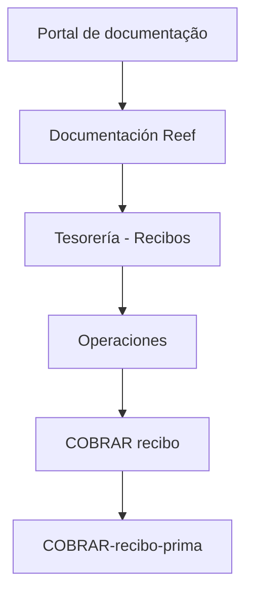

# Documentação de Operação de Tesorería — Recibos (REEF)

## 1. Metadados do Documento
- **Arquivo de Origem:** Não identificado
- **Tipo de Documento:** Manual Operacional
- **Domínio / Sistema:** Tesorería — Recibos; REEF; Mapfre
- **Público-Alvo:** Operações
- **Data/Versão Identificada:** Não identificada

---

## 2. Resumo Executivo & Contexto de Negócio

O conteúdo identifica uma documentação de operação para o domínio de **Tesorería — Recibos**, associada a **OPERACIONES**. O artefato aparenta estar localizado em uma área de documentação denominada **Reef**, dentro de um portal corporativo Mapfre.

A operação explicitamente identificada é **“COBRAR recibo”**, também referenciada pelo identificador ou rota textual **`COBRAR-recibo-prima`**. O conteúdo não fornece o procedimento operacional, os critérios de cobrança, as entradas exigidas, os resultados esperados ou os tratamentos de erro.

O portal apresenta categorias de navegação para soluções, arquiteturas, APIs, componentes, cloud, documentação, Zeus, Reef e ajuda. Essas categorias indicam a existência de um ecossistema documental corporativo, mas o texto extraído não descreve relações técnicas entre esses elementos.

O documento possui estado de ciclo de vida **Approved Source** e menciona o proprietário `user:agonzalez_mapfre.com`. Não foram identificadas versões, datas, ambientes, servidores, integrações ou especificações técnicas adicionais.

---

## 3. Arquitetura, Componentes & Tecnologias Envolvidas

| Componente / Termo | Papel identificado no conteúdo | Detalhamento disponível |
| :--- | :--- | :--- |
| Tesorería | Domínio da documentação operacional | Relacionado a recibos |
| Recibos | Objeto funcional tratado | Associado à operação de cobrança |
| OPERACIONES | Área operacional | Contém a referência a “COBRAR recibo” |
| REEF / Reef | Área, sistema ou repositório de documentação | O texto cita “Documentation / DOCUMENTACIÓN Reef” |
| Mapfre | Contexto organizacional ou portal documental | Citado em `Mapfredocument` |
| Zeus | Categoria de navegação do portal | Sem detalhamento funcional ou técnico |
| `COBRAR-recibo-prima` | Identificador ou rota textual da operação | Sem contrato, URL completa ou método HTTP |
| `user:agonzalez_mapfre.com` | Proprietário identificado | Aparece no campo Owner |



> **Nota de Análise:** O conteúdo não descreve microsserviços, APIs, protocolos, métodos HTTP, contratos JSON, bancos de dados, ambientes ou fluxos técnicos de integração.

---

## 4. Regras de Negócio, Especificações Funcionais & Processos

1. O documento está associado ao processo ou operação denominado **“COBRAR recibo”**.
2. A operação possui a referência textual **`COBRAR-recibo-prima`**.
3. O escopo funcional informado está relacionado a **Tesorería — Recibos**.
4. O conteúdo classifica o contexto como **OPERACIONES**.
5. Não foram extraídas regras de elegibilidade, cálculo, validação, autorização, confirmação, reversão, cancelamento ou exceções para a cobrança de recibos.
6. Não foram identificados passos operacionais para execução de **COBRAR recibo**.
7. Não foram identificados campos de entrada, saídas, mensagens de erro, responsáveis operacionais adicionais ou níveis de aprovação.

> **Nota de Análise:** O documento lista a operação `COBRAR-recibo-prima`, porém não detalha seu comportamento funcional, contrato técnico ou processo operacional.

---

## 5. Tabelas de Parâmetros, Ambientes e Estruturas de Dados

| Item / Parâmetro | Descrição / Função | Tipo / Valores / Formato | Ambiente / Observações |
| :--- | :--- | :--- | :--- |
| `COBRAR recibo` | Operação identificada no domínio de recibos | Nome de operação | Sem procedimento detalhado |
| `COBRAR-recibo-prima` | Referência textual associada à cobrança de recibo | Identificador, rota ou nome técnico não confirmado | Não há URL completa, método HTTP ou parâmetros |
| Tesorería | Domínio funcional da documentação | Área de negócio / operação | Associado a recibos |
| Recibos | Entidade ou assunto operacional | Termo funcional | Sem estrutura de dados descrita |
| OPERACIONES | Contexto de operação | Categoria funcional | Sem responsabilidades detalhadas |
| Reef | Área, sistema ou repositório documental citado | Nome próprio | Sem arquitetura identificada |
| Zeus | Item de navegação citado | Nome próprio | Sem função detalhada |
| Owner | Proprietário do documento | Campo de metadado | `user:agonzalez_mapfre.com` |
| Lifecycle | Estado de ciclo de vida documental | Campo de metadado | `Approved Source` |
| Idioma | Idioma exibido no portal | Código de idioma | `ES` |

---

## 6. Bateria de Perguntas & Respostas para RAG (FAQ Sintético)

### P1: Qual é o domínio funcional principal da documentação?
**R:** O domínio funcional principal é **Tesorería — Recibos**, conforme o título “DOCUMENTACIÓN de OPERACIÓN de TESORERÍA - RECIBOS”.

### P2: Qual operação é explicitamente mencionada para recibos?
**R:** A operação explicitamente mencionada é **“COBRAR recibo”**.

### P3: Qual identificador técnico ou rota textual está associado à operação de cobrança de recibo?
**R:** O conteúdo associa a referência **`COBRAR-recibo-prima`** à operação “COBRAR recibo”. O documento não confirma se essa referência é uma URL, endpoint, identificador de menu ou nome interno.

### P4: O documento informa como executar a operação “COBRAR recibo”?
**R:** Não. O conteúdo apenas menciona a operação “COBRAR recibo” e a referência `COBRAR-recibo-prima`; não apresenta etapas, pré-requisitos, validações ou resultados esperados.

### P5: Quem é o proprietário identificado para a documentação?
**R:** O campo **Owner** identifica `user:agonzalez_mapfre.com` como proprietário.

### P6: Qual é o estado de ciclo de vida do documento?
**R:** O campo **Lifecycle** apresenta o valor **Approved Source**.

### P7: O documento especifica uma API, método HTTP ou contrato JSON para a cobrança de recibos?
**R:** Não. Não há métodos HTTP, URLs completas, parâmetros de requisição, respostas, contratos JSON ou códigos de erro no conteúdo extraído.

### P8: Qual plataforma ou área documental é mencionada?
**R:** O conteúdo cita **Documentation / DOCUMENTACIÓN Reef** e **DOCUMENTACIÓN Reef**, indicando uma área ou repositório documental denominado Reef.

### P9: Quais áreas de navegação são citadas no portal?
**R:** O portal cita as áreas **Inicio**, **Soluciones**, **Arquitecturas**, **APIs**, **Componentes**, **Cloud**, **Documentación**, **Zeus**, **Reef** e **Ayuda**.

### P10: Existe informação sobre ambientes, servidores ou configurações de implantação?
**R:** Não. O conteúdo não apresenta ambientes, servidores, URLs de infraestrutura, portas, variáveis de configuração ou dados de implantação.

### P11: Em qual idioma o portal está indicado?
**R:** O portal apresenta o código de idioma **`ES`**, que é o único identificador de idioma explicitamente disponível no conteúdo.

### P12: O que pode ser afirmado sobre Zeus com base no documento?
**R:** Zeus é citado como um item de navegação do portal. O conteúdo não explica sua finalidade, arquitetura, integração ou relação operacional com Tesorería — Recibos.

---

## 7. Glossário de Termos, Siglas & Conceitos-Chave

- **Tesorería:** Domínio funcional citado no título da documentação, associado a recibos.
- **Recibos:** Entidade ou assunto operacional abordado pela documentação.
- **OPERACIONES:** Contexto ou área operacional em que a operação de cobrança é apresentada.
- **COBRAR recibo:** Operação explicitamente listada para o domínio de recibos.
- **`COBRAR-recibo-prima`:** Referência textual associada à operação “COBRAR recibo”; a natureza técnica exata não é detalhada.
- **Reef:** Área, sistema ou repositório de documentação citado no conteúdo.
- **Zeus:** Item de navegação citado sem definição adicional.
- **Owner:** Campo que identifica o proprietário da documentação.
- **Lifecycle:** Campo que identifica o estado de ciclo de vida documental.
- **Approved Source:** Valor do campo Lifecycle apresentado no documento.
- **ES:** Código de idioma exibido no portal.

---

## 8. Notas Críticas, Riscos & Limitações

- O conteúdo extraído é extremamente resumido e não contém o procedimento operacional de cobrança de recibos.
- Não há especificação de API, URL completa, método HTTP, autenticação, parâmetros, contratos de dados ou respostas associadas a `COBRAR-recibo-prima`.
- Não foram identificadas regras de negócio, critérios de validação, políticas de erro, auditoria, reversão ou reconciliação financeira.
- Não há dados sobre ambientes, servidores, logs, monitoramento, dependências, responsáveis técnicos ou acordos operacionais.
- A relação técnica ou funcional entre **Reef**, **Zeus**, **Mapfredocument** e a operação de Tesorería não é detalhada.
- O status **Approved Source** está presente, mas o conteúdo não explica o significado operacional desse estado no ciclo documental.

---

## 9. Conteúdo Bruto Estruturado (Referência Fiel)

```text
--- [PÁGINA 1 DE 1] ---

EN CONSTRUCCIÓN
DOCUMENTACIÓN de OPERACIÓN de TESORERÍA - RECIBOS
OPERACIONES
[COBRAR recibo][COBRAR-recibo-prima]
Documentation / DOCUMENTACIÓN Reef
DOCUMENTACIÓN Reef
Mapfredocument
DOCUMENTACIÓN Reef
Owner
user:agonzalez_mapfre.com
Lifecycle
Approved Source
 /
 VL
Buscar Inicio Soluciones Arquitecturas APIs Componentes Cloud Documentación Zeus Reef Ayuda
ES
```
