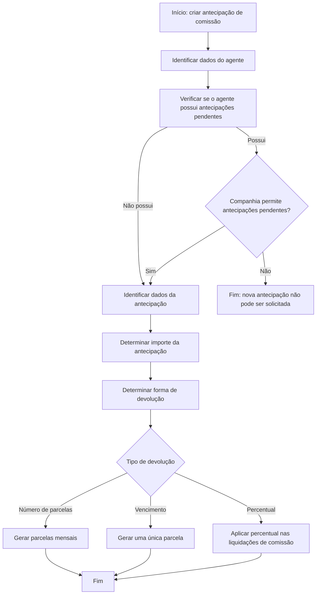

# Criação de Antecipação de Comissão de Agente — Documentação Reef / Mapfre

## 1. Metadados do Documento
- **Arquivo de Origem:** Não identificado no conteúdo extraído
- **Tipo de Documento:** Especificação Funcional
- **Domínio / Sistema:** Reef / Mapfre — antecipação de comissão de agente
- **Público-Alvo:** Negócio, analistas funcionais, desenvolvedores e operação
- **Data/Versão Identificada:** Não identificada

---

## 2. Resumo Executivo & Contexto de Negócio

O documento descreve a operação de criação de uma antecipação de comissão solicitada por um agente. A operação registra tanto os dados da antecipação quanto a forma pela qual o agente devolverá o valor antecipado, incluindo a geração das parcelas correspondentes ao modelo de devolução escolhido.

A solicitação considera antecipações anteriores pendentes. Um agente com antecipações pendentes somente pode solicitar uma nova antecipação quando a companhia permitir explicitamente a geração de antecipações simultâneas. Caso a companhia não permita, o agente deve devolver a antecipação anterior antes de realizar uma nova solicitação.

A operação exige a identificação do agente, da oficina comercial responsável pela imputação do gasto, do documento de compra/venda para a ordem de pagamento, do tipo e conceito da antecipação, da moeda e do valor-base. A seleção do tipo de documento determina se impostos e retenções são calculados.

O documento estabelece três modalidades de devolução: por número de parcelas, em uma única parcela com vencimento acordado e por percentual aplicado nas liquidações de comissões do agente. Cada modalidade possui propriedades específicas, critérios de geração de parcelas e possibilidades delimitadas de ajuste.

---

## 3. Arquitetura, Componentes & Tecnologias Envolvidas

O conteúdo descreve um processo funcional no contexto da **Documentation Reef / DOCUMENTACIÓN Reef**, associado a **Mapfre**. Não são especificados microsserviços, APIs, métodos HTTP, contratos JSON, bancos de dados, ambientes técnicos, URLs operacionais, servidores, tecnologias de infraestrutura ou ferramentas de CI/CD.

Os componentes funcionais identificados são:

- Operação de criação de antecipação de comissão de agente.
- Agente solicitante da antecipação.
- Companhia, responsável por permitir ou impedir novas antecipações quando existem antecipações pendentes.
- Oficina comercial de imputação do gasto.
- Documento de compra/venda usado na geração da ordem de pagamento.
- Conceito de cobrança e pagamento para geração da ordem de pagamento.
- Dados de impostos e retenções, quando aplicáveis ao documento selecionado.
- Moeda local e moeda da antecipação.
- Liquidações de comissões do agente, no modelo de devolução por percentual.
- Parcelas de devolução da antecipação.



> **Nota de Análise:** O documento apresenta um fluxo funcional, mas não detalha implementação técnica, interfaces, integrações sistêmicas ou contratos de dados.

---

## 4. Regras de Negócio, Especificações Funcionais & Processos

### 4.1 Objetivo da operação

A operação registra a informação de uma antecipação de comissão solicitada por um agente. A operação também registra a forma de devolução escolhida pelo agente e gera as parcelas correspondentes à modalidade de devolução selecionada.

### 4.2 Regra sobre antecipações anteriores pendentes

1. O sistema deve verificar se o agente possui antecipações anteriores pendentes.
2. Se não houver antecipações pendentes, o processo pode continuar.
3. Se houver antecipações pendentes, o sistema deve verificar se a companhia permite gerar novas antecipações nessa condição.
4. Se a companhia permitir antecipações pendentes, a solicitação de uma nova antecipação pode continuar.
5. Se a companhia não permitir antecipações pendentes, o agente não pode solicitar novas antecipações até devolver à companhia a antecipação anterior.

### 4.3 Identificação do agente e oficina de imputação

- O campo **Agente** identifica o agente que solicita a antecipação.
- A identificação do agente é usada para recuperar as informações do agente.
- A identificação do agente também é usada para verificar se o agente não está excluído do pagamento de comissões.
- O campo **Oficina de imputação** identifica a oficina comercial à qual será imputado o gasto.
- Por padrão, a oficina exibida é a oficina à qual pertence o agente solicitante.
- A oficina de imputação pode ser modificada para qualquer outra oficina da estrutura comercial.

### 4.4 Documento, tipo e conceito da antecipação

- O **Tipo de documento** registra o tipo de documento de compra/venda usado para gerar a ordem de pagamento.
- O tipo de documento selecionado determina se impostos e retenções serão calculados.
- O tipo de documento usado nesta operação deve ser:
  - Um tipo de documento de cobrança ou pagamento para pagamentos, identificado por **P**; ou
  - Um tipo de documento de cobrança e pagamentos, identificado por **A**.
- O **Tipo de antecipação** identifica o tipo de antecipação de comissão solicitado.
- O valor **1** corresponde à operação de antecipação descrita pelo documento.
- Após identificar o tipo de antecipação, o sistema verifica se o agente possui outras antecipações pendentes.
- Uma nova antecipação somente pode continuar quando a companhia permitir antecipações com outras antecipações pendentes.
- O **Conceito de antecipação** é o conceito de cobrança e pagamento usado para gerar a ordem de pagamento.
- O conceito de antecipação deve:
  - Pertencer à agrupação contábil de antecipação de comissões, identificada por **PC**;
  - Estar classificado como tipo de conceito de agentes e comissões, identificado por **AC**;
  - Estar classificado como tipo de movimento de pagamento, identificado por **P**.

### 4.5 Valores, moeda, impostos e total da antecipação

- A **Moeda dos valores** identifica a moeda em que os valores da antecipação solicitada são expressos.
- Quando a moeda da antecipação for diferente da moeda local, deve ser recuperada a taxa de câmbio da moeda informada em relação à moeda local na data de solicitação da antecipação.
- O **Valor-base** especifica o valor que se deseja resgatar, expresso na moeda identificada no campo de moeda dos valores.
- A partir do valor-base informado, são recuperados:
  - Dados de impostos, caso o documento de cobrança e pagamento inclua impostos;
  - Valor da antecipação e dos impostos na moeda do país;
  - Total da antecipação, incluindo impostos, tanto na moeda da antecipação quanto na moeda do país.

### 4.6 Devolução por número de parcelas

A devolução por número de parcelas, identificada pelo tipo **1**, informa que o valor antecipado será devolvido em uma quantidade de parcelas acordada com o agente.

Regras:

1. O campo **Número de parcelas** define a quantidade de parcelas para devolução do valor da antecipação.
2. O campo **Data de início das parcelas** identifica a data a partir da qual as parcelas são geradas.
3. A data de início coincide com a data de vencimento da primeira parcela.
4. Para cada parcela subsequente, é somado um mês à data de vencimento anterior.
5. O valor de cada parcela é proporcional ao número de parcelas.
6. O valor de cada parcela é obtido pela divisão do valor total da antecipação pelo número de parcelas.
7. É possível modificar as datas de vencimento das parcelas geradas.
8. É possível modificar os valores das parcelas geradas.
9. A soma dos valores das parcelas deve ser igual ao valor total da antecipação solicitada.

### 4.7 Devolução a vencimento

A devolução a vencimento, identificada pelo tipo **2**, informa que o valor será devolvido em uma única parcela, cuja data de vencimento é acordada com o agente.

Regras:

1. O campo **Data de vencimento** identifica a data de vencimento da parcela única.
2. O valor da parcela corresponde ao valor total da antecipação solicitada.
3. É possível modificar a data de vencimento da parcela gerada.

### 4.8 Devolução por percentual

A devolução por percentual, identificada pelo tipo **3**, aplica um percentual sobre a antecipação solicitada. O valor é cancelado em cada liquidação de comissões do agente até a data de vencimento da antecipação. Na data de vencimento, o valor restante deve ser cancelado para concluir integralmente a devolução.

Regras:

1. O campo **Percentual (%)** identifica o percentual da antecipação solicitado para cancelamento em cada liquidação de comissões do agente.
2. O campo **Data de início** indica a data a partir da qual o percentual de desconto começa a ser aplicado na liquidação de comissões do agente.
3. O campo **Data de vencimento** identifica a data em que o valor total da antecipação deve estar integralmente cancelado.
4. O valor total da antecipação é exibido e deve estar cancelado na data de vencimento acordada.
5. É possível ajustar a data de vencimento da devolução da antecipação.

### 4.9 Descrição do movimento

O campo **Descrição** é opcional e permite informar uma descrição para o movimento de antecipação que está sendo gerado.

---

## 5. Tabelas de Parâmetros, Ambientes e Estruturas de Dados

| Item / Parâmetro | Descrição / Função | Tipo / Valores / Formato | Ambiente / Observações |
| :--- | :--- | :--- | :--- |
| Agente | Identifica o agente que solicita a antecipação. Permite recuperar dados do agente e verificar se o agente não está excluído do pagamento de comissões. | Não especificado | Obrigatório no fluxo funcional apresentado. |
| Oficina de imputação | Identifica a oficina comercial à qual o gasto será imputado. | Não especificado | Por padrão, é exibida a oficina do agente; pode ser alterada para outra oficina da estrutura comercial. |
| Tipo de documento | Registra o documento de compra/venda usado para gerar a ordem de pagamento. Determina o cálculo de impostos e retenções. | P ou A | Deve ser documento de cobrança/pagamento para pagamentos (P) ou para cobrança e pagamentos (A). |
| Tipo de antecipação | Identifica o tipo de antecipação de comissão solicitada. | `1` = antecipação | Após a identificação, deve ocorrer a verificação de antecipações pendentes do agente. |
| Conceito de antecipação | Conceito de cobrança e pagamento usado na geração da ordem de pagamento da antecipação. | Agrupação contábil `PC`; tipo de conceito `AC`; tipo de movimento `P` | Deve atender simultaneamente às três classificações. |
| Moeda dos valores | Identifica a moeda de expressão dos valores da antecipação. | Não especificado | Em moeda diferente da local, recupera-se a taxa de câmbio na data da solicitação. |
| Taxa de câmbio | Conversão entre a moeda informada e a moeda local. | Não especificado | Recuperada quando a moeda da antecipação for diferente da moeda local. |
| Valor-base | Valor que se deseja resgatar na antecipação. | Valor monetário; moeda definida em “Moeda dos valores” | Origina o cálculo de impostos, valores na moeda do país e total da antecipação. |
| Dados de impostos | Dados aplicáveis aos valores da antecipação. | Não especificado | Recuperados se o documento de cobrança e pagamento incluir impostos. |
| Total da antecipação | Total da antecipação incluindo impostos. | Valores na moeda da antecipação e na moeda do país | Usado como referência para a devolução. |
| Devolução | Identifica a forma pela qual o agente devolverá a antecipação. | `1`, `2` ou `3` | Conforme o tipo, são solicitados dados diferentes e as parcelas são geradas de forma distinta. |
| Devolução por número de parcelas | Devolve a antecipação em quantidade acordada de parcelas. | Tipo `1` | Gera parcelas mensais a partir da data de início. |
| Número de parcelas | Define a quantidade de parcelas para devolução. | Não especificado | O valor de cada parcela é proporcional ao número de parcelas. |
| Data de início das parcelas | Define a primeira data de vencimento e o marco inicial da geração das parcelas. | Data | Cada nova parcela é gerada com vencimento um mês após a anterior. |
| Valor da parcela | Valor atribuível a cada parcela da devolução por número de parcelas. | Valor monetário | Inicialmente calculado pela divisão do total da antecipação pelo número de parcelas. Pode ser modificado, desde que a soma das parcelas seja igual ao total da antecipação. |
| Devolução a vencimento | Devolve a antecipação em uma única parcela. | Tipo `2` | A data de vencimento é acordada com o agente. |
| Data de vencimento da parcela única | Identifica o vencimento da única parcela da devolução a vencimento. | Data | Pode ser modificada. |
| Devolução por percentual | Cancela percentualmente a antecipação nas liquidações de comissão até a data de vencimento. | Tipo `3` | O restante deve ser cancelado na data de vencimento para encerrar integralmente a devolução. |
| Percentual (%) | Percentual da antecipação cancelado em cada liquidação de comissão do agente. | Percentual | Aplicado nas liquidações de comissões do agente. |
| Data de início do percentual | Data a partir da qual o desconto percentual é aplicado nas liquidações de comissão. | Data | Aplicável à devolução por percentual. |
| Data de vencimento da devolução por percentual | Data em que a antecipação deve estar totalmente cancelada. | Data | Pode ser ajustada. |
| Descrição | Descrição opcional do movimento de antecipação. | Texto | Campo opcional. |

> **Nota de Análise:** O documento não especifica ambientes técnicos, nomes de servidores, rotas de logs, URLs, portas, formatos de API, esquemas de banco de dados ou tipos de dados técnicos.

---

## 6. Bateria de Perguntas & Respostas para RAG (FAQ Sintético)

### P1: Qual é a finalidade da operação de criação de antecipação de comissão de agente?
**R:** A operação registra a informação de uma antecipação de comissão solicitada por um agente. A operação também registra a forma de devolução escolhida pelo agente e gera as parcelas correspondentes à forma de devolução selecionada.

### P2: Um agente com antecipações anteriores pendentes pode solicitar uma nova antecipação?
**R:** Um agente com antecipações anteriores pendentes somente pode solicitar uma nova antecipação quando a companhia permitir a geração de antecipações com antecipações pendentes. Caso a companhia não permita, o agente deve devolver a antecipação anterior à companhia antes de solicitar uma nova.

### P3: O que é validado ao informar o agente solicitante da antecipação?
**R:** A identificação do agente permite recuperar as informações do agente e verificar se o agente não está excluído do pagamento de comissões. O documento não detalha quais campos compõem os dados do agente nem como a exclusão é tecnicamente validada.

### P4: Qual oficina é usada por padrão para imputar o gasto da antecipação?
**R:** Por padrão, é exibida a oficina à qual pertence o agente solicitante da antecipação. A oficina de imputação pode ser modificada para outra oficina da estrutura comercial.

### P5: Quais tipos de documento podem ser usados para gerar a ordem de pagamento da antecipação?
**R:** O tipo de documento deve ser um documento de cobrança ou pagamento para pagamentos, identificado por `P`, ou um documento de cobrança e pagamentos, identificado por `A`. O tipo de documento selecionado define se impostos e retenções serão calculados.

### P6: Quais condições o conceito de antecipação deve cumprir?
**R:** O conceito de antecipação deve ser o conceito de cobrança e pagamento usado para gerar a ordem de pagamento. O conceito deve pertencer à agrupação contábil de antecipação de comissões `PC`, estar classificado como tipo de conceito de agentes e comissões `AC` e como tipo de movimento de pagamento `P`.

### P7: Como é tratado o valor da antecipação quando a moeda é diferente da moeda local?
**R:** Quando a moeda dos valores da antecipação for diferente da moeda local, deve ser recuperada a taxa de câmbio da moeda informada em relação à moeda local na data de solicitação da antecipação.

### P8: Como são calculadas as parcelas na devolução por número de parcelas?
**R:** O valor de cada parcela é inicialmente calculado dividindo-se o valor total da antecipação pelo número de parcelas definido. A data de início das parcelas corresponde ao vencimento da primeira parcela, e cada parcela seguinte possui vencimento um mês após a anterior.

### P9: É permitido alterar parcelas geradas na devolução por número de parcelas?
**R:** Sim. É possível modificar tanto as datas de vencimento quanto os valores das parcelas geradas. Entretanto, a soma dos valores das parcelas deve permanecer igual ao valor total da antecipação solicitada.

### P10: Como funciona a devolução a vencimento?
**R:** A devolução a vencimento gera uma única parcela, com data de vencimento acordada com o agente. O valor dessa parcela corresponde ao valor total da antecipação solicitada. A data de vencimento da parcela gerada pode ser modificada.

### P11: Como funciona a devolução por percentual nas liquidações de comissões?
**R:** A devolução por percentual aplica um percentual sobre a antecipação solicitada em cada liquidação de comissões do agente. O processo continua até a data de vencimento; nessa data, o valor restante deve ser cancelado para que a devolução seja totalmente concluída.

### P12: Quais informações são exigidas para devolução por percentual?
**R:** A devolução por percentual requer o percentual a ser cancelado em cada liquidação de comissões, a data de início para aplicação do desconto percentual e a data de vencimento até a qual o valor total da antecipação deve estar cancelado. A data de vencimento pode ser ajustada.

---

## 7. Glossário de Termos, Siglas & Conceitos-Chave

- **AC:** Tipo de conceito de agentes e comissões exigido para o conceito de antecipação.
- **Agente:** Entidade que solicita a antecipação de comissão e realiza a devolução do valor antecipado.
- **Antecipação de comissão:** Operação que registra um valor antecipado solicitado por um agente e sua forma de devolução.
- **Companhia:** Entidade que permite ou impede novas antecipações quando o agente possui antecipações anteriores pendentes.
- **Conceito de antecipação:** Conceito de cobrança e pagamento usado para gerar a ordem de pagamento da antecipação.
- **Devolução a vencimento:** Modalidade de devolução em uma única parcela com data de vencimento acordada.
- **Devolução por número de parcelas:** Modalidade de devolução em quantidade determinada de parcelas.
- **Devolução por percentual:** Modalidade em que um percentual da antecipação é cancelado nas liquidações de comissões até o vencimento.
- **Liquidação de comissões:** Evento no qual o percentual de devolução pode ser aplicado ao agente, conforme a modalidade de devolução por percentual.
- **Moeda local:** Moeda de referência para a qual deve ser recuperada a taxa de câmbio quando a antecipação estiver expressa em outra moeda.
- **Oficina de imputação:** Oficina comercial à qual é imputado o gasto da antecipação.
- **P:** Código usado tanto para documento de cobrança/pagamento para pagamentos quanto para tipo de movimento de pagamento, conforme o contexto apresentado.
- **PC:** Agrupação contábil de antecipação de comissões.
- **Reef:** Nome presente na documentação de origem, identificada como “Documentation Reef” e “DOCUMENTACIÓN Reef”.
- **Tipo de antecipação 1:** Valor que corresponde à operação de antecipação documentada.

---

## 8. Notas Críticas, Riscos & Limitações

- A criação de uma nova antecipação depende da regra corporativa que permite ou impede antecipações quando há antecipações anteriores pendentes.
- A seleção incorreta do tipo de documento pode afetar o cálculo de impostos e retenções, pois o tipo de documento define se esses valores são calculados.
- Na devolução por número de parcelas, alterações manuais em valores e vencimentos são permitidas, mas a soma dos valores das parcelas deve permanecer igual ao total da antecipação.
- Na devolução por percentual, o valor remanescente deve ser cancelado na data de vencimento para encerrar integralmente a devolução.
- O documento não detalha critérios de arredondamento na divisão do valor total pelo número de parcelas.
- O documento não detalha a origem, método de consulta, precisão ou tratamento de falhas da taxa de câmbio.
- O documento não detalha métodos HTTP, contratos JSON, interfaces de usuário, APIs, persistência de dados, mecanismos de autorização, trilhas de auditoria ou tratamentos de erro.
- O conteúdo inclui marcadores de navegação e metadados da plataforma documental, mas não fornece detalhamento técnico adicional sobre a plataforma Reef ou Mapfre.

---

## 9. Conteúdo Bruto Estruturado (Referência Fiel)

```text
--- [PÁGINA 1 DE 5] ---

EN CONSTRUCCIÓN
CREAR anticipo comisión agente
¿En que consiste?
Esta operación registra la información de un anticipo de comisión que solicita un agente.
Desde esta operación se registra también la forma en la que el agente devolverá el importe del anticipo, generando las cuotas
correspondientes a la forma de devolución elegida por el agente.
Premisas
Si un agente tiene anticipos anteriores pendientes, solo podrá solicitar un nuevo anticipo si la compañía lo permite, de lo contrario no podrá
solicitar nuevos anticipos hasta que el anticipo anterior haya sido devuelto a la compañía por parte del agente.
Proceso a seguir
A continuación se detallan las propiedades que pueden participar en esta operación.
SI
NO
NO
SIIdentificar
datos agente
Identificar datos
del anticipo
¿Hay anticipos
pendientes?
¿Permite
anticipos
pendientes?
Determinar importe
del anticipo
Determinar forma
de devolución
FIN
Documentation / DOCUMENTACIÓN Reef
DOCUMENTACIÓN Reef
Mapfredocument
DOCUMENTACIÓN Reef
Owner
user:agonzalez_mapfre.com
Lifecycle
Approved Source
 / 
 VL
Buscar Inicio Soluciones Arquitecturas APIs Componentes Cloud Documentación Zeus Reef Ayuda
ES


--- [PÁGINA 2 DE 5] ---

Propiedades del agente
Propiedades del anticipo
Propiedades de importes del anticipo
Propiedades de devolución
Propiedad descripción
Propiedades del agente
Agente
Identica el agente que solicita el anticipo.
Con este dato se recupera la información del agente y se comprueba que dicho agente no esté excluido del pago de comisiones.
Ocina de imputación
Identica la ocina comercial a la que se le va a imputar el gasto, por defecto se muestra la ocina a la que pertenece el agente que solicita el
anticipo, pero puede modicarse por cualquier otra ocina de la estructura comercial.
Propiedades del anticipo
Tipo de documento
Registra el tipo de documento de compra/venta que se va a utilizar en la generación de la orden de pago.
El tipo de documento elegido determinará si se calculan o no impuestos y retenciones.
El tipo de documento a utilizar para esta operación debe ser un tipo de documento de cobro o pago para pagos (P) o para cobro y pagos (A).
Tipo de anticipo
Identica el tipo de anticipo de comisión que se está solicitando, siendo anticipo (1) el valor que corresponde a esta operación.
Una vez identicado el tipo de anticipo, se verica si el agente tiene otros anticipos pendientes, en cuyo caso, solamente se puede continuar
con la solicitud de un nuevo anticipo, si la compañía permite generar anticipos con otros anticipos pendientes.
Concepto de anticipo
Se trata del concepto de cobro y pago que se va a utilizar para generar la orden de pago del anticipo. Dicho concepto debe pertenecer a la
[agrupación contable][agrupacion-contable] de anticipo de comisiones (PC) y debe estar clasicado como tipo de concepto de agentes y
comisiones (AC) y como tipo de movimiento de pago (P).


--- [PÁGINA 3 DE 5] ---

Propiedades de importes del anticipo
Moneda de los importes
Con esta propiedad se identica la moneda en la que están expresados los importes del anticipo solicitado.
En caso de ser una moneda distinta a la moneda local, se recupera el tipo de cambio de la moneda indicada, con respecto a la moneda local,
a la fecha de la solicitud del anticipo.
Importe base
En esta propiedad se especica el importe que se quiere rescatar, expresado en la moneda identicada en la propiedad Moneda de los
importes.
A partir del importe indicado se recuperan el resto de datos para el anticipo:
- Datos de impuestos si el documento de cobro y pago incluye impuestos
Importe de anticipo y de impuestos en moneda del país
Total del anticipo, incluyendo los impuestos, tanto en la moneda del anticipo como en la moneda del país
Propiedades de devolución
Devolución
Esta propiedad identica como va a devolver el anticipo el agente, según los tipos de devolución previamente denidos en el sistema.
Según el tipo de devolución se solicitan distintos datos y se generan las cuotas de forma diferente.
Tipos de devolución
1 - Devolución por número de cuotas
2 - Devolución a vencimiento
3 - Devolución por porcentaje
1 - Devolución por número de cuotas
Indica que el importe anticipado se va a devolver en un número de cuotas determinadas que se acordarán con el agente.
Propiedades:
Número de cuotas
Indica el número de cuotas en las que se va a devolver el importe del anticipo.
Fecha inicio cuotas
Identica la fecha a partir de la que se generan las cuotas. Esta fecha coincide con la fecha de vencimiento de la primera cuota y a partir
de esta fecha se suma un mes por cada cuota, para generar la fecha de vencimiento correspondiente a cada una de ellas.
El importe calculado para cada cuota es proporcional al número de cuotas, es decir, se obtiene dividiendo el importe total del anticipo por el
número de cuotas.


--- [PÁGINA 4 DE 5] ---

Es posible modicar tanto la fecha de vencimiento de las cuotas generadas como los importes, siempre que el valor de la suma del importe
de las cuotas sea igual al total del importe del anticipo solicitado.
2 - Devolución a vencimiento
Indica que el importe se va a devolver en una única cuota, cuyo vencimiento se acuerda con el agente.
Propiedades:
Fecha de vencimiento
Identica la fecha de vencimiento de la cuota.
El importe de la cuota corresponde al importe total del anticipo solicitado.
Es posible modicar la fecha de vencimiento de la cuota generada.
3 - Devolución por porcentaje
Este tipo de devolución indica que se aplicará un porcentaje sobre el anticipo solicitado, que se irá cancelando en cada una de las
liquidaciones de comisiones del agente, hasta llegar a la fecha de vencimiento del anticipo, que se cancelará el importe restante para dejar la
devolución cancelada totalmente.
Propiedades:


--- [PÁGINA 5 DE 5] ---

Porcentaje (%)
Identica el porcentaje del anticipo solicitado, a cancelar en cada liquidación de comisiones del agente.
Fecha de inicio
Indica la fecha a partir de la cual se empieza a aplicar el porcentaje del descuento en la liquidación de comisiones del agente.
Fecha de vencimiento
Identica la fecha a la que debe quedar cancelado el total del anticipo solicitado.
Se muestra el importe total del anticipo, que debe quedar cancelado a la fecha de vencimiento acordada.
Es posible ajustar la fecha de vencimiento de la devolución del anticipo.
Propiedad descripción
Descripción
Opcionalmente se puede dar una descripción al movimiento de anticipo que se está generando.
```
