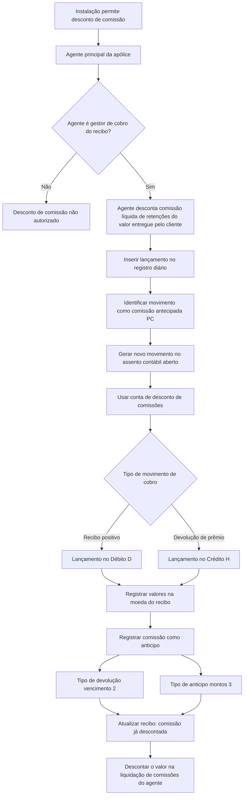

# Documentação Reef — Desconto de Comissão no Cobro de Recibo

## 1. Metadados do Documento
- **Arquivo de Origem:** Não identificado no conteúdo fornecido
- **Tipo de Documento:** Procedimento
- **Domínio / Sistema:** Reef / Mapfre
- **Público-Alvo:** Negócio, Operação, Desenvolvimento e Arquitetura
- **Data/Versão Identificada:** Não identificada
- **Status identificado:** `EN CONSTRUCCIÓN`
- **Proprietário identificado:** `user:agonzalez_mapfre.com`
- **Ciclo de vida identificado:** `Approved Source / VL`

---

## 2. Resumo Executivo & Contexto de Negócio

O documento descreve uma funcionalidade do domínio Reef para permitir o desconto de comissão no momento do cobro de um recibo. A decisão de permitir esse desconto é configurável por instalação. Quando habilitada, a funcionalidade permite que o agente desconte diretamente, do valor entregue pelo cliente, a comissão correspondente ao recibo.

A comissão descontada pelo agente deve considerar o valor líquido de retenções. O movimento é tratado contabilmente como um anticipo de comissão, não como o recebimento definitivo da comissão pelo agente. Posteriormente, o valor deve ser considerado na liquidação de comissões para ser descontado da liquidação do agente.

A elegibilidade é restrita: somente o agente principal da apólice pode descontar a comissão, e apenas se esse agente também for o gestor de cobro do recibo. O processo é automático e inclui lançamento no registro diário, registro do anticipo de comissão e atualização das informações do recibo.

O lançamento contábil utiliza a conta de desconto de comissões e deve ocorrer no assento contábil aberto. A posição contábil depende do tipo de movimento de cobro: Débito para recibo positivo e Crédito para devolução de prêmio. Todos os valores são registrados na moeda do recibo.

---

## 3. Arquitetura, Componentes & Tecnologias Envolvidas

O conteúdo fornecido cita os seguintes elementos funcionais e contábeis:

| Componente / Entidade | Papel no processo |
| :--- | :--- |
| Reef | Sistema ou domínio documentado. |
| Instalação | Define se permite o desconto de comissão no cobro do recibo. |
| Agente principal da apólice | Único agente autorizado a descontar a comissão. |
| Gestor de cobro | Condição obrigatória para que o agente principal possa realizar o desconto. |
| Recibo | Origem do cobro, da moeda e da identificação de comissão descontada. |
| Registro diário | Recebe o lançamento identificado como comissão antecipada (`PC`). |
| Assento contábil aberto | Contém o novo movimento gerado pelo desconto de comissão. |
| Conta de desconto de comissões | Conta contábil utilizada para o lançamento da comissão descontada. |
| Liquidação de comissões do agente | Processo que considera o anticipo para descontá-lo da liquidação. |



**Nota de Análise:** O conteúdo não detalha interfaces, APIs, métodos HTTP, contratos JSON, persistência física, serviços, filas, tecnologias de infraestrutura ou mecanismos técnicos de configuração por instalação.

---

## 4. Regras de Negócio, Especificações Funcionais & Processos

### 4.1 Objetivo funcional

O objetivo é registrar antecipadamente o cobro da comissão pelo agente associado à apólice, quando o desconto ocorre no momento do cobro de um recibo.

### 4.2 Regra de habilitação por instalação

Cada instalação pode decidir se permite que um agente desconte a comissão correspondente ao recibo no momento do cobro.

O documento não especifica:
- O nome do parâmetro de configuração.
- O local de manutenção da configuração.
- Os valores técnicos aceitos para a configuração.
- O comportamento padrão quando a configuração não estiver definida.

### 4.3 Elegibilidade do agente

O desconto de comissão só pode ser realizado quando ambas as condições abaixo forem atendidas:

1. O agente é o agente principal da apólice.
2. O agente é o gestor de cobro do recibo.

Se o agente não for simultaneamente agente principal da apólice e gestor de cobro do recibo, o documento não autoriza o desconto da comissão.

### 4.4 Natureza financeira do desconto

Quando permitido, o agente desconta diretamente a comissão, líquida de retenção, do valor entregue pelo cliente. Esse movimento é considerado um anticipo de comissão.

O desconto não é caracterizado pelo documento como um anticipo real convencional; o tipo de devolução vencimento utilizado sinaliza que o valor está sendo descontado no momento do cobro.

### 4.5 Inserção no registro diário

O processo deve criar um lançamento no registro diário com as seguintes características:

1. O movimento deve ser identificado como comissão antecipada, com código `PC`.
2. O valor de comissão registrado deve ser líquido de retenções e impostos.
3. O lançamento deve ser incluído como novo movimento no assento contábil que estiver aberto.
4. O lançamento deve utilizar a conta de desconto de comissões.
5. A imputação deve ocorrer de forma contrária ao movimento de cobro no qual o desconto é realizado.
6. Se a comissão for descontada do cobro de um recibo positivo, o lançamento deve ser no Débito (`D`).
7. Se o movimento corresponder a devolução de prêmio, o lançamento deve ser no Crédito (`H`).
8. Os valores devem ser registrados sempre na moeda do recibo.

### 4.6 Registro da comissão como anticipo

A comissão descontada deve ser registrada como anticipo de comissão com as seguintes classificações:

1. **Tipo de devolução vencimento:** `2`.
   - Indica que o valor está sendo descontado no momento do cobro.
   - Indica que o registro não corresponde a um anticipo real.

2. **Tipo de anticipo:** `montos (3)`.
   - Indica que o anticipo representa um importe.
   - Indica que o valor não foi calculado por percentual.

O valor registrado como anticipo deve ser considerado posteriormente na liquidação de comissões do agente, para ser descontado dessa liquidação.

### 4.7 Atualização do recibo

O movimento deve atualizar as informações do recibo para registrar que a comissão já foi descontada.

O documento não detalha:
- O atributo ou campo atualizado no recibo.
- O valor técnico utilizado para representar o estado de comissão descontada.
- As regras de reversão, estorno ou correção do desconto.
- O tratamento de cobranças parciais, múltiplos agentes ou múltiplos descontos.

---

## 5. Tabelas de Parâmetros, Ambientes e Estruturas de Dados

| Item / Parâmetro | Descrição / Função | Tipo / Valores / Formato | Ambiente / Observações |
| :--- | :--- | :--- | :--- |
| Permissão por instalação | Define se uma instalação permite o desconto de comissão no cobro de recibo. | Não detalhado | Cada instalação pode decidir pela permissão. |
| Agente elegível | Agente autorizado a descontar comissão. | Agente principal da apólice e gestor de cobro do recibo | As duas condições são obrigatórias. |
| Comissão descontada | Comissão retirada diretamente do valor entregue pelo cliente. | Valor líquido de retenção | O texto também informa que o lançamento considera retenções e impostos. |
| Identificador de movimento | Identifica o movimento no registro diário. | `PC` — comissão antecipada | Aplicável ao lançamento do desconto. |
| Registro diário | Recebe o lançamento do desconto de comissão. | Apunte contábil | O valor lançado é líquido de retenções e impostos. |
| Assento contábil | Contém o novo movimento de comissão descontada. | Assento aberto | O documento exige que o assento esteja aberto. |
| Conta contábil | Conta usada para registrar o desconto de comissão. | Conta de desconto de comissões | Nome técnico ou código não informado. |
| Sinal contábil para recibo positivo | Posição do lançamento quando a comissão é descontada de recibo positivo. | Débito (`D`) | Lançamento contrário ao movimento de cobro. |
| Sinal contábil para devolução de prêmio | Posição do lançamento em devolução de prêmio. | Crédito (`H`) | Lançamento contrário ao movimento de cobro. |
| Moeda | Moeda utilizada para registrar os importes. | Moeda do recibo | Aplicável sempre. |
| Tipo de devolução vencimento | Classifica o anticipo para indicar desconto no momento do cobro. | `2` | Não representa um anticipo real. |
| Tipo de anticipo | Classifica a natureza do valor antecipado. | `montos (3)` | Indica valor absoluto, não cálculo percentual. |
| Estado do recibo | Registra que a comissão já foi descontada. | Não detalhado | Campo, valor e mecanismo técnico não foram informados. |
| Liquidação de comissões | Processo que considera o anticipo para desconto da liquidação do agente. | Não detalhado | Periodicidade e regras de cálculo não foram especificadas. |

---

## 6. Bateria de Perguntas & Respostas para RAG (FAQ Sintético)

### P1: Qual é o objetivo do processo de desconto de comissão no cobro de recibo?
**R:** O objetivo é registrar o cobro antecipado da comissão pelo agente da apólice quando a comissão é descontada no momento do cobro de um recibo. O valor é tratado como anticipo de comissão e deve ser considerado posteriormente na liquidação de comissões do agente.

### P2: Uma instalação é obrigada a permitir o desconto de comissão no cobro de recibos?
**R:** Não. O documento informa que cada instalação pode decidir se permite que um agente desconte a comissão correspondente ao recibo no momento do cobro. O texto não informa o parâmetro técnico, o local de configuração ou o valor padrão dessa decisão.

### P3: Quais agentes podem descontar a comissão de um recibo?
**R:** Somente o agente principal da apólice pode descontar a comissão, desde que esse mesmo agente seja também o gestor de cobro do recibo. As duas condições são obrigatórias.

### P4: Como o valor da comissão é descontado no cobro?
**R:** O agente desconta diretamente do valor entregue pelo cliente a comissão correspondente ao recibo, líquida de retenção. O documento classifica esse movimento como um anticipo de comissão.

### P5: Como a comissão descontada é identificada no registro diário?
**R:** O lançamento no registro diário deve identificar o movimento como comissão antecipada, utilizando o identificador `PC`. O valor registrado deve ser líquido de retenções e impostos.

### P6: Em qual assento e conta contábil deve ser registrado o desconto de comissão?
**R:** O desconto deve gerar um novo movimento no assento contábil que esteja aberto. O movimento deve ser registrado na conta de desconto de comissões. O documento não fornece o código ou o nome técnico dessa conta.

### P7: Qual é o sinal contábil do desconto para um recibo positivo?
**R:** Quando a comissão é descontada do cobro de um recibo positivo, o lançamento deve ser imputado no Débito (`D`), de forma contrária ao movimento de cobro no qual o desconto é realizado.

### P8: Qual é o sinal contábil do desconto em uma devolução de prêmio?
**R:** Quando o movimento corresponde a uma devolução de prêmio, o lançamento de comissão antecipada deve ser imputado no Crédito (`H`), de forma contrária ao movimento de cobro.

### P9: Em qual moeda os valores de comissão descontada devem ser registrados?
**R:** Os valores devem ser registrados sempre na moeda do recibo.

### P10: Quais classificações devem ser usadas para registrar a comissão como anticipo?
**R:** A comissão descontada deve ser registrada como anticipo de comissão com tipo de devolução vencimento `2` e tipo de anticipo `montos (3)`. O tipo `2` indica desconto no momento do cobro e não um anticipo real; o tipo `montos (3)` indica um importe, não um cálculo percentual.

### P11: Como o anticipo de comissão afeta a liquidação de comissões do agente?
**R:** O valor registrado como anticipo deve ser considerado na liquidação de comissões do agente para ser descontado dessa liquidação.

### P12: O que deve ser atualizado no recibo após o desconto da comissão?
**R:** As informações do recibo devem ser atualizadas para refletir que a comissão já foi descontada. O documento não informa qual campo, indicador ou valor técnico representa esse estado.

---

## 7. Glossário de Termos, Siglas & Conceitos-Chave

- **Reef:** Sistema ou domínio identificado no cabeçalho da documentação.
- **Mapfre:** Organização ou contexto corporativo identificado no documento.
- **Recibo:** Entidade associada ao cobro, à comissão descontada e à moeda de registro.
- **Cobro:** Processo de recebimento associado ao recibo.
- **Agente principal:** Agente principal associado à apólice; única função autorizada a descontar a comissão, desde que também seja gestor de cobro.
- **Gestor de cobro:** Papel que administra o cobro do recibo; requisito para o agente principal poder descontar comissão.
- **Comissão antecipada:** Comissão registrada antecipadamente no momento do cobro do recibo.
- **PC:** Identificador do movimento de comissão antecipada no registro diário.
- **Registro diário:** Registro que recebe o lançamento contábil do desconto de comissão.
- **Assento contábil:** Estrutura contábil aberta que recebe o novo movimento de desconto.
- **Conta de desconto de comissões:** Conta contábil utilizada para imputar o lançamento de comissão descontada.
- **Débito (`D`):** Posição contábil aplicável quando a comissão é descontada de um recibo positivo.
- **Crédito (`H`):** Posição contábil aplicável quando o movimento representa devolução de prêmio.
- **Devolução de prêmio:** Cenário em que o lançamento de comissão antecipada é realizado no Crédito.
- **Tipo de devolução vencimento `2`:** Classificação que indica que o importe está sendo descontado no momento do cobro e não corresponde a um anticipo real.
- **Tipo de anticipo `montos (3)`:** Classificação que indica que o anticipo é um importe e não foi calculado por percentual.
- **Liquidação de comissões:** Processo no qual o importe antecipado é descontado da liquidação do agente.
- **Retenção:** Valor que deve ser considerado para que a comissão seja registrada como líquida de retenções.
- **Impostos:** Valores considerados no lançamento da comissão, que deve ser registrado líquido de retenções e impostos.

---

## 8. Notas Críticas, Riscos & Limitações

- O documento possui o status `EN CONSTRUCCIÓN`, indicando que o conteúdo pode estar incompleto ou sujeito a evolução.
- Não há identificação do arquivo de origem, data de publicação, versão do documento ou versão do sistema Reef.
- Não são especificados o parâmetro técnico, a tela, a API ou o mecanismo usado para configurar a permissão por instalação.
- Não há definição de códigos contábeis, nomes de contas, estrutura do registro diário ou atributos do assento contábil.
- O documento não descreve validações adicionais, mensagens de erro, tratamento de exceções, reversões, estornos ou correções de lançamentos.
- Não há detalhamento sobre cobranças parciais, descontos múltiplos, recibos com mais de um agente, concorrência de atualizações ou consistência transacional.
- Não há especificação do campo do recibo que registra que a comissão foi descontada.
- Não há contratos de integração, métodos HTTP, URLs, tecnologias, bancos de dados, serviços, jobs ou eventos associados ao processo.
- A expressão “líquida de retenção” e a expressão “líquido de retenções e impostos” aparecem no texto; o método de cálculo desses valores não é detalhado.

---

## 9. Conteúdo Bruto Estruturado (Referência Fiel)

```text
--- [PÁGINA 1 DE 2] ---

Documentation / DOCUMENTACIÓN Reef
DOCUMENTACIÓN Reef
Mapfredocument
DOCUMENTACIÓN Reef
Owner
user:agonzalez_mapfre.com
Lifecycle
Approved Source
 / 
 VL
Buscar Inicio Soluciones Arquitecturas APIs Componentes Cloud Documentación Zeus Reef Ayuda
ES


--- [PÁGINA 2 DE 2] ---

EN CONSTRUCCIÓN
DESCONTAR comisión en el cobro de recibo (enlace con visión
técnica)
¿En qué consiste?
Cada instalación podrá decidir si permite que un agente se descuente la comisión, correspondiente al recibo, en el momento del cobro. En
este caso, el agente descuenta directamente la comisión, neta de retención, del importe entregado por el cliente, considerándose este
movimiento como un anticipo de comisión.
Solamente podrá descontarse la comisión el agente principal de la póliza, siempre que sea el gestor de cobro del recibo.
Objetivo
Registrar el cobro de la comisión, por parte del agente de la póliza, de forma anticipada.
Proceso a seguir
El proceso comprende los siguientes pasos que se hacen de forma automática:
Insertar registro diario
Se realiza un apunte en el registro diario, identicando el movimiento como comisión anticipada (PC), el importe de la comisión que se
registra es neto de retenciones e impuestos.
Este apunte se generará como un nuevo movimiento en el asiento contable que esté abierto, en la cuenta de descuento de comisiones,
imputado de forma contraria al movimiento al movimiento de cobro en el que se realiza el descuento, es decir, en el Debe (D) cuando la
comisión se descuenta del cobro de un recibo positivo, o en el Haber (H) cuando se trata de una devolución de prima.
Los importes se registran siempre en la moneda del recibo.
Registrar comisiones como anticipo
La comisión descontada se reeja como un anticipo de comisión, identicado como tipo de devolución vencimiento (2), que reeja que este
importe se está descontando en el momento del cobro y no como un anticipo real, y tipo de anticipo, montos (3) que indica que es un importe
y no se ha calculado por un porcentaje. De esta forma, en la liquidación de comisiones del agente, se tendrá en cuenta este importe para
descontarlo de la liquidación.
Identicar descuento de comisión en recibo
En este movimiento, se actualiza la información del recibo para dejar reejado que la comisión ya ha sido descontada.
```
