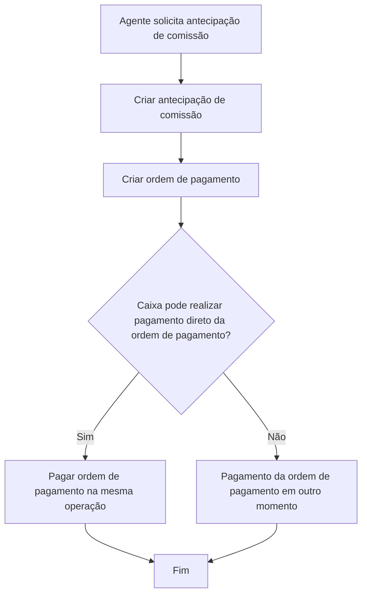

# Antecipação de Comissão — Criação, Ordem de Pagamento e Pagamento Direto

## 1. Metadados do Documento
- **Arquivo de Origem:** Não identificado
- **Tipo de Documento:** Procedimento
- **Domínio / Sistema:** Reef / Mapfre
- **Público-Alvo:** Não identificado
- **Data/Versão Identificada:** Não identificada

---

## 2. Resumo Executivo & Contexto de Negócio

O documento descreve a operação **“CREAR anticipo comisión”**, destinada a permitir que um agente solicite o pagamento antecipado de um valor por conta de comissões futuras. O agente deverá devolver posteriormente o valor antecipado conforme o acordo estabelecido no momento da solicitação.

O processo financeiro é baseado em **ordens de pagamento**: todos os pagamentos realizados aos agentes ocorrem por meio desse instrumento. Portanto, a criação de uma antecipação de comissão exige a criação da ordem de pagamento correspondente.

O pagamento da ordem de pagamento pode ocorrer posteriormente ou durante a própria operação. A execução imediata depende de o caixa possuir capacidade de realizar pagamento direto de ordens de pagamento.

O fluxo apresentado possui uma decisão operacional: se houver pagamento direto da ordem de pagamento, a ordem é paga na mesma operação; caso contrário, a ordem permanece para pagamento em outro momento.

---

## 3. Arquitetura, Componentes & Tecnologias Envolvidas

Componentes e termos citados:

| Componente / Termo | Papel identificado |
| :--- | :--- |
| Agente | Solicita o pagamento antecipado por conta de comissões. |
| Antecipação de comissão | Valor antecipado ao agente, que deverá ser devolvido conforme acordo. |
| Ordem de pagamento | Instrumento por meio do qual pagamentos aos agentes são realizados. |
| Caixa | Pode realizar o pagamento direto de ordens de pagamento. |
| Reef | Ambiente documental identificado na interface exibida. |
| Mapfre | Referência corporativa presente no conteúdo documental. |
| Zeus | Item de navegação citado na interface documental, sem detalhamento funcional. |



**Nota de Análise:** O documento não detalha interfaces, APIs, métodos HTTP, contratos de dados, persistência, autenticação, integrações técnicas ou regras de cálculo das comissões.

---

## 4. Regras de Negócio, Especificações Funcionais & Processos

1. Um agente pode solicitar o pagamento antecipado de um importe por conta de suas comissões.
2. O valor antecipado deverá ser devolvido pelo agente conforme o acordo realizado durante a solicitação da antecipação.
3. Pagamentos a agentes são sempre realizados por meio de ordens de pagamento.
4. A operação de criação de antecipação de comissão gera a ordem de pagamento correspondente ao pagamento da antecipação.
5. A ordem de pagamento pode ser paga em momento posterior à sua criação.
6. Quando o caixa puder executar pagamento direto de ordens de pagamento, a ordem será marcada como paga na mesma operação.
7. O fluxo operacional apresentado é:
   1. Criar antecipação de comissão.
   2. Criar ordem de pagamento.
   3. Verificar se existe pagamento direto da ordem de pagamento.
   4. Se houver pagamento direto, pagar a ordem de pagamento na mesma operação.
   5. Se não houver pagamento direto, efetuar o pagamento da ordem de pagamento em outro momento.

---

## 5. Tabelas de Parâmetros, Ambientes e Estruturas de Dados

| Item / Parâmetro | Descrição / Função | Tipo / Valores / Formato | Ambiente / Observações |
| :--- | :--- | :--- | :--- |
| Agente | Solicitante do pagamento antecipado. | Entidade de negócio | O documento não informa identificadores ou atributos. |
| Antecipação de comissão | Valor pago antecipadamente por conta de comissões do agente. | Importe monetário não especificado | Deve ser devolvido conforme acordo realizado na solicitação. |
| Ordem de pagamento | Mecanismo obrigatório para pagamentos aos agentes. | Documento/registro de pagamento | É criada durante a operação de antecipação. |
| Pagamento direto | Capacidade de o caixa pagar diretamente a ordem de pagamento. | Decisão Sim/Não | Se aplicável, a ordem fica paga na própria operação. |
| Pagamento posterior | Pagamento efetuado após a criação da ordem. | Processo posterior | O documento não define prazo, responsável ou canal de execução. |
| Reef | Referência de documentação. | Sistema/área documental | Exibido como “DOCUMENTACIÓN Reef”. |
| Lifecycle | Metadado de ciclo de vida exibido. | Valor: `Approved` | Associado à interface documental. |
| Owner | Proprietário exibido na interface. | `user:agonzalez_mapfre.com` | Valor reproduzido literalmente do conteúdo. |
| Idioma | Idioma apresentado na interface. | `ES` | O conteúdo operacional está em espanhol. |

---

## 6. Bateria de Perguntas & Respostas para RAG (FAQ Sintético)

### P1: Em que consiste a operação de criação de antecipação de comissão?
**R:** A operação permite que um agente solicite o pagamento antecipado de um importe por conta de suas comissões. O valor antecipado deverá ser devolvido posteriormente conforme o acordo realizado quando a antecipação foi solicitada.

### P2: Quem pode solicitar uma antecipação de comissão?
**R:** O documento informa que um agente pode solicitar o pagamento antecipado de um valor por conta de suas comissões.

### P3: Como os pagamentos aos agentes são realizados?
**R:** Os pagamentos aos agentes são realizados sempre por meio de ordens de pagamento. Por esse motivo, a operação de antecipação de comissão gera uma ordem de pagamento correspondente.

### P4: Quais são as etapas iniciais da operação de antecipação de comissão?
**R:** As etapas iniciais são criar a antecipação de comissão e criar a ordem de pagamento correspondente ao pagamento da antecipação.

### P5: A ordem de pagamento é necessariamente paga durante a criação da antecipação?
**R:** Não. O pagamento da ordem pode ser realizado em outro momento. A ordem somente fica paga na mesma operação quando o caixa puder realizar pagamento direto de ordens de pagamento.

### P6: O que ocorre se o caixa puder realizar pagamento direto da ordem de pagamento?
**R:** Se o caixa puder realizar pagamento direto de ordens de pagamento, a ordem de pagamento criada para a antecipação é paga durante a mesma operação.

### P7: O que ocorre se não houver pagamento direto da ordem de pagamento?
**R:** Se não houver pagamento direto, a ordem de pagamento é criada durante a operação de antecipação, mas o pagamento é realizado em outro momento.

### P8: O documento informa como o agente devolve a antecipação de comissão?
**R:** O documento informa apenas que o agente devolverá o valor da forma acordada ao solicitar a antecipação. Não são detalhados método, prazo, parcelas, regras de cálculo ou processo de cobrança.

### P9: O documento descreve APIs ou contratos técnicos para criar a antecipação?
**R:** Não. O documento apresenta o fluxo operacional de criação da antecipação, criação da ordem de pagamento e decisão sobre pagamento direto, mas não descreve APIs, métodos HTTP, payloads JSON ou contratos de integração.

---

## 7. Glossário de Termos, Siglas & Conceitos-Chave

- **Antecipação de comissão:** Pagamento antecipado de um importe ao agente por conta de suas comissões.
- **Agente:** Entidade que solicita a antecipação de comissão.
- **Ordem de pagamento:** Instrumento utilizado para realizar pagamentos aos agentes.
- **Pagamento direto:** Pagamento da ordem de pagamento durante a própria operação de criação da antecipação, quando o caixa possui essa capacidade.
- **Caixa:** Papel citado como potencial executor do pagamento direto de ordens de pagamento.
- **Reef:** Referência ao ambiente ou área de documentação exibida no conteúdo.
- **Lifecycle:** Metadado de ciclo de vida exibido com o valor `Approved`.
- **Owner:** Metadado de proprietário exibido na interface documental.

---

## 8. Notas Críticas, Riscos & Limitações

- O documento não informa valores máximos, mínimos ou critérios de elegibilidade para antecipação de comissão.
- Não há detalhamento sobre como a devolução da antecipação é formalizada, calculada, cobrada ou acompanhada.
- Não são apresentados estados formais da ordem de pagamento além da condição de ficar paga na mesma operação quando existir pagamento direto.
- O documento não especifica perfis de acesso, autorizações, validações, auditoria ou segregação de funções.
- Não há contratos técnicos, APIs, estruturas de banco de dados, URLs, ambientes, logs ou mecanismos de tratamento de erro.
- O fluxo apresenta variação textual entre “orden de pago” e “order de pago”; a fonte não esclarece se é apenas inconsistência de redação.

---

## 9. Conteúdo Bruto Estruturado (Referência Fiel)

```text
--- [PÁGINA 1 DE 1] ---

EN CONSTRUCCIÓN
CREAR anticipo comisión
¿En que consiste?
Esta operación permite que un agente solicite el pago anticipado de un importe, a cuenta de sus comisiones, que posteriormente devolverá
de la forma que haya acordado al solicitar el anticipo.
Premisas
Los pagos que se hacen a los agentes, se hacen siempre a través de órdenes de pago, por tanto, en esta operación se genera la orden de
pago correspondiente al pago del anticipo.El pago de dicha orden se hará en otro momento, a no ser que el cajero pueda realizar el pago
directo de órdenes de pago, en cuyo caso, la orden quedará pagada en esta misma operación.
Proceso a seguir
SI
NO
1. CREAR anticipo
comisión
2. CREAR orden
de pago
¿Pago directo
de la
orden de pago? 3. PAGAR orden
de pago
FIN
1. CREAR anticipo comisión
2. CREAR order de pago
3. PAGAR order de pago
Documentation / DOCUMENTACIÓN Reef
DOCUMENTACIÓN Reef
Mapfredocument
DOCUMENTACIÓN Reef
Owner
user:agonzalez_mapfre.com
Lifecycle
Approved Source
 / 
 VL
Buscar Inicio Soluciones Arquitecturas APIs Componentes Cloud Documentación Zeus Reef Ayuda
ES
```
